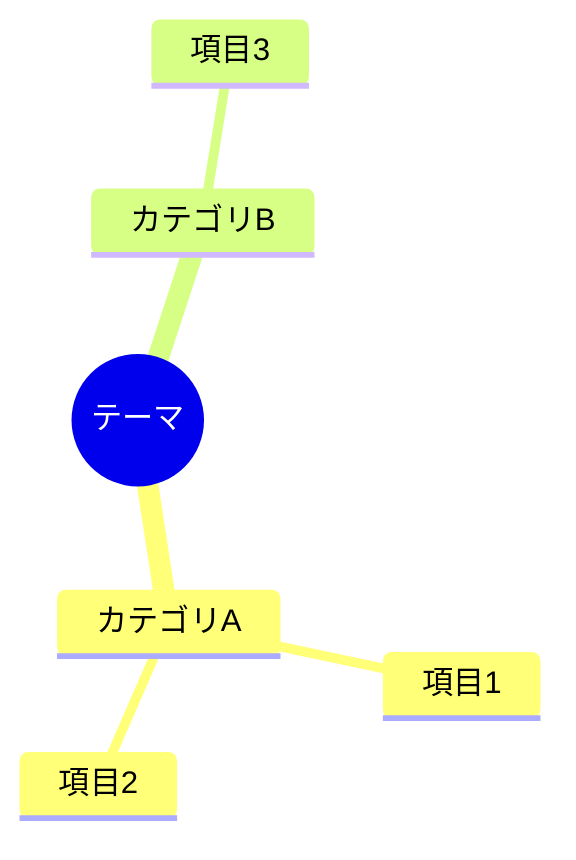
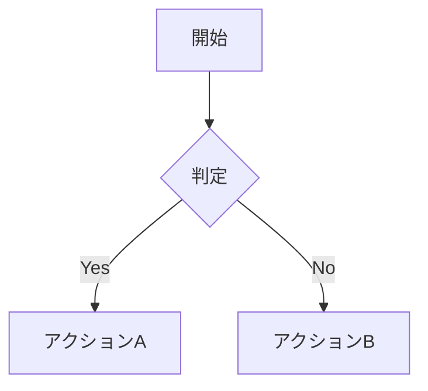

# Executive Summary スキル

調査結果や分析レポートを、エグゼクティブサマリー + 本編の2部構成で整理・再構成するスキルです。

## 概要

長大なドキュメントを意思決定者向けに読みやすく構造化します。Mermaidダイアグラムによる視覚的な全体像の把握と、結論ファーストの構成により、効率的な情報伝達を実現します。

## 主な機能

- **エグゼクティブサマリー + 本編の2部構成**: 冒頭1〜2ページに結論・推奨事項・重要ポイントを要約
- **Mermaidダイアグラム**: マインドマップ、フローチャート等で全体像を可視化
- **内部リンク**: サマリーから詳細セクションへのナビゲーション
- **GitHub/VSCode対応**: 直接レンダリング可能なMarkdown形式

## 使用方法

### 既存ドキュメントの変換

```
このドキュメントをエグゼクティブサマリー形式に変換してください
```

### 新規レポートの作成

```
調査結果をエグゼクティブサマリー形式でまとめてください
```

## ドキュメント構造

```
# レポートタイトル

## エグゼクティブサマリー
├── 結論（1〜3文）
├── 推奨事項（優先順位付き）
├── 重要ポイント（3〜5項目）
├── 全体像（Mermaidダイアグラム）
└── 詳細へのナビゲーション

## 本編
├── 1. 背景と目的
├── 2. 調査範囲と方法
├── 3. 調査結果
├── 4. 分析と考察
├── 5. リスクと課題
├── 6. 次のステップ
└── Appendix
```

## Mermaidダイアグラムの種類

### マインドマップ
調査内容の構造や関係性を階層的に表現



### フローチャート
プロセスや意思決定フローを表現



### 比較図
複数の選択肢を並列で比較

### シーケンス図
コンポーネント間のインタラクションを表現

### アーキテクチャ図
システム構成や技術スタックを表現

## ファイル構成

```
executive-summary/
├── SKILL.md                           # スキル定義
├── README.md                          # このファイル
└── assets/
    └── templates/
        └── executive_summary_template_ja.md  # テンプレート
```

## ベストプラクティス

1. **結論ファースト**: 最重要情報を冒頭に配置
2. **視覚的な情報提示**: ダイアグラム・表を積極活用
3. **ナビゲーションの充実**: リンクで詳細に誘導
4. **適切な粒度**: サマリーは1〜2ページに収める
5. **曖昧さの排除**: 明確な表現と具体的な数値を使用

## 詳細情報

詳細な使い方やガイドラインは [SKILL.md](SKILL.md) を参照してください。
