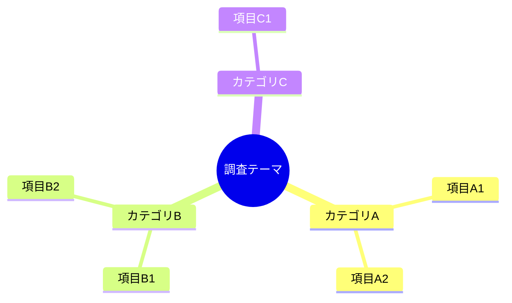
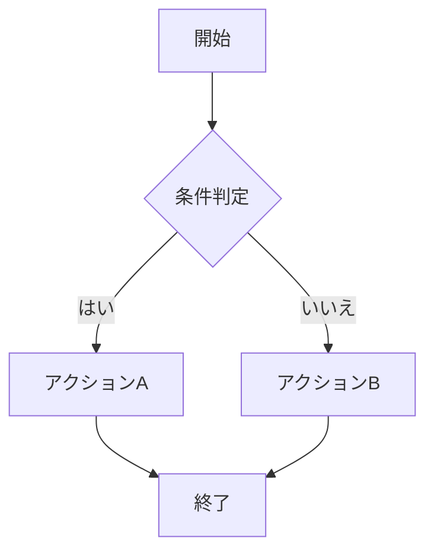
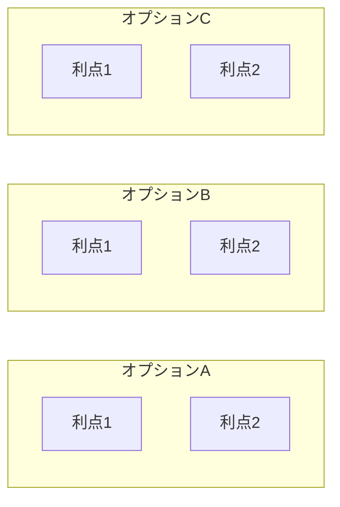
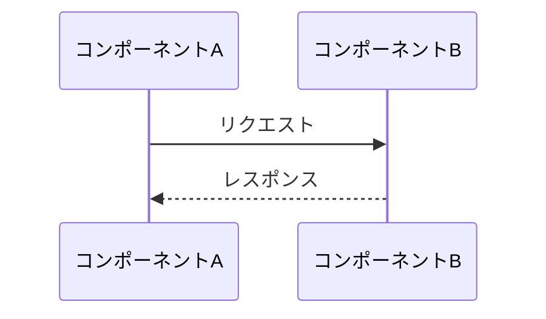
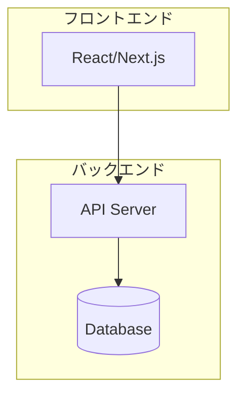
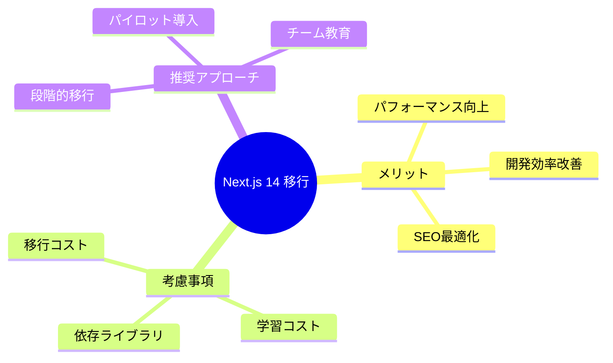

# エグゼクティブサマリー生成スキル

調査結果や分析レポートを、エグゼクティブサマリー + 本編の2部構成で整理・再構成します。Mermaidダイアグラムによる視覚的な全体像の把握と、結論ファーストの構成で意思決定を支援します。

## 概要

このスキルは以下の機能を提供します:
- 長大なドキュメントをエグゼクティブサマリー + 本編の2部構成に再構成
- Mermaidダイアグラム（マインドマップ、フローチャート等）による全体像の可視化
- 結論・推奨事項・重要ポイントを冒頭1〜2ページに要約
- 詳細セクションへの内部リンクによるナビゲーション
- GitHub/VSCodeで直接レンダリング可能なMarkdown形式

## このスキルを使用する場面

以下の状況でこのスキルを有効にしてください:

### ドキュメント整理時
- 調査結果が長大になり、全体像を把握しにくい場合
- 意思決定者向けに要約が必要な場合
- 技術調査の比較・関係性を可視化したい場合
- 既存のMarkdownドキュメントを読みやすく再構成したい場合

### レポート作成時
- 新規に調査レポートを作成する場合
- 複数の調査結果を統合してまとめる場合
- チームへの共有用にドキュメントを整理する場合

## 基本的な使い方

### 既存ドキュメントの変換

「このドキュメントをエグゼクティブサマリー形式に変換してください」などと依頼されたら:

1. **ドキュメントの分析**
   - 既存ドキュメントの構造を確認
   - 主要なセクション、結論、重要ポイントを特定
   - 関係性や依存関係を抽出

2. **エグゼクティブサマリーの作成**
   - 結論・推奨事項を1〜2ページに要約
   - 重要ポイントを箇条書きで整理
   - Mermaidダイアグラムで全体像を可視化
   - 詳細セクションへのリンクを配置

3. **本編の再構成**
   - 論理的な順序でセクションを整理
   - 各セクションにアンカーを設定
   - サマリーからリンク可能な形式に整形

4. **ユーザー確認**
   - 変換結果を確認
   - 必要に応じて調整

### 新規レポートの作成

「調査結果をレポートにまとめてください」などと依頼されたら:

1. **情報の整理**
   - 調査内容の確認
   - 結論と推奨事項の特定
   - 重要ポイントの抽出

2. **テンプレートに基づくドキュメント作成**
   - assets/templates/executive_summary_template_ja.mdを基に作成
   - エグゼクティブサマリーから記述
   - 本編を順次追加

3. **ユーザー確認**
   - 内容の確認
   - 追加情報の有無を確認

## ドキュメント構造

### 推奨される構成

```markdown
# [レポートタイトル]

## エグゼクティブサマリー

### 結論
[1〜3文で最重要な結論を記載]

### 推奨事項
[優先順位付きで推奨アクションを記載]

### 重要ポイント
[箇条書きで3〜5項目]

### 全体像
[Mermaidダイアグラムで可視化]

### 詳細へのナビゲーション
[本編各セクションへのリンク]

---

## 本編

### 1. [セクション1タイトル]
[詳細内容]

### 2. [セクション2タイトル]
[詳細内容]

...
```

## Mermaidダイアグラムの活用

### 1. マインドマップ（全体構造の可視化）

調査内容の構造や関係性を表現する場合:



**使用場面**:
- 調査範囲の全体像を示す
- カテゴリ別の分類を可視化
- 階層構造を表現

### 2. フローチャート（プロセス・フローの可視化）

意思決定フローや処理の流れを表現する場合:



**使用場面**:
- 推奨アクションのフローを示す
- 意思決定プロセスを可視化
- 手順を明確化

### 3. 比較図（オプション比較）

複数の選択肢を比較する場合:



**使用場面**:
- 技術選定の比較
- アプローチの比較
- コスト・効果の比較

### 4. シーケンス図（インタラクションの可視化）

コンポーネント間のやり取りを表現する場合:



**使用場面**:
- システム間の連携を示す
- API呼び出しの流れを表現
- 処理シーケンスを可視化

### 5. アーキテクチャ図（システム構成）

システム構成や技術スタックを表現する場合:



**使用場面**:
- システムアーキテクチャを示す
- 技術スタックを可視化
- インフラ構成を表現

## エグゼクティブサマリーの書き方

### 1. 結論セクション

**原則**:
- 最も重要な結論を1〜3文で記載
- 「〜である」「〜すべきである」という明確な表現を使用
- 曖昧な表現を避ける

**良い例**:
```markdown
### 結論

本調査の結果、Next.js 14の採用を推奨する。App Routerによるパフォーマンス向上と開発効率の改善が見込め、既存のReactエコシステムとの互換性も高い。移行コストは中程度だが、長期的なメンテナンスコスト削減により1年以内に回収可能である。
```

**悪い例**:
```markdown
### 結論

調査の結果、いくつかの選択肢があることがわかりました。それぞれにメリット・デメリットがあり、状況に応じて選択することが重要です。
```

### 2. 推奨事項セクション

**原則**:
- 優先順位を明示（P1/P2/P3または高/中/低）
- 具体的なアクションを記載
- 期限や担当を可能な範囲で示唆

**良い例**:
```markdown
### 推奨事項

| 優先度 | 推奨アクション | 期待効果 |
|-------|--------------|---------|
| P1（高） | Next.js 14へのマイグレーション計画を策定 | パフォーマンス30%向上 |
| P2（中） | 既存コンポーネントのServer Components対応 | バンドルサイズ削減 |
| P3（低） | テスト環境の整備 | 品質向上 |
```

### 3. 重要ポイントセクション

**原則**:
- 3〜5項目に絞る
- 各項目は1〜2文で簡潔に
- 詳細は本編で説明する旨を示す

**良い例**:
```markdown
### 重要ポイント

- **パフォーマンス**: Server Componentsにより初期読み込み時間が平均40%短縮される（[詳細](#パフォーマンス分析)）
- **開発効率**: 新しいルーティング方式により、ファイル構成がシンプルになる（[詳細](#開発効率の改善)）
- **移行コスト**: 既存のpagesディレクトリとの段階的な移行が可能（[詳細](#移行戦略)）
- **リスク**: ブレイキングチェンジがあり、一部の依存ライブラリの更新が必要（[詳細](#リスク分析)）
```

### 4. 全体像セクション

**原則**:
- Mermaidダイアグラムで視覚化
- 複雑な関係性を1つの図で表現
- 図の下に簡潔な説明を追加

**良い例**:
```markdown
### 全体像



上図は、Next.js 14移行における主要な検討ポイントを示している。詳細は本編各セクションを参照。
```

## 内部リンクの活用

### アンカーリンクの設定

本編の各セクションにはアンカーを設定し、サマリーからリンク可能にします:

**サマリー側**:
```markdown
詳細は[パフォーマンス分析](#パフォーマンス分析)を参照。
```

**本編側**:
```markdown
## パフォーマンス分析

[詳細内容]
```

### ナビゲーションセクション

サマリーの末尾に、本編へのナビゲーションを設置:

```markdown
### 詳細へのナビゲーション

| セクション | 概要 |
|-----------|------|
| [1. 背景と目的](#背景と目的) | 調査の背景と目的 |
| [2. 調査方法](#調査方法) | 調査手法と対象 |
| [3. 調査結果](#調査結果) | 詳細な調査結果 |
| [4. 分析と考察](#分析と考察) | 結果の分析 |
| [5. リスク分析](#リスク分析) | 想定されるリスク |
| [Appendix](#appendix) | 補足資料 |
```

## ワークフロー

### 既存ドキュメントの変換フロー

```
1. ドキュメントの読み込み
   - 既存ドキュメントの構造を分析
   - 主要セクション、結論を特定
   ↓
2. 情報の抽出
   - 結論と推奨事項を抽出
   - 重要ポイントをリストアップ
   - 関係性・構造を把握
   ↓
3. エグゼクティブサマリーの作成
   - 結論セクションを記述
   - 推奨事項を優先度付きで整理
   - 重要ポイントを箇条書き化
   - Mermaidダイアグラムを作成
   - ナビゲーションリンクを設置
   ↓
4. 本編の再構成
   - 論理的な順序で整理
   - アンカーを設定
   - 不要な重複を削除
   ↓
5. ユーザー確認
   - 変換結果を確認
   - フィードバックに基づき調整
```

### 新規レポート作成フロー

```
1. 情報のヒアリング
   - 調査内容の確認
   - 結論・推奨事項の確認
   - 重要ポイントの確認
   ↓
2. 構成の設計
   - セクション構成を決定
   - ダイアグラムの種類を選択
   ↓
3. ドキュメント作成
   - テンプレートを基に作成
   - エグゼクティブサマリーから記述
   - 本編を順次追加
   ↓
4. レビューと調整
   - 内容の確認
   - 必要に応じて調整
```

## ユーザーとの対話ガイドライン

### 1. 変換時の確認事項

既存ドキュメントを変換する際は、以下を確認します:

```
ドキュメントの変換について確認させてください：

1. 最も重要な結論は何ですか？
2. 推奨事項の優先順位はどうしますか？
3. 特に強調したいポイントはありますか？
4. 本編のセクション構成は現状のままで良いですか？
```

### 2. ダイアグラムの選択

全体像を可視化する際は、適切なダイアグラム形式を提案します:

```
全体像の可視化について確認させてください：

A) マインドマップ - 階層構造や関係性を表現
B) フローチャート - プロセスや意思決定フローを表現
C) 比較図 - 複数選択肢の比較を表現
D) その他 - 具体的に教えてください

どの形式が適切ですか？
```

### 3. 詳細レベルの調整

サマリーの詳細レベルを確認します:

```
エグゼクティブサマリーの詳細レベルについて：

A) 超簡潔（半ページ程度）- 結論と推奨のみ
B) 標準（1ページ程度）- 結論、推奨、重要ポイント
C) 詳細（2ページ程度）- 上記 + 背景・リスクの要約

どのレベルが適切ですか？
```

## 検証チェックリスト

変換・作成後は以下を確認:

### エグゼクティブサマリー
- [ ] 結論が1〜3文で明確に記載されている
- [ ] 推奨事項に優先順位が付いている
- [ ] 重要ポイントが3〜5項目に絞られている
- [ ] Mermaidダイアグラムで全体像が可視化されている
- [ ] 本編へのナビゲーションリンクが機能する

### 本編
- [ ] 論理的な順序でセクションが整理されている
- [ ] 各セクションにアンカーが設定されている
- [ ] サマリーからのリンクが正しく機能する
- [ ] 重複した内容が削除されている

### 全体
- [ ] GitHubでMermaidが正しくレンダリングされる
- [ ] 内部リンクが正しく機能する
- [ ] 読み手が全体像を把握しやすい構成になっている

## ベストプラクティス

### 1. 結論ファースト
- 最も重要な情報を冒頭に配置
- 詳細は後から参照できるようにリンク

### 2. 視覚的な情報提示
- Mermaidダイアグラムを積極的に活用
- 表形式で比較情報を整理
- 箇条書きで要点を明確化

### 3. ナビゲーションの充実
- サマリーから本編へのリンクを設置
- 本編内でも関連セクションへのリンクを追加
- 目次を活用

### 4. 適切な粒度
- サマリーは1〜2ページに収める
- 本編は必要に応じて詳細に
- 長すぎるセクションは分割を検討

### 5. 曖昧さの排除
- 「〜かもしれない」より「〜である」
- 具体的な数値や根拠を示す
- 推奨事項は明確なアクションとして記述

## リソース

### assets/templates/
- `executive_summary_template_ja.md`: エグゼクティブサマリー形式のテンプレート

## 今後の拡張

このスキルは将来的に以下の機能を追加予定です:

- 英語版テンプレートの追加
- PDFエクスポート対応
- プレゼンテーション形式への変換
- 複数ドキュメントの統合機能
- バージョン管理・差分表示機能
