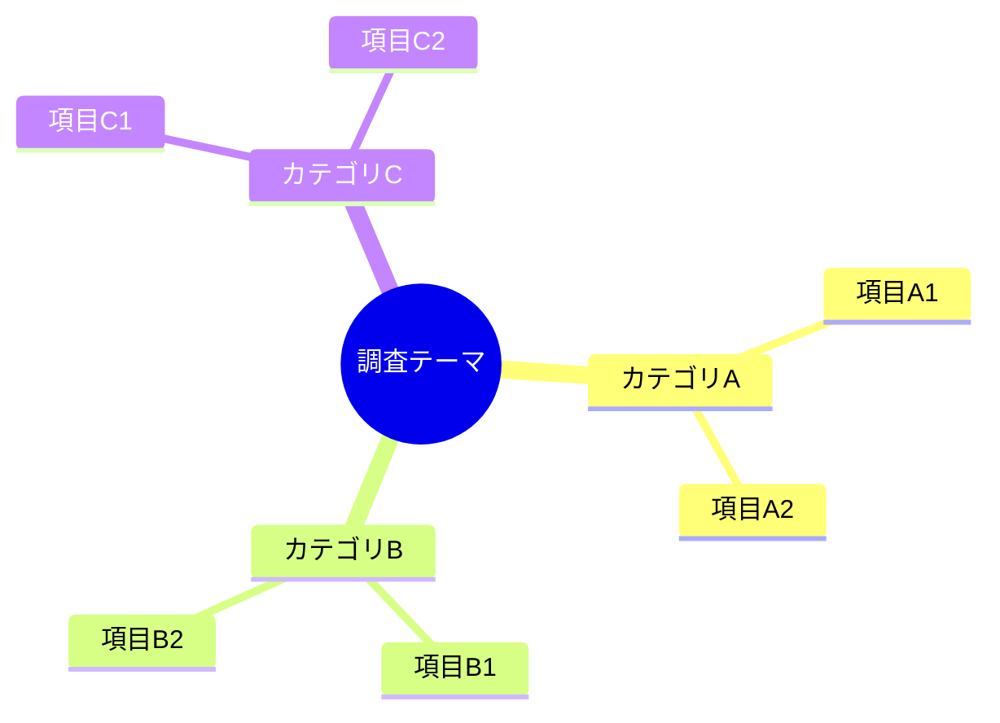
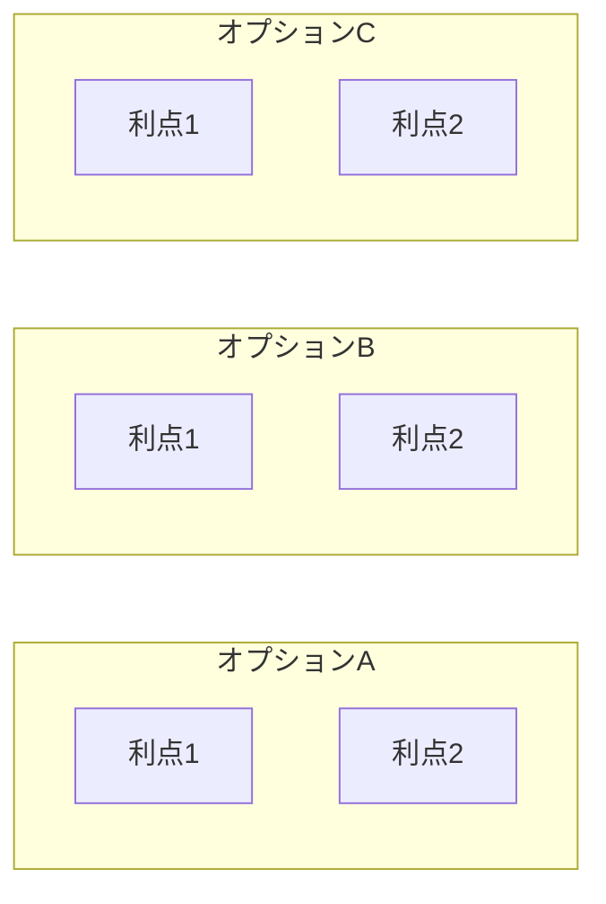
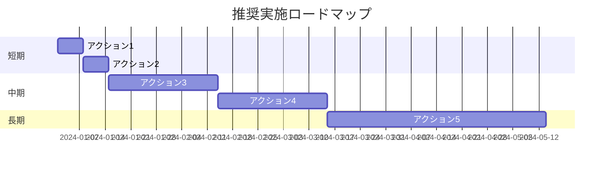

# [レポートタイトル]

> **作成日**: YYYY-MM-DD
> **作成者**: [作成者名]
> **バージョン**: 1.0
> **ステータス**: [Draft / Review / Final]

---

## エグゼクティブサマリー

### 結論

<!-- 最も重要な結論を1〜3文で簡潔に記載 -->
<!-- 例: 本調査の結果、[結論A]を推奨する。[理由]により、[期待効果]が見込める。 -->

[結論を記載]

### 推奨事項

<!-- 優先順位付きで具体的なアクションを記載 -->

| 優先度 | 推奨アクション | 期待効果 | 備考 |
|-------|--------------|---------|------|
| P1（高） | [アクション1] | [効果1] | [補足] |
| P2（中） | [アクション2] | [効果2] | [補足] |
| P3（低） | [アクション3] | [効果3] | [補足] |

### 重要ポイント

<!-- 3〜5項目に絞り、各項目から詳細セクションへリンク -->

- **[ポイント1のタイトル]**: [1〜2文の説明]（[詳細](#セクション名)）
- **[ポイント2のタイトル]**: [1〜2文の説明]（[詳細](#セクション名)）
- **[ポイント3のタイトル]**: [1〜2文の説明]（[詳細](#セクション名)）
- **[ポイント4のタイトル]**: [1〜2文の説明]（[詳細](#セクション名)）

### 全体像

<!-- Mermaidダイアグラムで全体構造を可視化 -->
<!-- 調査内容に応じて適切なダイアグラム形式を選択 -->

<!-- 図の簡潔な説明 -->
上図は[調査テーマ]の全体構造を示している。詳細は本編各セクションを参照。

### 詳細へのナビゲーション

| セクション | 概要 |
|-----------|------|
| [1. 背景と目的](#1-背景と目的) | 調査の背景と目的 |
| [2. 調査範囲と方法](#2-調査範囲と方法) | 調査の範囲と手法 |
| [3. 調査結果](#3-調査結果) | 詳細な調査結果 |
| [4. 分析と考察](#4-分析と考察) | 結果の分析と考察 |
| [5. リスクと課題](#5-リスクと課題) | 想定されるリスク |
| [6. 次のステップ](#6-次のステップ) | 推奨アクションの詳細 |
| [Appendix](#appendix) | 補足資料・参考文献 |

---

## 本編

### 1. 背景と目的

#### 1.1 背景

<!-- 調査の背景・経緯を記載 -->

[背景を記載]

#### 1.2 目的

<!-- 調査の目的を明確に記載 -->

[目的を記載]

#### 1.3 対象読者

<!-- このレポートの対象読者を明記 -->

- [対象読者1]
- [対象読者2]

---

### 2. 調査範囲と方法

#### 2.1 調査範囲

<!-- 調査の範囲（スコープ）を明確に -->

**スコープ内**:
- [範囲内の項目1]
- [範囲内の項目2]

**スコープ外**:
- [範囲外の項目1]
- [範囲外の項目2]

#### 2.2 調査方法

<!-- 使用した調査手法を記載 -->

| 手法 | 内容 | 目的 |
|-----|------|------|
| [手法1] | [内容の説明] | [目的] |
| [手法2] | [内容の説明] | [目的] |

#### 2.3 調査期間

<!-- 調査期間を記載 -->

- 開始日: YYYY-MM-DD
- 終了日: YYYY-MM-DD

---

### 3. 調査結果

#### 3.1 [調査結果カテゴリ1]

<!-- 調査結果を論理的に整理して記載 -->

[調査結果1の詳細]

#### 3.2 [調査結果カテゴリ2]

[調査結果2の詳細]

#### 3.3 [調査結果カテゴリ3]

[調査結果3の詳細]

---

### 4. 分析と考察

#### 4.1 [分析観点1]

<!-- 調査結果に対する分析・考察を記載 -->

[分析内容1]

#### 4.2 [分析観点2]

[分析内容2]

#### 4.3 比較分析

<!-- 複数の選択肢を比較する場合 -->

| 観点 | オプションA | オプションB | オプションC |
|-----|------------|------------|------------|
| [観点1] | [評価] | [評価] | [評価] |
| [観点2] | [評価] | [評価] | [評価] |
| [観点3] | [評価] | [評価] | [評価] |
| **総合評価** | [評価] | [評価] | [評価] |

---

### 5. リスクと課題

#### 5.1 リスク分析

<!-- 想定されるリスクとその対策を記載 -->

| リスク | 影響度 | 発生可能性 | 対策 |
|-------|-------|-----------|------|
| [リスク1] | 高/中/低 | 高/中/低 | [対策1] |
| [リスク2] | 高/中/低 | 高/中/低 | [対策2] |
| [リスク3] | 高/中/低 | 高/中/低 | [対策3] |

#### 5.2 課題

<!-- 特定された課題を記載 -->

1. **[課題1]**: [課題の説明と影響]
2. **[課題2]**: [課題の説明と影響]
3. **[課題3]**: [課題の説明と影響]

---

### 6. 次のステップ

#### 6.1 短期アクション（1〜2週間）

<!-- 即座に実行すべきアクション -->

- [ ] [アクション1]
- [ ] [アクション2]

#### 6.2 中期アクション（1〜3ヶ月）

<!-- 中期的に実行すべきアクション -->

- [ ] [アクション3]
- [ ] [アクション4]

#### 6.3 長期アクション（3ヶ月以上）

<!-- 長期的に検討すべきアクション -->

- [ ] [アクション5]
- [ ] [アクション6]

#### 6.4 推奨ロードマップ

---

## Appendix

### A. 用語集

<!-- 専門用語の定義を記載 -->

| 用語 | 定義 |
|-----|------|
| [用語1] | [定義] |
| [用語2] | [定義] |

### B. 参考文献

<!-- 参考にした文献・リソースを記載 -->

1. [文献タイトル1](URL) - [説明]
2. [文献タイトル2](URL) - [説明]

### C. 関連ドキュメント

<!-- 関連する他のドキュメントへのリンク -->

- [関連ドキュメント1](パス)
- [関連ドキュメント2](パス)

### D. 変更履歴

| バージョン | 日付 | 変更内容 | 変更者 |
|-----------|------|---------|-------|
| 1.0 | YYYY-MM-DD | 初版作成 | [作成者] |

---

> **免責事項**: [必要に応じて免責事項を記載]
