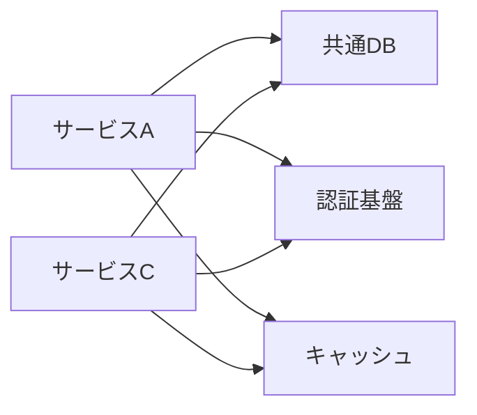

# ヘルスチェック ナレッジベース

最終更新: [YYYY-MM-DD]

---

## 1. 業務パターン（定期処理）

定期的に発生するスパイクや負荷パターンを記録します。ヘルスチェック時に周期的なスパイクを誤検知しないために使用します。

### 日次パターン

| 時刻 | 対象サービス | 処理内容 | 影響するメトリクス | 備考 |
|------|-------------|---------|-------------------|------|
| [HH:MM] | [サービス名] | [処理内容] | [CPU, メモリ等] | [補足] |

### 週次パターン

| 曜日・時刻 | 対象サービス | 処理内容 | 影響するメトリクス | 備考 |
|-----------|-------------|---------|-------------------|------|
| [曜日 HH:MM] | [サービス名] | [処理内容] | [CPU, メモリ等] | [補足] |

### 月次パターン

| 日付・時刻 | 対象サービス | 処理内容 | 影響するメトリクス | 備考 |
|-----------|-------------|---------|-------------------|------|
| [月初/月末等] | [サービス名] | [処理内容] | [CPU, メモリ等] | [補足] |

---

## 2. 商業イベントカレンダー

負荷増が想定されるイベントを記録します。

| 時期 | イベント名 | 対象サービス | 想定される影響 | 備考 |
|------|-----------|-------------|---------------|------|
| [時期] | [イベント名] | [サービス名] | [リクエスト増、コスト増等] | [補足] |

---

## 3. 既知の制約

対策不可と確定した問題、またはリスクを受容した事項を記録します。ヘルスチェック時に不要な調査を避けるために使用します。

| 対象サービス | 事象 | 理由/背景 | 判断日 | 判断者 | レビュー予定 |
|-------------|------|----------|--------|--------|-------------|
| [サービス名] | [事象の説明] | [対策不可の理由] | [YYYY-MM-DD] | [判断者] | [次回レビュー日] |

---

## 4. 解決済み事例

過去に検出・対応した事例を記録します。再発監視や類似事象の調査に使用します。

### [事例タイトル]

| 項目 | 内容 |
|------|------|
| 検出日 | [YYYY-MM-DD] |
| 対象サービス | [サービス名] |
| 検出メトリクス | [カテゴリ: メトリクス名] |
| 事象 | [発生した事象の説明] |
| 原因 | [特定された原因] |
| 対策 | [実施した対策] |
| 対策実施日 | [YYYY-MM-DD] |
| 再発監視期間 | [期間] |
| 監視終了日 | [YYYY-MM-DD or 監視中] |
| 関連チケット | [チケット番号] |

---

## 5. 依存関係マップ

サービス間・アカウント間の依存関係を記録します。障害波及の調査に使用します。

### サービス依存関係

### 依存関係テーブル

| サービス | 依存先 | 依存の種類 | 障害時の影響 |
|---------|--------|-----------|-------------|
| [サービス名] | [依存先] | [DB/API/キャッシュ/認証等] | [影響の説明] |

### 共通基盤コンポーネント

| コンポーネント | 利用サービス | 障害時の影響範囲 |
|---------------|-------------|----------------|
| [コンポーネント名] | [サービス一覧] | [影響の説明] |

---

## 6. カスタム閾値

デフォルトと異なる閾値を設定している場合に記録します。

| 対象サービス | メトリクス | デフォルト閾値 | カスタム閾値 | 理由 | 設定日 |
|-------------|-----------|--------------|-------------|------|--------|
| [サービス名] | [メトリクス名] | [デフォルト値] | [カスタム値] | [変更理由] | [YYYY-MM-DD] |

---

## 7. 更新履歴

| 更新日 | 更新者 | 更新内容 |
|--------|--------|---------|
| [YYYY-MM-DD] | [更新者] | [更新内容の概要] |
