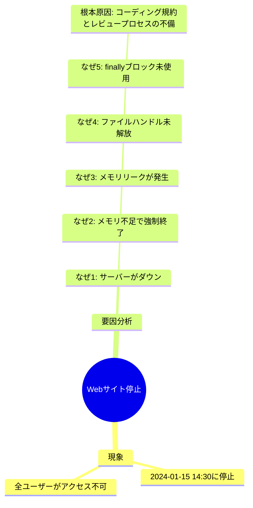
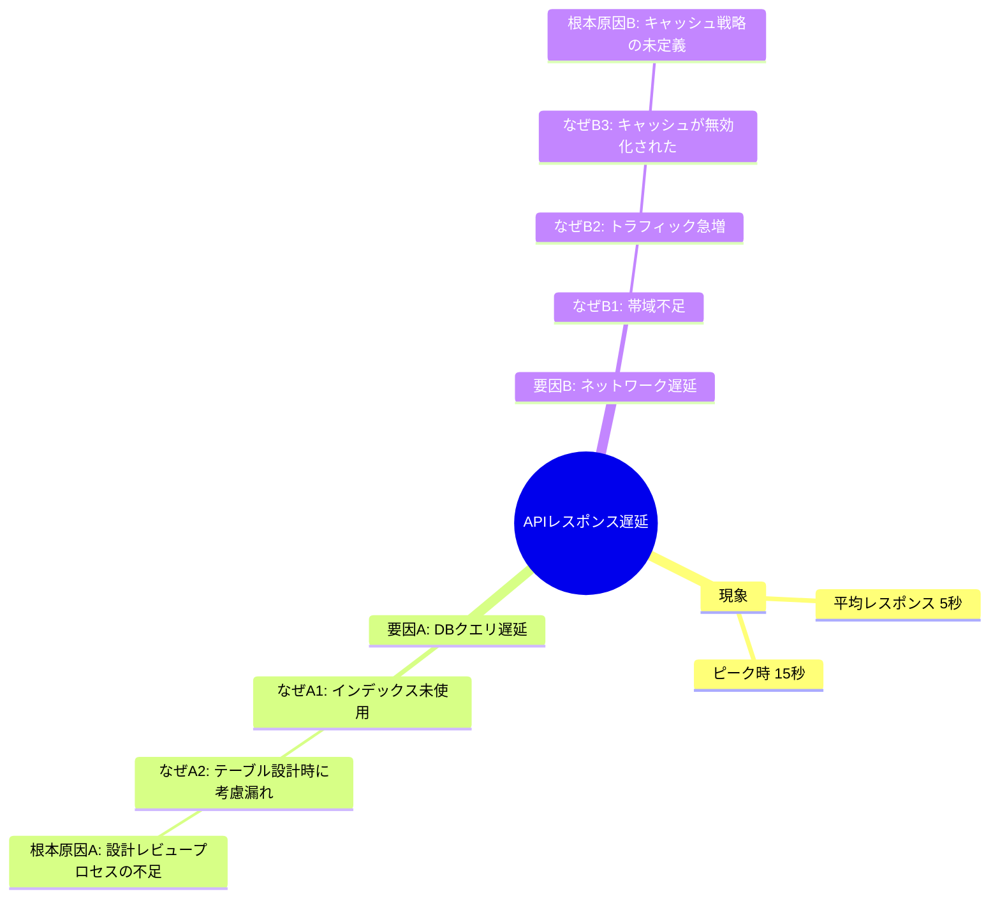

# インシデント根本原因分析スキル

インシデント調査で根本原因を特定するための、なぜなぜ分析ファシリテーションスキルです。

## 概要

インシデント根本原因分析（RCA: Root Cause Analysis）スキルは、システム障害やサービス停止などのインシデント発生時に、なぜなぜ分析を用いて体系的に根本原因を特定することを支援します。推測や意見を避け、ファシリテーターとしてユーザーの思考を整理し、リアルタイムでマインドツリーを作成して全体を可視化します。

## 主な機能

- なぜなぜ分析による体系的な根本原因特定
- ユーザーの発言を漏らさず記録
- リアルタイムマインドツリー（Mermaid形式）の作成と可視化
- ファシリテーターとしての中立的なサポート（推測や意見を言わない）
- 複合要因の分割と個別分析
- 最低1つの根本原因の特定保証
- 煮詰まった時の新しい視点の提供
- 絵文字を使用しないクリーンなコミュニケーション

## 使用方法

### 基本的な使い方

```
インシデントの根本原因を分析したい
```

または

```
なぜなぜ分析を始めたい
```

### 分析の開始

スキルを有効化すると、以下のような対話で分析が開始されます：

```
ファシリテーター: インシデントの根本原因分析を開始します。
                  まず、発生した事象について教えてください。
                  何が起きましたか？

ユーザー: Webサイトが停止しました

ファシリテーター: いつ発生しましたか？

ユーザー: 2024-01-15 14:30頃です

ファシリテーター: どこで発生しましたか？

ユーザー: 本番環境のWebサーバーです
```

## 分析フロー

1. インシデントの確認（現象、日時、場所）
2. マインドツリーの初期化
3. 第1階層の「なぜ？」を問いかける
4. ユーザーの回答を記録し、マインドツリーに追加
5. 複合要因がある場合は要因を分割
6. 各要因について「なぜ？」を繰り返す
7. 必要に応じて新しい視点を提供
8. 根本原因を特定
9. すべての要因について分析完了後、サマリーを作成

## マインドツリーの例

### 単一要因の場合



### 複合要因の場合



## ファシリテーターの役割

このスキルは、ファシリテーターとしてのロールに専念します：

### 実施すること

- ユーザーに適切な質問を投げかける
- ユーザーの回答を正確に記録する
- 思考の整理をサポートする
- 分析の進捗を可視化する
- 新しい視点を提供する（煮詰まった時のみ）

### 実施しないこと

- 原因について推測する
- 技術的な意見を述べる
- ユーザーの回答を否定する
- 特定の結論へ誘導する
- 答えを与える

## なぜなぜ分析の原則

### 基本ルール

- 通常は5回の「なぜ？」で根本原因に到達（回数は目安）
- 「それ以上なぜを問えない」状態が根本原因
- 「ヒューマンエラー」で止めず、なぜそれが起きたかを追求
- システムや組織の構造的な問題に到達するまで深掘り

### 根本原因の判定基準

- システムや組織の構造的な問題に到達している
- 対策を講じることで再発を防げる
- さらに「なぜ？」と問うことができない
- 具体的なアクションに繋がる

### 複合要因の分割

複数の要因が存在する場合は、要因ごとに分割して分析します：

- 1つの「なぜ？」に対して複数の答えがある場合
- 独立した要因が並列に存在する場合
- 異なる系統の原因が絡み合っている場合

各要因について個別にマインドツリーを構築し、それぞれの根本原因を特定します。

## 煮詰まり時のサポート

ユーザーが煮詰まっている場合のみ、新しい視点を提供します：

### 煮詰まりの兆候

- ユーザーが「わからない」と答える
- 同じ内容を繰り返す
- 長時間沈黙する
- 行き詰まりを明示的に示す

### 提供する視点

**時間軸の視点**:
- 発生の前後で何か変更はありましたか？
- 過去に同様の事象は発生していましたか？

**空間軸の視点**:
- 他のコンポーネント/システムではどうでしょうか？
- 上流/下流のプロセスに問題はありませんか？

**人・組織の視点**:
- プロセスやルールに問題はありませんか？
- 情報共有やコミュニケーションに課題はありましたか？

**技術の視点**:
- 監視やログに何か記録されていませんか？
- メトリクスに異常な値は見られませんか？

## 分析サマリー

分析完了時に、以下の内容を含むサマリーを自動作成します：

```markdown
# インシデント根本原因分析サマリー

## インシデント概要
- 発生事象: [事象の説明]
- 発生日時: [日時]
- 発生場所: [システム/コンポーネント]

## 分析プロセス
- 分析手法: なぜなぜ分析
- 特定した要因数: [数]
- 「なぜ？」の深さ: [最大階層数]

## 特定された根本原因

### 根本原因1: [タイトル]
- 要因系統: [要因A/要因B等]
- 詳細: [根本原因の説明]
- 推奨対策: [ユーザーが述べた対策、またはなし]

## 分析ツリー

[最終的なマインドツリーを表示]

## 分析履歴

分析中に記録された主要な発言:
1. [記録1]
2. [記録2]
...
```

## 制約事項

### 実施しないこと

- 原因についての推測や意見の提示
- ユーザーの回答の評価や否定
- すべての会話・ドキュメントで絵文字の使用
- 分析の省略（最低1つの根本原因を必ず特定）

### 実施の限界

以下の場合は、その旨をユーザーに伝え、現時点での分析結果を記録します：

- ユーザーが情報を持っていない
- ログや監視データが存在しない
- 新しい視点を複数提供しても進展がない
- ユーザーが分析継続を希望しない

## ベストプラクティス

### 1. 中立性の維持

- ユーザーの思考プロセスを尊重
- 答えを与えず、考えを引き出す
- 記録者として正確に記録

### 2. 構造化された記録

- マインドツリーでビジュアル化
- 階層構造で整理
- 時系列で追跡可能

### 3. 根本原因の確実な特定

- 「ヒューマンエラー」で止めない
- システムや組織の構造的問題まで深掘り
- 対策可能なレベルまで到達
- 必ず最低1つの根本原因を特定

### 4. 複合要因の丁寧な分析

- 各要因を独立して分析
- すべての要因に対して根本原因を特定
- 要因間の関連性も記録

## トラブルシューティング

### 問題1: ユーザーが「ヒューマンエラー」で止まってしまう

**対処**: 「なぜそのヒューマンエラーが発生したのか？」を問う

**例**:
```
ファシリテーター: なぜその操作ミスが起きたのでしょうか？
ファシリテーター: ミスを防ぐ仕組みはありませんでしたか？
```

### 問題2: 複数の要因が混在している

**対処**: 要因を明確に分割する

**例**:
```
ファシリテーター: 複数の要因があるようですね。
                  それぞれを分けて分析しましょう。
```

### 問題3: ユーザーが情報不足で答えられない

**対処**: 現時点での分析結果を記録し、調査事項として残す

**例**:
```
ファシリテーター: 現時点では情報が不足しているようですね。
                  ここまでの分析結果を記録し、
                  今後の調査事項として残します。
```

### 問題4: 表面的な分析で終わろうとする

**対処**: さらに「なぜ？」を問い、深掘りを促す

**例**:
```
ファシリテーター: もう1段階深く考えてみましょう。
                  なぜそのような状況になったのでしょうか？
```

## 適用例

### 例1: システム障害

```
現象: ECサイトのチェックアウト機能が停止

なぜ1: 決済APIがタイムアウト
なぜ2: 決済サービス側の負荷増大
なぜ3: キャンペーン開始で予想を超えるトラフィック
なぜ4: キャンペーン時の負荷テストを実施していなかった
なぜ5: 負荷テストのプロセスが確立されていなかった

根本原因: キャンペーン施策時の負荷テストプロセスの未整備
```

### 例2: データ不整合

```
現象: ユーザーの注文履歴が表示されない

要因A: データベースの同期失敗
  なぜA1: レプリケーション遅延
  なぜA2: マスターDBの負荷増大
  なぜA3: インデックス未設定でフルスキャン発生
  根本原因A: データベース設計レビューの不足

要因B: キャッシュの不整合
  なぜB1: キャッシュ更新のタイミング問題
  なぜB2: キャッシュ戦略が明文化されていない
  根本原因B: キャッシュ戦略の未定義
```

## 今後の拡張

このスキルは将来的に以下の機能を追加予定です：

- フィッシュボーン図（特性要因図）のサポート
- 5W1Hフレームワークの統合
- 対策立案支援機能
- 過去の分析事例の参照機能
- 分析テンプレートのカスタマイズ
- 複数人での分析セッションサポート

## ライセンス

このスキルはMITライセンスの下で公開されています。
