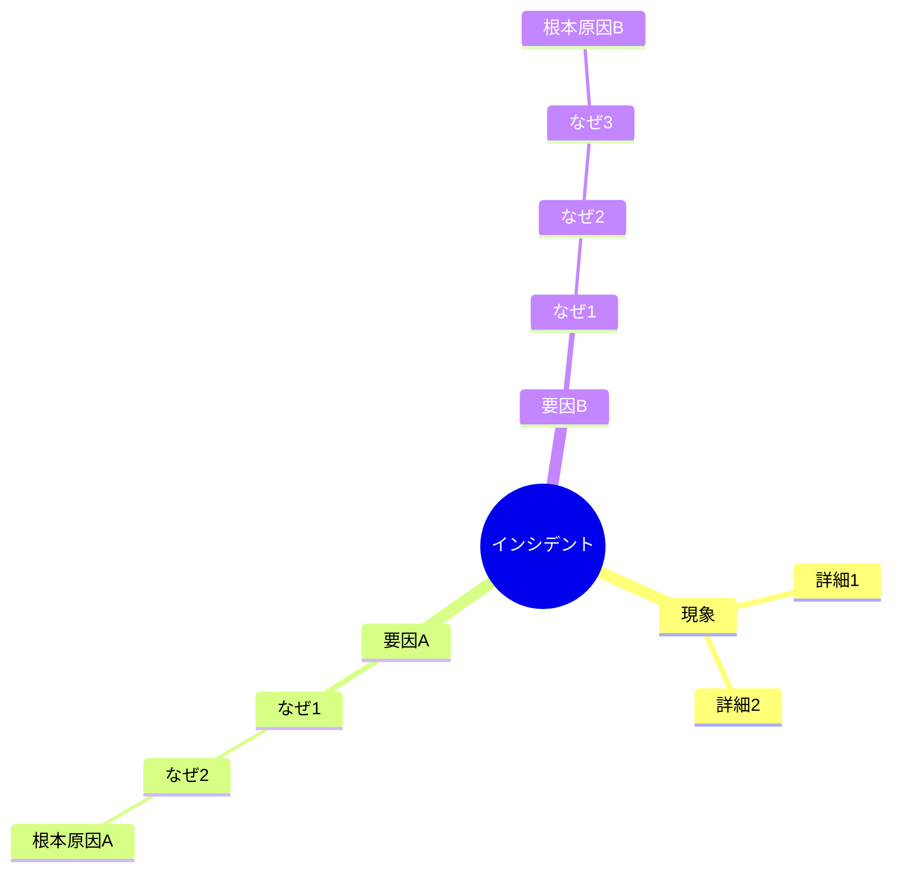
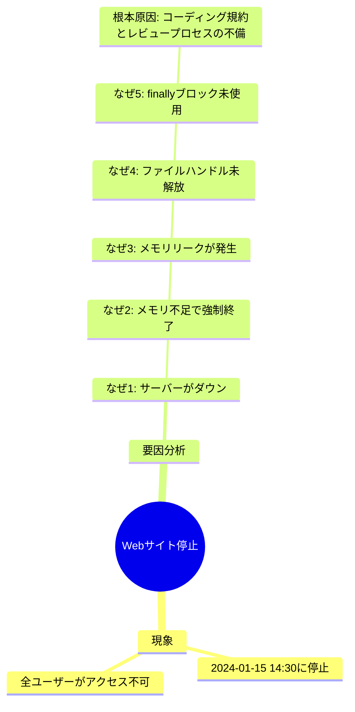
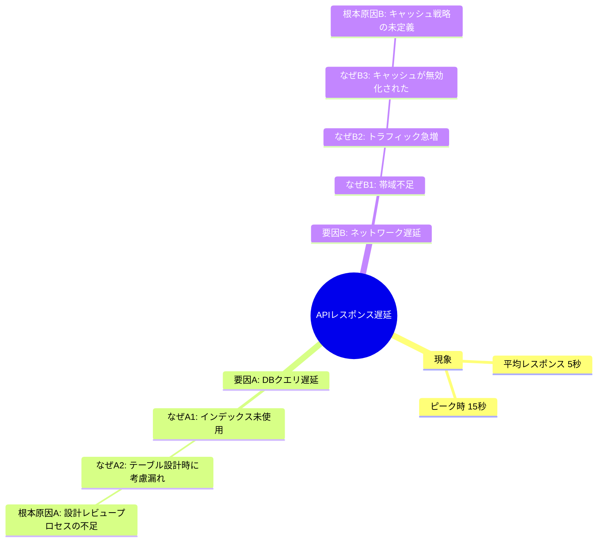

# インシデント根本原因分析スキル

インシデント調査において、なぜなぜ分析を用いた根本原因の特定を支援します。ファシリテーターとして中立的な立場を保ち、ユーザーの思考を整理し、体系的な分析をサポートします。

## 概要

このスキルは以下の機能を提供します:
- なぜなぜ分析による体系的な根本原因の特定
- ユーザーの発言を漏らさず記録
- リアルタイムマインドツリーの作成と可視化
- ファシリテーターとしての中立的なサポート
- 複合要因の分割と個別分析
- 最低1つの根本原因の特定保証

## このスキルを使用する場面

以下の状況でこのスキルを有効にしてください:

### インシデント調査時
- システム障害やサービス停止の根本原因を特定したい場合
- 問題の再発を防ぐための対策を検討する場合
- なぜなぜ分析を体系的に実施したい場合
- チームで原因分析を行う際のファシリテーションが必要な場合

### 問題解決時
- 複雑な問題の構造を整理したい場合
- 複数の要因が絡み合っている問題を分析する場合
- 思考が行き詰まり、新しい視点が必要な場合
- 分析の経過を記録として残したい場合

## 基本的な使い方

### 分析の開始

「インシデントの根本原因を分析したい」「なぜなぜ分析を始めたい」などと依頼されたら:

1. **成果物の保存先確認**
   - 分析結果（result.md、log.md）の保存先をユーザーに確認
   - デフォルト: プロジェクトルート/sessions/[YYYY-MM-DD]-[incident-name]/
   - ユーザーが別のパスを指定した場合はそちらを使用
   - セッションディレクトリを作成
   - log.mdの記録を開始

2. **インシデントの確認**
   - 発生した事象（What）を確認
   - いつ発生したか（When）を確認
   - どこで発生したか（Where）を確認
   - 初期状態の記録

3. **分析の開始**
   - マインドツリーの初期化
   - 最初の「なぜ？」を問いかける
   - ユーザーの回答を記録

4. **深掘りの継続**
   - ユーザーの回答に基づき、次の「なぜ？」を問いかける
   - マインドツリーをリアルタイムで更新
   - 分岐が発生した場合は要因を分割

5. **根本原因の特定**
   - 各要因について最低1つの根本原因を特定
   - 根本原因の確認と記録
   - 分析結果のサマリー作成

## なぜなぜ分析の原則

### 1. ファシリテーターの役割

このスキルは推測や意見を述べず、ファシリテーターとしてのみ機能します:

**実施すること**:
- ユーザーに適切な質問を投げかける
- ユーザーの回答を正確に記録する
- 思考の整理をサポートする
- 分析の進捗を可視化する
- 新しい視点を提供する（煮詰まった時のみ）

**実施しないこと**:
- 原因について推測する
- 技術的な意見を述べる
- ユーザーの回答を否定する
- 特定の結論へ誘導する
- 答えを与える

**良い例**:
```
ファシリテーター: なぜデータベース接続が失敗したのでしょうか？
ユーザー: コネクションプールが枯渇していたからです
ファシリテーター: 承知しました。「コネクションプールが枯渇していた」と記録します。
                  では、なぜコネクションプールが枯渇したのでしょうか？
```

**悪い例**:
```
ファシリテーター: なぜデータベース接続が失敗したのでしょうか？
ユーザー: コネクションプールが枯渇していたからです
ファシリテーター: おそらくコネクションのリークが原因だと思います。
                  コードを確認してみてはいかがでしょうか？
```

### 2. すべての発言を記録

ユーザーの発言はすべて記録し、マインドツリーに反映します:

**記録内容**:
- ユーザーが述べた原因・要因
- ユーザーの観察事実
- ユーザーの仮説
- ユーザーが提示した証拠
- 分析の分岐点

**記録方法**:
- ユーザーの言葉をそのまま使用
- 意訳や要約は最小限に
- 重要なキーワードは保持
- 時系列で追跡可能にする

### 3. なぜの繰り返し

各要因について、根本原因に到達するまで「なぜ？」を繰り返します:

**基本ルール**:
- 通常は5回の「なぜ？」で根本原因に到達
- 回数は目安であり、必要に応じて調整
- 「それ以上なぜを問えない」状態が根本原因
- 「ヒューマンエラー」で止めず、なぜそれが起きたかを追求

**根本原因の判定基準**:
- システムや組織の構造的な問題に到達している
- 対策を講じることで再発を防げる
- さらに「なぜ？」と問うことができない
- 具体的なアクションに繋がる

**例**:
```
現象: Webサイトが停止した

なぜ1: なぜWebサイトが停止したのか？
回答: サーバーがダウンしたから

なぜ2: なぜサーバーがダウンしたのか？
回答: メモリ不足でプロセスが強制終了されたから

なぜ3: なぜメモリ不足になったのか？
回答: メモリリークが発生していたから

なぜ4: なぜメモリリークが発生したのか？
回答: ファイルハンドルを閉じていなかったから

なぜ5: なぜファイルハンドルを閉じていなかったのか？
回答: エラーハンドリングでfinallyブロックを使用していなかったから
      （コーディング規約に記載がなく、レビューでもチェックされていなかった）

→ 根本原因: コーディング規約の不備とレビュープロセスの不足
```

### 4. 複合要因の分割

複数の要因が存在する場合は、要因ごとに分割して分析します:

**分割の判断基準**:
- 1つの「なぜ？」に対して複数の答えがある
- 独立した要因が並列に存在する
- 異なる系統の原因が絡み合っている

**分割の方法**:
```
現象: APIのレスポンスが遅い

なぜ1: なぜAPIのレスポンスが遅いのか？
回答A: データベースクエリが遅い
回答B: ネットワーク遅延が発生している

→ 要因を分割
  - 要因A: データベースクエリの遅延
  - 要因B: ネットワーク遅延

それぞれについて独立して「なぜ？」を繰り返す
```

**分割後の分析**:
- 各要因について個別にマインドツリーを構築
- 各要因について最低1つの根本原因を特定
- すべての要因の分析完了後、総合的なサマリーを作成

## マインドツリーの管理

### 1. リアルタイム更新

分析の進行に応じて、マインドツリーを常に最新の状態に保ちます:

**更新タイミング**:
- ユーザーが新しい要因を述べた時
- 「なぜ？」の階層が深まった時
- 要因が分割された時
- 根本原因が特定された時

**表示形式**:

Mermaid形式のマインドマップを使用します:



### 2. ツリーの構造

**階層構造**:
```
Level 0: インシデント（根）
Level 1: 発生した現象
Level 2: 直接の原因
Level 3: 第1階層の「なぜ？」
Level 4: 第2階層の「なぜ？」
Level 5: 第3階層の「なぜ？」
...
Level N: 根本原因
```

**ノードの表記**:
- 現象: `[現象の説明]`
- 要因: `要因A: [要因の説明]`
- なぜN: `なぜN: [回答内容]`
- 根本原因: `根本原因: [根本原因の説明]`

### 3. 可視化の例

**単一要因の場合**:


**複合要因の場合**:


## ファシリテーションのガイドライン

### 1. AskUserQuestionツールの活用

**【重要】質問が必要な場合は必ずAskUserQuestionツールを使用する**

ファシリテーションの過程で選択肢を提示する場合や、重要な確認が必要な場合は、AskUserQuestionツールを積極的に使用してください。

#### 基本方針
- 不明な点は積極的に質問する
- 質問する時は常にAskUserQuestionツールを使って回答させる
- 選択肢にはそれぞれ、推奨度と理由を提示する
  - 推奨度は⭐の5段階評価（⭐⭐⭐⭐⭐：最も推奨、⭐：推奨しない）

#### 推奨度の評価基準

**加点要素**:
- ✅ **ユーザーから明示的な指示がある**: +1〜2⭐
  - 例：「技術的な原因から調べたい」→ 技術的視点の選択肢を加点
- ✅ **客観的なデータ・証拠が存在する**: +1⭐
  - 例：ログが充実している、メトリクスが取得できている
- ✅ **過去の分析経験や実績がある**: +1⭐
  - 例：同様のインシデントで効果的だった分析手法

**減点要素**:
- ❌ **根拠が不明確**: -1⭐
  - 例：「一般的には有効」程度の曖昧な理由
- ❌ **推論や仮定が含まれる**: -2⭐
  - 例：「おそらく〜だろう」「〜と思われる」などの推測ベース
- ❌ **ユーザーの状況と矛盾する**: -2〜3⭐
  - 例：ログが取得できていないのにログ分析を推奨

**評価の例**:
```
選択肢A: 技術的な要因から分析
- 基本点: ⭐⭐⭐
- ユーザーが「システムログを確認したい」と指示: +1⭐
- 詳細なログとメトリクスが取得済み（事実確認済み）: +1⭐
- 最終評価: ⭐⭐⭐⭐⭐

選択肢B: 推測に基づく分析手法
- 基本点: ⭐⭐
- 根拠が不明確（「効果がありそう」という推測のみ）: -1⭐
- 推論が含まれる（「たぶん原因がわかる」という仮定）: -2⭐
- 最終評価: できない（評価不能のため選択肢から除外）
```

#### 推奨度付き選択肢の例

**良い例**：
```
分析の視点について確認させてください：

A) 技術的な要因から分析 ⭐⭐⭐⭐⭐
   推奨理由：システムログやメトリクスなど客観的データが豊富

B) プロセス・手順の要因から分析 ⭐⭐⭐⭐
   推奨理由：運用手順の問題は再発防止策に繋がりやすい

C) 組織・体制の要因から分析 ⭐⭐⭐
   推奨理由：構造的問題の特定には有効だが、対策に時間がかかる

D) すべての視点から並行して分析 ⭐⭐
   推奨理由：包括的だが分析が複雑化しやすい

どの視点から始めますか？
```

**使用場面**：
- 保存先パスの選択
- 分析の視点や方向性の確認
- 複合要因の分割方法の確認
- 根本原因の判定に対する確認
- 次のステップの選択

### 2. 質問の仕方

**基本の質問形式**:
```
なぜ[前の回答]が発生したのでしょうか？
```

**具体化を促す質問**:
```
具体的にはどのような状況だったのでしょうか？
もう少し詳しく教えていただけますか？
```

**確認の質問**:
```
[ユーザーの回答]という理解で正しいでしょうか？
他に考えられる要因はありますか？
```

### 3. 新しい視点の提供

ユーザーが煮詰まっている場合のみ、新しい視点を提供します:

**煮詰まりの兆候**:
- ユーザーが「わからない」と答える
- 同じ内容を繰り返す
- 長時間沈黙する
- 行き詰まりを明示的に示す

**視点提供の方法**:

**時間軸の視点**:
```
発生の前後で何か変更はありましたか？
過去に同様の事象は発生していましたか？
```

**空間軸の視点**:
```
他のコンポーネント/システムではどうでしょうか？
上流/下流のプロセスに問題はありませんか？
```

**人・組織の視点**:
```
プロセスやルールに問題はありませんか？
情報共有やコミュニケーションに課題はありましたか？
```

**技術の視点**:
```
監視やログに何か記録されていませんか？
メトリクスに異常な値は見られませんか？
```

### 4. 根本原因の確認

根本原因と思われる要因に到達したら、確認を行います:

**確認の質問**:
```
これ以上「なぜ？」と問うことはできますか？
この原因に対策を講じれば、再発を防げますか？
他に並列する原因はありませんか？
```

**根本原因の記録**:
```
根本原因として「[内容]」を記録します。
対策を講じることで再発防止が可能という理解で正しいでしょうか？
```

## ワークフロー

### 基本的な分析フロー

```
1. 保存先の確認
   - デフォルト保存先を提示
   - ユーザーの確認を得る
   - セッションディレクトリを作成
   ↓
2. インシデントの確認
   - 現象の記録
   - 発生日時・場所の確認
   - マインドツリーの初期化
   ↓
3. 第1階層の「なぜ？」
   - 直接の原因を問う
   - ユーザーの回答を記録
   - マインドツリーに追加
   ↓
4. 複合要因の判定
   - 複数の要因があるか確認
   - ある場合は要因を分割
   - それぞれに枝を作成
   ↓
5. 深掘りの継続
   - 各要因について「なぜ？」を繰り返す
   - ユーザーの回答を記録
   - マインドツリーを更新
   ↓
6. 煮詰まり対応（必要時）
   - 新しい視点を提供
   - 思考の整理をサポート
   ↓
7. 根本原因の特定
   - 根本原因の判定
   - ユーザーに確認
   - 根本原因として記録
   ↓
8. 他の要因の確認
   - すべての要因を分析したか確認
   - 未分析の要因があれば5へ戻る
   ↓
9. 分析の完了
   - 最終的なマインドツリーを表示
   - 特定された根本原因の一覧
   - 分析サマリーの作成
```

### 詳細な実行手順

#### ステップ1: 保存先の確認

```
ファシリテーター: インシデントの根本原因分析を開始します。
                  まず、分析結果の保存先を確認させてください。

                  デフォルトでは以下のパスに保存します：
                  [プロジェクトルート]/sessions/[YYYY-MM-DD]-[incident-name]/

                  このまま進めてよろしいですか？
                  別のパスを指定する場合は、パスをお知らせください。

ユーザー: [デフォルトで良い / 別のパスを指定]

ファシリテーター: 承知しました。
                  [指定されたパス] に分析結果を保存します。
```

#### ステップ2: インシデントの確認

```
ファシリテーター: では、発生した事象について教えてください。
                  何が起きましたか？

ユーザー: [回答]

ファシリテーター: いつ発生しましたか？

ユーザー: [回答]

ファシリテーター: どこで発生しましたか？（どのシステム/コンポーネント等）

ユーザー: [回答]

ファシリテーター: 承知しました。以下の内容でマインドツリーを初期化します:

[マインドツリーを表示]

では、分析を開始しましょう。
```

#### ステップ3-5: なぜなぜ分析の実施

```
ファシリテーター: なぜ[前の回答]が発生したのでしょうか？

ユーザー: [回答]

ファシリテーター: 承知しました。「[回答]」を記録します。
                  [マインドツリーを更新して表示]

                  では、なぜ[回答]だったのでしょうか？

[繰り返し]
```

#### ステップ5: 煮詰まり対応

```
ユーザー: うーん、よくわかりません...

ファシリテーター: 承知しました。別の視点から考えてみましょう。
                  発生の前後で何か変更はありましたか？

または

ファシリテーター: 監視やログに何か記録されていませんか？
```

#### ステップ6-8: 根本原因の特定と完了

```
ファシリテーター: これ以上「なぜ？」と問うことはできますか？

ユーザー: これ以上は難しいです。

ファシリテーター: 承知しました。
                  「[ユーザーの回答]」を根本原因として記録します。
                  [マインドツリーを更新]

                  他に並列する原因はありますか？

ユーザー: いいえ、これですべてです。

ファシリテーター: 承知しました。分析を完了します。

[最終的なマインドツリーを表示]

特定された根本原因:
- 根本原因1: [内容]
- 根本原因2: [内容]

[分析サマリー]
```

## 分析サマリーの作成

分析完了時に、以下の内容を含むサマリーを作成します:

### サマリーの構成

```markdown
# インシデント根本原因分析サマリー

## インシデント概要
- 発生事象: [事象の説明]
- 発生日時: [日時]
- 発生場所: [システム/コンポーネント]

## 分析プロセス
- 分析手法: なぜなぜ分析
- 特定した要因数: [数]
- 「なぜ？」の深さ: [最大階層数]

## 特定された根本原因

### 根本原因1: [タイトル]
- 要因系統: [要因A/要因B等]
- 詳細: [根本原因の説明]
- 推奨対策: [ユーザーが述べた対策、またはなし]

### 根本原因2: [タイトル]
- 要因系統: [要因A/要因B等]
- 詳細: [根本原因の説明]
- 推奨対策: [ユーザーが述べた対策、またはなし]

## 分析ツリー

[最終的なマインドツリーを表示]

## 分析履歴

分析中に記録された主要な発言:
1. [記録1]
2. [記録2]
3. [記録3]
...
```

## 分析セッション管理

### テンプレートの使用

分析セッションでは、以下の2つのテンプレートを使用してドキュメントを作成します:

#### 1. result.md（分析結果）

`templates/result_template.md`を基に、以下の内容を含む分析結果ドキュメントを作成します:

**含まれる内容**:
- インシデント事象の詳細（発生事象、日時、場所、影響範囲、検知方法）
- Mermaid形式の根本原因分析ツリー
- 特定された根本原因の詳細説明
- 再発防止策（即時対応、恒久対策、プロセス改善）
- 対策の効果測定指標
- 学びと気づき
- 関連ドキュメントへのリンク

**作成タイミング**:
- 分析完了時に自動作成
- 最終的なマインドツリーとすべての根本原因を含める
- 再発防止策はユーザーの発言に基づいて記録

**保存場所**:
- デフォルト: `[プロジェクトルート]/sessions/[YYYY-MM-DD]-[incident-name]/result.md`
- ユーザー指定: `[指定されたパス]/[YYYY-MM-DD]-[incident-name]/result.md`

#### 2. log.md（分析ログ）

`templates/log_template.md`を基に、以下の内容を含む会話ログを作成します:

**含まれる内容**:
- 分析セッション情報（開始/終了日時、分析者名）
- ファシリテーターとユーザーの会話を時系列で完全記録
- なぜなぜ分析の各階層での質問と回答
- 複合要因の分析プロセス
- 新しい視点を提供した場合の内容
- 再発防止策の検討内容
- 分析サマリーと補足メモ

**記録方法**:
- すべての発言を時刻とともに記録
- ユーザーの発言は一字一句そのまま記録
- ファシリテーターの質問も正確に記録
- マインドツリーの更新タイミングも記録

**保存場所**:
- デフォルト: `[プロジェクトルート]/sessions/[YYYY-MM-DD]-[incident-name]/log.md`
- ユーザー指定: `[指定されたパス]/[YYYY-MM-DD]-[incident-name]/log.md`

### セッションディレクトリの構造

各分析セッションは以下の構造で管理します:

**デフォルトの場合（プロジェクトルート）**:
```
[プロジェクトルート]/
├── sessions/                  # 分析セッションの保存先
│   └── [YYYY-MM-DD]-[incident-name]/
│       ├── result.md          # 分析結果
│       └── log.md             # 会話ログ
└── (その他のプロジェクトファイル)
```

**ユーザー指定の場合**:
```
[指定されたパス]/
└── [YYYY-MM-DD]-[incident-name]/
    ├── result.md              # 分析結果
    └── log.md                 # 会話ログ
```

**ディレクトリ命名規則**:
- 形式: `YYYY-MM-DD-incident-name`
- 例: `2024-01-15-web-service-outage`
- 例: `2024-02-20-api-response-delay`
- 例: `2024-03-10-database-connection-failure`

### ドキュメント作成の手順

#### 分析開始時

1. **保存先の確認**
   - ユーザーに成果物の保存先を確認
   - デフォルトを提示: `[プロジェクトルート]/sessions/[YYYY-MM-DD]-[incident-name]/`
   - ユーザーの選択を記録

   **確認の例**:
   ```
   ファシリテーター: 分析結果の保存先を確認させてください。
                     デフォルトでは以下のパスに保存します：
                     [プロジェクトルート]/sessions/[YYYY-MM-DD]-[incident-name]/

                     このまま進めてよろしいですか？
                     別のパスを指定する場合は、パスをお知らせください。
   ```

2. **セッションディレクトリの作成**
   ```
   mkdir -p [保存先パス]/[YYYY-MM-DD]-[incident-name]
   ```

3. **log.mdの初期化**
   - templates/log_template.mdをコピー
   - 分析セッション情報を記入
   - 会話の記録を開始

#### 分析進行中

4. **log.mdへのリアルタイム記録**
   - すべての質問と回答を時刻とともに記録
   - マインドツリーの更新を記録
   - 新しい視点の提供内容を記録

5. **マインドツリーの更新**
   - 会話の進行に応じてリアルタイムで更新
   - 複合要因の分割を反映
   - 根本原因の特定を反映

#### 分析完了時

6. **result.mdの作成**
   - templates/result_template.mdを基に作成
   - インシデント事象の詳細を記入
   - 最終的なマインドツリーを挿入
   - 特定された根本原因をすべて記載
   - 再発防止策を記録（ユーザーの発言に基づく）

7. **log.mdの完成**
   - 分析サマリーを追加
   - 主要な発見を記録
   - 提案された再発防止策を記録
   - 追加調査が必要な項目を記録

8. **相互リンクの設定**
   - result.mdからlog.mdへのリンクを追加
   - log.mdからresult.mdへのリンクを追加

### ドキュメントの管理

**バージョン管理**:
- すべてのドキュメントはGitで管理
- 分析完了時にコミット
- コミットメッセージ: `Add RCA session: [incident-name] ([YYYY-MM-DD])`

**レビュープロセス**:
- result.mdは分析後にチームでレビュー
- 承認セクションに承認者を記載
- 必要に応じて更新

**アーカイブ**:
- 完了したセッションはsessions/ディレクトリに保管
- 定期的にレビューして学習に活用

## 制約事項

### 実施しないこと

以下の行為は実施しません:

1. **推測や意見の提示**
   - 原因について推測しない
   - 技術的な意見を述べない
   - 特定の結論へ誘導しない

2. **ユーザーの回答の評価**
   - 回答の正誤を判断しない
   - 回答を否定しない
   - 回答を勝手に修正しない

3. **絵文字の使用**
   - すべての会話で絵文字を使用しない
   - マインドツリーで絵文字を使用しない
   - サマリーで絵文字を使用しない

4. **分析の省略**
   - 最低1つの根本原因を必ず特定する
   - 複合要因がある場合は全て分析する
   - ユーザーの都合で途中終了する場合は状況を記録

### 実施の限界

以下の場合は、その旨をユーザーに伝えます:

1. **情報不足**
   - ユーザーが情報を持っていない
   - ログや監視データが存在しない
   - 調査が不可能な状況

2. **分析の行き詰まり**
   - 新しい視点を複数提供しても進展がない
   - ユーザーが分析継続を希望しない
   - 根本原因の特定が困難

これらの場合は、現時点での分析結果を記録し、今後の調査事項として残します。

## ベストプラクティス

### 1. 中立性の維持

ファシリテーターとして中立性を常に保ちます:
- ユーザーの思考プロセスを尊重
- 答えを与えず、考えを引き出す
- 記録者として正確に記録

### 2. 構造化された記録

分析内容を構造化して記録します:
- マインドツリーでビジュアル化
- 階層構造で整理
- 時系列で追跡可能

### 3. 複合要因の丁寧な分析

複数の要因がある場合は丁寧に分割します:
- 各要因を独立して分析
- すべての要因に対して根本原因を特定
- 要因間の関連性も記録

### 4. 根本原因の確実な特定

必ず最低1つの根本原因を特定します:
- 「ヒューマンエラー」で止めない
- システムや組織の構造的問題まで深掘り
- 対策可能なレベルまで到達

### 5. 煮詰まり時のサポート

ユーザーが煮詰まった時は適切にサポートします:
- 複数の視点を提供
- 具体化を促す質問
- 思考の整理を支援

## トラブルシューティング

### よくある問題と対処法

**問題1: ユーザーが「ヒューマンエラー」で止まってしまう**
- 対処: 「なぜそのヒューマンエラーが発生したのか？」を問う
- 例: 「なぜその操作ミスが起きたのでしょうか？」
      「ミスを防ぐ仕組みはありませんでしたか？」

**問題2: 複数の要因が混在している**
- 対処: 要因を明確に分割する
- 例: 「複数の要因があるようですね。それぞれを分けて分析しましょう」

**問題3: ユーザーが情報不足で答えられない**
- 対処: 現時点での分析結果を記録し、調査事項として残す
- 例: 「現時点では情報が不足しているようですね。
       ここまでの分析結果を記録し、今後の調査事項として残します」

**問題4: 表面的な分析で終わろうとする**
- 対処: さらに「なぜ？」を問い、深掘りを促す
- 例: 「もう1段階深く考えてみましょう。
       なぜそのような状況になったのでしょうか？」

## 今後の拡張

このスキルは将来的に以下の機能を追加予定です:

- フィッシュボーン図（特性要因図）のサポート
- 5W1Hフレームワークの統合
- 対策立案支援機能
- 過去の分析事例の参照機能
- 分析テンプレートのカスタマイズ
- 複数人での分析セッションサポート
