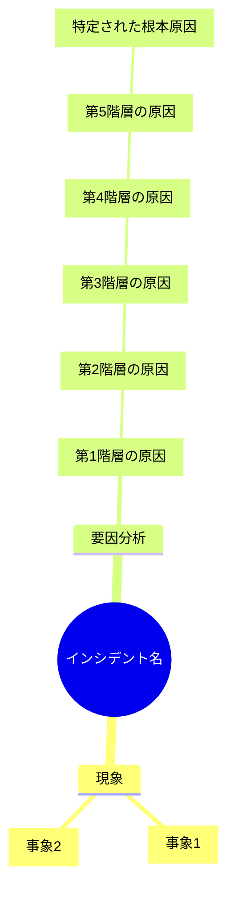

# インシデント根本原因分析結果

## 概要

**分析日時**: [YYYY-MM-DD HH:MM]
**分析者**: [分析者名]
**分析手法**: なぜなぜ分析

## インシデント事象

### 発生事象
[何が起きたかを記載]

### 発生日時
[YYYY-MM-DD HH:MM]

### 発生場所
[システム名/コンポーネント名/環境]

### 影響範囲
[影響を受けたユーザー数、サービス、機能など]

### 検知方法
[どのように検知したか]

## 分析プロセス

**特定した要因数**: [数]
**「なぜ？」の深さ**: 最大[数]階層
**分析所要時間**: [時間]

## 根本原因分析ツリー

※複合要因の場合は要因ごとに分岐を追加

## 特定された根本原因

### 根本原因1: [根本原因のタイトル]

**要因系統**: [単一要因/要因A/要因B等]

**詳細**:
[根本原因の詳しい説明を記載]

**なぜこれが根本原因か**:
- [理由1]
- [理由2]
- [理由3]

### 根本原因2: [根本原因のタイトル]

※複合要因の場合のみ

**要因系統**: [要因A/要因B等]

**詳細**:
[根本原因の詳しい説明を記載]

**なぜこれが根本原因か**:
- [理由1]
- [理由2]

## 再発防止策

### 根本原因1への対策

#### 即時対応（緊急対策）
- [ ] [対策1: 具体的な内容]
  - 実施者: [担当者名]
  - 期限: [YYYY-MM-DD]
  - 状態: [未着手/進行中/完了]

- [ ] [対策2: 具体的な内容]
  - 実施者: [担当者名]
  - 期限: [YYYY-MM-DD]
  - 状態: [未着手/進行中/完了]

#### 恒久対策
- [ ] [対策1: 具体的な内容]
  - 実施者: [担当者名]
  - 期限: [YYYY-MM-DD]
  - 状態: [未着手/進行中/完了]

- [ ] [対策2: 具体的な内容]
  - 実施者: [担当者名]
  - 期限: [YYYY-MM-DD]
  - 状態: [未着手/進行中/完了]

#### プロセス改善
- [ ] [対策1: 具体的な内容]
  - 実施者: [担当者名]
  - 期限: [YYYY-MM-DD]
  - 状態: [未着手/進行中/完了]

### 根本原因2への対策

※複合要因の場合のみ

#### 即時対応（緊急対策）
- [ ] [対策1: 具体的な内容]
  - 実施者: [担当者名]
  - 期限: [YYYY-MM-DD]
  - 状態: [未着手/進行中/完了]

#### 恒久対策
- [ ] [対策1: 具体的な内容]
  - 実施者: [担当者名]
  - 期限: [YYYY-MM-DD]
  - 状態: [未着手/進行中/完了]

## 対策の効果測定

### 測定指標

| 指標 | 現状値 | 目標値 | 測定方法 | 測定頻度 |
|------|--------|--------|----------|----------|
| [指標1] | [値] | [値] | [方法] | [頻度] |
| [指標2] | [値] | [値] | [方法] | [頻度] |
| [指標3] | [値] | [値] | [方法] | [頻度] |

### 効果確認日
[YYYY-MM-DD]

## 学びと気づき

### 良かった点
- [良かった点1]
- [良かった点2]

### 改善が必要な点
- [改善点1]
- [改善点2]

### 他のシステム/チームへの展開
- [横展開が必要な内容1]
- [横展開が必要な内容2]

## 関連ドキュメント

- 分析ログ: [log.mdへのリンク]
- インシデントチケット: [チケットURL]
- 関連する障害報告: [ドキュメントリンク]
- 参考資料: [リンク]

## 承認

**作成者**: [名前] ([YYYY-MM-DD])
**レビュー者**: [名前] ([YYYY-MM-DD])
**承認者**: [名前] ([YYYY-MM-DD])

---

**最終更新日**: [YYYY-MM-DD]
**バージョン**: 1.0
