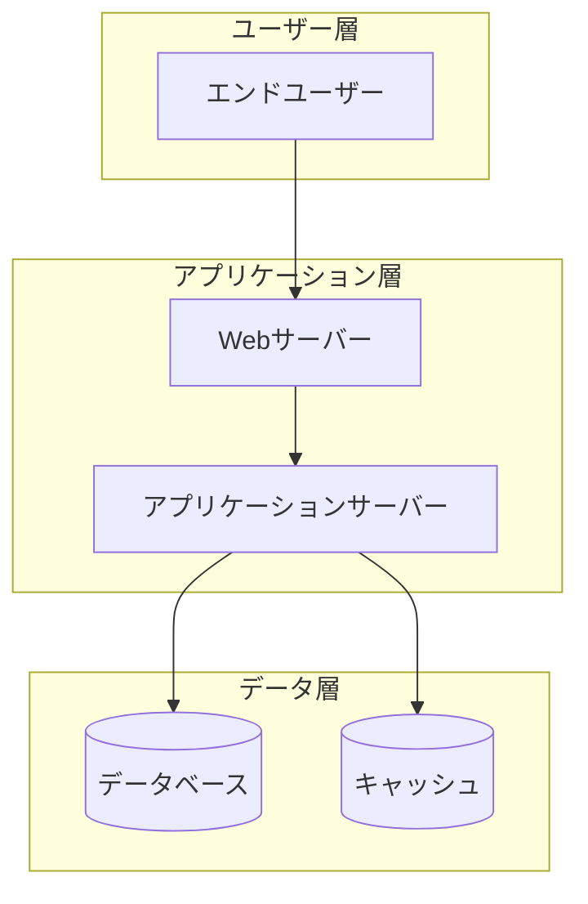
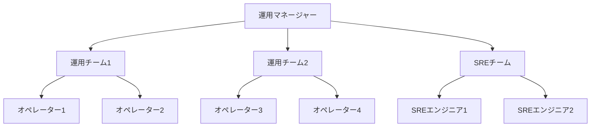

# 基盤設計（Foundation）

このモジュールは運用設計の基礎となる概要、サービス概要、運用方針、体制、スケジュールを定義します。

---

## 1. 概要

### 1.1 目的

本ドキュメントの目的を記載します。

- 運用に求められる要件の明確化
- システム運用に関わる関係者間の合意形成
- 運用プロセスの標準化と最適化
- 運用品質の向上と継続的改善

### 1.2 対象範囲

本運用設計書が対象とするシステム・サービスの範囲を記載します。

**対象システム**:
- [システム名・サービス名]

**対象業務**:
- [業務名]

**対象期間**:
- [運用開始予定日] ～ [運用終了予定日（該当する場合）]

### 1.3 前提条件

運用設計における前提条件を記載します。

- システム開発が完了していること
- 運用環境が構築されていること
- 運用チームの体制が整っていること
- [その他の前提条件]

### 1.4 制約条件

運用における制約事項を記載します。

- 予算制約: [金額や制約内容]
- リソース制約: [人員やインフラリソースの制約]
- 技術制約: [技術的な制約]
- 法規制・コンプライアンス: [該当する法規制]

### 1.5 クラウドネイティブ特有の考慮事項

**【重要】責任共有モデル**:

クラウドサービスでは、クラウドプロバイダーと利用者の間で運用責任が分担されます。

| 責任範囲 | クラウドプロバイダーの責任 | 利用者の責任 |
|---------|--------------------------|-------------|
| **インフラ** | 物理インフラ、ネットワーク、ハイパーバイザー | - |
| **マネージドサービス** | サービスの可用性、パッチ適用、スケーリング | サービス設定、アクセス制御 |
| **コンテナ/K8s** | コントロールプレーン（マネージドの場合） | アプリケーションコンテナ、Pod設計、ワークロード管理 |
| **サーバレス** | 関数実行環境、スケーリング、可用性 | 関数コード、設定、イベント設計 |
| **データ** | ストレージの冗長化、バックアップ機能提供 | データ保護設定、暗号化、バックアップ取得 |
| **セキュリティ** | インフラレベルのセキュリティ | アプリケーションレベルのセキュリティ、IAM、ネットワーク設計 |

**クラウドサービスのSLAへの依存**:
- 利用するマネージドサービスの SLAを確認し、サービス全体のSLO設計に反映
- 例: RDS（99.95%）、Lambda（99.95%）、S3（99.99%）
- 複数サービスの組み合わせによるSLOへの影響を計算

**コスト最適化の考慮**:
- オンデマンドリソースの適切な設定（タイムアウト、メモリサイズ等）
- 未使用リソースの自動削減
- Reserved Instances / Savings Plansの活用

**ベンダーロックインのリスク**:
- クラウド特有のサービスへの依存度
- マルチクラウド/ハイブリッドクラウド戦略の有無

**コンテナ・Kubernetes運用の考慮事項**:
- **コンテナイメージ管理**:
  - イメージレジストリ: ECR/GCR/ACR/DockerHub
  - イメージスキャン: Trivy/Clair/Snyk等による脆弱性検査頻度
  - イメージライフサイクル: 保管期間、削除ポリシー、タグ戦略
  - ベースイメージの更新ポリシー: セキュリティパッチ適用のサイクル

- **Kubernetes特有の運用課題**:
  - クラスタバージョン管理: マネージドK8sのアップグレード戦略（インプレース/ブルーグリーン）
  - Podのライフサイクル管理: Liveness Probe、Readiness Probe、Startup Probeの設計
  - リソース制限: Requests/Limitsの適切な設定とQoS（Guaranteed/Burstable/BestEffort）
  - ノードのメンテナンス: ノードのドレイン・交換手順、計画的メンテナンス
  - Namespaceによるマルチテナント: リソースクォータ、ネットワークポリシー
  - ConfigMap/Secretの管理: 機密情報の暗号化、ローテーションポリシー
  - PersistentVolumeの管理: スナップショット、バックアップ、リサイズ手順

- **GitOps による Infrastructure as Code 運用**:
  - **GitOpsの原則**:
    - Git を信頼できる唯一の情報源（Single Source of Truth）として扱う
    - すべてのインフラ変更は Git リポジトリへのコミット・PR 経由で実施
    - 自動化されたエージェントが Git の状態をクラスタに同期
    - 宣言的な設定（Declarative Configuration）によるインフラ管理

  - **GitOpsツールの選択**:
    - **ArgoCD** ⭐⭐⭐⭐⭐: Kubernetes 専用、UI が優れている、多機能
    - **Flux** ⭐⭐⭐⭐: CNCF 卒業プロジェクト、軽量、GitOps Toolkit として拡張可能
    - **Jenkins X** ⭐⭐⭐: CI/CD と GitOps を統合、学習コスト高

  - **GitOps ワークフロー**:
    1. 開発者が Infrastructure as Code（Terraform/Helm/Kustomize）を Git にコミット
    2. PR レビューによる変更承認プロセス
    3. マージ後、GitOps エージェント（ArgoCD/Flux）が自動的に変更を検知
    4. クラスタの状態を Git リポジトリの定義に同期
    5. 同期結果の監視とアラート

  - **GitOps 運用上の考慮事項**:
    - **リポジトリ構成**:
      - アプリケーションコードと Infrastructure as Code の分離
      - 環境ごとのブランチ/ディレクトリ戦略（dev/staging/production）
      - マニフェストの再利用（Helm Charts / Kustomize Overlays）

    - **シークレット管理**:
      - Git にシークレットをコミットしない（必須）
      - Sealed Secrets / External Secrets Operator / SOPS による暗号化
      - AWS Secrets Manager / GCP Secret Manager との連携

    - **ロールバック戦略**:
      - Git の履歴を利用した簡易ロールバック（git revert）
      - バージョンタグによる特定バージョンへの復元
      - カナリアリリース・ブルーグリーンデプロイメントとの組み合わせ

    - **監査とコンプライアンス**:
      - すべての変更が Git 履歴に記録される（変更者、タイムスタンプ、理由）
      - PR レビューによる変更承認の証跡
      - コンプライアンス要件を満たす監査ログとして活用

    - **障害時の対応**:
      - GitOps エージェントの障害時は手動デプロイも可能にしておく
      - Git リポジトリの障害時のフォールバック手順
      - 同期の失敗アラートとエスカレーション設定

**サーバレス特有の制限と考慮事項**:
- **実行制限の考慮**:
  - Lambda同時実行数制限: デフォルト1000（リージョンごと）、必要に応じて上限緩和申請
  - タイムアウト設計: 最大15分（Lambda）の制限、長時間処理はStep Functions等で分割
  - コールドスタート対策:
    - Provisioned Concurrency（追加コスト発生）
    - VPC Lambda使用時のENI作成時間考慮
    - 軽量ランタイムの選択（Python/Node.js推奨、Java/C#は起動遅い）
  - ペイロードサイズ制限:
    - 同期呼び出し: 6MB
    - 非同期呼び出し: 256KB
    - 大きなデータはS3経由で処理

- **料金最適化**:
  - メモリサイズとCPU割り当ての最適化（メモリに比例してCPUも増加）
  - タイムアウト値の適切な設定（無駄な待機時間を削減）
  - Provisioned Concurrencyの費用対効果分析

**オブザーバビリティの実装**:
- **分散トレーシング**:
  - AWS X-Ray / Jaeger / Zipkin / OpenTelemetry
  - トレースサンプリング率の設定（コストと可視性のトレードオフ）
  - サービスマップによる依存関係の可視化

- **ログ集約**:
  - CloudWatch Logs Insights / ELK Stack / Loki / Splunk
  - ログ保管期間とコスト管理
  - 構造化ログ（JSON形式）の推奨
  - ログレベル（DEBUG/INFO/WARN/ERROR）の運用ルール

- **メトリクス収集**:
  - Prometheus + Grafana / CloudWatch / Datadog / New Relic
  - カスタムメトリクスの設計
  - ダッシュボードの標準化

**AWS特有の運用項目**:
- **IAM管理**:
  - ロール・ポリシーの定期レビュー（四半期ごと推奨）
  - 最小権限の原則の徹底
  - サービスロールとIAMユーザーの使い分け
  - MFA強制ポリシー
  - アクセスキーのローテーションポリシー

- **タグ戦略**:
  - コスト配分タグ（Environment、Service、Team、CostCenter）の必須化
  - リソース管理タグ（Owner、Project、Compliance）
  - 自動タグ付けの実装（Terraform/CloudFormation）
  - タグポリシーの強制（AWS Organizations Tag Policies）

- **マルチアカウント戦略**:
  - AWS Organizations による一元管理
  - アカウント分離戦略（本番/ステージング/開発、サービスごと、環境ごと）
  - AWS Control Tower の活用（ガードレール、アカウントファクトリ）
  - 請求の統合（Consolidated Billing）

- **AWSサポート活用**:
  - サポートプラン: Developer / Business / Enterprise（要件に応じて選択）
  - TAM（Technical Account Manager）の活用（Enterprise Support）
  - Trusted Advisor の定期確認（コスト最適化、セキュリティ、パフォーマンス）
  - AWS Well-Architected Review の実施

- **コンプライアンスとガバナンス**:
  - AWS Config によるリソース設定の記録と監査
  - AWS CloudTrail による API 操作の記録（改ざん検知）
  - GuardDuty によるセキュリティ脅威検知
  - Security Hub による セキュリティポスチャの統合管理

---

## 2. サービス概要

### 2.1 サービスの目的

サービスが提供する価値と目的を記載します。

**ビジネス目的**:
- [ビジネス上の目的]

**提供価値**:
- [ユーザーに提供する価値]

### 2.2 サービスの機能

主要な機能を記載します。

| 機能名 | 概要 | 重要度 |
|--------|------|--------|
| [機能1] | [機能の説明] | High / Medium / Low |
| [機能2] | [機能の説明] | High / Medium / Low |

### 2.3 システム構成

システムのアーキテクチャと主要コンポーネントを記載します。

**アーキテクチャ図**:

**主要コンポーネント**:

| コンポーネント | 役割 | 技術スタック | 冗長化 |
|----------------|------|--------------|--------|
| [コンポーネント1] | [役割] | [技術] | Yes / No |
| [コンポーネント2] | [役割] | [技術] | Yes / No |

### 2.4 外部連携

外部システムとの連携を記載します。

| 連携先 | 連携方式 | データフロー | 重要度 |
|--------|----------|--------------|--------|
| [システム名] | API / Batch / etc | [方向と内容] | High / Medium / Low |

---

## 3. 運用方針と目標

### 3.1 運用基本方針

運用における基本的な方針を記載します。

1. **可用性重視**: [方針の詳細]
2. **セキュリティ優先**: [方針の詳細]
3. **継続的改善**: [方針の詳細]
4. **コスト最適化**: [方針の詳細]

### 3.2 サービスレベル目標（SLO）

**【重要】ユーザー中心のSLO設計原則**:

SLOは「測りやすい指標」ではなく、「ユーザーが快適に使える範囲」を起点として設計します。

**設計アプローチ**:
1. **ユーザーの期待値を理解する**
   - ユーザーはどの程度の応答速度を期待しているか
   - どの程度のエラーなら許容できるか
   - サービス停止はどの程度の影響を与えるか

2. **ユーザー体験に基づいた目標設定**
   - 「サーバーCPU使用率」ではなく「ユーザーが体感するレスポンスタイム」
   - 「データベース接続数」ではなく「ユーザーがエラーに遭遇する頻度」
   - 技術指標はユーザー体験指標の裏付けとして使用

3. **システム構成ごとの目標設定**
   - 同期処理、非同期処理、バッチ処理でユーザー期待値は異なる
   - それぞれに適切な目標値を設定

**SLO定義**:

| システム構成/機能 | 指標名 | 目標値 | ユーザー視点での意味 | 測定方法 | 測定頻度 |
|-------------------|--------|--------|---------------------|----------|----------|
| [全体] | 可用性 | [例: 99.9%] | ユーザーがサービスを利用できる時間の割合 | [測定方法] | [頻度] |
| [Web同期リクエスト] | レスポンスタイム（P95） | [例: 500ms以下] | ユーザーが操作後に結果が表示されるまでの体感速度 | [測定方法] | [頻度] |
| [Web同期リクエスト] | エラーレート | [例: 0.1%以下] | ユーザーがエラーに遭遇する頻度 | [測定方法] | [頻度] |
| [非同期APIリクエスト] | 処理完了時間（P95） | [例: 5秒以内] | バックグラウンド処理が完了するまでの時間 | [測定方法] | [頻度] |
| [バッチ処理] | 処理完了時刻 | [例: 翌朝8時まで] | 業務開始時にデータが利用可能になっている状態 | [測定方法] | 日次 |
| [全体] | MTTR | [例: 30分以内] | 障害発生時にユーザーが待つ時間 | [測定方法] | [頻度] |

### 3.3 サービスレベル指標（SLI）

SLOを測定するための具体的な指標を記載します。

| SLI名 | 定義 | データソース | 計算式 |
|-------|------|--------------|--------|
| [SLI1] | [定義] | [ソース] | [計算式] |
| [SLI2] | [定義] | [ソース] | [計算式] |

### 3.4 サービスレベル合意（SLA）

顧客またはユーザーに対して約束するサービス品質の基準を記載します。

**SLA策定の重要性**:
- SLOとSLIに基づいた実現可能な目標設定
- 顧客期待値の明確化
- サービス品質保証の根拠
- 違約時の対応方針の明確化

**SLA定義**:

| システム構成/機能 | SLA項目 | 保証値 | 測定方法 | 測定期間 | 未達時の対応 |
|-------------------|---------|--------|----------|----------|-------------|
| [全体] | サービス可用性 | [例: 99.9%] | [測定方法] | 月次 | [対応内容] |
| [Web同期リクエスト] | レスポンスタイム（P95） | [例: 500ms以下] | [測定方法] | 月次 | [対応内容] |
| [非同期APIリクエスト] | 処理完了時間（P95） | [例: 5秒以内] | [測定方法] | 月次 | [対応内容] |
| [バッチ処理] | 処理完了時刻 | [例: 翌朝8時まで] | [測定方法] | 日次 | [対応内容] |

**システム構成別のSLA設定指針**:

1. **同期的なWebリクエスト（ユーザー対話操作）**
   - ユーザーが快適に操作できる範囲を基準とする
   - レスポンスタイム: 一般的に500ms以下（P95）
   - エラーレート: 0.1%以下

2. **非同期APIリクエスト（バックグラウンド処理）**
   - ユーザー体験に直接影響しない範囲で設定
   - 処理完了時間: 数秒〜数十秒
   - 再試行ポリシーを含む

3. **バッチ処理（夜間処理等）**
   - 業務開始時刻までの完了を保証
   - 処理時間: 数時間単位
   - 失敗時の再実行ポリシー

**SLA未達時のペナルティまたは対応**:
- サービスクレジット: [内容]
- エスカレーション: [プロセス]
- 改善計画の提出: [内容]

### 3.5 エラーバジェット

許容されるエラーの範囲を定義します。

**エラーバジェット算出**:
- 可用性目標: 99.9%
- 許容ダウンタイム（月間）: [計算結果]
- エラーバジェット消費の閾値: [閾値]

**エラーバジェットポリシー**:
- エラーバジェット残量 > 50%: [対応方針]
- エラーバジェット残量 20-50%: [対応方針]
- エラーバジェット残量 < 20%: [対応方針]

---

## 4. 運用体制

### 4.1 運用組織体制

運用組織の体制を記載します。

### 4.2 役割と責任（RACI）

主要な運用プロセスにおける役割と責任を記載します。

| プロセス/タスク | 運用マネージャー | 運用チーム | SREチーム | 開発チーム | 備考 |
|-----------------|------------------|------------|-----------|------------|------|
| 監視・アラート対応 | A | R | C | I | [備考] |
| インシデント対応 | A | R | C | C | [備考] |
| 変更管理 | A | I | C | R | [備考] |
| リリース管理 | A | C | R | R | [備考] |

※ R=Responsible（実行責任）, A=Accountable（説明責任）, C=Consulted（相談）, I=Informed（報告）

### 4.3 運用時間帯

運用体制の時間帯を記載します。

| 時間帯 | 運用体制 | 対応内容 |
|--------|----------|----------|
| 平日 9:00-18:00 | 通常体制 | [対応内容] |
| 平日 18:00-9:00 | オンコール体制 | [対応内容] |
| 休日・祝日 | オンコール体制 | [対応内容] |

**オンコール体制**:
- 1次対応: [担当者・連絡先]
- 2次対応: [担当者・連絡先]
- エスカレーション先: [担当者・連絡先]

### 4.4 コミュニケーション

運用における コミュニケーション方法を記載します。

**定例会議**:

| 会議名 | 頻度 | 参加者 | 目的 |
|--------|------|--------|------|
| 日次運用会議 | 毎日 | [参加者] | [目的] |
| 週次運用レビュー | 毎週 | [参加者] | [目的] |
| 月次運用報告 | 毎月 | [参加者] | [目的] |

**コミュニケーションツール**:
- チャット: [ツール名・チャンネル]
- チケット管理: [ツール名]
- ドキュメント共有: [ツール名]
- インシデント管理: [ツール名]

---

## 5. 運用スケジュール

### 5.1 定期運用スケジュール

定期的に実施する運用作業のスケジュールを記載します。

| 作業項目 | 頻度 | 実施日時 | 担当 | 所要時間 |
|----------|------|----------|------|----------|
| [作業1] | 日次 | [時刻] | [担当] | [時間] |
| [作業2] | 週次 | [曜日・時刻] | [担当] | [時間] |
| [作業3] | 月次 | [日・時刻] | [担当] | [時間] |

### 5.2 メンテナンスウィンドウ

計画メンテナンスの実施可能時間帯を記載します。

**定期メンテナンス**:
- 頻度: [週次/月次/四半期等]
- 実施日時: [曜日・時刻]
- 所要時間: [時間]
- 影響範囲: [影響内容]

**緊急メンテナンス**:
- 実施判断基準: [基準]
- 承認プロセス: [プロセス]
- 通知方法: [通知手段]

### 5.3 年間運用カレンダー

年間の主要イベントとメンテナンススケジュールを記載します。

| 月 | イベント/作業 | 詳細 |
|----|---------------|------|
| 1月 | [イベント] | [詳細] |
| 2月 | [イベント] | [詳細] |
| ... | ... | ... |

---
