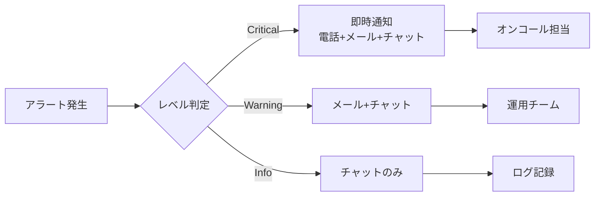

# 日常運用（Daily Operations）

このモジュールは日常的な運用作業と監視・通知の設計を定義します。

---

## 6. 定常運用作業

### 6.1 日次運用作業

毎日実施する運用作業を記載します。

#### 7.1.1 [作業名1]

**目的**: [作業の目的]

**実施タイミング**: [時刻]

**手順**:
1. [手順1]
2. [手順2]
3. [手順3]

**確認項目**:
- [ ] [確認項目1]
- [ ] [確認項目2]

**成果物**: [成果物があれば記載]

**エスカレーション基準**: [異常時の対応]

#### 7.1.2 [作業名2]

[同様の形式で記載]

### 6.2 週次運用作業

週単位で実施する運用作業を記載します。

#### 7.2.1 [作業名]

[日次作業と同様の形式で記載]

### 6.3 月次運用作業

月単位で実施する運用作業を記載します。

#### 7.3.1 [作業名]

[日次作業と同様の形式で記載]

---

## 7. 監視・通知

### 7.1 監視方針

**【重要】ユーザー中心の監視設計原則**:

監視は「測りやすい技術指標」ではなく、「ユーザーが快適に使える状態」を維持するために実施します。

**監視設計アプローチ**:

1. **ユーザー体験起点の監視**
   - まず「ユーザーが体感する品質」を監視
   - 技術指標はユーザー体験指標が悪化した時の原因特定に使用
   - 例: レスポンスタイムの悪化を検知 → CPU使用率を確認して原因を特定

2. **外形監視を最優先**
   - ユーザーと同じ視点でサービスを監視
   - エンドツーエンドの動作確認
   - 実際のユーザートランザクションをシミュレート

3. **システム構成ごとの監視基準**
   - 同期処理、非同期処理、バッチ処理で監視基準を分ける
   - それぞれのユーザー期待値に基づいた閾値設定

**監視の目的**:
- **第一目的**: ユーザーが快適に利用できる状態の維持
- サービスの可用性確保
- パフォーマンス劣化の早期検知（ユーザー体感品質の観点から）
- セキュリティインシデントの検知
- キャパシティ不足の予兆検知

**監視レベル**:
- レベル1（Critical）: ユーザーに直接影響がある状態 [具体的な定義と対応]
- レベル2（Warning）: ユーザーへ影響が及ぶ可能性のある状態 [具体的な定義と対応]
- レベル3（Info）: ユーザーに影響はないが注視すべき状態 [具体的な定義と対応]

### 7.2 監視項目

**【重要】監視項目の優先順位**:

**優先度1: ユーザー体験監視（SLI直結）**
- ユーザーが直接体感する品質指標
- これらが正常であればサービスは正常

**優先度2: アプリケーション監視**
- ユーザー体験指標の裏付け
- 問題発生時の原因特定用

**優先度3: インフラ監視**
- アプリケーション指標の裏付け
- キャパシティ管理用

**監視項目定義**:

| 優先度 | 監視対象 | 監視項目 | 閾値 | 監視間隔 | アラートレベル | ユーザー視点での意味 |
|--------|----------|----------|------|----------|----------------|---------------------|
| 1 | 外形監視（Web同期） | レスポンスタイム（P95） | 500ms超 | 1分 | Warning | ユーザーが遅いと感じる |
| 1 | 外形監視（Web同期） | レスポンスタイム（P95） | 1000ms超 | 1分 | Critical | ユーザーがストレスを感じる |
| 1 | 外形監視（Web同期） | エラーレート | 0.1%超 | 1分 | Warning | ユーザーがエラーに遭遇し始める |
| 1 | 外形監視（Web同期） | エラーレート | 1%超 | 1分 | Critical | 多数のユーザーがエラーに遭遇 |
| 1 | 外形監視（非同期API） | 処理完了時間（P95） | 5秒超 | 5分 | Warning | バックグラウンド処理の遅延 |
| 1 | 外形監視（バッチ） | 処理完了時刻 | 7:00以降 | 1時間 | Warning | 業務開始に間に合わない可能性 |
| 1 | 外形監視（バッチ） | 処理完了時刻 | 8:00以降 | 1時間 | Critical | 業務開始に間に合わない |
| 2 | アプリケーション | エラーレート | [閾値] | 1分 | [レベル] | アプリケーションレベルのエラー発生状況 |
| 2 | アプリケーション | レスポンスタイム | [閾値] | 1分 | [レベル] | アプリケーション処理時間 |
| 3 | Webサーバー | CPU使用率 | 80%超 | 1分 | Info | リソース逼迫の予兆 |
| 3 | Webサーバー | CPU使用率 | 90%超 | 1分 | Warning | リソース逼迫 |
| 3 | Webサーバー | メモリ使用率 | [閾値] | [間隔] | [レベル] | メモリリソース状況 |
| 3 | データベース | 接続数 | [閾値] | [間隔] | [レベル] | DB接続リソース状況 |

**クラウドネイティブ/サーバレス固有の監視項目**:

**【サーバレス（Lambda/Cloud Functions等）の監視】**:

| 優先度 | 監視対象 | 監視項目 | 閾値 | 監視間隔 | アラートレベル | ユーザー視点での意味 |
|--------|----------|----------|------|----------|----------------|---------------------|
| 1 | Lambda関数 | Errors | 1件以上/分 | 1分 | Critical | ユーザーリクエストが失敗している |
| 2 | Lambda関数 | Throttles | 1件以上 | 1分 | Critical | リクエストがスロットリングされている |
| 2 | Lambda関数 | 同時実行数 | アカウント上限の80%超 | 1分 | Warning | スロットリングの予兆 |
| 2 | Lambda関数 | Duration（P95） | タイムアウト値の80%超 | 5分 | Warning | タイムアウトの予兆、処理遅延 |
| 2 | Lambda関数 | Duration（P95） | タイムアウト値の95%超 | 5分 | Critical | タイムアウト直前、即座に対応必要 |
| 3 | Lambda関数 | Cold Start率 | 5%超 | 5分 | Info | レスポンスタイム悪化の要因 |
| 3 | Lambda関数 | メモリ使用率 | 設定値の90%超 | 5分 | Warning | メモリ不足によるパフォーマンス低下 |
| 3 | Lambda関数 | イテレーター経過時間 | 1時間超 | 5分 | Warning | ストリーム処理の遅延（Kinesis/DynamoDB Streams） |

**【Kubernetes（EKS/GKE/AKS）の監視】**:

| 優先度 | 監視対象 | 監視項目 | 閾値 | 監視間隔 | アラートレベル | ユーザー視点での意味 |
|--------|----------|----------|------|----------|----------------|---------------------|
| 1 | Pod | CrashLoopBackOff | 発生 | 1分 | Critical | サービスが起動できない状態 |
| 1 | Pod | ImagePullBackOff | 発生 | 1分 | Critical | コンテナイメージ取得失敗 |
| 1 | Service | Endpoints数 | 0 | 1分 | Critical | バックエンドPodが全て停止 |
| 2 | Pod | PodのPending状態 | 5分以上 | 1分 | Warning | リソース不足でスケールできない |
| 2 | Pod | Restart回数 | 10回/1時間 | 5分 | Warning | 不安定な状態、調査必要 |
| 2 | Node | NodeNotReady | 発生 | 1分 | Critical | ノード障害、サービス影響の可能性 |
| 2 | Node | DiskPressure | 発生 | 1分 | Warning | ディスク容量不足 |
| 2 | Node | MemoryPressure | 発生 | 1分 | Warning | メモリ不足 |
| 3 | Pod | CPU使用率（Requests比） | 90%超 | 1分 | Warning | スケールアウトの必要性 |
| 3 | Pod | メモリ使用率（Requests比） | 90%超 | 1分 | Warning | スケールアウトの必要性 |
| 3 | HPA | desiredReplicas vs currentReplicas | 不一致が5分以上 | 1分 | Warning | スケールが追いついていない |
| 3 | Cluster | ノード数 | 最大ノード数の90%超 | 5分 | Warning | クラスタ拡張限界に近づいている |

**【AWSマネージドサービス固有の監視】**:

| 優先度 | 監視対象 | 監視項目 | 閾値 | 監視間隔 | アラートレベル | ユーザー視点での意味 |
|--------|----------|----------|------|----------|----------------|---------------------|
| 1 | RDS | DBInstanceStatus | available以外 | 1分 | Critical | データベースが利用不可 |
| 1 | RDS | フェイルオーバー発生 | 発生 | 1分 | Critical | DBが一時的に利用不可になる |
| 1 | ALB/NLB | HealthyHostCount | 0 | 1分 | Critical | 全てのバックエンドが停止 |
| 1 | ALB/NLB | UnHealthyHostCount | 全ターゲット数 | 1分 | Critical | 全てのバックエンドが異常 |
| 2 | RDS | CPU使用率 | 80%超 | 5分 | Warning | パフォーマンス劣化の予兆 |
| 2 | RDS | 接続数 | 最大接続数の80%超 | 1分 | Warning | 新規接続が拒否され始める |
| 2 | RDS | FreeableMemory | 1GB未満 | 5分 | Warning | メモリ不足 |
| 2 | RDS | FreeStorageSpace | 10GB未満または10%未満 | 5分 | Warning | ストレージ容量不足 |
| 2 | RDS | ReadLatency/WriteLatency | 100ms超（P95） | 5分 | Warning | I/O性能劣化 |
| 2 | SQS | ApproximateAgeOfOldestMessage | 15分超 | 5分 | Warning | メッセージ処理の遅延 |
| 2 | SQS | DLQメッセージ数 | 1件以上 | 5分 | Warning | 処理失敗メッセージの蓄積 |
| 2 | DynamoDB | UserErrors | 1件以上/分 | 1分 | Warning | クライアントエラーの発生 |
| 2 | DynamoDB | SystemErrors | 1件以上 | 1分 | Critical | DynamoDB側のエラー |
| 2 | DynamoDB | ConsumedReadCapacity | プロビジョニング値の80%超 | 1分 | Warning | スロットリングの予兆 |
| 2 | DynamoDB | ConsumedWriteCapacity | プロビジョニング値の80%超 | 1分 | Warning | スロットリングの予兆 |
| 2 | S3 | 4xxErrors | 10件以上/分 | 5分 | Warning | クライアントエラーの多発 |
| 2 | S3 | 5xxErrors | 1件以上 | 5分 | Critical | S3側のエラー |
| 3 | CloudWatch Logs | IncomingBytes | 予算の80%超（月累計） | 1時間 | Info | ログコスト超過の予兆 |
| 3 | API Gateway | Latency（P95） | 1000ms超 | 5分 | Warning | API処理遅延 |
| 3 | API Gateway | 4XXError率 | 5%超 | 5分 | Warning | クライアントエラーの多発 |
| 3 | API Gateway | 5XXError率 | 1%超 | 5分 | Critical | サーバーエラーの多発 |

**【コンテナイメージ・レジストリの監視】**:

| 優先度 | 監視対象 | 監視項目 | 閾値 | 監視間隔 | アラートレベル | ユーザー視点での意味 |
|--------|----------|----------|------|----------|----------------|---------------------|
| 2 | ECR/GCR/ACR | イメージプル失敗 | 発生 | 1分 | Critical | デプロイ・スケールができない |
| 3 | ECR/GCR/ACR | 脆弱性スキャン結果 | Critical/High検出 | 1日 | Warning | セキュリティリスク |
| 3 | ECR/GCR/ACR | ストレージ使用量 | 予算の80%超 | 1日 | Info | コスト超過の予兆 |

**【分散トレーシング・オブザーバビリティ】**:

| 優先度 | 監視対象 | 監視項目 | 閾値 | 監視間隔 | アラートレベル | ユーザー視点での意味 |
|--------|----------|----------|------|----------|----------------|---------------------|
| 1 | X-Ray/Jaeger | エラートレース率 | 1%超 | 5分 | Warning | 分散システム内でのエラー発生 |
| 2 | X-Ray/Jaeger | エンドツーエンドレイテンシ（P95） | SLO超過 | 5分 | Warning | 複数サービスにまたがる処理遅延 |
| 3 | X-Ray/Jaeger | サンプリング率 | 設定値未満 | 1時間 | Info | トレースデータの欠損 |

**システム構成別の監視設計**:

1. **同期的なWebリクエスト**
   - ユーザーは即座に結果を期待
   - レスポンスタイム: P95で500ms以下を目標
   - 監視間隔: 1分（迅速な検知が必要）

2. **非同期APIリクエスト**
   - ユーザーは数秒の待機は許容
   - 処理完了時間: P95で5秒以内を目標
   - 監視間隔: 5分（ある程度の猶予あり）

3. **バッチ処理**
   - ユーザーは完了時刻を期待
   - 処理完了時刻: 業務開始時刻まで
   - 監視間隔: 1時間（処理時間が長いため）

### 7.3 ログ管理

ログの収集・保管・分析方針を記載します。

**ログ種類**:

| ログ種類 | 出力先 | 保管期間 | 用途 |
|----------|--------|----------|------|
| アクセスログ | [保存先] | [期間] | [用途] |
| アプリケーションログ | [保存先] | [期間] | [用途] |
| エラーログ | [保存先] | [期間] | [用途] |
| セキュリティログ | [保存先] | [期間] | [用途] |

**ログ分析**:
- ツール: [ツール名]
- 分析頻度: [頻度]
- 分析内容: [内容]

### 7.4 アラート通知

アラート通知のルールと方法を記載します。

**通知ルート**:

**通知先**:

| アラートレベル | 通知方法 | 通知先 | 対応時間 |
|----------------|----------|--------|----------|
| Critical | 電話+メール+チャット | [通知先] | 即時 |
| Warning | メール+チャット | [通知先] | 30分以内 |
| Info | チャット | [通知先] | 営業時間内 |

---
