# 変更・リリース管理（Change and Release Management)

このモジュールはインシデント管理、変更管理、リリース管理、バックアップ・リカバリを定義します。

---

## 8. インシデント管理

### 8.1 インシデント定義

インシデントの定義と分類を記載します。

**インシデント定義**:
サービスの計画外の中断、またはサービス品質の低下

**インシデント分類**:

| 優先度 | 定義 | 対応目標時間 | 例 |
|--------|------|--------------|-----|
| P1（Critical） | サービス全停止 | 15分以内に対応開始 | [例] |
| P2（High） | 主要機能停止 | 30分以内に対応開始 | [例] |
| P3（Medium） | 一部機能停止 | 2時間以内に対応開始 | [例] |
| P4（Low） | 軽微な問題 | 営業時間内対応 | [例] |

### 8.2 インシデント対応フロー

インシデント対応の標準フローを記載します。

### 8.3 インシデント対応手順

インシデント対応の詳細手順を記載します。

#### 9.3.1 検知・報告

**検知方法**:
- 監視アラート
- ユーザー報告
- 運用チーム発見

**報告フロー**:
1. インシデント管理ツールにチケット作成
2. 運用チームに通知
3. 優先度に応じてエスカレーション

#### 9.3.2 トリアージ

**トリアージ基準**:
- 影響範囲（全ユーザー / 一部ユーザー / 特定機能）
- ビジネスインパクト（売上損失 / 信用失墜 / 軽微）
- 緊急度（即時対応必要 / 計画的対応可能）

**優先度判定**:
[優先度判定のマトリクスやルール]

#### 9.3.3 対応・復旧

**対応原則**:
1. まず復旧、原因究明は後
2. 影響範囲の最小化を優先
3. コミュニケーションを密に

**復旧手順**:
1. [手順1]
2. [手順2]
3. [手順3]

#### 9.3.4 ポストモーテム

**実施タイミング**:
- P1/P2インシデント: 必須
- P3インシデント: 必要に応じて
- P4インシデント: 任意

**ポストモーテム内容**:
- インシデントサマリー
- 影響範囲と期間
- 根本原因分析（なぜなぜ分析）
- 再発防止策
- アクションアイテム

### 8.4 エスカレーション

エスカレーションルールを記載します。

**エスカレーション基準**:
- 対応開始から[X]分経過しても復旧しない
- 影響範囲が拡大している
- 技術的な判断が必要
- ビジネス判断が必要

**エスカレーションパス**:

---

## 9. 変更管理

### 9.1 変更管理方針

変更管理の基本方針を記載します。

**変更管理の目的**:
- 変更に伴うリスクの最小化
- 変更の影響評価と承認プロセスの明確化
- 変更履歴の記録と追跡可能性の確保

**変更の定義**:
本番環境への以下の変更を対象とします
- システム構成の変更
- アプリケーションのデプロイ
- インフラ設定の変更
- セキュリティ設定の変更

### 9.2 変更分類

変更の種類と承認プロセスを記載します。

| 変更分類 | 定義 | 承認者 | リードタイム |
|----------|------|--------|--------------|
| 標準変更 | 手順化済みの低リスク変更 | 運用リーダー | 即時 |
| 通常変更 | 一般的な変更 | 運用マネージャー | 3営業日 |
| 緊急変更 | 緊急対応が必要な変更 | 運用マネージャー | 即時 |
| 重要変更 | 高リスクまたは大規模な変更 | 変更諮問委員会 | 1週間 |

### 9.3 変更管理フロー

変更管理のプロセスを記載します。

### 9.4 変更実施手順

変更を実施する際の標準手順を記載します。

**事前準備**:
1. 変更チケットの作成
2. 変更内容の詳細記載
3. 影響評価の実施
4. ロールバック計画の作成
5. 承認取得

**実施時**:
1. 事前バックアップの取得
2. 変更作業の実施
3. 作業ログの記録
4. 動作確認の実施

**事後**:
1. 変更結果の報告
2. ドキュメントの更新
3. チケットのクローズ

### 9.5 ロールバック計画

ロールバックの基準と手順を記載します。

**ロールバック判断基準**:
- 変更後の動作確認でエラーが検出された
- SLOを下回る性能劣化が発生した
- 予期しない副作用が発生した
- [その他の基準]

**ロールバック手順**:
1. [手順1]
2. [手順2]
3. [手順3]

---

## 10. リリース管理

### 10.1 リリース方針

リリースの基本方針を記載します。

**リリース原則**:
- 定期リリースと緊急リリースの明確な区別
- 本番環境へのリリース前の十分なテスト
- 段階的なロールアウト（カナリアリリース等）
- 自動化されたデプロイメントプロセス

### 10.2 リリーススケジュール

定期リリースのスケジュールを記載します。

| リリース種別 | 頻度 | 実施日時 | 対象 |
|--------------|------|----------|------|
| メジャーリリース | 四半期毎 | [日時] | 大規模機能追加 |
| マイナーリリース | 月次 | [日時] | 機能改善 |
| パッチリリース | 週次 | [日時] | バグフィックス |
| ホットフィックス | 随時 | 随時 | 緊急対応 |

### 10.3 リリースフロー

リリースプロセスを記載します。

**各環境の役割**:
- 開発環境: 機能開発とユニットテスト
- テスト環境: 結合テストと品質保証
- ステージング環境: 本番環境と同等構成での最終確認
- カナリア環境: 一部ユーザーでの先行リリース
- 本番環境: 全ユーザー向けリリース

### 10.4 デプロイメント戦略

デプロイメント方式を記載します。

**採用戦略**: [選択した戦略]

**デプロイメント方式の比較**:

| 方式 | メリット | デメリット | 採用判断 |
|------|----------|------------|----------|
| Blue-Green | ダウンタイムゼロ | リソース2倍必要 | [○/×] |
| Rolling | リソース効率的 | 段階的な切り替え | [○/×] |
| Canary | リスク最小化 | 複雑な制御必要 | [○/×] |

**自動化ツール**:
- CI/CDツール: [ツール名]
- デプロイツール: [ツール名]
- インフラ管理: [ツール名]

---

## 11. バックアップ・リカバリ

### 11.1 バックアップ方針

バックアップの基本方針を記載します。

**バックアップ目的**:
- データ損失時の復旧
- ランサムウェア等のセキュリティインシデント対応
- 監査・コンプライアンス要件への対応

**バックアップ原則**:
- 3-2-1ルール: 3つのコピー、2つの異なるメディア、1つはオフサイト
- 暗号化されたバックアップの保管
- 定期的なリストアテストの実施

### 11.2 バックアップ設計

バックアップ対象と方式を記載します。

| バックアップ対象 | バックアップ方式 | 頻度 | 世代管理 | 保管場所 |
|------------------|------------------|------|----------|----------|
| データベース | フル+差分 | 日次フル+6時間毎差分 | 30世代 | [場所] |
| ファイルストレージ | フル | 日次 | 7世代 | [場所] |
| システム設定 | フル | 変更時 | 10世代 | [場所] |
| ログファイル | 増分 | 1時間毎 | 90日 | [場所] |

**バックアップスケジュール**:

```mermaid
gantt
    title バックアップスケジュール（1日）
    dateFormat HH:mm
    axisFormat %H:%M

    section データベース
    フルバックアップ    :00:00, 2h
    差分バックアップ1   :06:00, 30m
    差分バックアップ2   :12:00, 30m
    差分バックアップ3   :18:00, 30m

    section ファイル
    フルバックアップ    :02:00, 1h
```

### 11.3 リカバリ設計

リカバリの目標値と手順を記載します。

**リカバリ目標**:

| 対象 | RPO（目標復旧時点） | RTO（目標復旧時間） |
|------|---------------------|---------------------|
| データベース | 6時間以内 | 4時間以内 |
| ファイルストレージ | 24時間以内 | 2時間以内 |
| システム全体 | 24時間以内 | 8時間以内 |

**リカバリ手順**:

#### データベースリカバリ
1. [手順1]
2. [手順2]
3. [手順3]

**リカバリテスト**:
- 頻度: 四半期毎
- 対象: [テスト対象]
- 成功基準: [基準]

### 11.4 災害対策（DR）

災害復旧計画を記載します。

**DR方針**:
- DR サイト: [有/無]
- DR 構成: [Hot Standby / Warm Standby / Cold Standby]

**DR切り替えシナリオ**:

| シナリオ | 発生条件 | 切り替え判断 | 切り替え時間目標 |
|----------|----------|--------------|------------------|
| データセンター障害 | [条件] | [判断基準] | [時間] |
| リージョン障害 | [条件] | [判断基準] | [時間] |

---
