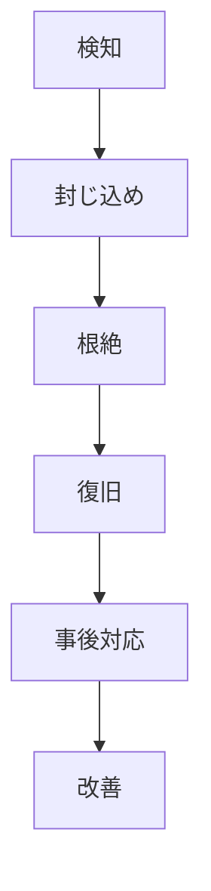

# セキュリティ運用（Security Operations）

このモジュールはセキュリティ運用、アクセス管理、脆弱性管理、DevSecOpsを定義します。

---

## 12. セキュリティ運用

### 12.1 セキュリティ運用方針

セキュリティ運用の基本方針を記載します。

**セキュリティ原則**:
- 多層防御（Defense in Depth）
- 最小権限の原則
- ゼロトラストアーキテクチャ
- 継続的なセキュリティ監視

### 12.2 アクセス管理

アクセス権限の管理方針を記載します。

**権限管理**:

| ロール | 権限範囲 | 承認者 | レビュー頻度 |
|--------|----------|--------|--------------|
| システム管理者 | 全権限 | [承認者] | 月次 |
| 運用担当者 | 運用操作のみ | [承認者] | 月次 |
| 開発者 | 開発環境のみ | [承認者] | 月次 |
| 閲覧者 | 読み取りのみ | [承認者] | 四半期 |

**アクセスレビュー**:
- 頻度: [頻度]
- 実施者: [担当者]
- レビュー内容: [内容]

### 12.3 脆弱性管理

脆弱性の検出と対応プロセスを記載します。

**脆弱性スキャン**:
- ツール: [ツール名]
- 頻度: [頻度]
- 対象: [対象システム]

**パッチ適用**:

| 脆弱性レベル | 対応期限 | 承認プロセス |
|--------------|----------|--------------|
| Critical | 24時間以内 | 緊急変更 |
| High | 7日以内 | 通常変更 |
| Medium | 30日以内 | 通常変更 |
| Low | 90日以内 | 計画変更 |

### 12.4 DevSecOps: CI/CDパイプラインのセキュリティ

**【重要】Shift Left Security - 開発の早期段階でセキュリティを組み込む**

DevSecOpsは、従来の「開発→テスト→運用→セキュリティチェック」というフローを変革し、開発の初期段階からセキュリティを組み込む実践です。

**DevSecOpsの原則**:
- セキュリティは全員の責任（開発者・運用者・セキュリティチーム）
- 自動化されたセキュリティチェックをCI/CDパイプラインに組み込む
- 早期発見・早期修正によるコスト削減
- 継続的なセキュリティ改善

**CI/CDパイプラインのセキュリティゲート**:

```mermaid
graph LR
    Code[コード作成] --> Commit[Git コミット]
    Commit --> SecretScan[シークレットスキャン]
    SecretScan --> SAST[SAST: 静的解析]
    SAST --> DepScan[依存関係スキャン]
    DepScan --> Build[ビルド]
    Build --> ContainerScan[コンテナスキャン]
    ContainerScan --> Deploy[デプロイ: ステージング]
    Deploy --> DAST[DAST: 動的解析]
    DAST --> ProdDeploy[本番デプロイ]
    ProdDeploy --> Runtime[ランタイム保護]
```



#### 12.4.1 SAST（静的アプリケーションセキュリティテスト）

**目的**: ソースコードの脆弱性を自動検出

**実装内容**:

| 項目 | 内容 |
|------|------|
| **ツール** | SonarQube / Checkmarx / Snyk Code / Semgrep |
| **実施タイミング** | PR作成時、マージ前（必須）、定期実行（週次） |
| **検出対象** | SQLインジェクション、XSS、CSRF、ハードコードされたシークレット、安全でない関数使用 |
| **閾値設定** | Critical/High: ビルド失敗、Medium: 警告、Low: 情報 |
| **レポート** | PR コメントへの自動投稿、ダッシュボードでの可視化 |
| **False Positive対応** | ホワイトリスト管理、定期レビュー |

**実装例（GitHub Actions）**:
```yaml
- name: Run SAST with SonarQube
  run: |
    sonar-scanner \
      -Dsonar.projectKey=${{ github.repository }} \
      -Dsonar.qualitygate.wait=true \
      -Dsonar.qualitygate.timeout=300
```

#### 12.4.2 依存関係の脆弱性スキャン（SCA: Software Composition Analysis）

**目的**: サードパーティライブラリの既知脆弱性を検出

**実装内容**:

| 項目 | 内容 |
|------|------|
| **ツール** | Snyk / Dependabot / Trivy / OWASP Dependency-Check |
| **実施タイミング** | PR作成時、日次スキャン、デプロイ前 |
| **検出対象** | npm/pip/maven等のパッケージ、既知脆弱性（CVE）、ライセンス違反 |
| **自動修正** | Dependabot/Snykによる自動PR作成 |
| **閾値設定** | Critical: 即座に修正、High: 7日以内、Medium: 30日以内 |
| **除外ルール** | False Positiveやパッチ未提供の脆弱性を一時的に除外 |

**対応フロー**:
1. 脆弱性検出 → Slack/GitHub Issue通知
2. 自動PR作成（パッチ適用可能な場合）
3. 開発チームがレビュー・マージ
4. 修正不可能な場合: リスク受容判断または代替パッケージ検討

#### 12.4.3 コンテナイメージスキャン

**目的**: コンテナイメージのOS/アプリケーション層の脆弱性検出

**実装内容**:

| 項目 | 内容 |
|------|------|
| **ツール** | Trivy / Clair / Anchore / Snyk Container |
| **実施タイミング** | イメージビルド後、レジストリへのプッシュ前、定期スキャン（日次） |
| **検出対象** | OS パッケージ脆弱性、アプリケーション依存関係、設定不備（CIS Benchmark） |
| **閾値設定** | Critical: デプロイ不可、High: 承認必須、Medium以下: 警告 |
| **ベースイメージ戦略** | 最小限のイメージ使用（alpine/distroless）、定期的な再ビルド |

**実装例（GitLab CI）**:
```yaml
container_scanning:
  image: aquasec/trivy:latest
  script:
    - trivy image --exit-code 1 --severity CRITICAL,HIGH $CI_REGISTRY_IMAGE:$CI_COMMIT_SHA
```

#### 12.4.4 DAST（動的アプリケーションセキュリティテスト）

**目的**: 稼働中のアプリケーションに対する実際の攻撃シミュレーション

**実装内容**:

| 項目 | 内容 |
|------|------|
| **ツール** | OWASP ZAP / Burp Suite / Acunetix |
| **実施タイミング** | ステージング環境デプロイ後、本番デプロイ前、週次定期実行 |
| **検出対象** | XSS、SQLインジェクション、認証バイパス、CSRF、セキュリティヘッダー不備 |
| **実施環境** | ステージング環境（本番と同等の構成） |
| **テストシナリオ** | 自動スキャン + 手動ペネトレーションテスト（重要機能） |

#### 12.4.5 シークレットスキャン（ハードコード検出）

**目的**: ソースコード内の機密情報（パスワード、APIキー等）の漏洩防止

**実装内容**:

| 項目 | 内容 |
|------|------|
| **ツール** | git-secrets / TruffleHog / Gitleaks / GitHub Secret Scanning |
| **実施タイミング** | コミット時（pre-commit hook）、PR作成時、リポジトリ全体の定期スキャン |
| **検出対象** | AWS/GCPアクセスキー、API トークン、パスワード、秘密鍵、証明書 |
| **対応** | コミット拒否、検出時の即時無効化、インシデント記録 |
| **False Positive対応** | ホワイトリスト設定、サンプルコードの除外 |

**実装例（pre-commit hook）**:
```bash
#!/bin/sh
gitleaks protect --staged --verbose
```

#### 12.4.6 Infrastructure as Code (IaC) セキュリティスキャン

**目的**: Terraform/CloudFormation等のインフラコードのセキュリティ設定不備を検出

**実装内容**:

| 項目 | 内容 |
|------|------|
| **ツール** | tfsec / Checkov / Terraform Sentinel / CloudFormation Guard |
| **実施タイミング** | PR作成時、terraform apply前 |
| **検出対象** | S3バケットの公開設定、暗号化未設定、過度な権限、セキュリティグループの0.0.0.0/0許可 |
| **ポリシー** | CIS Benchmark、NIST、PCI DSS準拠チェック |
| **修正支援** | 自動修正候補の提示 |

**実装例（Terraform）**:
```yaml
- name: Run tfsec
  run: tfsec . --soft-fail
```

#### 12.4.7 ランタイムセキュリティ保護

**目的**: 本番環境での異常な振る舞いの検出と防御

**実装内容**:

| 項目 | 内容 |
|------|------|
| **ツール** | Falco / Aqua Security / Sysdig Secure |
| **監視対象** | 予期しないプロセス起動、ファイル改ざん、異常なネットワーク通信、権限昇格試行 |
| **対応** | アラート通知、自動遮断（設定に応じて）、フォレンジック情報の記録 |
| **ポリシー** | Kubernetesセキュリティポリシー、Pod Security Standards準拠 |

#### 12.4.8 セキュリティメトリクスとダッシュボード

**可視化する指標**:

| メトリクス | 測定内容 | 目標値 |
|-----------|----------|--------|
| **Mean Time to Remediate (MTTR)** | 脆弱性発見から修正までの平均時間 | Critical: 24時間以内、High: 7日以内 |
| **脆弱性密度** | コード1000行あたりの脆弱性数 | < 0.5件/1000行 |
| **スキャンカバレッジ** | スキャン対象のコード/リポジトリの割合 | 100% |
| **セキュリティゲート通過率** | CI/CDパイプラインでのセキュリティチェック通過率 | > 95% |
| **False Positive率** | 誤検知の割合 | < 10% |

**ダッシュボード構成**:
- 脆弱性の重大度別分布
- 修正状況のトレンド
- 各セキュリティツールの検出数
- MTTR のトレンド

#### 12.4.9 セキュリティチャンピオン制度

**目的**: 開発チーム内にセキュリティの専門知識を浸透させる

**実施内容**:
- 各開発チームにセキュリティチャンピオンを配置
- 定期的なセキュリティトレーニング（月次）
- 脆弱性レビュー会議への参加
- セキュリティツールの使い方教育

#### 12.4.10 DevSecOps成熟度評価

**成熟度レベル**:

| レベル | 状態 | 特徴 |
|--------|------|------|
| **Level 1: 基本** | セキュリティチェックなし | 本番デプロイ後にセキュリティ問題が発覚 |
| **Level 2: 管理** | 手動セキュリティレビュー | リリース前に手動でセキュリティチェック |
| **Level 3: 自動化** | CI/CDに基本的なスキャン統合 | SAST、依存関係スキャンを自動実行 |
| **Level 4: 最適化** | 包括的な自動化と継続的改善 | 全セキュリティゲート実装、メトリクス測定 |
| **Level 5: イノベーション** | 予測的セキュリティ | AIによる脆弱性予測、自動修正 |

**現在のレベル**: [レベルを記載]
**目標レベル**: [目標レベルを記載]
**達成計画**: [計画を記載]

### 12.5 セキュリティインシデント対応

セキュリティインシデントの対応手順を記載します。

**セキュリティインシデント分類**:

| レベル | 定義 | 例 | 対応時間 |
|--------|------|-----|----------|
| L1 | 重大な侵害 | データ漏洩、ランサムウェア | 即時 |
| L2 | 侵害の疑い | 不正アクセス試行 | 1時間以内 |
| L3 | セキュリティ違反 | ポリシー違反 | 24時間以内 |

**対応フロー**:



**インシデント対応チーム（CSIRT）**:
- リーダー: [担当者]
- メンバー: [担当者リスト]
- 外部連絡先: [セキュリティベンダー、警察等]

### 12.6 コンプライアンス

法規制・コンプライアンス要件への対応を記載します。

**適用法規制**:
- [法規制名]: [要件概要]
- [法規制名]: [要件概要]

**監査対応**:
- 内部監査: [頻度・実施者]
- 外部監査: [頻度・監査法人]
- 証跡管理: [保管方法・期間]

---
