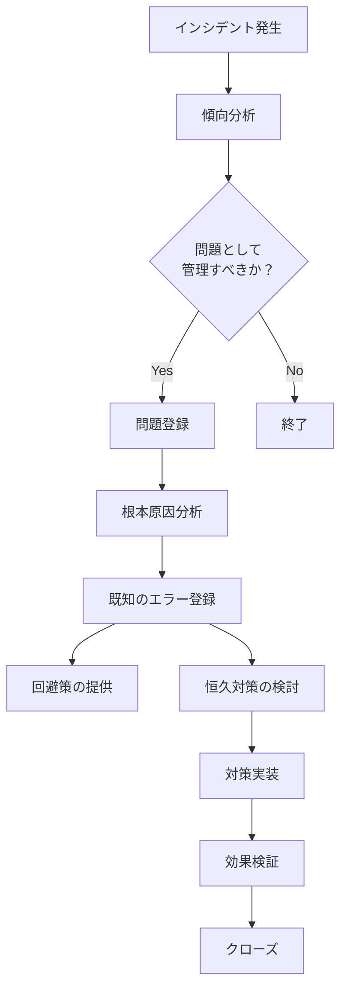
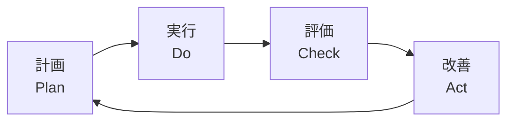
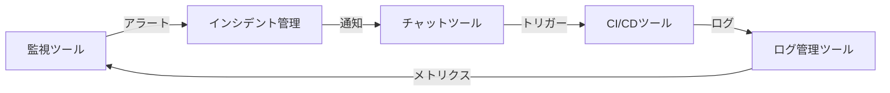

# 高度な運用手法（Advanced Operations）

このモジュールはキャパシティ管理、コスト管理とFinOps、Chaos Engineering、問題管理、ナレッジ管理、継続的改善を定義します。

---

## 13. キャパシティ管理

### 13.1 キャパシティ管理方針

キャパシティ管理の基本方針を記載します。

**キャパシティ管理の目的**:
- サービス品質の維持
- コストの最適化
- 将来の需要予測と計画

### 13.2 キャパシティ監視

監視対象リソースと閾値を記載します。

| リソース | 現在の使用率 | 警告閾値 | 限界閾値 | 対応アクション |
|----------|--------------|----------|----------|----------------|
| CPU | [%] | 70% | 85% | [アクション] |
| メモリ | [%] | 75% | 90% | [アクション] |
| ディスク | [%] | 80% | 90% | [アクション] |
| ネットワーク帯域 | [%] | 70% | 85% | [アクション] |

### 13.3 キャパシティ計画

将来の需要予測と増強計画を記載します。

**需要予測**:

| 期間 | 予想ユーザー数 | 予想トラフィック | 必要リソース |
|------|----------------|------------------|--------------|
| 3ヶ月後 | [数値] | [数値] | [内容] |
| 6ヶ月後 | [数値] | [数値] | [内容] |
| 1年後 | [数値] | [数値] | [内容] |

**増強計画**:
- 実施時期: [時期]
- 増強内容: [内容]
- 見積もりコスト: [金額]

### 13.4 スケーリング戦略

スケーリングの方針と実装を記載します。

**スケーリング方式**:
- 垂直スケーリング（スケールアップ）: [適用箇所]
- 水平スケーリング（スケールアウト）: [適用箇所]

**オートスケーリング設定**:

| 対象 | スケールアウト条件 | スケールイン条件 | 最小/最大インスタンス数 |
|------|-------------------|------------------|------------------------|
| [対象1] | [条件] | [条件] | [最小数]/[最大数] |
| [対象2] | [条件] | [条件] | [最小数]/[最大数] |

---

## 14. コスト管理

### 14.1 コスト管理方針

コスト管理の基本方針を記載します。

**コスト管理の目的**:
- 予算内での運用実現
- コスト効率の最適化
- コスト可視化と予測

### 14.2 コスト構造

運用コストの内訳を記載します。

| コスト項目 | 月額コスト | 年額コスト | 備考 |
|------------|------------|------------|------|
| インフラコスト | [金額] | [金額] | [内訳] |
| ライセンスコスト | [金額] | [金額] | [内訳] |
| 人件費 | [金額] | [金額] | [内訳] |
| 外部委託費 | [金額] | [金額] | [内訳] |
| その他 | [金額] | [金額] | [内訳] |
| **合計** | [金額] | [金額] | |

### 14.3 コスト最適化施策

コスト削減・最適化の取り組みを記載します。

**実施中の施策**:
1. [施策1]: [効果]
2. [施策2]: [効果]

**計画中の施策**:
1. [施策1]: [期待効果]
2. [施策2]: [期待効果]

### 14.4 コスト監視

コストの監視とアラート設定を記載します。

**コスト監視**:
- ツール: [ツール名]
- 監視頻度: [頻度]
- レポート: [頻度・宛先]

**コストアラート**:
- 月次予算超過アラート: [閾値]
- 異常なコスト増加アラート: [条件]

---

## 15. 問題管理

### 15.1 問題管理方針

問題管理の基本方針を記載します。

**問題の定義**:
1つ以上のインシデントの根本原因、または潜在的なインシデントの原因

**問題管理の目的**:
- インシデントの根本原因の特定と除去
- 既知のエラーの記録と回避策の提供
- 再発防止策の実装

### 15.2 問題管理プロセス

問題管理のフローを記載します。

### 15.3 既知のエラー管理

既知のエラーと回避策を記録します。

| エラーID | 問題概要 | 影響 | 回避策 | 恒久対策の状況 |
|----------|----------|------|--------|----------------|
| KE-001 | [概要] | [影響] | [回避策] | [状況] |
| KE-002 | [概要] | [影響] | [回避策] | [状況] |

---

## 16. ナレッジ管理

### 16.1 ナレッジ管理方針

ナレッジの蓄積と共有の方針を記載します。

**ナレッジ管理の目的**:
- 運用ノウハウの蓄積と継承
- 問題解決の効率化
- 属人化の排除

### 16.2 ドキュメント体系

管理するドキュメントの種類と保管場所を記載します。

| ドキュメント種別 | 保管場所 | 更新頻度 | 管理者 |
|------------------|----------|----------|--------|
| 運用設計書 | [場所] | [頻度] | [担当] |
| 運用手順書 | [場所] | [頻度] | [担当] |
| 障害対応手順書 | [場所] | [頻度] | [担当] |
| FAQ | [場所] | [頻度] | [担当] |
| ポストモーテム | [場所] | 都度 | [担当] |

### 16.3 ドキュメント管理ルール

ドキュメントの作成・更新・レビューのルールを記載します。

**作成ルール**:
- テンプレートの使用
- 命名規則の遵守
- バージョン管理の実施

**更新ルール**:
- 変更履歴の記録
- レビュープロセスの実施
- 関連ドキュメントの同期更新

**レビュープロセス**:
- レビュー頻度: [頻度]
- レビュー担当: [担当者]
- レビュー基準: [基準]

---

## 17. 継続的改善

### 17.1 改善活動方針

継続的改善の基本方針を記載します。

**改善の原則**:
- データドリブンな意思決定
- 小さな改善の積み重ね
- チーム全体での取り組み
- 定期的な振り返りと学び

### 17.2 改善プロセス

改善活動のサイクルを記載します。

**改善活動の実施**:
- 週次: チーム振り返り
- 月次: メトリクスレビュー
- 四半期: 運用プロセスレビュー
- 年次: 運用戦略レビュー

### 17.3 運用メトリクス

運用品質を測定する指標を記載します。

| メトリクス | 目標値 | 測定方法 | レポート頻度 |
|------------|--------|----------|--------------|
| 可用性 | 99.9%以上 | [方法] | 月次 |
| MTBF（平均故障間隔） | [目標] | [方法] | 月次 |
| MTTR（平均復旧時間） | 30分以内 | [方法] | 月次 |
| 変更成功率 | 95%以上 | [方法] | 月次 |
| インシデント件数 | [目標] | [方法] | 月次 |
| デプロイ頻度 | [目標] | [方法] | 月次 |

### 17.4 改善施策管理

改善施策の管理方法を記載します。

**改善施策リスト**:

| 施策ID | 施策名 | 目的 | 担当 | 期限 | ステータス |
|--------|--------|------|------|------|------------|
| IMP-001 | [施策名] | [目的] | [担当] | [期限] | [ステータス] |
| IMP-002 | [施策名] | [目的] | [担当] | [期限] | [ステータス] |

---

## 18. 運用ツール

### 18.1 運用ツール一覧

使用する運用ツールを記載します。

| カテゴリ | ツール名 | 用途 | ライセンス | 管理者 |
|----------|----------|------|------------|--------|
| 監視 | [ツール名] | [用途] | [ライセンス] | [担当] |
| ログ管理 | [ツール名] | [用途] | [ライセンス] | [担当] |
| インシデント管理 | [ツール名] | [用途] | [ライセンス] | [担当] |
| 変更管理 | [ツール名] | [用途] | [ライセンス] | [担当] |
| CI/CD | [ツール名] | [用途] | [ライセンス] | [担当] |
| コミュニケーション | [ツール名] | [用途] | [ライセンス] | [担当] |

### 18.2 ツール統合

ツール間の連携を記載します。

**統合フロー**:

---

## 19. 付録

### 19.1 用語集

本ドキュメントで使用する用語の定義を記載します。

| 用語 | 定義 |
|------|------|
| SLO | Service Level Objective: サービスレベル目標 |
| SLI | Service Level Indicator: サービスレベル指標 |
| SLA | Service Level Agreement: サービスレベル合意 |
| MTTR | Mean Time To Repair: 平均復旧時間 |
| MTBF | Mean Time Between Failures: 平均故障間隔 |
| RPO | Recovery Point Objective: 目標復旧時点 |
| RTO | Recovery Time Objective: 目標復旧時間 |
| RACI | Responsible, Accountable, Consulted, Informed |

### 19.2 参照ドキュメント

関連ドキュメントへのリンクを記載します。

| ドキュメント名 | 場所/URL | 備考 |
|----------------|----------|------|
| システム設計書 | [リンク] | [備考] |
| セキュリティポリシー | [リンク] | [備考] |
| 運用手順書 | [リンク] | [備考] |

### 19.3 連絡先

運用に関わる主要な連絡先を記載します。

| 役割 | 担当者 | 連絡先 | 対応時間 |
|------|--------|--------|----------|
| 運用マネージャー | [名前] | [連絡先] | [時間] |
| オンコール担当 | [名前] | [連絡先] | 24/365 |
| セキュリティ担当 | [名前] | [連絡先] | [時間] |

### 19.4 承認

本ドキュメントの承認記録を記載します。

| 役割 | 氏名 | 承認日 | 署名 |
|------|------|--------|------|
| 作成者 | [名前] | [日付] | |
| レビュアー | [名前] | [日付] | |
| 承認者 | [名前] | [日付] | |

---

## 運用設計書作成時の注意事項

本テンプレートを使用する際は、以下の点に注意してください：

1. **プロジェクト特性に応じたカスタマイズ**
   - すべてのセクションが必要とは限りません
   - プロジェクトの規模や性質に応じて取捨選択してください

2. **具体性の確保**
   - 抽象的な記述ではなく、具体的な数値や手順を記載してください
   - 「適切に」「十分に」などの曖昧な表現は避けてください

3. **測定可能性**
   - 目標値は測定可能な形で定義してください
   - 測定方法も明記してください

4. **継続的な更新**
   - 運用開始後も定期的に見直し、更新してください
   - 実態との乖離が生じないよう注意してください

5. **ステークホルダーの合意**
   - 関係者全員で内容を確認し、合意を形成してください
   - 特にSLOや運用体制については十分な議論が必要です
