# 運用設計書（クラウドインスタンス / IaaS対応）

## ドキュメント情報

| 項目 | 内容 |
|------|------|
| ドキュメント名 | [サービス名] 運用設計書 |
| インフラパターン | **クラウドインスタンス（IaaS / LAMP等）** |
| バージョン | [バージョン番号] |
| 作成日 | [YYYY-MM-DD] |
| 最終更新日 | [YYYY-MM-DD] |
| 作成者 | [作成者名] |
| 承認者 | [承認者名] |
| ステータス | [Draft / Review / Approved] |

**このテンプレートの適用対象**:
- EC2、GCE、Azure VM等のクラウドインスタンス
- オンプレミスからクラウドへ移行した構成（Lift & Shift）
- LAMP/LEMP等の従来型Web構成
- 仮想マシンベースのアプリケーション

## 改訂履歴

| バージョン | 日付 | 変更内容 | 変更者 |
|------------|------|----------|--------|
| 0.1 | YYYY-MM-DD | 初版作成 | [名前] |

---

## 1. 概要

### 1.1 目的

本ドキュメントの目的を記載します。

- 運用に求められる要件の明確化
- システム運用に関わる関係者間の合意形成
- 運用プロセスの標準化と最適化
- 運用品質の向上と継続的改善

### 1.2 対象範囲

本運用設計書が対象とするシステム・サービスの範囲を記載します。

**対象システム**:
- [システム名・サービス名]

**対象業務**:
- [業務名]

**対象期間**:
- [運用開始予定日] ～ [運用終了予定日（該当する場合）]

### 1.3 前提条件

運用設計における前提条件を記載します。

- システム開発が完了していること
- 運用環境が構築されていること
- 運用チームの体制が整っていること
- [その他の前提条件]

### 1.4 制約条件

運用における制約事項を記載します。

- 予算制約: [金額や制約内容]
- リソース制約: [人員やインフラリソースの制約]
- 技術制約: [技術的な制約]
- 法規制・コンプライアンス: [該当する法規制]

### 1.5 クラウドインスタンス特有の考慮事項

**【重要】オンプレミスとクラウドのハイブリッド運用**:

クラウドインスタンスは、オンプレミスと同様の運用が基本ですが、クラウド特有の制限と利点があります。

**オンプレミスと同様の運用責任**:
- OS管理（パッチ適用、セキュリティ更新）
- ミドルウェア管理（アップデート、設定変更）
- アプリケーション管理
- バックアップ・リストア
- 監視設定

**クラウドサービスによる制限**:
- ハイパーバイザーレベルの制御不可
- 物理ハードウェアへのアクセス不可
- ネットワーク帯域の共有（ノイジーネイバー問題）
- インスタンスタイプによる性能制限

**クラウドの利点活用**:
- **柔軟なスケーリング**: Auto Scaling Groupsの活用
- **高可用性**: マルチAZ配置
- **マネージドサービスとの組み合わせ**: RDS、ELB等の活用

**パッチ管理の考慮**:
- OS・ミドルウェアのパッチ適用計画
- メンテナンスウィンドウの設定
- ゴールデンイメージ（AMI等）の管理戦略

**コスト管理の考慮**:
- インスタンスの適切なサイジング
- Reserved Instances / Savings Plansの活用
- 未使用インスタンスの停止・削除

---

## 2. サービス概要

### 2.1 サービスの目的

サービスが提供する価値と目的を記載します。

**ビジネス目的**:
- [ビジネス上の目的]

**提供価値**:
- [ユーザーに提供する価値]

### 2.2 サービスの機能

主要な機能を記載します。

| 機能名 | 概要 | 重要度 |
|--------|------|--------|
| [機能1] | [機能の説明] | High / Medium / Low |
| [機能2] | [機能の説明] | High / Medium / Low |

### 2.3 システム構成

システムのアーキテクチャと主要コンポーネントを記載します。

**アーキテクチャ図**:

**主要コンポーネント**:

| コンポーネント | 役割 | 技術スタック | 冗長化 |
|----------------|------|--------------|--------|
| [コンポーネント1] | [役割] | [技術] | Yes / No |
| [コンポーネント2] | [役割] | [技術] | Yes / No |

### 2.4 外部連携

外部システムとの連携を記載します。

| 連携先 | 連携方式 | データフロー | 重要度 |
|--------|----------|--------------|--------|
| [システム名] | API / Batch / etc | [方向と内容] | High / Medium / Low |

---

## 3. 運用方針と目標

### 3.1 運用基本方針

運用における基本的な方針を記載します。

1. **可用性重視**: [方針の詳細]
2. **セキュリティ優先**: [方針の詳細]
3. **継続的改善**: [方針の詳細]
4. **コスト最適化**: [方針の詳細]

### 3.2 サービスレベル目標（SLO）

**【重要】ユーザー中心のSLO設計原則**:

SLOは「測りやすい指標」ではなく、「ユーザーが快適に使える範囲」を起点として設計します。

**設計アプローチ**:
1. **ユーザーの期待値を理解する**
   - ユーザーはどの程度の応答速度を期待しているか
   - どの程度のエラーなら許容できるか
   - サービス停止はどの程度の影響を与えるか

2. **ユーザー体験に基づいた目標設定**
   - 「サーバーCPU使用率」ではなく「ユーザーが体感するレスポンスタイム」
   - 「データベース接続数」ではなく「ユーザーがエラーに遭遇する頻度」
   - 技術指標はユーザー体験指標の裏付けとして使用

3. **システム構成ごとの目標設定**
   - 同期処理、非同期処理、バッチ処理でユーザー期待値は異なる
   - それぞれに適切な目標値を設定

**SLO定義**:

| システム構成/機能 | 指標名 | 目標値 | ユーザー視点での意味 | 測定方法 | 測定頻度 |
|-------------------|--------|--------|---------------------|----------|----------|
| [全体] | 可用性 | [例: 99.9%] | ユーザーがサービスを利用できる時間の割合 | [測定方法] | [頻度] |
| [Web同期リクエスト] | レスポンスタイム（P95） | [例: 500ms以下] | ユーザーが操作後に結果が表示されるまでの体感速度 | [測定方法] | [頻度] |
| [Web同期リクエスト] | エラーレート | [例: 0.1%以下] | ユーザーがエラーに遭遇する頻度 | [測定方法] | [頻度] |
| [非同期APIリクエスト] | 処理完了時間（P95） | [例: 5秒以内] | バックグラウンド処理が完了するまでの時間 | [測定方法] | [頻度] |
| [バッチ処理] | 処理完了時刻 | [例: 翌朝8時まで] | 業務開始時にデータが利用可能になっている状態 | [測定方法] | 日次 |
| [全体] | MTTR | [例: 30分以内] | 障害発生時にユーザーが待つ時間 | [測定方法] | [頻度] |

### 3.3 サービスレベル指標（SLI）

SLOを測定するための具体的な指標を記載します。

| SLI名 | 定義 | データソース | 計算式 |
|-------|------|--------------|--------|
| [SLI1] | [定義] | [ソース] | [計算式] |
| [SLI2] | [定義] | [ソース] | [計算式] |

### 3.4 サービスレベル合意（SLA）

顧客またはユーザーに対して約束するサービス品質の基準を記載します。

**SLA策定の重要性**:
- SLOとSLIに基づいた実現可能な目標設定
- 顧客期待値の明確化
- サービス品質保証の根拠
- 違約時の対応方針の明確化

**SLA定義**:

| システム構成/機能 | SLA項目 | 保証値 | 測定方法 | 測定期間 | 未達時の対応 |
|-------------------|---------|--------|----------|----------|-------------|
| [全体] | サービス可用性 | [例: 99.9%] | [測定方法] | 月次 | [対応内容] |
| [Web同期リクエスト] | レスポンスタイム（P95） | [例: 500ms以下] | [測定方法] | 月次 | [対応内容] |
| [非同期APIリクエスト] | 処理完了時間（P95） | [例: 5秒以内] | [測定方法] | 月次 | [対応内容] |
| [バッチ処理] | 処理完了時刻 | [例: 翌朝8時まで] | [測定方法] | 日次 | [対応内容] |

**システム構成別のSLA設定指針**:

1. **同期的なWebリクエスト（ユーザー対話操作）**
   - ユーザーが快適に操作できる範囲を基準とする
   - レスポンスタイム: 一般的に500ms以下（P95）
   - エラーレート: 0.1%以下

2. **非同期APIリクエスト（バックグラウンド処理）**
   - ユーザー体験に直接影響しない範囲で設定
   - 処理完了時間: 数秒〜数十秒
   - 再試行ポリシーを含む

3. **バッチ処理（夜間処理等）**
   - 業務開始時刻までの完了を保証
   - 処理時間: 数時間単位
   - 失敗時の再実行ポリシー

**SLA未達時のペナルティまたは対応**:
- サービスクレジット: [内容]
- エスカレーション: [プロセス]
- 改善計画の提出: [内容]

### 3.5 エラーバジェット

許容されるエラーの範囲を定義します。

**エラーバジェット算出**:
- 可用性目標: 99.9%
- 許容ダウンタイム（月間）: [計算結果]
- エラーバジェット消費の閾値: [閾値]

**エラーバジェットポリシー**:
- エラーバジェット残量 > 50%: [対応方針]
- エラーバジェット残量 20-50%: [対応方針]
- エラーバジェット残量 < 20%: [対応方針]

---

## 4. 運用体制

### 4.1 運用組織体制

運用組織の体制を記載します。

### 4.2 役割と責任（RACI）

主要な運用プロセスにおける役割と責任を記載します。

| プロセス/タスク | 運用マネージャー | 運用チーム | SREチーム | 開発チーム | 備考 |
|-----------------|------------------|------------|-----------|------------|------|
| 監視・アラート対応 | A | R | C | I | [備考] |
| インシデント対応 | A | R | C | C | [備考] |
| 変更管理 | A | I | C | R | [備考] |
| リリース管理 | A | C | R | R | [備考] |

※ R=Responsible（実行責任）, A=Accountable（説明責任）, C=Consulted（相談）, I=Informed（報告）

### 4.3 運用時間帯

運用体制の時間帯を記載します。

| 時間帯 | 運用体制 | 対応内容 |
|--------|----------|----------|
| 平日 9:00-18:00 | 通常体制 | [対応内容] |
| 平日 18:00-9:00 | オンコール体制 | [対応内容] |
| 休日・祝日 | オンコール体制 | [対応内容] |

**オンコール体制**:
- 1次対応: [担当者・連絡先]
- 2次対応: [担当者・連絡先]
- エスカレーション先: [担当者・連絡先]

### 4.4 コミュニケーション

運用における コミュニケーション方法を記載します。

**定例会議**:

| 会議名 | 頻度 | 参加者 | 目的 |
|--------|------|--------|------|
| 日次運用会議 | 毎日 | [参加者] | [目的] |
| 週次運用レビュー | 毎週 | [参加者] | [目的] |
| 月次運用報告 | 毎月 | [参加者] | [目的] |

**コミュニケーションツール**:
- チャット: [ツール名・チャンネル]
- チケット管理: [ツール名]
- ドキュメント共有: [ツール名]
- インシデント管理: [ツール名]

---

## 5. 運用スケジュール

### 5.1 定期運用スケジュール

定期的に実施する運用作業のスケジュールを記載します。

| 作業項目 | 頻度 | 実施日時 | 担当 | 所要時間 |
|----------|------|----------|------|----------|
| [作業1] | 日次 | [時刻] | [担当] | [時間] |
| [作業2] | 週次 | [曜日・時刻] | [担当] | [時間] |
| [作業3] | 月次 | [日・時刻] | [担当] | [時間] |

### 5.2 メンテナンスウィンドウ

計画メンテナンスの実施可能時間帯を記載します。

**定期メンテナンス**:
- 頻度: [週次/月次/四半期等]
- 実施日時: [曜日・時刻]
- 所要時間: [時間]
- 影響範囲: [影響内容]

**緊急メンテナンス**:
- 実施判断基準: [基準]
- 承認プロセス: [プロセス]
- 通知方法: [通知手段]

### 5.3 年間運用カレンダー

年間の主要イベントとメンテナンススケジュールを記載します。

| 月 | イベント/作業 | 詳細 |
|----|---------------|------|
| 1月 | [イベント] | [詳細] |
| 2月 | [イベント] | [詳細] |
| ... | ... | ... |

---

## 6. 定常運用作業

### 6.1 日次運用作業

毎日実施する運用作業を記載します。

#### 7.1.1 [作業名1]

**目的**: [作業の目的]

**実施タイミング**: [時刻]

**手順**:
1. [手順1]
2. [手順2]
3. [手順3]

**確認項目**:
- [ ] [確認項目1]
- [ ] [確認項目2]

**成果物**: [成果物があれば記載]

**エスカレーション基準**: [異常時の対応]

#### 7.1.2 [作業名2]

[同様の形式で記載]

### 6.2 週次運用作業

週単位で実施する運用作業を記載します。

#### 7.2.1 [作業名]

[日次作業と同様の形式で記載]

### 6.3 月次運用作業

月単位で実施する運用作業を記載します。

#### 7.3.1 [作業名]

[日次作業と同様の形式で記載]

---

## 7. 監視・通知

### 7.1 監視方針

**【重要】ユーザー中心の監視設計原則**:

監視は「測りやすい技術指標」ではなく、「ユーザーが快適に使える状態」を維持するために実施します。

**監視設計アプローチ**:

1. **ユーザー体験起点の監視**
   - まず「ユーザーが体感する品質」を監視
   - 技術指標はユーザー体験指標が悪化した時の原因特定に使用
   - 例: レスポンスタイムの悪化を検知 → CPU使用率を確認して原因を特定

2. **外形監視を最優先**
   - ユーザーと同じ視点でサービスを監視
   - エンドツーエンドの動作確認
   - 実際のユーザートランザクションをシミュレート

3. **システム構成ごとの監視基準**
   - 同期処理、非同期処理、バッチ処理で監視基準を分ける
   - それぞれのユーザー期待値に基づいた閾値設定

**監視の目的**:
- **第一目的**: ユーザーが快適に利用できる状態の維持
- サービスの可用性確保
- パフォーマンス劣化の早期検知（ユーザー体感品質の観点から）
- セキュリティインシデントの検知
- キャパシティ不足の予兆検知

**監視レベル**:
- レベル1（Critical）: ユーザーに直接影響がある状態 [具体的な定義と対応]
- レベル2（Warning）: ユーザーに影響が出る可能性がある状態 [具体的な定義と対応]
- レベル3（Info）: ユーザーに影響はないが注視すべき状態 [具体的な定義と対応]

### 7.2 監視項目

**【重要】監視項目の優先順位**:

**優先度1: ユーザー体験監視（SLI直結）**
- ユーザーが直接体感する品質指標
- これらが正常であればサービスは正常

**優先度2: アプリケーション監視**
- ユーザー体験指標の裏付け
- 問題発生時の原因特定用

**優先度3: インフラ監視**
- アプリケーション指標の裏付け
- キャパシティ管理用

**監視項目定義**:

| 優先度 | 監視対象 | 監視項目 | 閾値 | 監視間隔 | アラートレベル | ユーザー視点での意味 |
|--------|----------|----------|------|----------|----------------|---------------------|
| 1 | 外形監視（Web同期） | レスポンスタイム（P95） | 500ms超 | 1分 | Warning | ユーザーが遅いと感じる |
| 1 | 外形監視（Web同期） | レスポンスタイム（P95） | 1000ms超 | 1分 | Critical | ユーザーがストレスを感じる |
| 1 | 外形監視（Web同期） | エラーレート | 0.1%超 | 1分 | Warning | ユーザーがエラーに遭遇し始める |
| 1 | 外形監視（Web同期） | エラーレート | 1%超 | 1分 | Critical | 多数のユーザーがエラーに遭遇 |
| 1 | 外形監視（非同期API） | 処理完了時間（P95） | 5秒超 | 5分 | Warning | バックグラウンド処理の遅延 |
| 1 | 外形監視（バッチ） | 処理完了時刻 | 7:00以降 | 1時間 | Warning | 業務開始に間に合わない可能性 |
| 1 | 外形監視（バッチ） | 処理完了時刻 | 8:00以降 | 1時間 | Critical | 業務開始に間に合わない |
| 2 | アプリケーション | エラーレート | [閾値] | 1分 | [レベル] | アプリケーションレベルのエラー発生状況 |
| 2 | アプリケーション | レスポンスタイム | [閾値] | 1分 | [レベル] | アプリケーション処理時間 |
| 3 | Webサーバー | CPU使用率 | 80%超 | 1分 | Info | リソース逼迫の予兆 |
| 3 | Webサーバー | CPU使用率 | 90%超 | 1分 | Warning | リソース逼迫 |
| 3 | Webサーバー | メモリ使用率 | [閾値] | [間隔] | [レベル] | メモリリソース状況 |
| 3 | データベース | 接続数 | [閾値] | [間隔] | [レベル] | DB接続リソース状況 |

**システム構成別の監視設計**:

1. **同期的なWebリクエスト**
   - ユーザーは即座に結果を期待
   - レスポンスタイム: P95で500ms以下を目標
   - 監視間隔: 1分（迅速な検知が必要）

2. **非同期APIリクエスト**
   - ユーザーは数秒の待機は許容
   - 処理完了時間: P95で5秒以内を目標
   - 監視間隔: 5分（ある程度の猶予あり）

3. **バッチ処理**
   - ユーザーは完了時刻を期待
   - 処理完了時刻: 業務開始時刻まで
   - 監視間隔: 1時間（処理時間が長いため）

### 7.3 ログ管理

ログの収集・保管・分析方針を記載します。

**ログ種類**:

| ログ種類 | 出力先 | 保管期間 | 用途 |
|----------|--------|----------|------|
| アクセスログ | [保存先] | [期間] | [用途] |
| アプリケーションログ | [保存先] | [期間] | [用途] |
| エラーログ | [保存先] | [期間] | [用途] |
| セキュリティログ | [保存先] | [期間] | [用途] |

**ログ分析**:
- ツール: [ツール名]
- 分析頻度: [頻度]
- 分析内容: [内容]

### 7.4 アラート通知

アラート通知のルールと方法を記載します。

**通知ルート**:

**通知先**:

| アラートレベル | 通知方法 | 通知先 | 対応時間 |
|----------------|----------|--------|----------|
| Critical | 電話+メール+チャット | [通知先] | 即時 |
| Warning | メール+チャット | [通知先] | 30分以内 |
| Info | チャット | [通知先] | 営業時間内 |

---

## 8. インシデント管理

### 8.1 インシデント定義

インシデントの定義と分類を記載します。

**インシデント定義**:
サービスの計画外の中断、またはサービス品質の低下

**インシデント分類**:

| 優先度 | 定義 | 対応目標時間 | 例 |
|--------|------|--------------|-----|
| P1（Critical） | サービス全停止 | 15分以内に対応開始 | [例] |
| P2（High） | 主要機能停止 | 30分以内に対応開始 | [例] |
| P3（Medium） | 一部機能停止 | 2時間以内に対応開始 | [例] |
| P4（Low） | 軽微な問題 | 営業時間内対応 | [例] |

### 8.2 インシデント対応フロー

インシデント対応の標準フローを記載します。

### 8.3 インシデント対応手順

インシデント対応の詳細手順を記載します。

#### 9.3.1 検知・報告

**検知方法**:
- 監視アラート
- ユーザー報告
- 運用チーム発見

**報告フロー**:
1. インシデント管理ツールにチケット作成
2. 運用チームに通知
3. 優先度に応じてエスカレーション

#### 9.3.2 トリアージ

**トリアージ基準**:
- 影響範囲（全ユーザー / 一部ユーザー / 特定機能）
- ビジネスインパクト（売上損失 / 信用失墜 / 軽微）
- 緊急度（即時対応必要 / 計画的対応可能）

**優先度判定**:
[優先度判定のマトリクスやルール]

#### 9.3.3 対応・復旧

**対応原則**:
1. まず復旧、原因究明は後
2. 影響範囲の最小化を優先
3. コミュニケーションを密に

**復旧手順**:
1. [手順1]
2. [手順2]
3. [手順3]

#### 9.3.4 ポストモーテム

**実施タイミング**:
- P1/P2インシデント: 必須
- P3インシデント: 必要に応じて
- P4インシデント: 任意

**ポストモーテム内容**:
- インシデントサマリー
- 影響範囲と期間
- 根本原因分析（なぜなぜ分析）
- 再発防止策
- アクションアイテム

### 8.4 エスカレーション

エスカレーションルールを記載します。

**エスカレーション基準**:
- 対応開始から[X]分経過しても復旧しない
- 影響範囲が拡大している
- 技術的な判断が必要
- ビジネス判断が必要

**エスカレーションパス**:

---

## 9. 変更管理

### 9.1 変更管理方針

変更管理の基本方針を記載します。

**変更管理の目的**:
- 変更に伴うリスクの最小化
- 変更の影響評価と承認プロセスの明確化
- 変更履歴の記録と追跡可能性の確保

**変更の定義**:
本番環境への以下の変更を対象とします
- システム構成の変更
- アプリケーションのデプロイ
- インフラ設定の変更
- セキュリティ設定の変更

### 9.2 変更分類

変更の種類と承認プロセスを記載します。

| 変更分類 | 定義 | 承認者 | リードタイム |
|----------|------|--------|--------------|
| 標準変更 | 手順化済みの低リスク変更 | 運用リーダー | 即時 |
| 通常変更 | 一般的な変更 | 運用マネージャー | 3営業日 |
| 緊急変更 | 緊急対応が必要な変更 | 運用マネージャー | 即時 |
| 重要変更 | 高リスクまたは大規模な変更 | 変更諮問委員会 | 1週間 |

### 9.3 変更管理フロー

変更管理のプロセスを記載します。

### 9.4 変更実施手順

変更を実施する際の標準手順を記載します。

**事前準備**:
1. 変更チケットの作成
2. 変更内容の詳細記載
3. 影響評価の実施
4. ロールバック計画の作成
5. 承認取得

**実施時**:
1. 事前バックアップの取得
2. 変更作業の実施
3. 作業ログの記録
4. 動作確認の実施

**事後**:
1. 変更結果の報告
2. ドキュメントの更新
3. チケットのクローズ

### 9.5 ロールバック計画

ロールバックの基準と手順を記載します。

**ロールバック判断基準**:
- 変更後の動作確認でエラーが検出された
- SLOを下回る性能劣化が発生した
- 予期しない副作用が発生した
- [その他の基準]

**ロールバック手順**:
1. [手順1]
2. [手順2]
3. [手順3]

---

## 10. リリース管理

### 10.1 リリース方針

リリースの基本方針を記載します。

**リリース原則**:
- 定期リリースと緊急リリースの明確な区別
- 本番環境へのリリース前の十分なテスト
- 段階的なロールアウト（カナリアリリース等）
- 自動化されたデプロイメントプロセス

### 10.2 リリーススケジュール

定期リリースのスケジュールを記載します。

| リリース種別 | 頻度 | 実施日時 | 対象 |
|--------------|------|----------|------|
| メジャーリリース | 四半期毎 | [日時] | 大規模機能追加 |
| マイナーリリース | 月次 | [日時] | 機能改善 |
| パッチリリース | 週次 | [日時] | バグフィックス |
| ホットフィックス | 随時 | 随時 | 緊急対応 |

### 10.3 リリースフロー

リリースプロセスを記載します。

**各環境の役割**:
- 開発環境: 機能開発とユニットテスト
- テスト環境: 結合テストと品質保証
- ステージング環境: 本番環境と同等構成での最終確認
- カナリア環境: 一部ユーザーでの先行リリース
- 本番環境: 全ユーザー向けリリース

### 10.4 デプロイメント戦略

デプロイメント方式を記載します。

**採用戦略**: [選択した戦略]

**デプロイメント方式の比較**:

| 方式 | メリット | デメリット | 採用判断 |
|------|----------|------------|----------|
| Blue-Green | ダウンタイムゼロ | リソース2倍必要 | [○/×] |
| Rolling | リソース効率的 | 段階的な切り替え | [○/×] |
| Canary | リスク最小化 | 複雑な制御必要 | [○/×] |

**自動化ツール**:
- CI/CDツール: [ツール名]
- デプロイツール: [ツール名]
- インフラ管理: [ツール名]

---

## 11. バックアップ・リカバリ

### 11.1 バックアップ方針

バックアップの基本方針を記載します。

**バックアップ目的**:
- データ損失時の復旧
- ランサムウェア等のセキュリティインシデント対応
- 監査・コンプライアンス要件への対応

**バックアップ原則**:
- 3-2-1ルール: 3つのコピー、2つの異なるメディア、1つはオフサイト
- 暗号化されたバックアップの保管
- 定期的なリストアテストの実施

### 11.2 バックアップ設計

バックアップ対象と方式を記載します。

| バックアップ対象 | バックアップ方式 | 頻度 | 世代管理 | 保管場所 |
|------------------|------------------|------|----------|----------|
| データベース | フル+差分 | 日次フル+6時間毎差分 | 30世代 | [場所] |
| ファイルストレージ | フル | 日次 | 7世代 | [場所] |
| システム設定 | フル | 変更時 | 10世代 | [場所] |
| ログファイル | 増分 | 1時間毎 | 90日 | [場所] |

**バックアップスケジュール**:

```mermaid
gantt
    title バックアップスケジュール（1日）
    dateFormat HH:mm
    axisFormat %H:%M

    section データベース
    フルバックアップ    :00:00, 2h
    差分バックアップ1   :06:00, 30m
    差分バックアップ2   :12:00, 30m
    差分バックアップ3   :18:00, 30m

    section ファイル
    フルバックアップ    :02:00, 1h
```

### 11.3 リカバリ設計

リカバリの目標値と手順を記載します。

**リカバリ目標**:

| 対象 | RPO（目標復旧時点） | RTO（目標復旧時間） |
|------|---------------------|---------------------|
| データベース | 6時間以内 | 4時間以内 |
| ファイルストレージ | 24時間以内 | 2時間以内 |
| システム全体 | 24時間以内 | 8時間以内 |

**リカバリ手順**:

#### データベースリカバリ
1. [手順1]
2. [手順2]
3. [手順3]

**リカバリテスト**:
- 頻度: 四半期毎
- 対象: [テスト対象]
- 成功基準: [基準]

### 11.4 災害対策（DR）

災害復旧計画を記載します。

**DR方針**:
- DR サイト: [有/無]
- DR 構成: [Hot Standby / Warm Standby / Cold Standby]

**DR切り替えシナリオ**:

| シナリオ | 発生条件 | 切り替え判断 | 切り替え時間目標 |
|----------|----------|--------------|------------------|
| データセンター障害 | [条件] | [判断基準] | [時間] |
| リージョン障害 | [条件] | [判断基準] | [時間] |

---

## 12. セキュリティ運用

### 12.1 セキュリティ運用方針

セキュリティ運用の基本方針を記載します。

**セキュリティ原則**:
- 多層防御（Defense in Depth）
- 最小権限の原則
- ゼロトラストアーキテクチャ
- 継続的なセキュリティ監視

### 12.2 アクセス管理

アクセス権限の管理方針を記載します。

**権限管理**:

| ロール | 権限範囲 | 承認者 | レビュー頻度 |
|--------|----------|--------|--------------|
| システム管理者 | 全権限 | [承認者] | 月次 |
| 運用担当者 | 運用操作のみ | [承認者] | 月次 |
| 開発者 | 開発環境のみ | [承認者] | 月次 |
| 閲覧者 | 読み取りのみ | [承認者] | 四半期 |

**アクセスレビュー**:
- 頻度: [頻度]
- 実施者: [担当者]
- レビュー内容: [内容]

### 12.3 脆弱性管理

脆弱性の検出と対応プロセスを記載します。

**脆弱性スキャン**:
- ツール: [ツール名]
- 頻度: [頻度]
- 対象: [対象システム]

**パッチ適用**:

| 脆弱性レベル | 対応期限 | 承認プロセス |
|--------------|----------|--------------|
| Critical | 24時間以内 | 緊急変更 |
| High | 7日以内 | 通常変更 |
| Medium | 30日以内 | 通常変更 |
| Low | 90日以内 | 計画変更 |

### 12.4 セキュリティインシデント対応

セキュリティインシデントの対応手順を記載します。

**セキュリティインシデント分類**:

| レベル | 定義 | 例 | 対応時間 |
|--------|------|-----|----------|
| L1 | 重大な侵害 | データ漏洩、ランサムウェア | 即時 |
| L2 | 侵害の疑い | 不正アクセス試行 | 1時間以内 |
| L3 | セキュリティ違反 | ポリシー違反 | 24時間以内 |

**対応フロー**:

**インシデント対応チーム（CSIRT）**:
- リーダー: [担当者]
- メンバー: [担当者リスト]
- 外部連絡先: [セキュリティベンダー、警察等]

### 12.5 コンプライアンス

法規制・コンプライアンス要件への対応を記載します。

**適用法規制**:
- [法規制名]: [要件概要]
- [法規制名]: [要件概要]

**監査対応**:
- 内部監査: [頻度・実施者]
- 外部監査: [頻度・監査法人]
- 証跡管理: [保管方法・期間]

---

## 13. キャパシティ管理

### 13.1 キャパシティ管理方針

キャパシティ管理の基本方針を記載します。

**キャパシティ管理の目的**:
- サービス品質の維持
- コストの最適化
- 将来の需要予測と計画

### 13.2 キャパシティ監視

監視対象リソースと閾値を記載します。

| リソース | 現在の使用率 | 警告閾値 | 限界閾値 | 対応アクション |
|----------|--------------|----------|----------|----------------|
| CPU | [%] | 70% | 85% | [アクション] |
| メモリ | [%] | 75% | 90% | [アクション] |
| ディスク | [%] | 80% | 90% | [アクション] |
| ネットワーク帯域 | [%] | 70% | 85% | [アクション] |

### 13.3 キャパシティ計画

将来の需要予測と増強計画を記載します。

**需要予測**:

| 期間 | 予想ユーザー数 | 予想トラフィック | 必要リソース |
|------|----------------|------------------|--------------|
| 3ヶ月後 | [数値] | [数値] | [内容] |
| 6ヶ月後 | [数値] | [数値] | [内容] |
| 1年後 | [数値] | [数値] | [内容] |

**増強計画**:
- 実施時期: [時期]
- 増強内容: [内容]
- 見積もりコスト: [金額]

### 13.4 スケーリング戦略

スケーリングの方針と実装を記載します。

**スケーリング方式**:
- 垂直スケーリング（スケールアップ）: [適用箇所]
- 水平スケーリング（スケールアウト）: [適用箇所]

**オートスケーリング設定**:

| 対象 | スケールアウト条件 | スケールイン条件 | 最小/最大インスタンス数 |
|------|-------------------|------------------|------------------------|
| [対象1] | [条件] | [条件] | [最小数]/[最大数] |
| [対象2] | [条件] | [条件] | [最小数]/[最大数] |

---

## 14. コスト管理

### 14.1 コスト管理方針

コスト管理の基本方針を記載します。

**コスト管理の目的**:
- 予算内での運用実現
- コスト効率の最適化
- コスト可視化と予測

### 14.2 コスト構造

運用コストの内訳を記載します。

| コスト項目 | 月額コスト | 年額コスト | 備考 |
|------------|------------|------------|------|
| インフラコスト | [金額] | [金額] | [内訳] |
| ライセンスコスト | [金額] | [金額] | [内訳] |
| 人件費 | [金額] | [金額] | [内訳] |
| 外部委託費 | [金額] | [金額] | [内訳] |
| その他 | [金額] | [金額] | [内訳] |
| **合計** | [金額] | [金額] | |

### 14.3 コスト最適化施策

コスト削減・最適化の取り組みを記載します。

**実施中の施策**:
1. [施策1]: [効果]
2. [施策2]: [効果]

**計画中の施策**:
1. [施策1]: [期待効果]
2. [施策2]: [期待効果]

### 14.4 コスト監視

コストの監視とアラート設定を記載します。

**コスト監視**:
- ツール: [ツール名]
- 監視頻度: [頻度]
- レポート: [頻度・宛先]

**コストアラート**:
- 月次予算超過アラート: [閾値]
- 異常なコスト増加アラート: [条件]

---

## 15. 問題管理

### 15.1 問題管理方針

問題管理の基本方針を記載します。

**問題の定義**:
1つ以上のインシデントの根本原因、または潜在的なインシデントの原因

**問題管理の目的**:
- インシデントの根本原因の特定と除去
- 既知のエラーの記録と回避策の提供
- 再発防止策の実装

### 15.2 問題管理プロセス

問題管理のフローを記載します。

### 15.3 既知のエラー管理

既知のエラーと回避策を記録します。

| エラーID | 問題概要 | 影響 | 回避策 | 恒久対策の状況 |
|----------|----------|------|--------|----------------|
| KE-001 | [概要] | [影響] | [回避策] | [状況] |
| KE-002 | [概要] | [影響] | [回避策] | [状況] |

---

## 16. ナレッジ管理

### 16.1 ナレッジ管理方針

ナレッジの蓄積と共有の方針を記載します。

**ナレッジ管理の目的**:
- 運用ノウハウの蓄積と継承
- 問題解決の効率化
- 属人化の排除

### 16.2 ドキュメント体系

管理するドキュメントの種類と保管場所を記載します。

| ドキュメント種別 | 保管場所 | 更新頻度 | 管理者 |
|------------------|----------|----------|--------|
| 運用設計書 | [場所] | [頻度] | [担当] |
| 運用手順書 | [場所] | [頻度] | [担当] |
| 障害対応手順書 | [場所] | [頻度] | [担当] |
| FAQ | [場所] | [頻度] | [担当] |
| ポストモーテム | [場所] | 都度 | [担当] |

### 16.3 ドキュメント管理ルール

ドキュメントの作成・更新・レビューのルールを記載します。

**作成ルール**:
- テンプレートの使用
- 命名規則の遵守
- バージョン管理の実施

**更新ルール**:
- 変更履歴の記録
- レビュープロセスの実施
- 関連ドキュメントの同期更新

**レビュープロセス**:
- レビュー頻度: [頻度]
- レビュー担当: [担当者]
- レビュー基準: [基準]

---

## 17. 継続的改善

### 17.1 改善活動方針

継続的改善の基本方針を記載します。

**改善の原則**:
- データドリブンな意思決定
- 小さな改善の積み重ね
- チーム全体での取り組み
- 定期的な振り返りと学び

### 17.2 改善プロセス

改善活動のサイクルを記載します。

**改善活動の実施**:
- 週次: チーム振り返り
- 月次: メトリクスレビュー
- 四半期: 運用プロセスレビュー
- 年次: 運用戦略レビュー

### 17.3 運用メトリクス

運用品質を測定する指標を記載します。

| メトリクス | 目標値 | 測定方法 | レポート頻度 |
|------------|--------|----------|--------------|
| 可用性 | 99.9%以上 | [方法] | 月次 |
| MTBF（平均故障間隔） | [目標] | [方法] | 月次 |
| MTTR（平均復旧時間） | 30分以内 | [方法] | 月次 |
| 変更成功率 | 95%以上 | [方法] | 月次 |
| インシデント件数 | [目標] | [方法] | 月次 |
| デプロイ頻度 | [目標] | [方法] | 月次 |

### 17.4 改善施策管理

改善施策の管理方法を記載します。

**改善施策リスト**:

| 施策ID | 施策名 | 目的 | 担当 | 期限 | ステータス |
|--------|--------|------|------|------|------------|
| IMP-001 | [施策名] | [目的] | [担当] | [期限] | [ステータス] |
| IMP-002 | [施策名] | [目的] | [担当] | [期限] | [ステータス] |

---

## 18. 運用ツール

### 18.1 運用ツール一覧

使用する運用ツールを記載します。

| カテゴリ | ツール名 | 用途 | ライセンス | 管理者 |
|----------|----------|------|------------|--------|
| 監視 | [ツール名] | [用途] | [ライセンス] | [担当] |
| ログ管理 | [ツール名] | [用途] | [ライセンス] | [担当] |
| インシデント管理 | [ツール名] | [用途] | [ライセンス] | [担当] |
| 変更管理 | [ツール名] | [用途] | [ライセンス] | [担当] |
| CI/CD | [ツール名] | [用途] | [ライセンス] | [担当] |
| コミュニケーション | [ツール名] | [用途] | [ライセンス] | [担当] |

### 18.2 ツール統合

ツール間の連携を記載します。

**統合フロー**:

---

## 19. 付録

### 19.1 用語集

本ドキュメントで使用する用語の定義を記載します。

| 用語 | 定義 |
|------|------|
| SLO | Service Level Objective: サービスレベル目標 |
| SLI | Service Level Indicator: サービスレベル指標 |
| SLA | Service Level Agreement: サービスレベル合意 |
| MTTR | Mean Time To Repair: 平均復旧時間 |
| MTBF | Mean Time Between Failures: 平均故障間隔 |
| RPO | Recovery Point Objective: 目標復旧時点 |
| RTO | Recovery Time Objective: 目標復旧時間 |
| RACI | Responsible, Accountable, Consulted, Informed |

### 19.2 参照ドキュメント

関連ドキュメントへのリンクを記載します。

| ドキュメント名 | 場所/URL | 備考 |
|----------------|----------|------|
| システム設計書 | [リンク] | [備考] |
| セキュリティポリシー | [リンク] | [備考] |
| 運用手順書 | [リンク] | [備考] |

### 19.3 連絡先

運用に関わる主要な連絡先を記載します。

| 役割 | 担当者 | 連絡先 | 対応時間 |
|------|--------|--------|----------|
| 運用マネージャー | [名前] | [連絡先] | [時間] |
| オンコール担当 | [名前] | [連絡先] | 24/365 |
| セキュリティ担当 | [名前] | [連絡先] | [時間] |

### 19.4 承認

本ドキュメントの承認記録を記載します。

| 役割 | 氏名 | 承認日 | 署名 |
|------|------|--------|------|
| 作成者 | [名前] | [日付] | |
| レビュアー | [名前] | [日付] | |
| 承認者 | [名前] | [日付] | |

---

## 運用設計書作成時の注意事項

本テンプレートを使用する際は、以下の点に注意してください：

1. **プロジェクト特性に応じたカスタマイズ**
   - すべてのセクションが必要とは限りません
   - プロジェクトの規模や性質に応じて取捨選択してください

2. **具体性の確保**
   - 抽象的な記述ではなく、具体的な数値や手順を記載してください
   - 「適切に」「十分に」などの曖昧な表現は避けてください

3. **測定可能性**
   - 目標値は測定可能な形で定義してください
   - 測定方法も明記してください

4. **継続的な更新**
   - 運用開始後も定期的に見直し、更新してください
   - 実態との乖離が生じないよう注意してください

5. **ステークホルダーの合意**
   - 関係者全員で内容を確認し、合意を形成してください
   - 特にSLOや運用体制については十分な議論が必要です
