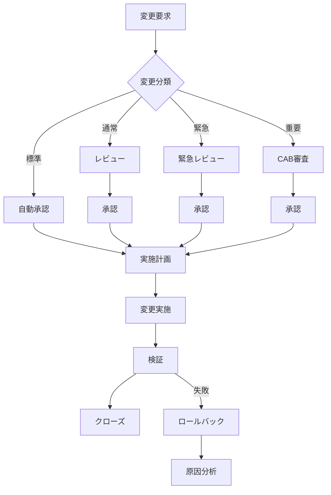

# 運用設計書（クラウドネイティブ/サーバレス/Kubernetes対応）

## ドキュメント情報

| 項目 | 内容 |
|------|------|
| ドキュメント名 | [サービス名] 運用設計書 |
| インフラパターン | **クラウドネイティブ（サーバレス/Kubernetes）** |
| バージョン | [バージョン番号] |
| 作成日 | [YYYY-MM-DD] |
| 最終更新日 | [YYYY-MM-DD] |
| 作成者 | [作成者名] |
| 承認者 | [承認者名] |
| ステータス | [Draft / Review / Approved] |

**このテンプレートの適用対象**:
- サーバレスアーキテクチャ（Lambda, Cloud Functions, Cloud Run等）
- Kubernetes環境（EKS, GKE, AKS, 自前K8s等）
- マネージドサービス中心の構成
- コンテナベースのアプリケーション

## 改訂履歴

| バージョン | 日付 | 変更内容 | 変更者 |
|------------|------|----------|--------|
| 0.1 | YYYY-MM-DD | 初版作成 | [名前] |

---

## 1. 概要

### 1.1 目的

本ドキュメントの目的を記載します。

- 運用に求められる要件の明確化
- システム運用に関わる関係者間の合意形成
- 運用プロセスの標準化と最適化
- 運用品質の向上と継続的改善

### 1.2 対象範囲

本運用設計書が対象とするシステム・サービスの範囲を記載します。

**対象システム**:
- [システム名・サービス名]

**対象業務**:
- [業務名]

**対象期間**:
- [運用開始予定日] ～ [運用終了予定日（該当する場合）]

### 1.3 前提条件

運用設計における前提条件を記載します。

- システム開発が完了していること
- 運用環境が構築されていること
- 運用チームの体制が整っていること
- [その他の前提条件]

### 1.4 制約条件

運用における制約事項を記載します。

- 予算制約: [金額や制約内容]
- リソース制約: [人員やインフラリソースの制約]
- 技術制約: [技術的な制約]
- 法規制・コンプライアンス: [該当する法規制]

### 1.5 クラウドネイティブ特有の考慮事項

**【重要】責任共有モデル**:

クラウドサービスでは、クラウドプロバイダーと利用者の間で運用責任が分担されます。

| 責任範囲 | クラウドプロバイダーの責任 | 利用者の責任 |
|---------|--------------------------|-------------|
| **インフラ** | 物理インフラ、ネットワーク、ハイパーバイザー | - |
| **マネージドサービス** | サービスの可用性、パッチ適用、スケーリング | サービス設定、アクセス制御 |
| **コンテナ/K8s** | コントロールプレーン（マネージドの場合） | アプリケーションコンテナ、Pod設計、ワークロード管理 |
| **サーバレス** | 関数実行環境、スケーリング、可用性 | 関数コード、設定、イベント設計 |
| **データ** | ストレージの冗長化、バックアップ機能提供 | データ保護設定、暗号化、バックアップ取得 |
| **セキュリティ** | インフラレベルのセキュリティ | アプリケーションレベルのセキュリティ、IAM、ネットワーク設計 |

**クラウドサービスのSLAへの依存**:
- 利用するマネージドサービスの SLAを確認し、サービス全体のSLO設計に反映
- 例: RDS（99.95%）、Lambda（99.95%）、S3（99.99%）
- 複数サービスの組み合わせによるSLOへの影響を計算

**コスト最適化の考慮**:
- オンデマンドリソースの適切な設定（タイムアウト、メモリサイズ等）
- 未使用リソースの自動削減
- Reserved Instances / Savings Plansの活用

**ベンダーロックインのリスク**:
- クラウド特有のサービスへの依存度
- マルチクラウド/ハイブリッドクラウド戦略の有無

**コンテナ・Kubernetes運用の考慮事項**:
- **コンテナイメージ管理**:
  - イメージレジストリ: ECR/GCR/ACR/DockerHub
  - イメージスキャン: Trivy/Clair/Snyk等による脆弱性検査頻度
  - イメージライフサイクル: 保管期間、削除ポリシー、タグ戦略
  - ベースイメージの更新ポリシー: セキュリティパッチ適用のサイクル

- **Kubernetes特有の運用課題**:
  - クラスタバージョン管理: マネージドK8sのアップグレード戦略（インプレース/ブルーグリーン）
  - Podのライフサイクル管理: Liveness Probe、Readiness Probe、Startup Probeの設計
  - リソース制限: Requests/Limitsの適切な設定とQoS（Guaranteed/Burstable/BestEffort）
  - ノードのメンテナンス: ノードのドレイン・交換手順、計画的メンテナンス
  - Namespaceによるマルチテナント: リソースクォータ、ネットワークポリシー
  - ConfigMap/Secretの管理: 機密情報の暗号化、ローテーションポリシー
  - PersistentVolumeの管理: スナップショット、バックアップ、リサイズ手順

- **GitOps による Infrastructure as Code 運用**:
  - **GitOpsの原則**:
    - Git を信頼できる唯一の情報源（Single Source of Truth）として扱う
    - すべてのインフラ変更は Git リポジトリへのコミット・PR 経由で実施
    - 自動化されたエージェントが Git の状態をクラスタに同期
    - 宣言的な設定（Declarative Configuration）によるインフラ管理

  - **GitOpsツールの選択**:
    - **ArgoCD** ⭐⭐⭐⭐⭐: Kubernetes 専用、UI が優れている、多機能
    - **Flux** ⭐⭐⭐⭐: CNCF 卒業プロジェクト、軽量、GitOps Toolkit として拡張可能
    - **Jenkins X** ⭐⭐⭐: CI/CD と GitOps を統合、学習コスト高

  - **GitOps ワークフロー**:
    1. 開発者が Infrastructure as Code（Terraform/Helm/Kustomize）を Git にコミット
    2. PR レビューによる変更承認プロセス
    3. マージ後、GitOps エージェント（ArgoCD/Flux）が自動的に変更を検知
    4. クラスタの状態を Git リポジトリの定義に同期
    5. 同期結果の監視とアラート

  - **GitOps 運用上の考慮事項**:
    - **リポジトリ構成**:
      - アプリケーションコードと Infrastructure as Code の分離
      - 環境ごとのブランチ/ディレクトリ戦略（dev/staging/production）
      - マニフェストの再利用（Helm Charts / Kustomize Overlays）

    - **シークレット管理**:
      - Git にシークレットをコミットしない（必須）
      - Sealed Secrets / External Secrets Operator / SOPS による暗号化
      - AWS Secrets Manager / GCP Secret Manager との連携

    - **ロールバック戦略**:
      - Git の履歴を利用した簡易ロールバック（git revert）
      - バージョンタグによる特定バージョンへの復元
      - カナリアリリース・ブルーグリーンデプロイメントとの組み合わせ

    - **監査とコンプライアンス**:
      - すべての変更が Git 履歴に記録される（変更者、タイムスタンプ、理由）
      - PR レビューによる変更承認の証跡
      - コンプライアンス要件を満たす監査ログとして活用

    - **障害時の対応**:
      - GitOps エージェントの障害時は手動デプロイも可能にしておく
      - Git リポジトリの障害時のフォールバック手順
      - 同期の失敗アラートとエスカレーション設定

**サーバレス特有の制限と考慮事項**:
- **実行制限の考慮**:
  - Lambda同時実行数制限: デフォルト1000（リージョンごと）、必要に応じて上限緩和申請
  - タイムアウト設計: 最大15分（Lambda）の制限、長時間処理はStep Functions等で分割
  - コールドスタート対策:
    - Provisioned Concurrency（追加コスト発生）
    - VPC Lambda使用時のENI作成時間考慮
    - 軽量ランタイムの選択（Python/Node.js推奨、Java/C#は起動遅い）
  - ペイロードサイズ制限:
    - 同期呼び出し: 6MB
    - 非同期呼び出し: 256KB
    - 大きなデータはS3経由で処理

- **料金最適化**:
  - メモリサイズとCPU割り当ての最適化（メモリに比例してCPUも増加）
  - タイムアウト値の適切な設定（無駄な待機時間を削減）
  - Provisioned Concurrencyの費用対効果分析

**オブザーバビリティの実装**:
- **分散トレーシング**:
  - AWS X-Ray / Jaeger / Zipkin / OpenTelemetry
  - トレースサンプリング率の設定（コストと可視性のトレードオフ）
  - サービスマップによる依存関係の可視化

- **ログ集約**:
  - CloudWatch Logs Insights / ELK Stack / Loki / Splunk
  - ログ保管期間とコスト管理
  - 構造化ログ（JSON形式）の推奨
  - ログレベル（DEBUG/INFO/WARN/ERROR）の運用ルール

- **メトリクス収集**:
  - Prometheus + Grafana / CloudWatch / Datadog / New Relic
  - カスタムメトリクスの設計
  - ダッシュボードの標準化

**AWS特有の運用項目**:
- **IAM管理**:
  - ロール・ポリシーの定期レビュー（四半期ごと推奨）
  - 最小権限の原則の徹底
  - サービスロールとIAMユーザーの使い分け
  - MFA強制ポリシー
  - アクセスキーのローテーションポリシー

- **タグ戦略**:
  - コスト配分タグ（Environment、Service、Team、CostCenter）の必須化
  - リソース管理タグ（Owner、Project、Compliance）
  - 自動タグ付けの実装（Terraform/CloudFormation）
  - タグポリシーの強制（AWS Organizations Tag Policies）

- **マルチアカウント戦略**:
  - AWS Organizations による一元管理
  - アカウント分離戦略（本番/ステージング/開発、サービスごと、環境ごと）
  - AWS Control Tower の活用（ガードレール、アカウントファクトリ）
  - 請求の統合（Consolidated Billing）

- **AWSサポート活用**:
  - サポートプラン: Developer / Business / Enterprise（要件に応じて選択）
  - TAM（Technical Account Manager）の活用（Enterprise Support）
  - Trusted Advisor の定期確認（コスト最適化、セキュリティ、パフォーマンス）
  - AWS Well-Architected Review の実施

- **コンプライアンスとガバナンス**:
  - AWS Config によるリソース設定の記録と監査
  - AWS CloudTrail による API 操作の記録（改ざん検知）
  - GuardDuty によるセキュリティ脅威検知
  - Security Hub による セキュリティポスチャの統合管理

---

## 2. サービス概要

### 2.1 サービスの目的

サービスが提供する価値と目的を記載します。

**ビジネス目的**:
- [ビジネス上の目的]

**提供価値**:
- [ユーザーに提供する価値]

### 2.2 サービスの機能

主要な機能を記載します。

| 機能名 | 概要 | 重要度 |
|--------|------|--------|
| [機能1] | [機能の説明] | High / Medium / Low |
| [機能2] | [機能の説明] | High / Medium / Low |

### 2.3 システム構成

システムのアーキテクチャと主要コンポーネントを記載します。

**アーキテクチャ図**:


**主要コンポーネント**:

| コンポーネント | 役割 | 技術スタック | 冗長化 |
|----------------|------|--------------|--------|
| [コンポーネント1] | [役割] | [技術] | Yes / No |
| [コンポーネント2] | [役割] | [技術] | Yes / No |

### 2.4 外部連携

外部システムとの連携を記載します。

| 連携先 | 連携方式 | データフロー | 重要度 |
|--------|----------|--------------|--------|
| [システム名] | API / Batch / etc | [方向と内容] | High / Medium / Low |

---

## 3. 運用方針と目標

### 3.1 運用基本方針

運用における基本的な方針を記載します。

1. **可用性重視**: [方針の詳細]
2. **セキュリティ優先**: [方針の詳細]
3. **継続的改善**: [方針の詳細]
4. **コスト最適化**: [方針の詳細]

### 3.2 サービスレベル目標（SLO）

**【重要】ユーザー中心のSLO設計原則**:

SLOは「測りやすい指標」ではなく、「ユーザーが快適に使える範囲」を起点として設計します。

**設計アプローチ**:
1. **ユーザーの期待値を理解する**
   - ユーザーはどの程度の応答速度を期待しているか
   - どの程度のエラーなら許容できるか
   - サービス停止はどの程度の影響を与えるか

2. **ユーザー体験に基づいた目標設定**
   - 「サーバーCPU使用率」ではなく「ユーザーが体感するレスポンスタイム」
   - 「データベース接続数」ではなく「ユーザーがエラーに遭遇する頻度」
   - 技術指標はユーザー体験指標の裏付けとして使用

3. **システム構成ごとの目標設定**
   - 同期処理、非同期処理、バッチ処理でユーザー期待値は異なる
   - それぞれに適切な目標値を設定

**SLO定義**:

| システム構成/機能 | 指標名 | 目標値 | ユーザー視点での意味 | 測定方法 | 測定頻度 |
|-------------------|--------|--------|---------------------|----------|----------|
| [全体] | 可用性 | [例: 99.9%] | ユーザーがサービスを利用できる時間の割合 | [測定方法] | [頻度] |
| [Web同期リクエスト] | レスポンスタイム（P95） | [例: 500ms以下] | ユーザーが操作後に結果が表示されるまでの体感速度 | [測定方法] | [頻度] |
| [Web同期リクエスト] | エラーレート | [例: 0.1%以下] | ユーザーがエラーに遭遇する頻度 | [測定方法] | [頻度] |
| [非同期APIリクエスト] | 処理完了時間（P95） | [例: 5秒以内] | バックグラウンド処理が完了するまでの時間 | [測定方法] | [頻度] |
| [バッチ処理] | 処理完了時刻 | [例: 翌朝8時まで] | 業務開始時にデータが利用可能になっている状態 | [測定方法] | 日次 |
| [全体] | MTTR | [例: 30分以内] | 障害発生時にユーザーが待つ時間 | [測定方法] | [頻度] |

### 3.3 サービスレベル指標（SLI）

SLOを測定するための具体的な指標を記載します。

| SLI名 | 定義 | データソース | 計算式 |
|-------|------|--------------|--------|
| [SLI1] | [定義] | [ソース] | [計算式] |
| [SLI2] | [定義] | [ソース] | [計算式] |

### 3.4 サービスレベル合意（SLA）

顧客またはユーザーに対して約束するサービス品質の基準を記載します。

**SLA策定の重要性**:
- SLOとSLIに基づいた実現可能な目標設定
- 顧客期待値の明確化
- サービス品質保証の根拠
- 違約時の対応方針の明確化

**SLA定義**:

| システム構成/機能 | SLA項目 | 保証値 | 測定方法 | 測定期間 | 未達時の対応 |
|-------------------|---------|--------|----------|----------|-------------|
| [全体] | サービス可用性 | [例: 99.9%] | [測定方法] | 月次 | [対応内容] |
| [Web同期リクエスト] | レスポンスタイム（P95） | [例: 500ms以下] | [測定方法] | 月次 | [対応内容] |
| [非同期APIリクエスト] | 処理完了時間（P95） | [例: 5秒以内] | [測定方法] | 月次 | [対応内容] |
| [バッチ処理] | 処理完了時刻 | [例: 翌朝8時まで] | [測定方法] | 日次 | [対応内容] |

**システム構成別のSLA設定指針**:

1. **同期的なWebリクエスト（ユーザー対話操作）**
   - ユーザーが快適に操作できる範囲を基準とする
   - レスポンスタイム: 一般的に500ms以下（P95）
   - エラーレート: 0.1%以下

2. **非同期APIリクエスト（バックグラウンド処理）**
   - ユーザー体験に直接影響しない範囲で設定
   - 処理完了時間: 数秒〜数十秒
   - 再試行ポリシーを含む

3. **バッチ処理（夜間処理等）**
   - 業務開始時刻までの完了を保証
   - 処理時間: 数時間単位
   - 失敗時の再実行ポリシー

**SLA未達時のペナルティまたは対応**:
- サービスクレジット: [内容]
- エスカレーション: [プロセス]
- 改善計画の提出: [内容]

### 3.5 エラーバジェット

許容されるエラーの範囲を定義します。

**エラーバジェット算出**:
- 可用性目標: 99.9%
- 許容ダウンタイム（月間）: [計算結果]
- エラーバジェット消費の閾値: [閾値]

**エラーバジェットポリシー**:
- エラーバジェット残量 > 50%: [対応方針]
- エラーバジェット残量 20-50%: [対応方針]
- エラーバジェット残量 < 20%: [対応方針]

---

## 4. 運用体制

### 4.1 運用組織体制

運用組織の体制を記載します。


### 4.2 役割と責任（RACI）

主要な運用プロセスにおける役割と責任を記載します。

| プロセス/タスク | 運用マネージャー | 運用チーム | SREチーム | 開発チーム | 備考 |
|-----------------|------------------|------------|-----------|------------|------|
| 監視・アラート対応 | A | R | C | I | [備考] |
| インシデント対応 | A | R | C | C | [備考] |
| 変更管理 | A | I | C | R | [備考] |
| リリース管理 | A | C | R | R | [備考] |

※ R=Responsible（実行責任）, A=Accountable（説明責任）, C=Consulted（相談）, I=Informed（報告）

### 4.3 運用時間帯

運用体制の時間帯を記載します。

| 時間帯 | 運用体制 | 対応内容 |
|--------|----------|----------|
| 平日 9:00-18:00 | 通常体制 | [対応内容] |
| 平日 18:00-9:00 | オンコール体制 | [対応内容] |
| 休日・祝日 | オンコール体制 | [対応内容] |

**オンコール体制**:
- 1次対応: [担当者・連絡先]
- 2次対応: [担当者・連絡先]
- エスカレーション先: [担当者・連絡先]

### 4.4 コミュニケーション

運用における コミュニケーション方法を記載します。

**定例会議**:

| 会議名 | 頻度 | 参加者 | 目的 |
|--------|------|--------|------|
| 日次運用会議 | 毎日 | [参加者] | [目的] |
| 週次運用レビュー | 毎週 | [参加者] | [目的] |
| 月次運用報告 | 毎月 | [参加者] | [目的] |

**コミュニケーションツール**:
- チャット: [ツール名・チャンネル]
- チケット管理: [ツール名]
- ドキュメント共有: [ツール名]
- インシデント管理: [ツール名]

---

## 5. 運用スケジュール

### 5.1 定期運用スケジュール

定期的に実施する運用作業のスケジュールを記載します。

| 作業項目 | 頻度 | 実施日時 | 担当 | 所要時間 |
|----------|------|----------|------|----------|
| [作業1] | 日次 | [時刻] | [担当] | [時間] |
| [作業2] | 週次 | [曜日・時刻] | [担当] | [時間] |
| [作業3] | 月次 | [日・時刻] | [担当] | [時間] |

### 5.2 メンテナンスウィンドウ

計画メンテナンスの実施可能時間帯を記載します。

**定期メンテナンス**:
- 頻度: [週次/月次/四半期等]
- 実施日時: [曜日・時刻]
- 所要時間: [時間]
- 影響範囲: [影響内容]

**緊急メンテナンス**:
- 実施判断基準: [基準]
- 承認プロセス: [プロセス]
- 通知方法: [通知手段]

### 5.3 年間運用カレンダー

年間の主要イベントとメンテナンススケジュールを記載します。

| 月 | イベント/作業 | 詳細 |
|----|---------------|------|
| 1月 | [イベント] | [詳細] |
| 2月 | [イベント] | [詳細] |
| ... | ... | ... |

---

## 6. 定常運用作業

### 6.1 日次運用作業

毎日実施する運用作業を記載します。

#### 7.1.1 [作業名1]

**目的**: [作業の目的]

**実施タイミング**: [時刻]

**手順**:
1. [手順1]
2. [手順2]
3. [手順3]

**確認項目**:
- [ ] [確認項目1]
- [ ] [確認項目2]

**成果物**: [成果物があれば記載]

**エスカレーション基準**: [異常時の対応]

#### 7.1.2 [作業名2]

[同様の形式で記載]

### 6.2 週次運用作業

週単位で実施する運用作業を記載します。

#### 7.2.1 [作業名]

[日次作業と同様の形式で記載]

### 6.3 月次運用作業

月単位で実施する運用作業を記載します。

#### 7.3.1 [作業名]

[日次作業と同様の形式で記載]

---

## 7. 監視・通知

### 7.1 監視方針

**【重要】ユーザー中心の監視設計原則**:

監視は「測りやすい技術指標」ではなく、「ユーザーが快適に使える状態」を維持するために実施します。

**監視設計アプローチ**:

1. **ユーザー体験起点の監視**
   - まず「ユーザーが体感する品質」を監視
   - 技術指標はユーザー体験指標が悪化した時の原因特定に使用
   - 例: レスポンスタイムの悪化を検知 → CPU使用率を確認して原因を特定

2. **外形監視を最優先**
   - ユーザーと同じ視点でサービスを監視
   - エンドツーエンドの動作確認
   - 実際のユーザートランザクションをシミュレート

3. **システム構成ごとの監視基準**
   - 同期処理、非同期処理、バッチ処理で監視基準を分ける
   - それぞれのユーザー期待値に基づいた閾値設定

**監視の目的**:
- **第一目的**: ユーザーが快適に利用できる状態の維持
- サービスの可用性確保
- パフォーマンス劣化の早期検知（ユーザー体感品質の観点から）
- セキュリティインシデントの検知
- キャパシティ不足の予兆検知

**監視レベル**:
- レベル1（Critical）: ユーザーに直接影響がある状態 [具体的な定義と対応]
- レベル2（Warning）: ユーザーへ影響が及ぶ可能性のある状態 [具体的な定義と対応]
- レベル3（Info）: ユーザーに影響はないが注視すべき状態 [具体的な定義と対応]

### 7.2 監視項目

**【重要】監視項目の優先順位**:

**優先度1: ユーザー体験監視（SLI直結）**
- ユーザーが直接体感する品質指標
- これらが正常であればサービスは正常

**優先度2: アプリケーション監視**
- ユーザー体験指標の裏付け
- 問題発生時の原因特定用

**優先度3: インフラ監視**
- アプリケーション指標の裏付け
- キャパシティ管理用

**監視項目定義**:

| 優先度 | 監視対象 | 監視項目 | 閾値 | 監視間隔 | アラートレベル | ユーザー視点での意味 |
|--------|----------|----------|------|----------|----------------|---------------------|
| 1 | 外形監視（Web同期） | レスポンスタイム（P95） | 500ms超 | 1分 | Warning | ユーザーが遅いと感じる |
| 1 | 外形監視（Web同期） | レスポンスタイム（P95） | 1000ms超 | 1分 | Critical | ユーザーがストレスを感じる |
| 1 | 外形監視（Web同期） | エラーレート | 0.1%超 | 1分 | Warning | ユーザーがエラーに遭遇し始める |
| 1 | 外形監視（Web同期） | エラーレート | 1%超 | 1分 | Critical | 多数のユーザーがエラーに遭遇 |
| 1 | 外形監視（非同期API） | 処理完了時間（P95） | 5秒超 | 5分 | Warning | バックグラウンド処理の遅延 |
| 1 | 外形監視（バッチ） | 処理完了時刻 | 7:00以降 | 1時間 | Warning | 業務開始に間に合わない可能性 |
| 1 | 外形監視（バッチ） | 処理完了時刻 | 8:00以降 | 1時間 | Critical | 業務開始に間に合わない |
| 2 | アプリケーション | エラーレート | [閾値] | 1分 | [レベル] | アプリケーションレベルのエラー発生状況 |
| 2 | アプリケーション | レスポンスタイム | [閾値] | 1分 | [レベル] | アプリケーション処理時間 |
| 3 | Webサーバー | CPU使用率 | 80%超 | 1分 | Info | リソース逼迫の予兆 |
| 3 | Webサーバー | CPU使用率 | 90%超 | 1分 | Warning | リソース逼迫 |
| 3 | Webサーバー | メモリ使用率 | [閾値] | [間隔] | [レベル] | メモリリソース状況 |
| 3 | データベース | 接続数 | [閾値] | [間隔] | [レベル] | DB接続リソース状況 |

**クラウドネイティブ/サーバレス固有の監視項目**:

**【サーバレス（Lambda/Cloud Functions等）の監視】**:

| 優先度 | 監視対象 | 監視項目 | 閾値 | 監視間隔 | アラートレベル | ユーザー視点での意味 |
|--------|----------|----------|------|----------|----------------|---------------------|
| 1 | Lambda関数 | Errors | 1件以上/分 | 1分 | Critical | ユーザーリクエストが失敗している |
| 2 | Lambda関数 | Throttles | 1件以上 | 1分 | Critical | リクエストがスロットリングされている |
| 2 | Lambda関数 | 同時実行数 | アカウント上限の80%超 | 1分 | Warning | スロットリングの予兆 |
| 2 | Lambda関数 | Duration（P95） | タイムアウト値の80%超 | 5分 | Warning | タイムアウトの予兆、処理遅延 |
| 2 | Lambda関数 | Duration（P95） | タイムアウト値の95%超 | 5分 | Critical | タイムアウト直前、即座に対応必要 |
| 3 | Lambda関数 | Cold Start率 | 5%超 | 5分 | Info | レスポンスタイム悪化の要因 |
| 3 | Lambda関数 | メモリ使用率 | 設定値の90%超 | 5分 | Warning | メモリ不足によるパフォーマンス低下 |
| 3 | Lambda関数 | イテレーター経過時間 | 1時間超 | 5分 | Warning | ストリーム処理の遅延（Kinesis/DynamoDB Streams） |

**【Kubernetes（EKS/GKE/AKS）の監視】**:

| 優先度 | 監視対象 | 監視項目 | 閾値 | 監視間隔 | アラートレベル | ユーザー視点での意味 |
|--------|----------|----------|------|----------|----------------|---------------------|
| 1 | Pod | CrashLoopBackOff | 発生 | 1分 | Critical | サービスが起動できない状態 |
| 1 | Pod | ImagePullBackOff | 発生 | 1分 | Critical | コンテナイメージ取得失敗 |
| 1 | Service | Endpoints数 | 0 | 1分 | Critical | バックエンドPodが全て停止 |
| 2 | Pod | PodのPending状態 | 5分以上 | 1分 | Warning | リソース不足でスケールできない |
| 2 | Pod | Restart回数 | 10回/1時間 | 5分 | Warning | 不安定な状態、調査必要 |
| 2 | Node | NodeNotReady | 発生 | 1分 | Critical | ノード障害、サービス影響の可能性 |
| 2 | Node | DiskPressure | 発生 | 1分 | Warning | ディスク容量不足 |
| 2 | Node | MemoryPressure | 発生 | 1分 | Warning | メモリ不足 |
| 3 | Pod | CPU使用率（Requests比） | 90%超 | 1分 | Warning | スケールアウトの必要性 |
| 3 | Pod | メモリ使用率（Requests比） | 90%超 | 1分 | Warning | スケールアウトの必要性 |
| 3 | HPA | desiredReplicas vs currentReplicas | 不一致が5分以上 | 1分 | Warning | スケールが追いついていない |
| 3 | Cluster | ノード数 | 最大ノード数の90%超 | 5分 | Warning | クラスタ拡張限界に近づいている |

**【AWSマネージドサービス固有の監視】**:

| 優先度 | 監視対象 | 監視項目 | 閾値 | 監視間隔 | アラートレベル | ユーザー視点での意味 |
|--------|----------|----------|------|----------|----------------|---------------------|
| 1 | RDS | DBInstanceStatus | available以外 | 1分 | Critical | データベースが利用不可 |
| 1 | RDS | フェイルオーバー発生 | 発生 | 1分 | Critical | DBが一時的に利用不可になる |
| 1 | ALB/NLB | HealthyHostCount | 0 | 1分 | Critical | 全てのバックエンドが停止 |
| 1 | ALB/NLB | UnHealthyHostCount | 全ターゲット数 | 1分 | Critical | 全てのバックエンドが異常 |
| 2 | RDS | CPU使用率 | 80%超 | 5分 | Warning | パフォーマンス劣化の予兆 |
| 2 | RDS | 接続数 | 最大接続数の80%超 | 1分 | Warning | 新規接続が拒否され始める |
| 2 | RDS | FreeableMemory | 1GB未満 | 5分 | Warning | メモリ不足 |
| 2 | RDS | FreeStorageSpace | 10GB未満または10%未満 | 5分 | Warning | ストレージ容量不足 |
| 2 | RDS | ReadLatency/WriteLatency | 100ms超（P95） | 5分 | Warning | I/O性能劣化 |
| 2 | SQS | ApproximateAgeOfOldestMessage | 15分超 | 5分 | Warning | メッセージ処理の遅延 |
| 2 | SQS | DLQメッセージ数 | 1件以上 | 5分 | Warning | 処理失敗メッセージの蓄積 |
| 2 | DynamoDB | UserErrors | 1件以上/分 | 1分 | Warning | クライアントエラーの発生 |
| 2 | DynamoDB | SystemErrors | 1件以上 | 1分 | Critical | DynamoDB側のエラー |
| 2 | DynamoDB | ConsumedReadCapacity | プロビジョニング値の80%超 | 1分 | Warning | スロットリングの予兆 |
| 2 | DynamoDB | ConsumedWriteCapacity | プロビジョニング値の80%超 | 1分 | Warning | スロットリングの予兆 |
| 2 | S3 | 4xxErrors | 10件以上/分 | 5分 | Warning | クライアントエラーの多発 |
| 2 | S3 | 5xxErrors | 1件以上 | 5分 | Critical | S3側のエラー |
| 3 | CloudWatch Logs | IncomingBytes | 予算の80%超（月累計） | 1時間 | Info | ログコスト超過の予兆 |
| 3 | API Gateway | Latency（P95） | 1000ms超 | 5分 | Warning | API処理遅延 |
| 3 | API Gateway | 4XXError率 | 5%超 | 5分 | Warning | クライアントエラーの多発 |
| 3 | API Gateway | 5XXError率 | 1%超 | 5分 | Critical | サーバーエラーの多発 |

**【コンテナイメージ・レジストリの監視】**:

| 優先度 | 監視対象 | 監視項目 | 閾値 | 監視間隔 | アラートレベル | ユーザー視点での意味 |
|--------|----------|----------|------|----------|----------------|---------------------|
| 2 | ECR/GCR/ACR | イメージプル失敗 | 発生 | 1分 | Critical | デプロイ・スケールができない |
| 3 | ECR/GCR/ACR | 脆弱性スキャン結果 | Critical/High検出 | 1日 | Warning | セキュリティリスク |
| 3 | ECR/GCR/ACR | ストレージ使用量 | 予算の80%超 | 1日 | Info | コスト超過の予兆 |

**【分散トレーシング・オブザーバビリティ】**:

| 優先度 | 監視対象 | 監視項目 | 閾値 | 監視間隔 | アラートレベル | ユーザー視点での意味 |
|--------|----------|----------|------|----------|----------------|---------------------|
| 1 | X-Ray/Jaeger | エラートレース率 | 1%超 | 5分 | Warning | 分散システム内でのエラー発生 |
| 2 | X-Ray/Jaeger | エンドツーエンドレイテンシ（P95） | SLO超過 | 5分 | Warning | 複数サービスにまたがる処理遅延 |
| 3 | X-Ray/Jaeger | サンプリング率 | 設定値未満 | 1時間 | Info | トレースデータの欠損 |

**システム構成別の監視設計**:

1. **同期的なWebリクエスト**
   - ユーザーは即座に結果を期待
   - レスポンスタイム: P95で500ms以下を目標
   - 監視間隔: 1分（迅速な検知が必要）

2. **非同期APIリクエスト**
   - ユーザーは数秒の待機は許容
   - 処理完了時間: P95で5秒以内を目標
   - 監視間隔: 5分（ある程度の猶予あり）

3. **バッチ処理**
   - ユーザーは完了時刻を期待
   - 処理完了時刻: 業務開始時刻まで
   - 監視間隔: 1時間（処理時間が長いため）

### 7.3 ログ管理

ログの収集・保管・分析方針を記載します。

**ログ種類**:

| ログ種類 | 出力先 | 保管期間 | 用途 |
|----------|--------|----------|------|
| アクセスログ | [保存先] | [期間] | [用途] |
| アプリケーションログ | [保存先] | [期間] | [用途] |
| エラーログ | [保存先] | [期間] | [用途] |
| セキュリティログ | [保存先] | [期間] | [用途] |

**ログ分析**:
- ツール: [ツール名]
- 分析頻度: [頻度]
- 分析内容: [内容]

### 7.4 アラート通知

アラート通知のルールと方法を記載します。

**通知ルート**:


**通知先**:

| アラートレベル | 通知方法 | 通知先 | 対応時間 |
|----------------|----------|--------|----------|
| Critical | 電話+メール+チャット | [通知先] | 即時 |
| Warning | メール+チャット | [通知先] | 30分以内 |
| Info | チャット | [通知先] | 営業時間内 |

---

## 8. インシデント管理

### 8.1 インシデント定義

インシデントの定義と分類を記載します。

**インシデント定義**:
サービスの計画外の中断、またはサービス品質の低下

**インシデント分類**:

| 優先度 | 定義 | 対応目標時間 | 例 |
|--------|------|--------------|-----|
| P1（Critical） | サービス全停止 | 15分以内に対応開始 | [例] |
| P2（High） | 主要機能停止 | 30分以内に対応開始 | [例] |
| P3（Medium） | 一部機能停止 | 2時間以内に対応開始 | [例] |
| P4（Low） | 軽微な問題 | 営業時間内対応 | [例] |

### 8.2 インシデント対応フロー

インシデント対応の標準フローを記載します。


### 8.3 インシデント対応手順

インシデント対応の詳細手順を記載します。

#### 9.3.1 検知・報告

**検知方法**:
- 監視アラート
- ユーザー報告
- 運用チーム発見

**報告フロー**:
1. インシデント管理ツールにチケット作成
2. 運用チームに通知
3. 優先度に応じてエスカレーション

#### 9.3.2 トリアージ

**トリアージ基準**:
- 影響範囲（全ユーザー / 一部ユーザー / 特定機能）
- ビジネスインパクト（売上損失 / 信用失墜 / 軽微）
- 緊急度（即時対応必要 / 計画的対応可能）

**優先度判定**:
[優先度判定のマトリクスやルール]

#### 9.3.3 対応・復旧

**対応原則**:
1. まず復旧、原因究明は後
2. 影響範囲の最小化を優先
3. コミュニケーションを密に

**復旧手順**:
1. [手順1]
2. [手順2]
3. [手順3]

#### 9.3.4 ポストモーテム

**実施タイミング**:
- P1/P2インシデント: 必須
- P3インシデント: 必要に応じて
- P4インシデント: 任意

**ポストモーテム内容**:
- インシデントサマリー
- 影響範囲と期間
- 根本原因分析（なぜなぜ分析）
- 再発防止策
- アクションアイテム

### 8.4 エスカレーション

エスカレーションルールを記載します。

**エスカレーション基準**:
- 対応開始から[X]分経過しても復旧しない
- 影響範囲が拡大している
- 技術的な判断が必要
- ビジネス判断が必要

**エスカレーションパス**:


---

## 9. 変更管理

### 9.1 変更管理方針

変更管理の基本方針を記載します。

**変更管理の目的**:
- 変更に伴うリスクの最小化
- 変更の影響評価と承認プロセスの明確化
- 変更履歴の記録と追跡可能性の確保

**変更の定義**:
本番環境への以下の変更を対象とします
- システム構成の変更
- アプリケーションのデプロイ
- インフラ設定の変更
- セキュリティ設定の変更

### 9.2 変更分類

変更の種類と承認プロセスを記載します。

| 変更分類 | 定義 | 承認者 | リードタイム |
|----------|------|--------|--------------|
| 標準変更 | 手順化済みの低リスク変更 | 運用リーダー | 即時 |
| 通常変更 | 一般的な変更 | 運用マネージャー | 3営業日 |
| 緊急変更 | 緊急対応が必要な変更 | 運用マネージャー | 即時 |
| 重要変更 | 高リスクまたは大規模な変更 | 変更諮問委員会 | 1週間 |

### 9.3 変更管理フロー

変更管理のプロセスを記載します。



### 9.4 変更実施手順

変更を実施する際の標準手順を記載します。

**事前準備**:
1. 変更チケットの作成
2. 変更内容の詳細記載
3. 影響評価の実施
4. ロールバック計画の作成
5. 承認取得

**実施時**:
1. 事前バックアップの取得
2. 変更作業の実施
3. 作業ログの記録
4. 動作確認の実施

**事後**:
1. 変更結果の報告
2. ドキュメントの更新
3. チケットのクローズ

### 9.5 ロールバック計画

ロールバックの基準と手順を記載します。

**ロールバック判断基準**:
- 変更後の動作確認でエラーが検出された
- SLOを下回る性能劣化が発生した
- 予期しない副作用が発生した
- [その他の基準]

**ロールバック手順**:
1. [手順1]
2. [手順2]
3. [手順3]

---

## 10. リリース管理

### 10.1 リリース方針

リリースの基本方針を記載します。

**リリース原則**:
- 定期リリースと緊急リリースの明確な区別
- 本番環境へのリリース前の十分なテスト
- 段階的なロールアウト（カナリアリリース等）
- 自動化されたデプロイメントプロセス

### 10.2 リリーススケジュール

定期リリースのスケジュールを記載します。

| リリース種別 | 頻度 | 実施日時 | 対象 |
|--------------|------|----------|------|
| メジャーリリース | 四半期毎 | [日時] | 大規模機能追加 |
| マイナーリリース | 月次 | [日時] | 機能改善 |
| パッチリリース | 週次 | [日時] | バグフィックス |
| ホットフィックス | 随時 | 随時 | 緊急対応 |

### 10.3 リリースフロー

リリースプロセスを記載します。


**各環境の役割**:
- 開発環境: 機能開発とユニットテスト
- テスト環境: 結合テストと品質保証
- ステージング環境: 本番環境と同等構成での最終確認
- カナリア環境: 一部ユーザーでの先行リリース
- 本番環境: 全ユーザー向けリリース

### 10.4 デプロイメント戦略

デプロイメント方式を記載します。

**採用戦略**: [選択した戦略]

**デプロイメント方式の比較**:

| 方式 | メリット | デメリット | 採用判断 |
|------|----------|------------|----------|
| Blue-Green | ダウンタイムゼロ | リソース2倍必要 | [○/×] |
| Rolling | リソース効率的 | 段階的な切り替え | [○/×] |
| Canary | リスク最小化 | 複雑な制御必要 | [○/×] |

**自動化ツール**:
- CI/CDツール: [ツール名]
- デプロイツール: [ツール名]
- インフラ管理: [ツール名]

---

## 11. バックアップ・リカバリ

### 11.1 バックアップ方針

バックアップの基本方針を記載します。

**バックアップ目的**:
- データ損失時の復旧
- ランサムウェア等のセキュリティインシデント対応
- 監査・コンプライアンス要件への対応

**バックアップ原則**:
- 3-2-1ルール: 3つのコピー、2つの異なるメディア、1つはオフサイト
- 暗号化されたバックアップの保管
- 定期的なリストアテストの実施

### 11.2 バックアップ設計

バックアップ対象と方式を記載します。

| バックアップ対象 | バックアップ方式 | 頻度 | 世代管理 | 保管場所 |
|------------------|------------------|------|----------|----------|
| データベース | フル+差分 | 日次フル+6時間毎差分 | 30世代 | [場所] |
| ファイルストレージ | フル | 日次 | 7世代 | [場所] |
| システム設定 | フル | 変更時 | 10世代 | [場所] |
| ログファイル | 増分 | 1時間毎 | 90日 | [場所] |

**バックアップスケジュール**:

```mermaid
gantt
    title バックアップスケジュール（1日）
    dateFormat HH:mm
    axisFormat %H:%M

    section データベース
    フルバックアップ    :00:00, 2h
    差分バックアップ1   :06:00, 30m
    差分バックアップ2   :12:00, 30m
    差分バックアップ3   :18:00, 30m

    section ファイル
    フルバックアップ    :02:00, 1h
```



### 11.3 リカバリ設計

リカバリの目標値と手順を記載します。

**リカバリ目標**:

| 対象 | RPO（目標復旧時点） | RTO（目標復旧時間） |
|------|---------------------|---------------------|
| データベース | 6時間以内 | 4時間以内 |
| ファイルストレージ | 24時間以内 | 2時間以内 |
| システム全体 | 24時間以内 | 8時間以内 |

**リカバリ手順**:

#### データベースリカバリ
1. [手順1]
2. [手順2]
3. [手順3]

**リカバリテスト**:
- 頻度: 四半期毎
- 対象: [テスト対象]
- 成功基準: [基準]

### 11.4 災害対策（DR）

災害復旧計画を記載します。

**DR方針**:
- DR サイト: [有/無]
- DR 構成: [Hot Standby / Warm Standby / Cold Standby]

**DR切り替えシナリオ**:

| シナリオ | 発生条件 | 切り替え判断 | 切り替え時間目標 |
|----------|----------|--------------|------------------|
| データセンター障害 | [条件] | [判断基準] | [時間] |
| リージョン障害 | [条件] | [判断基準] | [時間] |

---

## 12. セキュリティ運用

### 12.1 セキュリティ運用方針

セキュリティ運用の基本方針を記載します。

**セキュリティ原則**:
- 多層防御（Defense in Depth）
- 最小権限の原則
- ゼロトラストアーキテクチャ
- 継続的なセキュリティ監視

### 12.2 アクセス管理

アクセス権限の管理方針を記載します。

**権限管理**:

| ロール | 権限範囲 | 承認者 | レビュー頻度 |
|--------|----------|--------|--------------|
| システム管理者 | 全権限 | [承認者] | 月次 |
| 運用担当者 | 運用操作のみ | [承認者] | 月次 |
| 開発者 | 開発環境のみ | [承認者] | 月次 |
| 閲覧者 | 読み取りのみ | [承認者] | 四半期 |

**アクセスレビュー**:
- 頻度: [頻度]
- 実施者: [担当者]
- レビュー内容: [内容]

### 12.3 脆弱性管理

脆弱性の検出と対応プロセスを記載します。

**脆弱性スキャン**:
- ツール: [ツール名]
- 頻度: [頻度]
- 対象: [対象システム]

**パッチ適用**:

| 脆弱性レベル | 対応期限 | 承認プロセス |
|--------------|----------|--------------|
| Critical | 24時間以内 | 緊急変更 |
| High | 7日以内 | 通常変更 |
| Medium | 30日以内 | 通常変更 |
| Low | 90日以内 | 計画変更 |

### 12.4 DevSecOps: CI/CDパイプラインのセキュリティ

**【重要】Shift Left Security - 開発の早期段階でセキュリティを組み込む**

DevSecOpsは、従来の「開発→テスト→運用→セキュリティチェック」というフローを変革し、開発の初期段階からセキュリティを組み込む実践です。

**DevSecOpsの原則**:
- セキュリティは全員の責任（開発者・運用者・セキュリティチーム）
- 自動化されたセキュリティチェックをCI/CDパイプラインに組み込む
- 早期発見・早期修正によるコスト削減
- 継続的なセキュリティ改善

**CI/CDパイプラインのセキュリティゲート**:


#### 12.4.1 SAST（静的アプリケーションセキュリティテスト）

**目的**: ソースコードの脆弱性を自動検出

**実装内容**:

| 項目 | 内容 |
|------|------|
| **ツール** | SonarQube / Checkmarx / Snyk Code / Semgrep |
| **実施タイミング** | PR作成時、マージ前（必須）、定期実行（週次） |
| **検出対象** | SQLインジェクション、XSS、CSRF、ハードコードされたシークレット、安全でない関数使用 |
| **閾値設定** | Critical/High: ビルド失敗、Medium: 警告、Low: 情報 |
| **レポート** | PR コメントへの自動投稿、ダッシュボードでの可視化 |
| **False Positive対応** | ホワイトリスト管理、定期レビュー |

**実装例（GitHub Actions）**:
```yaml
- name: Run SAST with SonarQube
  run: |
    sonar-scanner \
      -Dsonar.projectKey=${{ github.repository }} \
      -Dsonar.qualitygate.wait=true \
      -Dsonar.qualitygate.timeout=300
```

#### 12.4.2 依存関係の脆弱性スキャン（SCA: Software Composition Analysis）

**目的**: サードパーティライブラリの既知脆弱性を検出

**実装内容**:

| 項目 | 内容 |
|------|------|
| **ツール** | Snyk / Dependabot / Trivy / OWASP Dependency-Check |
| **実施タイミング** | PR作成時、日次スキャン、デプロイ前 |
| **検出対象** | npm/pip/maven等のパッケージ、既知脆弱性（CVE）、ライセンス違反 |
| **自動修正** | Dependabot/Snykによる自動PR作成 |
| **閾値設定** | Critical: 即座に修正、High: 7日以内、Medium: 30日以内 |
| **除外ルール** | False Positiveやパッチ未提供の脆弱性を一時的に除外 |

**対応フロー**:
1. 脆弱性検出 → Slack/GitHub Issue通知
2. 自動PR作成（パッチ適用可能な場合）
3. 開発チームがレビュー・マージ
4. 修正不可能な場合: リスク受容判断または代替パッケージ検討

#### 12.4.3 コンテナイメージスキャン

**目的**: コンテナイメージのOS/アプリケーション層の脆弱性検出

**実装内容**:

| 項目 | 内容 |
|------|------|
| **ツール** | Trivy / Clair / Anchore / Snyk Container |
| **実施タイミング** | イメージビルド後、レジストリへのプッシュ前、定期スキャン（日次） |
| **検出対象** | OS パッケージ脆弱性、アプリケーション依存関係、設定不備（CIS Benchmark） |
| **閾値設定** | Critical: デプロイ不可、High: 承認必須、Medium以下: 警告 |
| **ベースイメージ戦略** | 最小限のイメージ使用（alpine/distroless）、定期的な再ビルド |

**実装例（GitLab CI）**:
```yaml
container_scanning:
  image: aquasec/trivy:latest
  script:
    - trivy image --exit-code 1 --severity CRITICAL,HIGH $CI_REGISTRY_IMAGE:$CI_COMMIT_SHA
```

#### 12.4.4 DAST（動的アプリケーションセキュリティテスト）

**目的**: 稼働中のアプリケーションに対する実際の攻撃シミュレーション

**実装内容**:

| 項目 | 内容 |
|------|------|
| **ツール** | OWASP ZAP / Burp Suite / Acunetix |
| **実施タイミング** | ステージング環境デプロイ後、本番デプロイ前、週次定期実行 |
| **検出対象** | XSS、SQLインジェクション、認証バイパス、CSRF、セキュリティヘッダー不備 |
| **実施環境** | ステージング環境（本番と同等の構成） |
| **テストシナリオ** | 自動スキャン + 手動ペネトレーションテスト（重要機能） |

#### 12.4.5 シークレットスキャン（ハードコード検出）

**目的**: ソースコード内の機密情報（パスワード、APIキー等）の漏洩防止

**実装内容**:

| 項目 | 内容 |
|------|------|
| **ツール** | git-secrets / TruffleHog / Gitleaks / GitHub Secret Scanning |
| **実施タイミング** | コミット時（pre-commit hook）、PR作成時、リポジトリ全体の定期スキャン |
| **検出対象** | AWS/GCPアクセスキー、API トークン、パスワード、秘密鍵、証明書 |
| **対応** | コミット拒否、検出時の即時無効化、インシデント記録 |
| **False Positive対応** | ホワイトリスト設定、サンプルコードの除外 |

**実装例（pre-commit hook）**:
```bash
#!/bin/sh
gitleaks protect --staged --verbose
```

#### 12.4.6 Infrastructure as Code (IaC) セキュリティスキャン

**目的**: Terraform/CloudFormation等のインフラコードのセキュリティ設定不備を検出

**実装内容**:

| 項目 | 内容 |
|------|------|
| **ツール** | tfsec / Checkov / Terraform Sentinel / CloudFormation Guard |
| **実施タイミング** | PR作成時、terraform apply前 |
| **検出対象** | S3バケットの公開設定、暗号化未設定、過度な権限、セキュリティグループの0.0.0.0/0許可 |
| **ポリシー** | CIS Benchmark、NIST、PCI DSS準拠チェック |
| **修正支援** | 自動修正候補の提示 |

**実装例（Terraform）**:
```yaml
- name: Run tfsec
  run: tfsec . --soft-fail
```

#### 12.4.7 ランタイムセキュリティ保護

**目的**: 本番環境での異常な振る舞いの検出と防御

**実装内容**:

| 項目 | 内容 |
|------|------|
| **ツール** | Falco / Aqua Security / Sysdig Secure |
| **監視対象** | 予期しないプロセス起動、ファイル改ざん、異常なネットワーク通信、権限昇格試行 |
| **対応** | アラート通知、自動遮断（設定に応じて）、フォレンジック情報の記録 |
| **ポリシー** | Kubernetesセキュリティポリシー、Pod Security Standards準拠 |

#### 12.4.8 セキュリティメトリクスとダッシュボード

**可視化する指標**:

| メトリクス | 測定内容 | 目標値 |
|-----------|----------|--------|
| **Mean Time to Remediate (MTTR)** | 脆弱性発見から修正までの平均時間 | Critical: 24時間以内、High: 7日以内 |
| **脆弱性密度** | コード1000行あたりの脆弱性数 | < 0.5件/1000行 |
| **スキャンカバレッジ** | スキャン対象のコード/リポジトリの割合 | 100% |
| **セキュリティゲート通過率** | CI/CDパイプラインでのセキュリティチェック通過率 | > 95% |
| **False Positive率** | 誤検知の割合 | < 10% |

**ダッシュボード構成**:
- 脆弱性の重大度別分布
- 修正状況のトレンド
- 各セキュリティツールの検出数
- MTTR のトレンド

#### 12.4.9 セキュリティチャンピオン制度

**目的**: 開発チーム内にセキュリティの専門知識を浸透させる

**実施内容**:
- 各開発チームにセキュリティチャンピオンを配置
- 定期的なセキュリティトレーニング（月次）
- 脆弱性レビュー会議への参加
- セキュリティツールの使い方教育

#### 12.4.10 DevSecOps成熟度評価

**成熟度レベル**:

| レベル | 状態 | 特徴 |
|--------|------|------|
| **Level 1: 基本** | セキュリティチェックなし | 本番デプロイ後にセキュリティ問題が発覚 |
| **Level 2: 管理** | 手動セキュリティレビュー | リリース前に手動でセキュリティチェック |
| **Level 3: 自動化** | CI/CDに基本的なスキャン統合 | SAST、依存関係スキャンを自動実行 |
| **Level 4: 最適化** | 包括的な自動化と継続的改善 | 全セキュリティゲート実装、メトリクス測定 |
| **Level 5: イノベーション** | 予測的セキュリティ | AIによる脆弱性予測、自動修正 |

**現在のレベル**: [レベルを記載]
**目標レベル**: [目標レベルを記載]
**達成計画**: [計画を記載]

### 12.5 セキュリティインシデント対応

セキュリティインシデントの対応手順を記載します。

**セキュリティインシデント分類**:

| レベル | 定義 | 例 | 対応時間 |
|--------|------|-----|----------|
| L1 | 重大な侵害 | データ漏洩、ランサムウェア | 即時 |
| L2 | 侵害の疑い | 不正アクセス試行 | 1時間以内 |
| L3 | セキュリティ違反 | ポリシー違反 | 24時間以内 |

**対応フロー**:


**インシデント対応チーム（CSIRT）**:
- リーダー: [担当者]
- メンバー: [担当者リスト]
- 外部連絡先: [セキュリティベンダー、警察等]

### 12.6 コンプライアンス

法規制・コンプライアンス要件への対応を記載します。

**適用法規制**:
- [法規制名]: [要件概要]
- [法規制名]: [要件概要]

**監査対応**:
- 内部監査: [頻度・実施者]
- 外部監査: [頻度・監査法人]
- 証跡管理: [保管方法・期間]

---

## 13. キャパシティ管理

### 13.1 キャパシティ管理方針

キャパシティ管理の基本方針を記載します。

**キャパシティ管理の目的**:
- サービス品質の維持
- コストの最適化
- 将来の需要予測と計画

### 13.2 キャパシティ監視

監視対象リソースと閾値を記載します。

| リソース | 現在の使用率 | 警告閾値 | 限界閾値 | 対応アクション |
|----------|--------------|----------|----------|----------------|
| CPU | [%] | 70% | 85% | [アクション] |
| メモリ | [%] | 75% | 90% | [アクション] |
| ディスク | [%] | 80% | 90% | [アクション] |
| ネットワーク帯域 | [%] | 70% | 85% | [アクション] |

### 13.3 キャパシティ計画

将来の需要予測と増強計画を記載します。

**需要予測**:

| 期間 | 予想ユーザー数 | 予想トラフィック | 必要リソース |
|------|----------------|------------------|--------------|
| 3ヶ月後 | [数値] | [数値] | [内容] |
| 6ヶ月後 | [数値] | [数値] | [内容] |
| 1年後 | [数値] | [数値] | [内容] |

**増強計画**:
- 実施時期: [時期]
- 増強内容: [内容]
- 見積もりコスト: [金額]

### 13.4 スケーリング戦略

スケーリングの方針と実装を記載します。

**スケーリング方式**:
- 垂直スケーリング（スケールアップ）: [適用箇所]
- 水平スケーリング（スケールアウト）: [適用箇所]

**オートスケーリング設定**:

| 対象 | スケールアウト条件 | スケールイン条件 | 最小/最大インスタンス数 |
|------|-------------------|------------------|------------------------|
| [対象1] | [条件] | [条件] | [最小数]/[最大数] |
| [対象2] | [条件] | [条件] | [最小数]/[最大数] |

---

## 14. コスト管理とFinOps

### 14.1 FinOps: クラウド財務管理の原則と文化

**【重要】FinOpsは単なるコスト削減ではなく、ビジネス価値の最大化を目指す文化**

**FinOpsの定義**:
FinOps（Financial Operations）は、クラウドの変動費モデルにおいて、エンジニアリング・財務・ビジネスチームが協力し、データドリブンな支出決定を通じてビジネス価値を最大化するための実践です。

**FinOpsの3つの柱**:

#### 1. チーム間のコラボレーション

| ステークホルダー | 役割 | 責任 |
|--------------|------|------|
| **エンジニアリングチーム** | リソース利用の最適化 | アーキテクチャ設計、リソース選定、コスト効率的な実装 |
| **財務チーム** | 予算管理と予測 | 予算配分、コスト予測、支出承認、財務レポート |
| **ビジネスチーム** | 価値とコストのバランス | ビジネス要件定義、投資判断、ROI評価 |
| **FinOpsチーム** | 調整とガバナンス | コスト可視化、ポリシー策定、教育、ツール提供 |

**コラボレーションモデル**:
- 月次FinOpsレビュー会議（全ステークホルダー参加）
- コストアラート時の迅速なコミュニケーション
- 四半期ごとのコスト最適化ワークショップ
- チーム別コスト予算とShowback/Chargebackの実施

#### 2. データドリブンな意思決定

**可視化すべきメトリクス**:

| メトリクス | 測定単位 | 目標値 | ビジネスへの影響 |
|-----------|---------|--------|----------------|
| **Unit Economics** | コスト/ユーザー、コスト/トランザクション | 前月比±5%以内 | ユーザー獲得コストの最適化 |
| **Cloud Efficiency** | 実利用率/プロビジョニング率 | > 70% | 過剰プロビジョニングの削減 |
| **Cost Anomaly** | 異常コスト発生頻度 | < 5件/月 | 予期しないコスト増加の防止 |
| **RI/SP Coverage** | コミットメント適用率 | > 70% | 割引適用率の向上 |
| **Waste Ratio** | 未使用リソースコスト/総コスト | < 10% | 無駄の削減 |

**レポーティング体制**:
- **リアルタイムダッシュボード**: Grafana/CloudWatch/Datadog
- **日次レポート**: コスト異常の早期検出（Slack通知）
- **週次レポート**: サービス別・チーム別コストトレンド
- **月次レポート**: 予実対比、Unit Economics分析、最適化提案
- **四半期レポート**: 経営層向けコスト戦略レビュー

#### 3. ビジネス価値の最大化

**コスト削減 vs 価値創出のバランス**:

FinOpsは「安ければ良い」ではなく、「ビジネス価値に見合ったコスト」を追求します。

| 判断基準 | 削減重視 | 価値重視 | 推奨アプローチ |
|---------|---------|---------|--------------|
| 本番環境の可用性 | コスト削減のため99.9%に下げる | ビジネス要件を満たす99.99%を維持 | **価値重視** |
| 開発環境 | 夜間・週末は自動停止 | 24時間稼働 | **削減重視** |
| データ分析基盤 | 最小構成 | ビジネスインサイト獲得のため十分投資 | **価値重視** |
| 監視ツール | 無料ツールのみ | 有償APMで開発生産性向上 | **バランス** |

**投資判断のフレームワーク**:
1. コスト削減施策のROI計算（削減額 vs 実装工数）
2. パフォーマンス改善の価値評価（UX向上 vs コスト増）
3. セキュリティ投資の必須性判断（リスク vs コスト）
4. 新技術導入の総保有コスト（TCO）評価

**FinOps成熟度モデル**:

| フェーズ | 特徴 | アクション |
|---------|------|----------|
| **Crawl（初期）** | コストの可視化 | タグ付け、Cost Explorer活用、基本的なレポート |
| **Walk（発展）** | 予測と最適化 | 予算管理、アラート設定、RI/SP購入、無駄の削減 |
| **Run（成熟）** | 自動化と文化 | Unit Economics追跡、自動最適化、FinOps文化の浸透 |

**現在のフェーズ**: [Crawl / Walk / Run]
**目標フェーズ**: [フェーズ]
**達成計画**: [計画]

### 14.2 コスト構造とサービス別内訳

運用コストの内訳を記載します。

**【重要】クラウドネイティブ環境では、AWSコストの詳細な内訳把握が必須**

**AWSコストの詳細内訳**:

| サービスカテゴリ | サービス | 月額コスト | 年額コスト | 構成比 | コスト最適化施策 |
|----------------|---------|------------|------------|--------|----------------|
| **コンピュート** | Lambda | [金額] | [金額] | [XX]% | Reserved Concurrency見直し、メモリサイズ最適化 |
| **コンピュート** | ECS/EKS | [金額] | [金額] | [XX]% | Fargate Spot活用、EC2 Spot Instances活用 |
| **データベース** | RDS | [金額] | [金額] | [XX]% | Reserved Instances購入、Multi-AZの必要性見直し |
| **データベース** | DynamoDB | [金額] | [金額] | [XX]% | On-Demand vs Provisioned見直し、Auto Scaling設定 |
| **ストレージ** | S3 | [金額] | [金額] | [XX]% | ライフサイクルポリシー設定（IA/Glacier移行） |
| **ストレージ** | EBS | [金額] | [金額] | [XX]% | gp2→gp3移行、未使用ボリューム削除 |
| **ネットワーク** | Data Transfer | [金額] | [金額] | [XX]% | CloudFront活用、リージョン間転送削減 |
| **ネットワーク** | ALB/NLB | [金額] | [金額] | [XX]% | LCU使用量最適化、アイドルロードバランサー削除 |
| **監視** | CloudWatch | [金額] | [金額] | [XX]% | ログ保管期間短縮、メトリクス削減、S3へのエクスポート |
| **その他** | API Gateway | [金額] | [金額] | [XX]% | キャッシング活用、リクエスト数削減 |
| **その他** | SQS/SNS | [金額] | [金額] | [XX]% | メッセージサイズ最適化、ロングポーリング活用 |
| **サポート** | AWS Support | [金額] | [金額] | [XX]% | プラン見直し（Developer/Business/Enterprise） |
| **その他コスト** | 人件費 | [金額] | [金額] | [XX]% | [内訳] |
| **その他コスト** | サードパーティツール | [金額] | [金額] | [XX]% | Datadog、New Relic等 |
| **合計** | | [金額] | [金額] | 100% | |

**コスト配分（タグ別）**:

| タグキー | タグ値 | 月額コスト | 構成比 |
|---------|--------|------------|--------|
| Environment | production | [金額] | [XX]% |
| Environment | staging | [金額] | [XX]% |
| Environment | development | [金額] | [XX]% |
| Service | api-backend | [金額] | [XX]% |
| Service | web-frontend | [金額] | [XX]% |
| Service | batch-processing | [金額] | [XX]% |
| Team | platform | [金額] | [XX]% |
| Team | application | [金額] | [XX]% |

### 14.3 コスト最適化施策

コスト削減・最適化の取り組みを記載します。

**実施中の施策**:
1. [施策1]: [効果]
2. [施策2]: [効果]

**計画中の施策**:
1. [施策1]: [期待効果]
2. [施策2]: [期待効果]

### 14.4 コスト監視

コストの監視とアラート設定を記載します。

**コスト監視**:
- ツール: [ツール名]
- 監視頻度: [頻度]
- レポート: [頻度・宛先]

**コストアラート**:
- 月次予算超過アラート: [閾値]
- 異常なコスト増加アラート: [条件]

### 14.5 タグ戦略とコスト配分

**【重要】適切なタグ戦略は、コスト管理の成否を決める**

**必須タグの定義**:

| タグキー | 必須/推奨 | 設定値 | 用途 |
|---------|----------|--------|------|
| Environment | 必須 | production / staging / development / test | 環境別コスト分析 |
| Service | 必須 | [サービス名] | サービス別コスト分析 |
| Team | 必須 | [チーム名] | チーム別コスト配分、予算管理 |
| CostCenter | 必須 | [コストセンター番号] | 会計上のコスト配分 |
| Project | 推奨 | [プロジェクト名] | プロジェクト別コスト追跡 |
| Owner | 推奨 | [所有者メールアドレス] | リソース所有者の特定 |
| ManagedBy | 推奨 | terraform / cloudformation / manual | リソース管理方法の識別 |
| Compliance | 推奨 | pci-dss / hipaa / gdpr / none | コンプライアンス要件の識別 |
| BackupPolicy | 推奨 | daily / weekly / none | バックアップポリシーの識別 |
| AutoShutdown | 推奨 | yes / no | 自動停止対象の識別（開発環境等） |

**タグ付けルール**:
- すべての課金対象リソースに必須タグを付与
- タグの命名規則: 小文字、ハイフン区切り（例: api-backend）
- タグ値の標準化: 定義された値のみ使用（自由記述禁止）
- 自動タグ付け: Terraform/CloudFormationでデフォルトタグを設定

**タグポリシーの強制**:
- AWS Organizations Tag Policiesで必須タグを強制
- タグ未設定リソースの定期検出（AWS Config Rules）
- タグ未設定リソースへのアラート・自動停止

**Cost Explorerの活用**:

**日次コストレポート**:
- 配信先: [メールアドレス/Slackチャンネル]
- 内容: 前日比コスト増減、上位コスト発生リソース
- 閾値: 前日比[XX]%増加で アラート

**月次コスト予測**:
- 実施タイミング: 毎月[XX]日
- 予測方法: Cost Explorerの予測機能
- アクション: 予算超過予測時の対応プロセス

**異常検知アラート**:
- AWS Cost Anomaly Detection の有効化
- 異常検知閾値: [金額]または[XX]%
- 通知先: [通知先]
- 対応プロセス: [プロセス]

**コスト最適化レポート**:
- 頻度: 月次
- ツール: AWS Cost Explorer、Trusted Advisor、Compute Optimizer
- レビュー項目:
  - 未使用リソース（EBS、EIP、ロードバランサー）
  - 低使用率リソース（RDS、EC2インスタンス）
  - RIカバレッジとUtilization
  - Savings Plansカバレッジ

### 14.6 Savings PlansとReserved Instances戦略

**【重要】適切なコミットメント購入で30-70%のコスト削減が可能**

**Savings Plans vs Reserved Instances比較**:

| 項目 | Compute Savings Plans | EC2 Instance Savings Plans | Reserved Instances |
|------|----------------------|---------------------------|-------------------|
| 割引率 | 最大66% | 最大72% | 最大72% |
| 柔軟性 | 高（EC2、Fargate、Lambda全対応） | 中（EC2のみ、ファミリー変更可） | 低（インスタンスタイプ固定） |
| コミットメント | 時間当たりの使用額（$/hour） | 時間当たりの使用額（$/hour） | インスタンス数 |
| 推奨用途 | 多様なサービス利用 | EC2中心だがサイズ変動あり | EC2で安定した利用 |

**購入戦略**:

**1. 利用パターン分析（3-6ヶ月）**:
- Cost Explorerで過去の使用量を分析
- 最小使用量（ベースライン）を特定
- ピーク時の変動幅を把握

**2. コミットメント対象の選定**:

| リソース | 推奨コミットメント | 購入量の目安 | 理由 |
|---------|------------------|------------|------|
| 本番RDS | RDS Reserved Instances | 最小使用量の80-90% | 安定稼働、大幅割引 |
| 本番EC2（常時稼働） | EC2 Instance Savings Plans | 最小使用量の70-80% | ある程度の柔軟性維持 |
| Lambda/Fargate混在 | Compute Savings Plans | 最小使用量の60-70% | 最大の柔軟性 |
| 開発/検証環境 | On-Demand | 購入しない | 使用量が不安定 |

**3. コミットメント期間の選択**:

| 期間 | 割引率 | 支払いオプション | 推奨ケース |
|------|--------|----------------|----------|
| 1年・全額前払い | 高 | 初期コスト大 | キャッシュフロー良好、確実な利用 |
| 1年・一部前払い | 中 | バランス型 | 一般的な推奨 |
| 1年・前払いなし | 中 | 初期コスト不要 | 予算制約あり |
| 3年・全額前払い | 最高 | 初期コスト大 | 長期利用確実、最大割引 |
| 3年・前払いなし | 高 | 初期コスト不要 | 長期利用確実、キャッシュフロー重視 |

**4. 購入計画**:

| サービス | コミットメント種別 | 購入量 | 期間 | 支払いオプション | 年間節約額 |
|---------|------------------|--------|------|----------------|----------|
| [サービス1] | [種別] | [量] | [期間] | [オプション] | [金額] |
| [サービス2] | [種別] | [量] | [期間] | [オプション] | [金額] |
| **合計** | | | | | [金額] |

**5. 購入後の管理**:
- RI/SPのUtilization監視（目標: 95%以上）
- カバレッジ監視（目標: [XX]%以上）
- 四半期ごとの購入見直し
- 未使用RI/SPの Marketplace出品検討

**Spot Instances活用**:

| ワークロード | Spot使用可否 | 推奨構成 | 期待削減率 |
|-------------|------------|---------|----------|
| バッチ処理 | 最適 | 100% Spot | 70-90% |
| 開発環境 | 適 | 100% Spot | 70-90% |
| ステートレスなWebワーカー | 適 | 50-70% Spot + On-Demand | 35-60% |
| データベース | 不適 | On-Demand/RI | 0% |
| ステートフルアプリ | 不適 | On-Demand/RI | 0% |

---

## 15. レジリエンステストとChaos Engineering（オプション）

**【重要】このセクションは高可用性・高レジリエンスを目指すシステムにのみ適用**

**適用判断基準**:

以下のすべてに該当する場合、Chaos Engineeringの導入を強く推奨します：

| 判断基準 | 条件 | 該当可否 |
|---------|------|---------|
| **SLA要件** | 99.99%以上の可用性が必要 | ✓ / ✗ |
| **ビジネス影響** | ダウンタイムが重大な金銭的損失をもたらす | ✓ / ✗ |
| **運用成熟度** | 基本的な監視・アラート・インシデント対応が確立済み | ✓ / ✗ |
| **チームスキル** | SRE/DevOpsチームがシステムアーキテクチャを深く理解 | ✓ / ✗ |

**該当数による推奨**:
- **4つすべて該当**: Chaos Engineering導入を強く推奨
- **3つ該当**: 段階的導入を検討
- **2つ以下**: 基本的な運用の成熟化を優先（Chaos Engineeringは時期尚早）

### 15.1 Chaos Engineeringとは

**定義**:
Chaos Engineering（カオスエンジニアリング）は、本番環境で意図的に障害を注入し、システムの耐障害性を検証・改善する実践です。

**目的**:
- 未知の障害に対するシステムの耐性を高める
- 障害発生時の影響範囲を事前に把握する
- 自動復旧メカニズムの有効性を検証する
- チームの障害対応能力を向上させる

**Chaos Engineeringの原則（Netflix Chaos Monkey）**:
1. 定常状態の定義（正常な動作の基準）
2. 仮説の立案（障害時の予想される振る舞い）
3. 実際の障害注入（実験）
4. 観察と検証（仮説との比較）
5. 改善と自動化

### 15.2 段階的な導入アプローチ

**フェーズ1: 非本番環境でのテスト（必須）**

| 実験内容 | 対象 | 期待結果 | ツール |
|---------|------|----------|--------|
| **Pod強制終了** | Kubernetes Pod | Pod再起動、サービス無停止 | kubectl delete pod |
| **ネットワーク遅延** | サービス間通信 | タイムアウト処理、リトライ機能の動作確認 | toxiproxy |
| **CPU負荷** | コンテナ | HPA発動、スケールアウト | stress-ng |
| **メモリ逼迫** | コンテナ | OOM Killer発動、Pod再起動 | stress-ng |

**判定基準**:
- すべての実験で期待通りの結果が得られること
- 復旧時間が SLO 内に収まること
- アラートが正常に発火すること

**フェーズ2: 本番環境でのカナリア実験（推奨）**

**実施条件**:
- 非本番環境で十分な検証が完了
- オンコール体制が整備済み
- ロールバック手順が確立
- ビジネス影響が最小の時間帯を選定

**実験例**:

| 実験内容 | スコープ | 開始条件 | 停止条件 |
|---------|---------|---------|---------|
| **単一AZの障害** | 1つのAZのトラフィックをブロック | 営業時間外、トラフィック低 | エラーレート3%超過、または5分経過 |
| **依存サービスの遅延** | 外部API呼び出しに500ms遅延注入 | 営業時間外 | タイムアウト率5%超過 |
| **データベース接続数制限** | DB接続数を通常の50%に制限 | ステージング環境で検証済み | 接続エラー発生 |

**安全装置（Abort Conditions）**:
- ユーザー影響が閾値を超えた場合（エラーレート、レスポンスタイム）
- SLOバジェットを消費しすぎた場合
- 手動での緊急停止

**フェーズ3: 自動化と継続的実行（高度）**

- CI/CDパイプラインへの組み込み
- 定期的な自動実行（週次・月次）
- GameDay（計画的障害演習）の実施

### 15.3 Chaos Engineeringツール

**ツール選定**:

| ツール | 対象 | 特徴 | 推奨度 |
|--------|------|------|--------|
| **Litmus Chaos** | Kubernetes | CNCF プロジェクト、Kubernetes ネイティブ、豊富な実験テンプレート | ⭐⭐⭐⭐⭐ |
| **Chaos Mesh** | Kubernetes | CNCF プロジェクト、Web UI、スケジュール実行 | ⭐⭐⭐⭐⭐ |
| **AWS FIS** | AWS | AWSマネージドサービス、安全装置内蔵、EC2/ECS/RDS対応 | ⭐⭐⭐⭐ |
| **Gremlin** | 汎用 | 商用、エンタープライズサポート、充実したUI | ⭐⭐⭐⭐ |
| **Chaos Toolkit** | 汎用 | オープンソース、Python ベース、拡張可能 | ⭐⭐⭐ |
| **Pumba** | Docker/Kubernetes | 軽量、ネットワーク障害特化 | ⭐⭐⭐ |

**ツール選定基準**:
- Kubernetes環境: Litmus Chaos または Chaos Mesh
- AWS中心: AWS FIS
- エンタープライズサポート必要: Gremlin

### 15.4 実験カタログとシナリオ

#### 15.4.1 インフラレベルの実験

| 実験名 | 障害内容 | 検証項目 | 実装方法 |
|--------|----------|----------|----------|
| **Pod Killer** | ランダムにPodを削除 | Pod再起動、サービス継続性 | Litmus: pod-delete |
| **Node Drain** | ノードを意図的にドレイン | Pod再スケジューリング、データ永続性 | kubectl drain |
| **AZ障害** | 1つのAZを分離 | マルチAZ構成の有効性 | AWS FIS: az-failure |
| **ディスク満杯** | ディスク容量を消費 | ディスク監視アラート、自動クリーンアップ | stress-ng --hdd |

#### 15.4.2 ネットワークレベルの実験

| 実験名 | 障害内容 | 検証項目 | 実装方法 |
|--------|----------|----------|----------|
| **ネットワーク遅延** | 通信に遅延注入（100-500ms） | タイムアウト設定の妥当性、UX影響 | Chaos Mesh: NetworkChaos |
| **パケットロス** | パケット損失（5-20%） | リトライ機構、エラーハンドリング | toxiproxy |
| **帯域制限** | 帯域幅を制限 | 大容量データ転送の影響 | tc (traffic control) |
| **DNS障害** | DNS応答遅延・失敗 | DNS キャッシュ、フォールバック | Chaos Mesh: DNSChaos |

#### 15.4.3 アプリケーションレベルの実験

| 実験名 | 障害内容 | 検証項目 | 実装方法 |
|--------|----------|----------|----------|
| **CPU負荷** | CPU使用率を90%以上に | HPA、パフォーマンス劣化 | Chaos Mesh: StressChaos |
| **メモリリーク** | メモリを徐々に消費 | OOM Killer、Pod再起動 | stress-ng --vm |
| **API エラー注入** | 特定APIが500エラーを返す | サーキットブレーカー、フォールバック | Fault Injection (Istio) |
| **データベース遅延** | DB応答を遅延 | 接続プール枯渇対策 | Chaos Toolkit |

### 15.5 GameDay（障害演習）の実施

**GameDayとは**:
チーム全体で計画的に障害を起こし、対応手順を訓練するイベント。

**実施計画**:

| 項目 | 内容 |
|------|------|
| **頻度** | 四半期に1回 |
| **参加者** | SREチーム、開発チーム、オンコール担当 |
| **所要時間** | 2-4時間 |
| **シナリオ** | 事前に用意したインシデントシナリオ（複合障害） |
| **評価項目** | MTTD（検知時間）、MTTR（復旧時間）、対応品質 |

**GameDayシナリオ例**:
1. **マルチAZ障害**: 1つのAZが完全にダウン → 残りのAZでサービス継続を確認
2. **データベースフェイルオーバー**: プライマリDBダウン → レプリカへの自動フェイルオーバー確認
3. **依存サービス障害**: 決済APIダウン → フォールバック処理、キューイング確認
4. **複合障害**: ネットワーク遅延 + CPU高負荷 → 複数の問題への同時対応能力確認

**GameDay後のアクション**:
- 振り返り会議（ポストモーテム）
- 改善項目の洗い出し
- ランブック（対応手順書）の更新
- 自動化できる箇所の特定

### 15.6 成功指標とメトリクス

**Chaos Engineering成功の測定**:

| メトリクス | 測定方法 | 目標値 |
|-----------|---------|--------|
| **実験実施数** | 月次実行回数 | 月[XX]回以上 |
| **システムレジリエンス** | 障害注入時のサービス継続率 | 99%以上 |
| **未知の障害検出数** | 実験で発見された新たな脆弱性 | 四半期[XX]件 |
| **MTTR改善** | 実験前後のMTTR比較 | [XX]%短縮 |
| **SLO達成率** | 実験中のSLO遵守率 | 100% |

**改善サイクル**:
1. 実験実施
2. 脆弱性発見
3. 対策実装
4. 再実験で検証
5. 自動化

### 15.7 注意事項とリスク管理

**実施前の必須条件**:
- ✅ 完全なバックアップ（データ・設定）
- ✅ ロールバック手順の確立
- ✅ 監視・アラートの整備
- ✅ オンコール体制の確保
- ✅ ビジネスサイドへの事前通知

**禁止事項**:
- ❌ 本番環境で未検証の実験を実施
- ❌ ピーク時間帯・重要イベント期間中の実施
- ❌ 複数の実験を同時実施
- ❌ 停止条件を設定せずに実行
- ❌ チームメンバーへの通知なしで実施

**インシデント発生時の対応**:
1. 即座に実験を停止
2. 通常のインシデント対応フローに従う
3. ポストモーテムで実験設計を見直し
4. 再発防止策の実装

### 15.8 導入ロードマップ

**3ヶ月計画（推奨）**:

| 月 | フェーズ | アクション |
|----|---------|----------|
| **1ヶ月目** | 準備 | ツール選定、非本番環境セットアップ、チームトレーニング |
| **2ヶ月目** | 非本番実験 | ステージング環境で10種類の実験実施、脆弱性修正 |
| **3ヶ月目** | 本番実験 | 本番環境で3種類の実験実施（低リスク）、GameDay開催 |

**継続運用**:
- 月次: 定期的な実験実施（自動化）
- 四半期: GameDay開催
- 半期: Chaos Engineering成熟度評価

---

## 16. 問題管理

### 16.1 問題管理方針

問題管理の基本方針を記載します。

**問題の定義**:
1つ以上のインシデントの根本原因、または潜在的なインシデントの原因

**問題管理の目的**:
- インシデントの根本原因の特定と除去
- 既知のエラーの記録と回避策の提供
- 再発防止策の実装

### 15.2 問題管理プロセス

問題管理のフローを記載します。


### 15.3 既知のエラー管理

既知のエラーと回避策を記録します。

| エラーID | 問題概要 | 影響 | 回避策 | 恒久対策の状況 |
|----------|----------|------|--------|----------------|
| KE-001 | [概要] | [影響] | [回避策] | [状況] |
| KE-002 | [概要] | [影響] | [回避策] | [状況] |

---

## 16. ナレッジ管理

### 16.1 ナレッジ管理方針

ナレッジの蓄積と共有の方針を記載します。

**ナレッジ管理の目的**:
- 運用ノウハウの蓄積と継承
- 問題解決の効率化
- 属人化の排除

### 16.2 ドキュメント体系

管理するドキュメントの種類と保管場所を記載します。

| ドキュメント種別 | 保管場所 | 更新頻度 | 管理者 |
|------------------|----------|----------|--------|
| 運用設計書 | [場所] | [頻度] | [担当] |
| 運用手順書 | [場所] | [頻度] | [担当] |
| 障害対応手順書 | [場所] | [頻度] | [担当] |
| FAQ | [場所] | [頻度] | [担当] |
| ポストモーテム | [場所] | 都度 | [担当] |

### 16.3 ドキュメント管理ルール

ドキュメントの作成・更新・レビューのルールを記載します。

**作成ルール**:
- テンプレートの使用
- 命名規則の遵守
- バージョン管理の実施

**更新ルール**:
- 変更履歴の記録
- レビュープロセスの実施
- 関連ドキュメントの同期更新

**レビュープロセス**:
- レビュー頻度: [頻度]
- レビュー担当: [担当者]
- レビュー基準: [基準]

---

## 17. 継続的改善

### 17.1 改善活動方針

継続的改善の基本方針を記載します。

**改善の原則**:
- データドリブンな意思決定
- 小さな改善の積み重ね
- チーム全体での取り組み
- 定期的な振り返りと学び

### 17.2 改善プロセス

改善活動のサイクルを記載します。


**改善活動の実施**:
- 週次: チーム振り返り
- 月次: メトリクスレビュー
- 四半期: 運用プロセスレビュー
- 年次: 運用戦略レビュー

### 17.3 運用メトリクス

運用品質を測定する指標を記載します。

| メトリクス | 目標値 | 測定方法 | レポート頻度 |
|------------|--------|----------|--------------|
| 可用性 | 99.9%以上 | [方法] | 月次 |
| MTBF（平均故障間隔） | [目標] | [方法] | 月次 |
| MTTR（平均復旧時間） | 30分以内 | [方法] | 月次 |
| 変更成功率 | 95%以上 | [方法] | 月次 |
| インシデント件数 | [目標] | [方法] | 月次 |
| デプロイ頻度 | [目標] | [方法] | 月次 |

### 17.4 改善施策管理

改善施策の管理方法を記載します。

**改善施策リスト**:

| 施策ID | 施策名 | 目的 | 担当 | 期限 | ステータス |
|--------|--------|------|------|------|------------|
| IMP-001 | [施策名] | [目的] | [担当] | [期限] | [ステータス] |
| IMP-002 | [施策名] | [目的] | [担当] | [期限] | [ステータス] |

---

## 18. 運用ツール

### 18.1 運用ツール一覧

使用する運用ツールを記載します。

| カテゴリ | ツール名 | 用途 | ライセンス | 管理者 |
|----------|----------|------|------------|--------|
| 監視 | [ツール名] | [用途] | [ライセンス] | [担当] |
| ログ管理 | [ツール名] | [用途] | [ライセンス] | [担当] |
| インシデント管理 | [ツール名] | [用途] | [ライセンス] | [担当] |
| 変更管理 | [ツール名] | [用途] | [ライセンス] | [担当] |
| CI/CD | [ツール名] | [用途] | [ライセンス] | [担当] |
| コミュニケーション | [ツール名] | [用途] | [ライセンス] | [担当] |

### 18.2 ツール統合

ツール間の連携を記載します。

**統合フロー**:


---

## 19. 付録

### 19.1 用語集

本ドキュメントで使用する用語の定義を記載します。

| 用語 | 定義 |
|------|------|
| SLO | Service Level Objective: サービスレベル目標 |
| SLI | Service Level Indicator: サービスレベル指標 |
| SLA | Service Level Agreement: サービスレベル合意 |
| MTTR | Mean Time To Repair: 平均復旧時間 |
| MTBF | Mean Time Between Failures: 平均故障間隔 |
| RPO | Recovery Point Objective: 目標復旧時点 |
| RTO | Recovery Time Objective: 目標復旧時間 |
| RACI | Responsible, Accountable, Consulted, Informed |

### 19.2 参照ドキュメント

関連ドキュメントへのリンクを記載します。

| ドキュメント名 | 場所/URL | 備考 |
|----------------|----------|------|
| システム設計書 | [リンク] | [備考] |
| セキュリティポリシー | [リンク] | [備考] |
| 運用手順書 | [リンク] | [備考] |

### 19.3 連絡先

運用に関わる主要な連絡先を記載します。

| 役割 | 担当者 | 連絡先 | 対応時間 |
|------|--------|--------|----------|
| 運用マネージャー | [名前] | [連絡先] | [時間] |
| オンコール担当 | [名前] | [連絡先] | 24/365 |
| セキュリティ担当 | [名前] | [連絡先] | [時間] |

### 19.4 承認

本ドキュメントの承認記録を記載します。

| 役割 | 氏名 | 承認日 | 署名 |
|------|------|--------|------|
| 作成者 | [名前] | [日付] | |
| レビュアー | [名前] | [日付] | |
| 承認者 | [名前] | [日付] | |

---

## 運用設計書作成時の注意事項

本テンプレートを使用する際は、以下の点に注意してください：

1. **プロジェクト特性に応じたカスタマイズ**
   - すべてのセクションが必要とは限りません
   - プロジェクトの規模や性質に応じて取捨選択してください

2. **具体性の確保**
   - 抽象的な記述ではなく、具体的な数値や手順を記載してください
   - 「適切に」「十分に」などの曖昧な表現は避けてください

3. **測定可能性**
   - 目標値は測定可能な形で定義してください
   - 測定方法も明記してください

4. **継続的な更新**
   - 運用開始後も定期的に見直し、更新してください
   - 実態との乖離が生じないよう注意してください

5. **ステークホルダーの合意**
   - 関係者全員で内容を確認し、合意を形成してください
   - 特にSLOや運用体制については十分な議論が必要です
