# 運用設計書（クラウドネイティブ/サーバレス/Kubernetes対応）

## ドキュメント情報

| 項目 | 内容 |
|------|------|
| ドキュメント名 | [サービス名] 運用設計書 |
| インフラパターン | **クラウドネイティブ（サーバレス/Kubernetes）** |
| バージョン | [バージョン番号] |
| 作成日 | [YYYY-MM-DD] |
| 最終更新日 | [YYYY-MM-DD] |
| 作成者 | [作成者名] |
| 承認者 | [承認者名] |
| ステータス | [Draft / Review / Approved] |

**このテンプレートの適用対象**:
- サーバレスアーキテクチャ（Lambda, Cloud Functions, Cloud Run等）
- Kubernetes環境（EKS, GKE, AKS, 自前K8s等）
- マネージドサービス中心の構成
- コンテナベースのアプリケーション

## 改訂履歴

| バージョン | 日付 | 変更内容 | 変更者 |
|------------|------|----------|--------|
| 0.1 | YYYY-MM-DD | 初版作成 | [名前] |

---

## 1. 概要

### 1.1 目的

本ドキュメントの目的を記載します。

- 運用に求められる要件の明確化
- システム運用に関わる関係者間の合意形成
- 運用プロセスの標準化と最適化
- 運用品質の向上と継続的改善

### 1.2 対象範囲

本運用設計書が対象とするシステム・サービスの範囲を記載します。

**対象システム**:
- [システム名・サービス名]

**対象業務**:
- [業務名]

**対象期間**:
- [運用開始予定日] ～ [運用終了予定日（該当する場合）]

### 1.3 前提条件

運用設計における前提条件を記載します。

- システム開発が完了していること
- 運用環境が構築されていること
- 運用チームの体制が整っていること
- [その他の前提条件]

### 1.4 制約条件

運用における制約事項を記載します。

- 予算制約: [金額や制約内容]
- リソース制約: [人員やインフラリソースの制約]
- 技術制約: [技術的な制約]
- 法規制・コンプライアンス: [該当する法規制]

### 1.5 クラウドネイティブ運用の基本原則

本運用設計は、以下のクラウドネイティブの基本原則に基づいています。各原則の詳細は後続の章で具体的に記述します。

1.  **責任共有モデルの理解**:
    - クラウドプロバイダー（AWS等）と利用者である我々の間で、運用責任が明確に分担されていることを常に意識します。例えば、AWSは物理インフラの可用性に責任を持ちますが、我々はアプリケーション、データ、アクセス管理に責任を持ちます。

2.  **マネージドサービスの積極活用**:
    - データベース、メッセージキュー、コンテナオーケストレーションなど、可能な限りマネージドサービスを活用し、インフラ管理の運用負荷を低減します。
    - 利用するマネージドサービスのSLAを理解し、サービス全体のSLO設計に反映させることが不可欠です。（詳細は「3. 運用方針と目標」）

3.  **Infrastructure as Code (IaC) の徹底**:
    - インフラ構成のすべてをコード（Terraform, CloudFormation等）で定義し、バージョン管理します。これにより、変更の再現性、レビュー可能性、自動化が実現します。（詳細は「9. 変更管理」）

4.  **イミュータブルインフラストラクチャ (Immutable Infrastructure)**:
    - 一度構築したサーバーやコンテナには変更を加えず、変更が必要な場合は新しいバージョンを構築して置き換える「イミュータブル」なアプローチを採用します。これにより、構成ドリフトを防ぎ、システムの予測可能性を高めます。

5.  **オブザーバビリティ (可観測性) の確保**:
    - メトリクス、ログ、トレースの3つの柱を組み合わせ、複雑な分散システムの状態を外部から理解できる「オブザーバビリティ」を確保します。これにより、障害発生時の迅速な原因特定が可能になります。（詳細は「7. 監視・通知」）

6.  **継続的な自動化**:
    - CI/CDパイプラインによるテスト・デプロイの自動化はもちろん、インシデント対応、バックアップ、スケーリングなど、あらゆる運用タスクの自動化を追求し、手作業によるミス（トイル）を削減します。

---

## 2. サービス概要

### 2.1 サービスの目的

サービスが提供する価値と目的を記載します。

**ビジネス目的**:
- [ビジネス上の目的]

**提供価値**:
- [ユーザーに提供する価値]

### 2.2 サービスの機能

主要な機能を記載します。

| 機能名 | 概要 | 重要度 |
|--------|------|--------|
| [機能1] | [機能の説明] | High / Medium / Low |
| [機能2] | [機能の説明] | High / Medium / Low |

### 2.3 システム構成

システムのアーキテクチャと主要コンポーネントを記載します。

**アーキテクチャ図**:


**主要コンポーネント**:

| コンポーネント | 役割 | 技術スタック | 冗長化 |
|----------------|------|--------------|--------|
| [コンポーネント1] | [役割] | [技術] | Yes / No |
| [コンポーネント2] | [役割] | [技術] | Yes / No |

### 2.4 外部連携

外部システムとの連携を記載します。

| 連携先 | 連携方式 | データフロー | 重要度 |
|--------|----------|--------------|--------|
| [システム名] | API / Batch / etc | [方向と内容] | High / Medium / Low |

---

## 3. 運用方針と目標

### 3.1 運用基本方針

運用における基本的な方針を記載します。

1. **可用性重視**: [方針の詳細]
2. **セキュリティ優先**: [方針の詳細]
3. **継続的改善**: [方針の詳細]
4. **コスト最適化**: [方針の詳細]

### 3.2 サービスレベル目標（SLO）

**【重要】ユーザー中心のSLO設計原則**:

SLOは「測りやすい指標」ではなく、「ユーザーが快適に使える範囲」を起点として設計します。

**設計アプローチ**:
1. **ユーザーの期待値を理解する**
   - ユーザーはどの程度の応答速度を期待しているか
   - どの程度のエラーなら許容できるか
   - サービス停止はどの程度の影響を与えるか

2. **ユーザー体験に基づいた目標設定**
   - 「サーバーCPU使用率」ではなく「ユーザーが体感するレスポンスタイム」
   - 「データベース接続数」ではなく「ユーザーがエラーに遭遇する頻度」
   - 技術指標はユーザー体験指標の裏付けとして使用

3. **システム構成ごとの目標設定**
   - 同期処理、非同期処理、バッチ処理でユーザー期待値は異なる
   - それぞれに適切な目標値を設定

**SLO定義**:

| システム構成/機能 | 指標名 | 目標値 | ユーザー視点での意味 | 測定方法 | 測定頻度 |
|-------------------|--------|--------|---------------------|----------|----------|
| [全体] | 可用性 | [例: 99.9%] | ユーザーがサービスを利用できる時間の割合 | [測定方法] | [頻度] |
| [Web同期リクエスト] | レスポンスタイム（P95） | [例: 500ms以下] | ユーザーが操作後に結果が表示されるまでの体感速度 | [測定方法] | [頻度] |
| [Web同期リクエスト] | エラーレート | [例: 0.1%以下] | ユーザーがエラーに遭遇する頻度 | [測定方法] | [頻度] |
| [非同期APIリクエスト] | 処理完了時間（P95） | [例: 5秒以内] | バックグラウンド処理が完了するまでの時間 | [測定方法] | [頻度] |
| [バッチ処理] | 処理完了時刻 | [例: 翌朝8時まで] | 業務開始時にデータが利用可能になっている状態 | [測定方法] | 日次 |
| [全体] | MTTR | [例: 30分以内] | 障害発生時にユーザーが待つ時間 | [測定方法] | [頻度] |

### 3.3 サービスレベル指標（SLI）

SLOを測定するための具体的な指標を記載します。

| SLI名 | 定義 | データソース | 計算式 |
|-------|------|--------------|--------|
| [SLI1] | [定義] | [ソース] | [計算式] |
| [SLI2] | [定義] | [ソース] | [計算式] |

### 3.4 サービスレベル合意（SLA）

顧客またはユーザーに対して約束するサービス品質の基準を記載します。

**SLA策定の重要性**:
- SLOとSLIに基づいた実現可能な目標設定
- 顧客期待値の明確化
- サービス品質保証の根拠
- 違約時の対応方針の明確化

**SLA定義**:

| システム構成/機能 | SLA項目 | 保証値 | 測定方法 | 測定期間 | 未達時の対応 |
|-------------------|---------|--------|----------|----------|-------------|
| [全体] | サービス可用性 | [例: 99.9%] | [測定方法] | 月次 | [対応内容] |
| [Web同期リクエスト] | レスポンスタイム（P95） | [例: 500ms以下] | [測定方法] | 月次 | [対応内容] |
| [非同期APIリクエスト] | 処理完了時間（P95） | [例: 5秒以内] | [測定方法] | 月次 | [対応内容] |
| [バッチ処理] | 処理完了時刻 | [例: 翌朝8時まで] | [測定方法] | 日次 | [対応内容] |

**システム構成別のSLA設定指針**:

1. **同期的なWebリクエスト（ユーザー対話操作）**
   - ユーザーが快適に操作できる範囲を基準とする
   - レスポンスタイム: 一般的に500ms以下（P95）
   - エラーレート: 0.1%以下

2. **非同期APIリクエスト（バックグラウンド処理）**
   - ユーザー体験に直接影響しない範囲で設定
   - 処理完了時間: 数秒〜数十秒
   - 再試行ポリシーを含む

3. **バッチ処理（夜間処理等）**
   - 業務開始時刻までの完了を保証
   - 処理時間: 数時間単位
   - 失敗時の再実行ポリシー

**SLA未達時のペナルティまたは対応**:
- サービスクレジット: [内容]
- エスカレーション: [プロセス]
- 改善計画の提出: [内容]

### 3.5 エラーバジェット

許容されるエラーの範囲を定義します。

**エラーバジェット算出**:
- 可用性目標: 99.9%
- 許容ダウンタイム（月間）: [計算結果]
- エラーバジェット消費の閾値: [閾値]

**エラーバジェットポリシー**:
- エラーバジェット残量 > 50%: [対応方針]
- エラーバジェット残量 20-50%: [対応方針]
- エラーバジェット残量 < 20%: [対応方針]

---

## 4. 運用体制

### 4.1 運用組織体制

運用組織の体制を記載します。


### 4.1.1 AWSマルチアカウント戦略

セキュリティ、コンプライアンス、コスト管理の観点から、AWSアカウントを目的別に分離するマルチアカウント戦略を採用します。

- **AWS Organizationsによる一元管理**:
  - すべてのアカウントを単一の組織で管理し、請求の統合（Consolidated Billing）とサービスコントロールポリシー（SCP）によるガバナンス強化を図ります。
  - **アカウント分離戦略**:
    - **本番環境アカウント**: 本番ワークロード専用。アクセスは厳格に制限。
    - **ステージング環境アカウント**: 本番相当のテスト環境。
    - **開発環境アカウント**: 開発者が自由にリソースを作成できるサンドボックス環境。
    - **セキュリティアカウント**: CloudTrailログ集約、GuardDutyマスター、Security Hubなど、セキュリティ・監査ツールを集約。
    - **共有サービスアカウント**: CI/CDパイプライン、コンテナレジストリなど、複数環境から利用される共有インフラを配置。
  - **AWS Control Towerの活用**:
    - ベストプラクティスに基づいたアカウントの自動セットアップ（アカウントファクトリ）と、継続的なガバナンス維持（ガードレール）のためにControl Towerの導入を検討します。

### 4.2 役割と責任（RACI）

主要な運用プロセスにおける役割と責任を記載します。

| プロセス/タスク | 運用マネージャー | 運用チーム | SREチーム | 開発チーム | 備考 |
|-----------------|------------------|------------|-----------|------------|------|
| 監視・アラート対応 | A | R | C | I | [備考] |
| インシデント対応 | A | R | C | C | [備考] |
| 変更管理 | A | I | C | R | [備考] |
| リリース管理 | A | C | R | R | [備考] |

※ R=Responsible（実行責任）, A=Accountable（説明責任）, C=Consulted（相談）, I=Informed（報告）

### 4.3 運用時間帯

運用体制の時間帯を記載します。

| 時間帯 | 運用体制 | 対応内容 |
|--------|----------|----------|
| 平日 9:00-18:00 | 通常体制 | [対応内容] |
| 平日 18:00-9:00 | オンコール体制 | [対応内容] |
| 休日・祝日 | オンコール体制 | [対応内容] |

**オンコール体制**:
- 1次対応: [担当者・連絡先]
- 2次対応: [担当者・連絡先]
- エスカレーション先: [担当者・連絡先]

### 4.4 コミュニケーション

運用における コミュニケーション方法を記載します。

**定例会議**:

| 会議名 | 頻度 | 参加者 | 目的 |
|--------|------|--------|------|
| 日次運用会議 | 毎日 | [参加者] | [目的] |
| 週次運用レビュー | 毎週 | [参加者] | [目的] |
| 月次運用報告 | 毎月 | [参加者] | [目的] |

**コミュニケーションツール**:
- チャット: [ツール名・チャンネル]
- チケット管理: [ツール名]
- ドキュメント共有: [ツール名]
- インシデント管理: [ツール名]

**AWSサポートの活用**:
- **サポートプラン**: サービスの重要性に応じて、適切なサポートプラン（Developer / Business / Enterprise）を選択します。
- **インシデント発生時の起票**: AWS側の問題が疑われる場合や、重大なインシデント発生時には、迅速にサポートケースを起票し、専門家の支援を要請します。
- **アーキテクチャレビュー**: 技術的な課題やアーキテクチャの妥当性について、AWSのソリューションアーキテクト（SA）やテクニカルアカウントマネージャー（TAM, Enterprise Supportの場合）に定期的にレビューを依頼します。
- **Trusted Advisorの定期確認**: コスト最適化、セキュリティ、パフォーマンス、耐障害性の観点からAWSが提供するベストプラクティスを定期的に（週次/月次）確認し、改善アクションを計画します。
- **AWS Well-Architected Reviewの実施**: 年次または大規模な変更後に、AWS Well-Architectedフレームワークに基づいて自己評価またはSAによるレビューを実施し、継続的な改善に繋げます。

---

## 5. 運用スケジュール

### 5.1 定期運用スケジュール

定期的に実施する運用作業のスケジュールを記載します。

| 作業項目 | 頻度 | 実施日時 | 担当 | 所要時間 |
|----------|------|----------|------|----------|
| [作業1] | 日次 | [時刻] | [担当] | [時間] |
| [作業2] | 週次 | [曜日・時刻] | [担当] | [時間] |
| [作業3] | 月次 | [日・時刻] | [担当] | [時間] |

### 5.2 メンテナンスウィンドウ

計画メンテナンスの実施可能時間帯を記載します。

**定期メンテナンス**:
- 頻度: [週次/月次/四半期等]
- 実施日時: [曜日・時刻]
- 所要時間: [時間]
- 影響範囲: [影響内容]

**緊急メンテナンス**:
- 実施判断基準: [基準]
- 承認プロセス: [プロセス]
- 通知方法: [通知手段]

### 5.3 年間運用カレンダー

年間の主要イベントとメンテナンススケジュールを記載します。

| 月 | イベント/作業 | 詳細 |
|----|---------------|------|
| 1月 | [イベント] | [詳細] |
| 2月 | [イベント] | [詳細] |
| ... | ... | ... |

---

## 6. 定常運用作業

### 6.1 日次運用作業

毎日実施する運用作業を記載します。

#### 7.1.1 [作業名1]

**目的**: [作業の目的]

**実施タイミング**: [時刻]

**手順**:
1. [手順1]
2. [手順2]
3. [手順3]

**確認項目**:
- [ ] [確認項目1]
- [ ] [確認項目2]

**成果物**: [成果物があれば記載]

**エスカレーション基準**: [異常時の対応]

#### 7.1.2 [作業名2]

[同様の形式で記載]

### 6.2 週次運用作業

週単位で実施する運用作業を記載します。

#### 7.2.1 [作業名]

[日次作業と同様の形式で記載]

### 6.3 月次運用作業

月単位で実施する運用作業を記載します。

#### 7.3.1 [作業名]

[日次作業と同様の形式で記載]

---

## 7. 監視・通知

### 7.1 オブザーバビリティ（可観測性）の実現

クラウドネイティブ環境における監視は、単一リソースの死活監視だけでは不十分です。マイクロサービスやサーバレスといった分散アーキテクチャでは、システム全体の振る舞いを把握するための「オブザーバビリティ（可観測性）」が不可欠となります。

オブザーバビリティは、以下の3つの主要なデータソース（テレメトリーデータ）から構成されます。

- **メトリクス (Metrics)**: CPU使用率やレスポンスタイムなど、一定間隔で収集される数値データ。システムの定量的な状態を把握するために使用します。
- **ログ (Logs)**: イベントが発生した際に記録される、タイムスタンプ付きのテキストデータ。特定のリクエストの挙動やエラーの詳細など、個別の事象を調査するために使用します。
- **トレース (Traces)**: 複数のサービスにまたがるリクエストの処理経路を可視化したデータ。分散システムにおけるパフォーマンスのボトルネックやエラーの原因を特定するために不可欠です。

**オブザーバビリティ実現のためのツール戦略**:
- **分散トレーシング**:
  - AWS X-Ray / Jaeger / Zipkin / OpenTelemetry
  - トレースサンプリング率の設定（コストと可視性のトレードオフ）
  - サービスマップによる依存関係の可視化

- **ログ集約**:
  - CloudWatch Logs Insights / ELK Stack / Loki / Splunk
  - ログ保管期間とコスト管理
  - 構造化ログ（JSON形式）の推奨
  - ログレベル（DEBUG/INFO/WARN/ERROR）の運用ルール

- **メトリクス収集**:
  - Prometheus + Grafana / CloudWatch / Datadog / New Relic
  - カスタムメトリクスの設計
  - ダッシュボードの標準化

### 7.2 監視方針

**【重要】ユーザー中心の監視設計原則**:

監視は「測りやすい技術指標」ではなく、「ユーザーが快適に使える状態」を維持するために実施します。

**監視設計アプローチ**:

1. **ユーザー体験起点の監視**
   - まず「ユーザーが体感する品質」を監視
   - 技術指標はユーザー体験指標が悪化した時の原因特定に使用
   - 例: レスポンスタイムの悪化を検知 → CPU使用率を確認して原因を特定

2. **外形監視を最優先**
   - ユーザーと同じ視点でサービスを監視
   - エンドツーエンドの動作確認
   - 実際のユーザートランザクションをシミュレート

3. **システム構成ごとの監視基準**
   - 同期処理、非同期処理、バッチ処理で監視基準を分ける
   - それぞれのユーザー期待値に基づいた閾値設定

**監視の目的**:
- **第一目的**: ユーザーが快適に利用できる状態の維持
- サービスの可用性確保
- パフォーマンス劣化の早期検知（ユーザー体感品質の観点から）
- セキュリティインシデントの検知
- キャパシティ不足の予兆検知

**監視レベル**:
- レベル1（Critical）: ユーザーに直接影響がある状態 [具体的な定義と対応]
- レベル2（Warning）: ユーザーへ影響が及ぶ可能性のある状態 [具体的な定義と対応]
- レベル3（Info）: ユーザーに影響はないが注視すべき状態 [具体的な定義と対応]

### 7.2 監視項目

**【重要】監視項目の優先順位**:

**優先度1: ユーザー体験監視（SLI直結）**
- ユーザーが直接体感する品質指標
- これらが正常であればサービスは正常

**優先度2: アプリケーション監視**
- ユーザー体験指標の裏付け
- 問題発生時の原因特定用

**優先度3: インフラ監視**
- アプリケーション指標の裏付け
- キャパシティ管理用

**監視項目定義**:

| 優先度 | 監視対象 | 監視項目 | 閾値 | 監視間隔 | アラートレベル | ユーザー視点での意味 |
|--------|----------|----------|------|----------|----------------|---------------------|
| 1 | 外形監視（Web同期） | レスポンスタイム（P95） | 500ms超 | 1分 | Warning | ユーザーが遅いと感じる |
| 1 | 外形監視（Web同期） | レスポンスタイム（P95） | 1000ms超 | 1分 | Critical | ユーザーがストレスを感じる |
| 1 | 外形監視（Web同期） | エラーレート | 0.1%超 | 1分 | Warning | ユーザーがエラーに遭遇し始める |
| 1 | 外形監視（Web同期） | エラーレート | 1%超 | 1分 | Critical | 多数のユーザーがエラーに遭遇 |
| 1 | 外形監視（非同期API） | 処理完了時間（P95） | 5秒超 | 5分 | Warning | バックグラウンド処理の遅延 |
| 1 | 外形監視（バッチ） | 処理完了時刻 | 7:00以降 | 1時間 | Warning | 業務開始に間に合わない可能性 |
| 1 | 外形監視（バッチ） | 処理完了時刻 | 8:00以降 | 1時間 | Critical | 業務開始に間に合わない |
| 2 | アプリケーション | エラーレート | [閾値] | 1分 | [レベル] | アプリケーションレベルのエラー発生状況 |
| 2 | アプリケーション | レスポンスタイム | [閾値] | 1分 | [レベル] | アプリケーション処理時間 |
| 3 | Webサーバー | CPU使用率 | 80%超 | 1分 | Info | リソース逼迫の予兆 |
| 3 | Webサーバー | CPU使用率 | 90%超 | 1分 | Warning | リソース逼迫 |
| 3 | Webサーバー | メモリ使用率 | [閾値] | [間隔] | [レベル] | メモリリソース状況 |
| 3 | データベース | 接続数 | [閾値] | [間隔] | [レベル] | DB接続リソース状況 |

**クラウドネイティブ/サーバレス固有の監視項目**:

**【サーバレス（Lambda/Cloud Functions等）の監視】**:

| 優先度 | 監視対象 | 監視項目 | 閾値 | 監視間隔 | アラートレベル | ユーザー視点での意味 |
|--------|----------|----------|------|----------|----------------|---------------------|
| 1 | Lambda関数 | Errors | 1件以上/分 | 1分 | Critical | ユーザーリクエストが失敗している |
| 2 | Lambda関数 | Throttles | 1件以上 | 1分 | Critical | リクエストがスロットリングされている |
| 2 | Lambda関数 | 同時実行数 | アカウント上限の80%超 | 1分 | Warning | スロットリングの予兆 |
| 2 | Lambda関数 | Duration（P95） | タイムアウト値の80%超 | 5分 | Warning | タイムアウトの予兆、処理遅延 |
| 2 | Lambda関数 | Duration（P95） | タイムアウト値の95%超 | 5分 | Critical | タイムアウト直前、即座に対応必要 |
| 3 | Lambda関数 | Cold Start率 | 5%超 | 5分 | Info | レスポンスタイム悪化の要因 |
| 3 | Lambda関数 | メモリ使用率 | 設定値の90%超 | 5分 | Warning | メモリ不足によるパフォーマンス低下 |
| 3 | Lambda関数 | イテレーター経過時間 | 1時間超 | 5分 | Warning | ストリーム処理の遅延（Kinesis/DynamoDB Streams） |

**【Kubernetes（EKS/GKE/AKS）の監視】**:

| 優先度 | 監視対象 | 監視項目 | 閾値 | 監視間隔 | アラートレベル | ユーザー視点での意味 |
|--------|----------|----------|------|----------|----------------|---------------------|
| 1 | Pod | CrashLoopBackOff | 発生 | 1分 | Critical | サービスが起動できない状態 |
| 1 | Pod | ImagePullBackOff | 発生 | 1分 | Critical | コンテナイメージ取得失敗 |
| 1 | Service | Endpoints数 | 0 | 1分 | Critical | バックエンドPodが全て停止 |
| 2 | Pod | PodのPending状態 | 5分以上 | 1分 | Warning | リソース不足でスケールできない |
| 2 | Pod | Restart回数 | 10回/1時間 | 5分 | Warning | 不安定な状態、調査必要 |
| 2 | Node | NodeNotReady | 発生 | 1分 | Critical | ノード障害、サービス影響の可能性 |
| 2 | Node | DiskPressure | 発生 | 1分 | Warning | ディスク容量不足 |
| 2 | Node | MemoryPressure | 発生 | 1分 | Warning | メモリ不足 |
| 3 | Pod | CPU使用率（Requests比） | 90%超 | 1分 | Warning | スケールアウトの必要性 |
| 3 | Pod | メモリ使用率（Requests比） | 90%超 | 1分 | Warning | スケールアウトの必要性 |
| 3 | HPA | desiredReplicas vs currentReplicas | 不一致が5分以上 | 1分 | Warning | スケールが追いついていない |
| 3 | Cluster | ノード数 | 最大ノード数の90%超 | 5分 | Warning | クラスタ拡張限界に近づいている |

**【AWSマネージドサービス固有の監視】**:

| 優先度 | 監視対象 | 監視項目 | 閾値 | 監視間隔 | アラートレベル | ユーザー視点での意味 |
|--------|----------|----------|------|----------|----------------|---------------------|
| 1 | RDS | DBInstanceStatus | available以外 | 1分 | Critical | データベースが利用不可 |
| 1 | RDS | フェイルオーバー発生 | 発生 | 1分 | Critical | DBが一時的に利用不可になる |
| 1 | ALB/NLB | HealthyHostCount | 0 | 1分 | Critical | 全てのバックエンドが停止 |
| 1 | ALB/NLB | UnHealthyHostCount | 全ターゲット数 | 1分 | Critical | 全てのバックエンドが異常 |
| 2 | RDS | CPU使用率 | 80%超 | 5分 | Warning | パフォーマンス劣化の予兆 |
| 2 | RDS | 接続数 | 最大接続数の80%超 | 1分 | Warning | 新規接続が拒否され始める |
| 2 | RDS | FreeableMemory | 1GB未満 | 5分 | Warning | メモリ不足 |
| 2 | RDS | FreeStorageSpace | 10GB未満または10%未満 | 5分 | Warning | ストレージ容量不足 |
| 2 | RDS | ReadLatency/WriteLatency | 100ms超（P95） | 5分 | Warning | I/O性能劣化 |
| 2 | SQS | ApproximateAgeOfOldestMessage | 15分超 | 5分 | Warning | メッセージ処理の遅延 |
| 2 | SQS | DLQメッセージ数 | 1件以上 | 5分 | Warning | 処理失敗メッセージの蓄積 |
| 2 | DynamoDB | UserErrors | 1件以上/分 | 1分 | Warning | クライアントエラーの発生 |
| 2 | DynamoDB | SystemErrors | 1件以上 | 1分 | Critical | DynamoDB側のエラー |
| 2 | DynamoDB | ConsumedReadCapacity | プロビジョニング値の80%超 | 1分 | Warning | スロットリングの予兆 |
| 2 | DynamoDB | ConsumedWriteCapacity | プロビジョニング値の80%超 | 1分 | Warning | スロットリングの予兆 |
| 2 | S3 | 4xxErrors | 10件以上/分 | 5分 | Warning | クライアントエラーの多発 |
| 2 | S3 | 5xxErrors | 1件以上 | 5分 | Critical | S3側のエラー |
| 3 | CloudWatch Logs | IncomingBytes | 予算の80%超（月累計） | 1時間 | Info | ログコスト超過の予兆 |
| 3 | API Gateway | Latency（P95） | 1000ms超 | 5分 | Warning | API処理遅延 |
| 3 | API Gateway | 4XXError率 | 5%超 | 5分 | Warning | クライアントエラーの多発 |
| 3 | API Gateway | 5XXError率 | 1%超 | 5分 | Critical | サーバーエラーの多発 |

**【コンテナイメージ・レジストリの監視】**:

| 優先度 | 監視対象 | 監視項目 | 閾値 | 監視間隔 | アラートレベル | ユーザー視点での意味 |
|--------|----------|----------|------|----------|----------------|---------------------|
| 2 | ECR/GCR/ACR | イメージプル失敗 | 発生 | 1分 | Critical | デプロイ・スケールができない |
| 3 | ECR/GCR/ACR | 脆弱性スキャン結果 | Critical/High検出 | 1日 | Warning | セキュリティリスク |
| 3 | ECR/GCR/ACR | ストレージ使用量 | 予算の80%超 | 1日 | Info | コスト超過の予兆 |

**【分散トレーシング・オブザーバビリティ】**:

| 優先度 | 監視対象 | 監視項目 | 閾値 | 監視間隔 | アラートレベル | ユーザー視点での意味 |
|--------|----------|----------|------|----------|----------------|---------------------|
| 1 | X-Ray/Jaeger | エラートレース率 | 1%超 | 5分 | Warning | 分散システム内でのエラー発生 |
| 2 | X-Ray/Jaeger | エンドツーエンドレイテンシ（P95） | SLO超過 | 5分 | Warning | 複数サービスにまたがる処理遅延 |
| 3 | X-Ray/Jaeger | サンプリング率 | 設定値未満 | 1時間 | Info | トレースデータの欠損 |

**システム構成別の監視設計**:

1. **同期的なWebリクエスト**
   - ユーザーは即座に結果を期待
   - レスポンスタイム: P95で500ms以下を目標
   - 監視間隔: 1分（迅速な検知が必要）

2. **非同期APIリクエスト**
   - ユーザーは数秒の待機は許容
   - 処理完了時間: P95で5秒以内を目標
   - 監視間隔: 5分（ある程度の猶予あり）

3. **バッチ処理**
   - ユーザーは完了時刻を期待
   - 処理完了時刻: 業務開始時刻まで
   - 監視間隔: 1時間（処理時間が長いため）

### 7.3 ログ管理

ログの収集・保管・分析方針を記載します。

**ログ種類**:

| ログ種類 | 出力先 | 保管期間 | 用途 |
|----------|--------|----------|------|
| アクセスログ | [保存先] | [期間] | [用途] |
| アプリケーションログ | [保存先] | [期間] | [用途] |
| エラーログ | [保存先] | [期間] | [用途] |
| セキュリティログ | [保存先] | [期間] | [用途] |

**ログ分析**:
- ツール: [ツール名]
- 分析頻度: [頻度]
- 分析内容: [内容]

### 7.4 アラート通知

アラート通知のルールと方法を記載します。

**通知ルート**:


**通知先**:

| アラートレベル | 通知方法 | 通知先 | 対応時間 |
|----------------|----------|--------|----------|
| Critical | 電話+メール+チャット | [通知先] | 即時 |
| Warning | メール+チャット | [通知先] | 30分以内 |
| Info | チャット | [通知先] | 営業時間内 |

---

## 8. インシデント管理

### 8.1 インシデント定義

インシデントの定義と分類を記載します。

**インシデント定義**:
サービスの計画外の中断、またはサービス品質の低下

**インシデント分類**:

| 優先度 | 定義 | 対応目標時間 | 例 |
|--------|------|--------------|-----|
| P1（Critical） | サービス全停止 | 15分以内に対応開始 | [例] |
| P2（High） | 主要機能停止 | 30分以内に対応開始 | [例] |
| P3（Medium） | 一部機能停止 | 2時間以内に対応開始 | [例] |
| P4（Low） | 軽微な問題 | 営業時間内対応 | [例] |

### 8.2 インシデント対応フロー

インシデント対応の標準フローを記載します。


### 8.3 インシデント対応手順

インシデント対応の詳細手順を記載します。

#### 9.3.1 検知・報告

**検知方法**:
- 監視アラート
- ユーザー報告
- 運用チーム発見

**報告フロー**:
1. インシデント管理ツールにチケット作成
2. 運用チームに通知
3. 優先度に応じてエスカレーション

#### 9.3.2 トリアージ

**トリアージ基準**:
- 影響範囲（全ユーザー / 一部ユーザー / 特定機能）
- ビジネスインパクト（売上損失 / 信用失墜 / 軽微）
- 緊急度（即時対応必要 / 計画的対応可能）

**優先度判定**:
[優先度判定のマトリクスやルール]

#### 9.3.3 対応・復旧

**対応原則**:
1. まず復旧、原因究明は後
2. 影響範囲の最小化を優先
3. コミュニケーションを密に

**復旧手順**:
1. [手順1]
2. [手順2]
3. [手順3]

#### 9.3.4 ポストモーテム

**実施タイミング**:
- P1/P2インシデント: 必須
- P3インシデント: 必要に応じて
- P4インシデント: 任意

**ポストモーテム内容**:
- インシデントサマリー
- 影響範囲と期間
- 根本原因分析（なぜなぜ分析）
- 再発防止策
- アクションアイテム

### 8.4 エスカレーション

エスカレーションルールを記載します。

**エスカレーション基準**:
- 対応開始から[X]分経過しても復旧しない
- 影響範囲が拡大している
- 技術的な判断が必要
- ビジネス判断が必要

**エスカレーションパス**:


---

## 9. 変更管理 (IaC/GitOpsベース)

### 9.1 変更管理方針

クラウドネイティブ環境における変更管理は、Infrastructure as Code (IaC) とGitOpsの原則に基づき、自動化とレビュー可能性を最大化します。

**基本原則**:
- **Single Source of Truth**: Gitリポジトリがインフラ構成の唯一の真実（Source of Truth）です。本番環境のすべての状態はコードで表現されます。
- **コードによる変更**: 本番環境へのすべての変更は、GitリポジトリへのコードコミットとPull Request (PR)を通じて行われます。コンソールからの手動変更は原則として禁止します。
- **自動化された適用**: Gitのmainブランチへのマージをトリガーとして、CI/CDパイプラインが自動的に本番環境へ変更を適用します。
- **レビューと承認**: すべての変更は、PR上でレビュアーによって非同期にレビューされ、承認プロセスを経ます。

### 9.2 変更管理フロー

標準的な変更管理プロセスは、以下のPull Requestベースのワークフローに従います。

```mermaid
graph TD
    subgraph "開発者"
        A[1. 機能ブランチでIaCコードを修正]
    end

    subgraph "CI/CDパイプライン"
        B[2. PR作成時に自動テスト実行]
        C[ - 静的解析 (TFLint, etc)]
        D[ - セキュリティスキャン (tfsec, etc)]
        E[ - デプロイ計画生成 (terraform plan)]
        F[5. mainブランチへマージ後、自動デプロイ]
        G[ - terraform apply]
    end

    subgraph "レビュアー"
        H[3. PR上でコードと実行計画をレビュー]
        I[4. 承認 (Approve)]
    end

    A --> B
    B --> C & D & E
    E --> H
    H --> I
    I --> F
    F --> G
```

**フローの詳細**:
1.  **変更要求 (PR作成)**: 開発者は機能ブランチでIaCコード（Terraform等）を変更し、変更内容、理由、影響範囲を記述したPRを作成します。
2.  **自動テストと計画**: PRが作成されると、CIパイプラインが自動的にトリガーされます。
    - **静的解析・Lint**: コードの品質や規約違反をチェックします。
    - **セキュリティスキャン**: コードに潜在的なセキュリティ脆弱性がないかをスキャンします。
    - **実行計画の生成**: `terraform plan` などを実行し、実際のリソース変更内容を生成してPRにコメントします。
3.  **レビュー**: 担当レビュアー（2名以上を推奨）は、コードの変更内容と、自動生成された実行計画に予期せぬ変更やリスクがないかを確認します。
4.  **承認**: レビューで問題がなければ、レビュアーはPRを承認します。
5.  **マージとデプロイ**: PRが承認され、mainブランチにマージされると、CDパイプラインがトリガーされ、`terraform apply` を自動実行して本番環境に変更を適用します。

### 9.3 変更の分類と承認プロセス

| 変更分類 | 定義 | 承認者 | 備考 |
|------------|--------------------------------|-------------------|------------------------------------------------|
| **通常変更** | 標準的な機能追加や設定変更 | チームリーダー、SRE | 上記の標準フローに従う |
| **重要変更** | 広範囲に影響する、または高リスクな変更 | 運用マネージャー、アーキテクト | PRレビューに加え、設計レビュー会議での承認を必須とする |
| **緊急変更** | インシデント対応など、即時対応が必要な変更 | 運用マネージャー | 標準フローをバイパスする。詳細は「9.5 緊急変更手順」を参照 |

### 9.4 ロールバック戦略

- **Gitによるロールバック**: 最も基本的なロールバック方法は、PRを差し戻す（Revert）することです。新しいPRが作成され、変更を元に戻すコードが自動的に適用されます。
- **Blue-Greenデプロイメント**: DNS切り替えなどによって、旧環境に即座にトラフィックを戻すことでロールバックを実現します。
- **カナリアリリース**: 新バージョンへのトラフィックを0%にすることで、実質的にロールバックします。

### 9.5 緊急変更手順 (Break-Glass)

重大なインシデント対応など、標準のPRベースのフローでは間に合わない場合に限り、以下の手順で緊急変更を許可します。

1.  **インシデントの宣言**: まず、インシデント管理プロセスに従い、P1/P2のインシデントとして宣言します。
2.  **承認の取得**: 運用マネージャーから口頭またはチャットで緊急変更の承認を得ます。
3.  **緊急アクセスの払い出し**: 事前に定義された手順（例: IAMロールの一時的な有効化）に従い、作業者に本番環境への書き込み権限を付与します。
4.  **変更の実施と記録**: 作業者はコンソール等で最小限の変更を行い、すべての操作内容と時刻をインシデントチケットに詳細に記録します。
5.  **事後対応 (最重要)**:
    - **権限の剥奪**: 作業完了後、速やかに緊急アクセス権限を無効化します。
    - **コード化 (Catch-up)**: 緊急的に手動で行った変更を、**必ずIaCコードに反映させる**ためのPRを作成し、通常のレビュープロセスを事後的に実施します。これにより、Gitと実環境の状態を一致させます。
    - **ポストモーテム**: なぜ緊急変更が必要だったのかをポストモーテムで分析し、再発防止策を検討します。

### 9.6 構成ドリフトの検知

Gitリポジトリの状態と実際の本番環境の状態が乖離すること（ドリフト）は、手動変更や自動化の失敗によって発生する可能性があります。

- **定期的なドリフト検知**:
  - **ツール**: [ツール名 - 例: `terraform plan`の定期実行, `driftctl`, AWS Config]
  - **頻度**: 毎日
  - **アクション**: ドリフトが検知された場合、自動的にアラートを通知し、原因調査と修正（コードに合わせるか、コードを修正するか）を行います。

---

## 10. リリース管理

### 10.1 リリース方針

リリースの基本方針を記載します。

**リリース原則**:
- 定期リリースと緊急リリースの明確な区別
- 本番環境へのリリース前の十分なテスト
- 段階的なロールアウト（カナリアリリース等）
- 自動化されたデプロイメントプロセス

### 10.2 リリーススケジュール

定期リリースのスケジュールを記載します。

| リリース種別 | 頻度 | 実施日時 | 対象 |
|--------------|------|----------|------|
| メジャーリリース | 四半期毎 | [日時] | 大規模機能追加 |
| マイナーリリース | 月次 | [日時] | 機能改善 |
| パッチリリース | 週次 | [日時] | バグフィックス |
| ホットフィックス | 随時 | 随時 | 緊急対応 |

### 10.3 リリースフロー

リリースプロセスを記載します。


**各環境の役割**:
- 開発環境: 機能開発とユニットテスト
- テスト環境: 結合テストと品質保証
- ステージング環境: 本番環境と同等構成での最終確認
- カナリア環境: 一部ユーザーでの先行リリース
- 本番環境: 全ユーザー向けリリース

### 10.4 デプロイメント戦略

デプロイメント方式を記載します。

**採用戦略**: [選択した戦略]

**デプロイメント方式の比較**:

| 方式 | メリット | デメリット | 採用判断 |
|------|----------|------------|----------|
| Blue-Green | ダウンタイムゼロ | リソース2倍必要 | [○/×] |
| Rolling | リソース効率的 | 段階的な切り替え | [○/×] |
| Canary | リスク最小化 | 複雑な制御必要 | [○/×] |

**自動化ツール**:
- CI/CDツール: [ツール名]
- デプロイツール: [ツール名]
- インフラ管理: [ツール名]

---

## 11. バックアップ・リカバリ

### 11.1 バックアップ方針

バックアップの基本方針を記載します。

**バックアップ目的**:
- データ損失時の復旧
- ランサムウェア等のセキュリティインシデント対応
- 監査・コンプライアンス要件への対応

**バックアップ原則**:
- 3-2-1ルール: 3つのコピー、2つの異なるメディア、1つはオフサイト
- 暗号化されたバックアップの保管
- 定期的なリストアテストの実施

### 11.2 バックアップ設計

バックアップ対象と方式を記載します。

| バックアップ対象 | バックアップ方式 | 頻度 | 世代管理 | 保管場所 |
|------------------|------------------|------|----------|----------|
| データベース | フル+差分 | 日次フル+6時間毎差分 | 30世代 | [場所] |
| ファイルストレージ | フル | 日次 | 7世代 | [場所] |
| システム設定 | フル | 変更時 | 10世代 | [場所] |
| ログファイル | 増分 | 1時間毎 | 90日 | [場所] |

**バックアップスケジュール**:

```mermaid
gantt
    title バックアップスケジュール（1日）
    dateFormat HH:mm
    axisFormat %H:%M

    section データベース
    フルバックアップ    :00:00, 2h
    差分バックアップ1   :06:00, 30m
    差分バックアップ2   :12:00, 30m
    差分バックアップ3   :18:00, 30m

    section ファイル
    フルバックアップ    :02:00, 1h
```



### 11.3 リカバリ設計

リカバリの目標値と手順を記載します。

**リカバリ目標**:

| 対象 | RPO（目標復旧時点） | RTO（目標復旧時間） |
|------|---------------------|---------------------|
| データベース | 6時間以内 | 4時間以内 |
| ファイルストレージ | 24時間以内 | 2時間以内 |
| システム全体 | 24時間以内 | 8時間以内 |

**リカバリ手順**:

#### データベースリカバリ
1. [手順1]
2. [手順2]
3. [手順3]

**リカバリテスト**:
- 頻度: 四半期毎
- 対象: [テスト対象]
- 成功基準: [基準]

### 11.4 災害対策（DR）

災害復旧計画を記載します。

### 11.5 レジリエンス設計とカオスエンジニアリング

障害からの迅速な回復（リカバリ）だけでなく、障害発生時にもサービス全体が停止することなく、可能な限り機能を維持し続ける「レジリエンス（回復力）」を重視します。

**レジリエンス設計の原則**:
- **単一障害点 (SPOF) の排除**: すべてのコンポーネントを冗長化し、単一のコンポーネントの障害がサービス全体の停止に繋がらないように設計します。（例: Multi-AZ構成）
- **フォールトアイソレーション**: 障害の影響範囲を限定します。一部のコンポーネントの障害が、システム全体に波及することを防ぎます。（例: マイクロサービスアーキテクチャ、AWSのアベイラビリティゾーン/リージョン分離）
- **自己修復機能**: 障害を自動的に検知し、人間の介入なしに正常な状態に復旧する仕組みを導入します。（例: Auto Scaling Groupによるインスタンス自動復旧、Kubernetesの自動リスタート）

**主要なレジリエンスパターン**:

| パターン | 目的 | 実装例 |
|--------------|--------------------------------------|--------------------------------|
| **タイムアウト** | 外部サービスの応答遅延による連鎖的な遅延を防ぐ | APIクライアントでのタイムアウト設定 |
| **リトライ** | 一時的なエラー（ネットワーク瞬断など）から自動的に回復する | SDKの指数バックオフ付きリトライ機能 |
| **サーキットブレーカー** | 障害が発生しているコンポーネントへのリクエストを一時的に遮断し、障害の連鎖を防ぐ | Resilience4j, Istio |
| **レートリミット** | 過剰なリクエストからシステムを保護する | API Gatewayのスロットリング機能 |
| **バルクヘッド** | リソースを分離し、一部の障害が他に影響を与えないようにする | マイクロサービスごとのスレッドプール分離 |

**カオスエンジニアリング**:
システムのレジリエンスを継続的に検証し、改善するために、本番環境で意図的に障害を発生させる「カオスエンジニアリング」を実践します。

- **目的**:
  - 未知の弱点の発見
  - 障害対応プロセスの訓練
  - システムの挙動への理解深化

- **カオスエンジニアリングのプロセス**:
  1.  **定常状態の定義**: まず、システムの正常な状態（SLO/SLIなど）を定義します。
  2.  **仮説の立案**: 「EC2インスタンスが1台停止しても、SLOに影響はないはずだ」といった仮説を立てます。
  3.  **実験の設計と実施**: AWS Fault Injection Simulator (FIS) などのツールを使用し、本番環境で管理された小規模な実験（例: CPU使用率の急上昇、ネットワーク遅延の発生）を実施します。
  4.  **結果の検証**: 実験中にSLOが維持されたか、監視アラートが期待通りに機能したかなどを検証します。仮説が覆された場合は、それがシステムの弱点です。
  5.  **改善**: 発見された弱点に対処するための改善アクション（アーキテクチャ変更、監視設定の見直し等）を実施します。

- **実施計画**:
  - **頻度**: 四半期ごと
  - **対象**: [対象サービス/コンポーネント]
  - **シナリオ**: [実施する障害シナリオ - 例: EC2インスタンス停止、RDSフェイルオーバー、AZ障害]

**DR方針**:
- DR サイト: [有/無]
- DR 構成: [Hot Standby / Warm Standby / Cold Standby]

**DR切り替えシナリオ**:

| シナリオ | 発生条件 | 切り替え判断 | 切り替え時間目標 |
|----------|----------|--------------|------------------|
| データセンター障害 | [条件] | [判断基準] | [時間] |
| リージョン障害 | [条件] | [判断基準] | [時間] |

---

## 12. セキュリティ運用

### 12.1 セキュリティ運用方針

セキュリティ運用の基本方針を記載します。

**セキュリティ原則**:
- 多層防御（Defense in Depth）
- 最小権限の原則
- ゼロトラストアーキテクチャ
- 継続的なセキュリティ監視

### 12.2 IAM (Identity and Access Management)

AWS環境におけるアクセス管理はIAMを基本とします。

- **IAM管理方針**:
  - **最小権限の原則**: ユーザーやサービスには、その役割を遂行するために必要な最小限の権限のみを付与します。
  - **IAMユーザーではなくロールを優先**: EC2インスタンスやLambda関数などのAWSサービスには、IAMロールを使用して一時的な認証情報を付与します。IAMユーザーのアクセスキーは可能な限り使用しません。
  - **MFA (多要素認証) の強制**: すべてのIAMユーザー、特に管理者権限を持つユーザーにはMFAを必須とします。
  - **パスワードポリシー**: パスワードの複雑性（長さ、文字種）やローテーションポリシーを定義し、強制します。
  - **アクセスキーのローテーション**: プログラムによるアクセスが必要なIAMユーザーのアクセスキーは、定期的に（例: 90日ごと）ローテーションします。

- **IAMロールの設計**:

| ロール名 | 想定される利用者/サービス | 主要な権限 | 備考 |
|----------|--------------------------|--------------|------|
| [例: Administrator] | 運用管理者 | 全AWSサービスへのフルアクセス | 緊急時のみ使用を許可 |
| [例: Developer] | 開発者 | 開発環境のリソース操作権限 | 本番環境への読み取りアクセスは制限 |
| [例: AppServerRole] | EC2インスタンス/ECSタスク | S3, DynamoDBへの読み書き | |

- **定期的な権限レビュー**:
  - **頻度**: 四半期ごと
  - **実施者**: セキュリティ担当チーム
  - **レビュー内容**:
    - IAM Access Analyzerを使用して、意図しない外部アクセス許可を検出します。
    - 各IAMユーザーおよびロールの権限が、現在の役割に対して適切か（過剰でないか）を確認します。
    - 長期間使用されていない認証情報（パスワード、アクセスキー）を無効化または削除します。

### 12.3 シフトレフトセキュリティ (CI/CDパイプラインへの統合)

DevSecOpsのプラクティスとして、セキュリティ対策を開発ライフサイクルの早期段階（シフトレフト）に組み込み、問題を早期に発見・修正します。これらのセキュリティチェックは、CI/CDパイプラインに自動的に統合されます。

| チェック項目 | 説明 | 統合タイミング | 使用ツール例 |
|--------------|------|----------------|--------------|
| **IaCスキャン** | Infrastructure as Code (Terraform, CloudFormation) のコードを静的に解析し、セキュリティ設定の不備（例: 暗号化の無効、過剰な権限）を検出します。 | Pull Request作成時 | `tfsec`, `checkov` |
| **コンテナイメージスキャン** | コンテナイメージに含まれるOSパッケージやライブラリの既知の脆弱性 (CVE) をスキャンします。 | イメージビルド後、Push前 | `Trivy`, `Clair`, `Snyk`, ECR/GCR/ACRの標準機能 |
| **SAST (静的解析)** | アプリケーションのソースコードをスキャンし、SQLインジェクションやクロスサイトスクリプティングなどの潜在的な脆弱性を検出します。 | Pull Request作成時、ビルド時 | `SonarQube`, `Snyk Code`, `GitHub CodeQL` |
| **SCA (ソフトウェア構成分析)** | アプリケーションが利用しているオープンソースライブラリの依存関係を解析し、既知の脆弱性を持つコンポーネントを特定します。 | ビルド時、デプロイ前 | `OWASP Dependency-Check`, `Snyk Open Source`, `Dependabot` |
| **Secretスキャン** | ソースコード内に誤ってハードコードされたAPIキーやパスワードなどの機密情報を検出します。 | コミット時、Pull Request作成時 | `git-secrets`, `gitleaks` |

**脆弱性検知時のポリシー**:
- **ビルドの失敗**: CriticalまたはHighの脆弱性が検出された場合、CI/CDパイプラインは自動的に失敗し、デプロイをブロックします。
- **自動チケット起票**: 検出された脆弱性は、自動的にチケット管理システム（Jiraなど）に起票され、開発チームに割り当てられます。
- **許容期間**: 脆弱性の深刻度に応じて、修正までの許容期間（SLA）を定めます。（例: Critical: 24時間以内, High: 7日以内）

### 12.4 脆弱性管理

脆弱性の検出と対応プロセスを記載します。

**脆弱性スキャン (ランタイム)**:
- ツール: [ツール名 - 例: AWS Inspector, Qualys, Tenable]
- 頻度: [頻度 - 例: 週次]
- 対象: [対象システム - 例: EC2インスタンス, ECRのコンテナイメージ]

**パッチ適用**:

| 脆弱性レベル | 対応期限 | 承認プロセス |
|--------------|----------|--------------|
| Critical | 24時間以内 | 緊急変更 |
| High | 7日以内 | 通常変更 |
| Medium | 30日以内 | 通常変更 |
| Low | 90日以内 | 計画変更 |

### 12.4 セキュリティインシデント対応

セキュリティインシデントの対応手順を記載します。

**セキュリティインシデント分類**:

| レベル | 定義 | 例 | 対応時間 |
|--------|------|-----|----------|
| L1 | 重大な侵害 | データ漏洩、ランサムウェア | 即時 |
| L2 | 侵害の疑い | 不正アクセス試行 | 1時間以内 |
| L3 | セキュリティ違反 | ポリシー違反 | 24時間以内 |

**対応フロー**:


**インシデント対応チーム（CSIRT）**:
- リーダー: [担当者]
- メンバー: [担当者リスト]
- 外部連絡先: [セキュリティベンダー、警察等]

### 12.5 コンプライアンスとガバナンス

法規制・コンプライアンス要件への対応と、クラウド環境全体のガバナンスを維持するための方針を記載します。

**適用法規制**:
- [法規制名]: [要件概要]
- [法規制名]: [要件概要]

**監査対応**:
- 内部監査: [頻度・実施者]
- 外部監査: [頻度・監査法人]

**AWSにおけるガバナンス・監査ツール**:
- **AWS CloudTrail**:
  - **目的**: すべてのAWSアカウントに対するAPIコールを記録し、操作証跡を確保します。
  - **設定**: 全リージョンで有効化し、ログファイルは暗号化して専用のS3バケットに集約します。ログファイルの改ざん検知を有効化します。
- **AWS Config**:
  - **目的**: AWSリソースの設定を継続的に評価、監査、審査します。
  - **設定**: 主要なリソースタイプを記録対象とし、セキュリティポリシーに準拠しているかを評価するルール（Config Rules）を設定します（例: S3バケットが公開されていないか、暗号化が有効か）。
- **Amazon GuardDuty**:
  - **目的**: 悪意のあるアクティビティや不正な動作を継続的にモニタリングし、脅威を検出します。
  - **設定**: 全アカウントで有効化し、検出結果はSecurity Hubに集約して通知します。
- **AWS Security Hub**:
  - **目的**: AWS全体のセキュリティ状況を統合的に表示し、セキュリティチェックを自動化します。
  - **設定**: CIS AWS Foundations Benchmarkなどの標準に基づいてセキュリティ状況を評価し、GuardDuty, Config, IAM Access Analyzerなどからの検出結果を一元管理します。

---

## 13. キャパシティ管理

### 13.1 キャパシティ管理方針

キャパシティ管理の基本方針を記載します。

**キャパシティ管理の目的**:
- サービス品質の維持
- コストの最適化
- 将来の需要予測と計画

### 13.2 キャパシティ監視

監視対象リソースと閾値を記載します。

| リソース | 現在の使用率 | 警告閾値 | 限界閾値 | 対応アクション |
|----------|--------------|----------|----------|----------------|
| CPU | [%] | 70% | 85% | [アクション] |
| メモリ | [%] | 75% | 90% | [アクション] |
| ディスク | [%] | 80% | 90% | [アクション] |
| ネットワーク帯域 | [%] | 70% | 85% | [アクション] |

### 13.3 キャパシティ計画

将来の需要予測と増強計画を記載します。

**需要予測**:

| 期間 | 予想ユーザー数 | 予想トラフィック | 必要リソース |
|------|----------------|------------------|--------------|
| 3ヶ月後 | [数値] | [数値] | [内容] |
| 6ヶ月後 | [数値] | [数値] | [内容] |
| 1年後 | [数値] | [数値] | [内容] |

**増強計画**:
- 実施時期: [時期]
- 増強内容: [内容]
- 見積もりコスト: [金額]

### 13.4 スケーリング戦略

スケーリングの方針と実装を記載します。

**スケーリング方式**:
- 垂直スケーリング（スケールアップ）: [適用箇所]
- 水平スケーリング（スケールアウト）: [適用箇所]

**オートスケーリング設定**:

| 対象 | スケールアウト条件 | スケールイン条件 | 最小/最大インスタンス数 |
|------|-------------------|------------------|------------------------|
| [対象1] | [条件] | [条件] | [最小数]/[最大数] |
| [対象2] | [条件] | [条件] | [最小数]/[最大数] |

---

## 14. コスト管理 (FinOps)

### 14.1 FinOpsによるコスト管理方針

本サービスのコスト管理は、単なるコスト削減を目指すのではなく、ビジネス価値を最大化するための文化であり、実践である「FinOps」の原則に基づきます。

**FinOpsの基本原則**:
1.  **チームの協業**: 運用、開発、ビジネス、経理の各チームが連携し、コスト、品質、スピードのトレードオフについて情報に基づいた意思決定を行います。
2.  **コストのオーナーシップとアカウンタビリティ**: 各開発チームが自らのサービスが消費するクラウドリソースのコストに対して責任を持ちます。コストは中央集権的に管理されるのではなく、分散的に管理されます。
3.  **クラウドの従量課金モデルの活用**: クラウドの価値を最大化するため、オンデマンド、リザーブドインスタンス、スポットインスタンスなどを戦略的に活用します。
4.  **情報に基づいた意思決定**: リアルタイムに近い、正確なコストデータをすべてのステークホルダーが利用できるようにし、データに基づいた迅速な意思決定を促進します。

**コスト管理の目的**:
- **コストの可視化**: 誰が、何を、なぜ使っているのかを明確にします。
- **コストの最適化**: 継続的にリソースの利用効率を改善し、無駄を排除します。
- **コスト予測と予算管理**: 将来の利用料を予測し、予算計画の精度を高めます。
- **ビジネス価値との連携**: コストをビジネス指標（例: ユーザーあたりのコスト）と関連付け、投資対効果を評価します。

### 14.2 コスト構造

運用コストの内訳を記載します。

**【重要】クラウドネイティブ環境では、AWSコストの詳細な内訳把握が必須**

**AWSコストの詳細内訳**:

| サービスカテゴリ | サービス | 月額コスト | 年額コスト | 構成比 | コスト最適化施策 |
|----------------|---------|------------|------------|--------|----------------|
| **コンピュート** | Lambda | [金額] | [金額] | [XX]% | Reserved Concurrency見直し、メモリサイズ最適化 |
| **コンピュート** | ECS/EKS | [金額] | [金額] | [XX]% | Fargate Spot活用、EC2 Spot Instances活用 |
| **データベース** | RDS | [金額] | [金額] | [XX]% | Reserved Instances購入、Multi-AZの必要性見直し |
| **データベース** | DynamoDB | [金額] | [金額] | [XX]% | On-Demand vs Provisioned見直し、Auto Scaling設定 |
| **ストレージ** | S3 | [金額] | [金額] | [XX]% | ライフサイクルポリシー設定（IA/Glacier移行） |
| **ストレージ** | EBS | [金額] | [金額] | [XX]% | gp2→gp3移行、未使用ボリューム削除 |
| **ネットワーク** | Data Transfer | [金額] | [金額] | [XX]% | CloudFront活用、リージョン間転送削減 |
| **ネットワーク** | ALB/NLB | [金額] | [金額] | [XX]% | LCU使用量最適化、アイドルロードバランサー削除 |
| **監視** | CloudWatch | [金額] | [金額] | [XX]% | ログ保管期間短縮、メトリクス削減、S3へのエクスポート |
| **その他** | API Gateway | [金額] | [金額] | [XX]% | キャッシング活用、リクエスト数削減 |
| **その他** | SQS/SNS | [金額] | [金額] | [XX]% | メッセージサイズ最適化、ロングポーリング活用 |
| **サポート** | AWS Support | [金額] | [金額] | [XX]% | プラン見直し（Developer/Business/Enterprise） |
| **その他コスト** | 人件費 | [金額] | [金額] | [XX]% | [内訳] |
| **その他コスト** | サードパーティツール | [金額] | [金額] | [XX]% | Datadog、New Relic等 |
| **合計** | | [金額] | [金額] | 100% | |

**コスト配分（タグ別）**:

| タグキー | タグ値 | 月額コスト | 構成比 |
|---------|--------|------------|--------|
| Environment | production | [金額] | [XX]% |
| Environment | staging | [金額] | [XX]% |
| Environment | development | [金額] | [XX]% |
| Service | api-backend | [金額] | [XX]% |
| Service | web-frontend | [金額] | [XX]% |
| Service | batch-processing | [金額] | [XX]% |
| Team | platform | [金額] | [XX]% |
| Team | application | [金額] | [XX]% |

### 14.3 コスト最適化施策

コスト削減・最適化の取り組みを記載します。

**実施中の施策**:
1. [施策1]: [効果]
2. [施策2]: [効果]

**計画中の施策**:
1. [施策1]: [期待効果]
2. [施策2]: [期待効果]

### 14.4 コスト監視

コストの監視とアラート設定を記載します。

**コスト監視**:
- ツール: [ツール名]
- 監視頻度: [頻度]
- レポート: [頻度・宛先]

**コストアラート**:
- 月次予算超過アラート: [閾値]
- 異常なコスト増加アラート: [条件]

### 14.5 タグ戦略

**【重要】一貫性のあるタグ戦略は、コスト管理、セキュリティ、リソース管理の基盤となる**

タグは、AWSリソースを分類し、管理するためのメタデータです。コスト配分だけでなく、所有者の明確化、自動化のトリガー、アクセス制御など、多岐にわたる目的で活用します。

**タグ付けの原則**:
- **必須タグの徹底**: すべてのリソースには、定義された必須タグを付与します。
- **自動化**: Infrastructure as Code (IaC) ツール（Terraform, CloudFormation）を使用して、リソース作成時に自動でタグが付与される仕組みを構築します。手動でのタグ付けは極力避けます。
- **標準化**: タグキー、タグ値の命名規則（例: 小文字、ハイフン区切り）と利用可能な値を標準化し、表記の揺れを防ぎます。
- **ガバナンス**: AWS Organizationsのタグポリシー（Tag Policies）やAWS Config Rulesを用いて、タグ付けルールが遵守されていることを継続的に監視・強制します。

**標準タグの定義**:

| タグキー | 用途 | 必須/推奨 | 設定値の例 |
|------------|----------------------------------------------------------|----------|---------------------------------|
| `app:name` | アプリケーション/サービス名 | **必須** | `user-service`, `payment-api` |
| `app:env` | 環境（Environment） | **必須** | `production`, `staging`, `development` |
| `app:owner` | 所有チーム/担当者 | **必須** | `team-a`, `taro.yamada@example.com` |
| `app:cost-center` | コストセンター | **必須** | `cc-12345` |
| `app:managed-by` | プロビジョニング方法 | 推奨 | `terraform`, `cloudformation`, `manual` |
| `app:project` | 関連プロジェクト | 推奨 | `new-feature-x`, `performance-tuning` |
| `app:compliance`| 関連するコンプライアンス要件 | 推奨 | `pci-dss`, `hipaa`, `gdpr` |
| `app:backup` | バックアップポリシー | 推奨 | `daily`, `weekly`, `none` |
| `app:auto-shutdown`| 自動停止の対象か否か（開発環境等） | 推奨 | `true`, `false` |

**Cost Explorerの活用**:

**日次コストレポート**:
- 配信先: [メールアドレス/Slackチャンネル]
- 内容: 前日比コスト増減、上位コスト発生リソース
- 閾値: 前日比[XX]%増加で アラート

**月次コスト予測**:
- 実施タイミング: 毎月[XX]日
- 予測方法: Cost Explorerの予測機能
- アクション: 予算超過予測時の対応プロセス

**異常検知アラート**:
- AWS Cost Anomaly Detection の有効化
- 異常検知閾値: [金額]または[XX]%
- 通知先: [通知先]
- 対応プロセス: [プロセス]

**コスト最適化レポート**:
- 頻度: 月次
- ツール: AWS Cost Explorer、Trusted Advisor、Compute Optimizer
- レビュー項目:
  - 未使用リソース（EBS、EIP、ロードバランサー）
  - 低使用率リソース（RDS、EC2インスタンス）
  - RIカバレッジとUtilization
  - Savings Plansカバレッジ

### 14.6 Savings PlansとReserved Instances戦略

**【重要】適切なコミットメント購入で30-70%のコスト削減が可能**

**Savings Plans vs Reserved Instances比較**:

| 項目 | Compute Savings Plans | EC2 Instance Savings Plans | Reserved Instances |
|------|----------------------|---------------------------|-------------------|
| 割引率 | 最大66% | 最大72% | 最大72% |
| 柔軟性 | 高（EC2、Fargate、Lambda全対応） | 中（EC2のみ、ファミリー変更可） | 低（インスタンスタイプ固定） |
| コミットメント | 時間当たりの使用額（$/hour） | 時間当たりの使用額（$/hour） | インスタンス数 |
| 推奨用途 | 多様なサービス利用 | EC2中心だがサイズ変動あり | EC2で安定した利用 |

**購入戦略**:

**1. 利用パターン分析（3-6ヶ月）**:
- Cost Explorerで過去の使用量を分析
- 最小使用量（ベースライン）を特定
- ピーク時の変動幅を把握

**2. コミットメント対象の選定**:

| リソース | 推奨コミットメント | 購入量の目安 | 理由 |
|---------|------------------|------------|------|
| 本番RDS | RDS Reserved Instances | 最小使用量の80-90% | 安定稼働、大幅割引 |
| 本番EC2（常時稼働） | EC2 Instance Savings Plans | 最小使用量の70-80% | ある程度の柔軟性維持 |
| Lambda/Fargate混在 | Compute Savings Plans | 最小使用量の60-70% | 最大の柔軟性 |
| 開発/検証環境 | On-Demand | 購入しない | 使用量が不安定 |

**3. コミットメント期間の選択**:

| 期間 | 割引率 | 支払いオプション | 推奨ケース |
|------|--------|----------------|----------|
| 1年・全額前払い | 高 | 初期コスト大 | キャッシュフロー良好、確実な利用 |
| 1年・一部前払い | 中 | バランス型 | 一般的な推奨 |
| 1年・前払いなし | 中 | 初期コスト不要 | 予算制約あり |
| 3年・全額前払い | 最高 | 初期コスト大 | 長期利用確実、最大割引 |
| 3年・前払いなし | 高 | 初期コスト不要 | 長期利用確実、キャッシュフロー重視 |

**4. 購入計画**:

| サービス | コミットメント種別 | 購入量 | 期間 | 支払いオプション | 年間節約額 |
|---------|------------------|--------|------|----------------|----------|
| [サービス1] | [種別] | [量] | [期間] | [オプション] | [金額] |
| [サービス2] | [種別] | [量] | [期間] | [オプション] | [金額] |
| **合計** | | | | | [金額] |

**5. 購入後の管理**:
- RI/SPのUtilization監視（目標: 95%以上）
- カバレッジ監視（目標: [XX]%以上）
- 四半期ごとの購入見直し
- 未使用RI/SPの Marketplace出品検討

**Spot Instances活用**:

| ワークロード | Spot使用可否 | 推奨構成 | 期待削減率 |
|-------------|------------|---------|----------|
| バッチ処理 | 最適 | 100% Spot | 70-90% |
| 開発環境 | 適 | 100% Spot | 70-90% |
| ステートレスなWebワーカー | 適 | 50-70% Spot + On-Demand | 35-60% |
| データベース | 不適 | On-Demand/RI | 0% |
| ステートフルアプリ | 不適 | On-Demand/RI | 0% |

---

## 15. 問題管理

### 15.1 問題管理方針

問題管理の基本方針を記載します。

**問題の定義**:
1つ以上のインシデントの根本原因、または潜在的なインシデントの原因

**問題管理の目的**:
- インシデントの根本原因の特定と除去
- 既知のエラーの記録と回避策の提供
- 再発防止策の実装

### 15.2 問題管理プロセス

問題管理のフローを記載します。


### 15.3 既知のエラー管理

既知のエラーと回避策を記録します。

| エラーID | 問題概要 | 影響 | 回避策 | 恒久対策の状況 |
|----------|----------|------|--------|----------------|
| KE-001 | [概要] | [影響] | [回避策] | [状況] |
| KE-002 | [概要] | [影響] | [回避策] | [状況] |

---

## 16. ナレッジ管理

### 16.1 ナレッジ管理方針

ナレッジの蓄積と共有の方針を記載します。

**ナレッジ管理の目的**:
- 運用ノウハウの蓄積と継承
- 問題解決の効率化
- 属人化の排除

### 16.2 ドキュメント体系

管理するドキュメントの種類と保管場所を記載します。

| ドキュメント種別 | 保管場所 | 更新頻度 | 管理者 |
|------------------|----------|----------|--------|
| 運用設計書 | [場所] | [頻度] | [担当] |
| 運用手順書 | [場所] | [頻度] | [担当] |
| 障害対応手順書 | [場所] | [頻度] | [担当] |
| FAQ | [場所] | [頻度] | [担当] |
| ポストモーテム | [場所] | 都度 | [担当] |

### 16.3 ドキュメント管理ルール

ドキュメントの作成・更新・レビューのルールを記載します。

**作成ルール**:
- テンプレートの使用
- 命名規則の遵守
- バージョン管理の実施

**更新ルール**:
- 変更履歴の記録
- レビュープロセスの実施
- 関連ドキュメントの同期更新

**レビュープロセス**:
- レビュー頻度: [頻度]
- レビュー担当: [担当者]
- レビュー基準: [基準]

---

## 17. 継続的改善

### 17.1 改善活動方針

継続的改善の基本方針を記載します。

**改善の原則**:
- データドリブンな意思決定
- 小さな改善の積み重ね
- チーム全体での取り組み
- 定期的な振り返りと学び

### 17.2 改善プロセス

改善活動のサイクルを記載します。


**改善活動の実施**:
- 週次: チーム振り返り
- 月次: メトリクスレビュー
- 四半期: 運用プロセスレビュー
- 年次: 運用戦略レビュー

### 17.3 運用メトリクス

運用品質を測定する指標を記載します。

| メトリクス | 目標値 | 測定方法 | レポート頻度 |
|------------|--------|----------|--------------|
| 可用性 | 99.9%以上 | [方法] | 月次 |
| MTBF（平均故障間隔） | [目標] | [方法] | 月次 |
| MTTR（平均復旧時間） | 30分以内 | [方法] | 月次 |
| 変更成功率 | 95%以上 | [方法] | 月次 |
| インシデント件数 | [目標] | [方法] | 月次 |
| デプロイ頻度 | [目標] | [方法] | 月次 |

### 17.4 改善施策管理

改善施策の管理方法を記載します。

**改善施策リスト**:

| 施策ID | 施策名 | 目的 | 担当 | 期限 | ステータス |
|--------|--------|------|------|------|------------|
| IMP-001 | [施策名] | [目的] | [担当] | [期限] | [ステータス] |
| IMP-002 | [施策名] | [目的] | [担当] | [期限] | [ステータス] |

---

## 18. 運用ツール

### 18.1 運用ツール一覧

使用する運用ツールを記載します。

| カテゴリ | ツール名 | 用途 | ライセンス | 管理者 |
|----------|----------|------|------------|--------|
| 監視 | [ツール名] | [用途] | [ライセンス] | [担当] |
| ログ管理 | [ツール名] | [用途] | [ライセンス] | [担当] |
| インシデント管理 | [ツール名] | [用途] | [ライセンス] | [担当] |
| 変更管理 | [ツール名] | [用途] | [ライセンス] | [担当] |
| CI/CD | [ツール名] | [用途] | [ライセンス] | [担当] |
| コミュニケーション | [ツール名] | [用途] | [ライセンス] | [担当] |

### 18.2 ツール統合

ツール間の連携を記載します。

**統合フロー**:


---

## 19. 付録

### 19.1 用語集

本ドキュメントで使用する用語の定義を記載します。

| 用語 | 定義 |
|------|------|
| SLO | Service Level Objective: サービスレベル目標 |
| SLI | Service Level Indicator: サービスレベル指標 |
| SLA | Service Level Agreement: サービスレベル合意 |
| MTTR | Mean Time To Repair: 平均復旧時間 |
| MTBF | Mean Time Between Failures: 平均故障間隔 |
| RPO | Recovery Point Objective: 目標復旧時点 |
| RTO | Recovery Time Objective: 目標復旧時間 |
| RACI | Responsible, Accountable, Consulted, Informed |

### 19.2 参照ドキュメント

関連ドキュメントへのリンクを記載します。

| ドキュメント名 | 場所/URL | 備考 |
|----------------|----------|------|
| システム設計書 | [リンク] | [備考] |
| セキュリティポリシー | [リンク] | [備考] |
| 運用手順書 | [リンク] | [備考] |

### 19.3 連絡先

運用に関わる主要な連絡先を記載します。

| 役割 | 担当者 | 連絡先 | 対応時間 |
|------|--------|--------|----------|
| 運用マネージャー | [名前] | [連絡先] | [時間] |
| オンコール担当 | [名前] | [連絡先] | 24/365 |
| セキュリティ担当 | [名前] | [連絡先] | [時間] |

### 19.4 承認

本ドキュメントの承認記録を記載します。

| 役割 | 氏名 | 承認日 | 署名 |
|------|------|--------|------|
| 作成者 | [名前] | [日付] | |
| レビュアー | [名前] | [日付] | |
| 承認者 | [名前] | [日付] | |

---

## 運用設計書作成時の注意事項

本テンプレートを使用する際は、以下の点に注意してください：

1. **プロジェクト特性に応じたカスタマイズ**
   - すべてのセクションが必要とは限りません
   - プロジェクトの規模や性質に応じて取捨選択してください

2. **具体性の確保**
   - 抽象的な記述ではなく、具体的な数値や手順を記載してください
   - 「適切に」「十分に」などの曖昧な表現は避けてください

3. **測定可能性**
   - 目標値は測定可能な形で定義してください
   - 測定方法も明記してください

4. **継続的な更新**
   - 運用開始後も定期的に見直し、更新してください
   - 実態との乖離が生じないよう注意してください

5. **ステークホルダーの合意**
   - 関係者全員で内容を確認し、合意を形成してください
   - 特にSLOや運用体制については十分な議論が必要です
