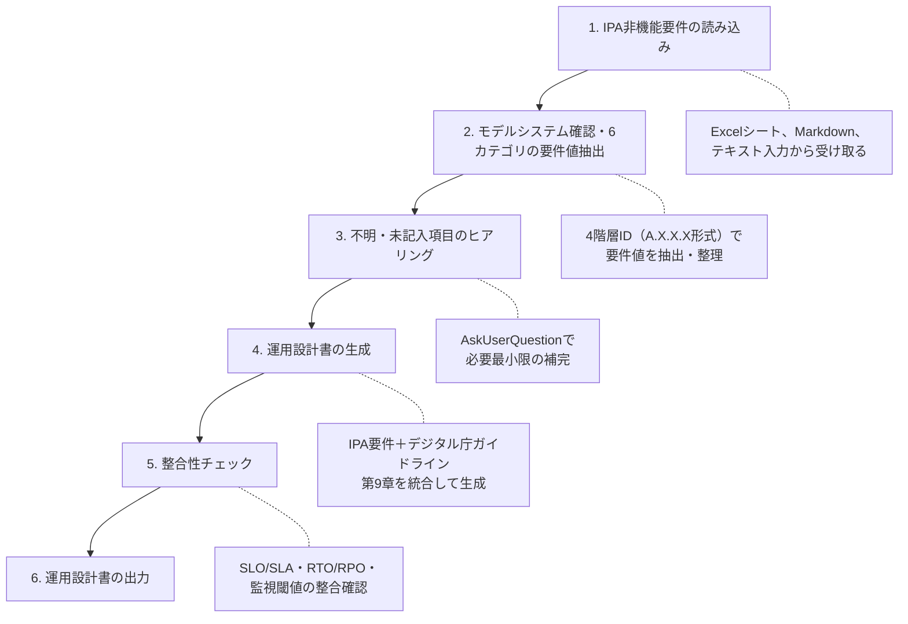

# IPA非機能要求グレード準拠 運用設計書生成スキル

IPA（独立行政法人情報処理推進機構）の「非機能要求グレード2018」に基づく非機能要件定義書から、運用設計書を自動生成します。デジタル庁「デジタル・ガバメント推進標準ガイドライン」第9章（運用）への準拠も組み込みます。

## 概要

このスキルは以下の機能を提供します:

- IPA非機能要求グレード2018（6カテゴリ、238項目）の要件値読み取り・解析
- 各カテゴリから運用設計項目へのマッピング（references/ipa_nfr_mapping_ja.md 参照）
- 不明・未記入項目のヒアリング（AskUserQuestionツール使用）
- 運用設計書の生成（assets/templates/operations_design_ipa_ja.md ベース）
- デジタル庁ガイドライン第9章（運用計画書・運用実施要領・主な運用作業）の要件を統合

## 入力・出力・責務

### 入力（Inputs）

| 入力 | 必須/任意 | 説明 |
|------|----------|------|
| IPA非機能要件ドキュメント | 必須 | 記入済みの非機能要求グレードシート（ファイルパスまたはテキスト） |
| モデルシステム分類 | 必須 | 社会的影響度（「殆ど無い」「限定される」「極めて大きい」） |
| システム名 | 必須 | 対象システム・サービスの名称 |
| 出力先パス | 任意 | 運用設計書の保存先（未指定時はカレントディレクトリ） |

### 出力（Outputs）

| 出力 | 形式 | 説明 |
|------|------|------|
| 運用設計書 | Markdown | IPA非機能要求グレード2018・デジタル庁ガイドライン準拠の運用設計書 |

### 責務

**このスキルが行うこと**:
- IPA非機能要件の6カテゴリを読み取り、運用設計項目に変換
- 必須の空欄・不明項目のみをヒアリングし、記入済み項目は確認なしで使用（重要/任意項目は[要確認]として出力）
- デジタル庁ガイドライン第9章の運用作業一覧（21項目）を運用設計に反映
- テンプレートに基づいた運用設計書の生成

**このスキルが行わないこと**:
- 非機能要件の定義・策定
- 業界トレンド調査
- システム構成・アーキテクチャの設計

## IPA非機能要求グレード2018の6カテゴリ

このスキルは以下の6カテゴリを処理します:

| カテゴリ | 記号 | 主な要件項目（4階層ID例） | 対応する運用設計セクション |
|---------|------|--------------------------|--------------------------|
| 可用性 | A | A.1.3.2 RTO, A.1.3.1 RPO, A.2.1.1 稼働率 | SLO/SLA定義、障害対応、BCP |
| 性能・拡張性 | B | B.1.2.1 応答時間, B.1.2.3 同時接続数, B.4.1.2 HW専有 | キャパシティ管理、監視 |
| 運用・保守性 | C | C.1.2.5 バックアップ間隔, C.1.3.1-C.1.3.9 監視 | 定常運用、バックアップ、変更管理 |
| 移行性 | D | D.1.1.1 移行期限, D.3.2.1 切戻し | 運用移管計画 |
| セキュリティ | E | E.1.1.1 認証, E.11.1.1 CSIRT | セキュリティ運用 |
| システム環境・エコロジー | F | F.1.1.1 稼働環境, F.2.2.1 廃棄管理 | インフラ運用基準 |

## 3つのモデルシステムと稼働率レベル

IPA非機能要求グレード2018はシステムの社会的影響度に応じて3つのモデルを定義します。

### モデルシステム分類

| モデル | 社会的影響度 | 適用例 |
|--------|------------|--------|
| モデルシステム1 | 社会的影響が殆ど無いシステム | 社内限定ツール、部門内業務システム |
| モデルシステム2 | 社会的影響が限定されるシステム | 企業間取引システム、中規模業務システム |
| モデルシステム3 | 社会的影響が極めて大きいシステム | 公共インフラ、金融基幹システム、行政サービス |

### 稼働率レベル定義（A.2.1.1）

| レベル | 稼働率 | 月間ダウンタイム上限 | 年間ダウンタイム上限 | 適用モデル目安 |
|--------|--------|-------------------|-------------------|--------------|
| L0 | 95%未満 | — | — | モデルシステム1 |
| L1 | 95% | 約36時間 | 約438時間 | モデルシステム1 |
| L2 | 99% | 約7時間18分 | 約87時間36分 | モデルシステム2 |
| L3 | 99.9% | 約43分48秒 | 約8時間45分 | モデルシステム2 |
| L4 | 99.99% | 約4分22秒 | 約52分36秒 | モデルシステム3 |
| L5 | 99.999% | 約26秒 | 約5分15秒 | モデルシステム3 |

### RTO・RPOのレベル別推奨値

| レベル | RTO（A.1.3.2） | RPO（A.1.3.1） | RLO（A.1.3.3） |
|--------|---------------|---------------|---------------|
| L0 | 72時間超 | 24時間超 | — |
| L1 | 72時間以内 | 24時間以内 | データ消失許容 |
| L2 | 24時間以内 | 8時間以内 | 業務再開可能 |
| L3 | 4時間以内 | 1時間以内 | 主要機能継続 |
| L4 | 1時間以内 | 15分以内 | 全機能継続 |
| L5 | 15分以内 | 5分以内 | 無停止継続 |

## Excel形式（活用シート）の扱い

IPA非機能要求グレード2018の公式形式はExcelシート（活用シート）です。

**Excelシートが提供された場合の処理方針**:

```text
1. ファイルパスを確認し、Readツールでファイルを読み込む試みる
2. Excelファイルが直接読めない場合（フォールバック優先順）:
   - まず「稼働率・RTO・RPO・サービス稼働時間・認証方式等の主要10項目のみ口頭で伝える」を依頼
     → 未伝達の項目はIPAモデルシステム推奨値を使い `[要確認]` 付きで出力
   - 全項目が必要な場合のみ「テキスト/CSV/Markdownに変換して貼り付け」を依頼
3. テキスト形式で受け取った場合: 項目IDと値を対応付けて解析
4. グレード番号（L0-L5）が記入されている場合: 上表の値に変換して使用
```

**重複項目（○マーク）の処理規則**:

重複項目の一覧と優先ルールの詳細は `references/ipa_nfr_mapping_ja.md` の「重複項目（○マーク）の処理規則」セクションを参照。

```text
重複項目で値が矛盾する場合:
→ ユーザーに確認: 「A.1.1.1（可用性カテゴリ）とC.1.1.1（運用保守性カテゴリ）の値が
  異なります。どちらが正しいですか？」
  確認が取れるまで当該項目を [要確認] として保留する。
```

## ワークフロー



## 詳細な実行手順

### ステップ1: IPA非機能要件の読み込み

```text
スキル: IPA非機能要求グレード準拠の運用設計書を生成します。

まず、以下を確認します:
1. モデルシステム分類（社会的影響度）
2. 非機能要件ドキュメントの場所
```

**入力形式に応じた処理**:

- **Excelシートのパスが指定された場合**: Readツールで読み込みを試みる。読めない場合は、まず主要10項目の口頭取得を依頼し、全項目が必要な場合のみテキスト/CSV/Markdown変換を依頼（詳細は「Excel形式（活用シート）の扱い」セクション参照）
- **Markdown/テキストが提供された場合**: 4階層ID（A.X.X.X形式）を基に解析
- **口頭で要件を伝えられた場合**: 項目名からIDに対応させて解析

**モデルシステムが未指定の場合**:

```text
スキル: （AskUserQuestionツールを使用）
        対象システムの社会的影響度を教えてください。

        A) モデルシステム1: 社会的影響が殆ど無いシステム（社内ツール等）
        B) モデルシステム2: 社会的影響が限定されるシステム（中規模業務システム等）
        C) モデルシステム3: 社会的影響が極めて大きいシステム（公共インフラ・行政等）
```

**SLAの要否確認（Step1で必ず確認）**:

```text
スキル: （AskUserQuestionツールを使用）
        SLAを外部に対して正式合意として定めますか？

        A) はい（外部顧客・利害関係者との正式なSLAを定める）
           → §3.1にSLO/SLA双方を定義し、付録CにSLA用語を含めます
        B) いいえ、内部SLOのみ（外部SLAは設けない）
           → §3.1はSLO定義のみとし、付録CのSLA用語は除外します
        C) 未定（プロジェクトで後日決定）
           → SLOのみ定義し、SLAは `[要確認: SLA設定の要否が未定]` として出力します
```

### ステップ2: 6カテゴリの要件値抽出

読み込んだドキュメントから、各カテゴリの要件値を4階層IDで抽出・整理します。

**抽出対象（詳細は references/ipa_nfr_mapping_ja.md 参照）**:

#### A. 可用性

```text
抽出項目（IPA 4階層ID）:
- A.1.1.1  通常時のサービス継続性（連続稼働時間）  ← C.1.1.1と重複
- A.1.1.2  業務継続性（システム継続稼働要件）
- A.1.1.3  障害時のサービス継続性（縮退継続）      ← C.2.1.1と重複
- A.1.2.1  サービス稼働時間（運用スケジュール）
- A.1.2.2  サービス切替え時間（フェイルオーバー時間）
- A.1.2.3  業務継続レベル（縮退時の業務継続率）
- A.1.3.1  目標復旧時点（RPO）
- A.1.3.2  目標復旧時間（RTO）
- A.1.3.3  目標復旧レベル（RLO）
- A.2.1.1  稼働率（L0-L5のレベル値）
- A.2.2.1  計画停止の可否
- A.2.2.2  計画停止の許容時間
- A.2.3.1  縮退稼働の可否
- A.2.3.2  縮退稼働のレベル
- A.2.5.3  機器更改計画（2018追加）
- A.2.6.1  ヘルプデスク要件                        ← C.1.2.7と重複
- A.2.6.2  ドキュメント整備要件                    ← C.1.2.1と重複
- A.3.3.1  BCP方針（事業継続計画）
- A.4.1.1  計画停止要件                            ← C.3.1.1と重複
```

#### B. 性能・拡張性

```text
抽出項目:
- B.1.1.1  通常時の業務量（リクエスト数）
- B.1.1.2  ピーク時の業務量
- B.1.2.1  通常時応答時間
- B.1.2.2  ピーク時応答時間
- B.1.2.3  同時接続数（通常時/ピーク時）
- B.2.1.1  スループット目標
- B.2.2.1  データ容量（現在/将来）
- B.3.1.1  スケールアップ/スケールアウト方式
- B.3.2.1  ピーク時対応方針
- B.4.1.1  リソース共有方式
- B.4.1.2  HWリソース専有要否（2018追加）
```

#### C. 運用・保守性

```text
抽出項目:
- C.1.1.1  サービス提供時間                        ← A.1.1.1と重複
- C.1.1.2  運用・監視時間帯
- C.1.2.1  ドキュメント管理要件                    ← A.2.6.2と重複
- C.1.2.5  バックアップ取得間隔
- C.1.2.7  ヘルプデスク要件                        ← A.2.6.1と重複
- C.1.3.1  ジョブ監視方式
- C.1.3.2  死活監視方式
- C.1.3.3  性能・負荷監視方式
- C.1.3.4  リソース監視方式
- C.1.3.5  障害監視方式
- C.1.3.6  ログ監視方式
- C.1.3.7  セキュリティ監視方式
- C.1.3.8  クラウド構成監視方式
- C.1.3.9  外形監視方式
- C.2.1.1  フォールバック時の継続性                ← A.1.1.3と重複
- C.2.1.2  バックアップ世代数・保管期間
- C.2.1.3  バックアップ保管場所
- C.2.1.4  リストア確認要件
- C.3.1.1  計画停止要件                            ← A.4.1.1と重複
- C.3.2.1  ジョブネット定義
- C.3.2.2  ジョブエラー対応
- C.3.2.3  リラン方針
- C.4.1.1  パッチ適用方針
- C.4.1.2  パッチ適用窓
- C.4.1.3  パッチ適用後テスト範囲
- C.5.1.1  ログ取得粒度
- C.5.1.2  ログ保管期間
- C.5.1.3  ログ分析要件
- C.6.1.1  インシデント管理プロセス
- C.6.2.1  問題管理プロセス
- C.6.3.1  変更管理プロセス
- C.6.4.1  リリース管理プロセス
- C.6.5.1  構成管理プロセス
- C.6.6.1  キャパシティ管理プロセス
- C.6.7.1  サービスレベル管理プロセス
```

#### D. 移行性

```text
抽出項目:
- D.1.1.1  移行期限
- D.1.1.2  移行方式（ビッグバン/段階的）
- D.1.1.3  移行中の許容停止時間
- D.2.1.1  移行対象データ量・種類
- D.2.1.2  データクレンジング要否
- D.3.1.1  並行稼働期間・方式
- D.3.2.1  切戻し手順
```

#### E. セキュリティ

```text
抽出項目:
- E.1.1.1  認証方式（パスワード/MFA/SSO、GDPR対応含む）
- E.1.1.2  多要素認証（MFA）要否
- E.1.1.3  認可方式（RBAC等）
- E.1.1.4  アクセスログ取得要件
- E.2.1.1  通信暗号化（TLS版等）
- E.2.1.2  保存データ暗号化
- E.3.1.1  脆弱性診断の頻度・種別
- E.3.1.2  ペネトレーションテスト要否
- E.4.1.1  監査ログ取得要件
- E.4.1.2  監査ログ保管期間・改ざん防止
- E.5.1.1  適用法規制・認証（個人情報保護法、GDPR、PCI DSS等）
- E.11.1.1 CSIRTセキュリティインシデント対応体制（2018追加）
```

#### F. システム環境・エコロジー

```text
抽出項目:
- F.1.1.1  稼働環境（データセンター/クラウド）
- F.1.1.2  電源・ネットワーク冗長化
- F.2.1.1  省エネ目標（PUE等）
- F.2.2.1  ハードウェア廃棄・リサイクル方針
```

**抽出結果の整理**:

```text
スキル: 非機能要件から以下の値を抽出しました。

【可用性（A）】
- モデルシステム: [モデルシステム1/2/3]
- 稼働率(A.2.1.1): [レベル][値]%（例: L3 = 99.9%）
- RTO(A.1.3.2): [抽出値]
- RPO(A.1.3.1): [抽出値]
- RLO(A.1.3.3): [抽出値 or 未定義]
- サービス稼働時間(A.1.2.1): [抽出値]
- サービス切替え時間(A.1.2.2): [抽出値]
- 業務継続レベル(A.1.2.3): [抽出値]

【性能・拡張性（B）】
- 応答時間(B.1.2.1): [抽出値]
- 同時接続数(B.1.2.3): [抽出値]
- HWリソース専有(B.4.1.2): [抽出値]

【運用・保守性（C）】
- 監視時間帯(C.1.1.2): [抽出値]
- バックアップ間隔(C.1.2.5): [抽出値]
- 監視方式(C.1.3.1-9): [抽出値]
- ログ保管期間(C.5.1.2): [抽出値]
- ITIL管理プロセス(C.6.x): [抽出値]

【移行性（D）】
- 移行期限(D.1.1.1): [抽出値]

【セキュリティ（E）】
- 認証方式(E.1.1.1): [抽出値]
- CSIRT体制(E.11.1.1): [抽出値 or 未定義]

【システム環境（F）】
- 稼働環境(F.1.1.1): [抽出値]

重複項目の整合確認: [矛盾あり/なし]
不明または未記入の項目: [リスト]
```

### ステップ3: 不明・未記入項目のヒアリング

未記入・不明な項目がある場合のみヒアリングします。

**【重要】記入済みの要件値は確認なしで使用すること。ヒアリングは必要最小限に留める。**

```text
スキル: （AskUserQuestionツールを使用）
        以下の項目が非機能要件に記載されていませんでした。
        運用設計書に反映するために確認させてください。

        Q1: 監視ツールのカテゴリを教えてください（具体的なツール名があれば括弧内に記入）
        A) オープンソース系（Prometheus/Grafana 等）
        B) SaaS型（クラウドベンダー提供以外の監視SaaS）
        C) クラウドネイティブ（クラウドベンダー標準の監視機能）
        D) オンプレ自前構築
        E) 未定

        Q2: インシデント通知の方式を教えてください
        A) チャットツール連携（ツール名: ______）
        B) メールのみ
        C) 電話・オンコールシステム
        D) 未定

        [未記入項目の数に応じて追加]
```

**ヒアリング対象の優先順位**:

1. **必須（ヒアリングなしでは生成不可）**:
   - モデルシステム分類（未指定の場合）
   - サービス稼働時間（A.1.2.1 が未記入の場合）
   - 稼働率（A.2.1.1 が未記入の場合）

2. **重要（品質向上のため確認）**:
   - 監視ツール（C.1.3.x が未記入の場合）
   - インシデント通知方式

3. **任意（未定の場合は[要確認]として出力）**:
   - 移行スケジュールの詳細
   - CSIRT体制の詳細（E.11.1.1 が未記入の場合）

### ステップ4: 運用設計書の生成

`assets/templates/operations_design_ipa_ja.md` を Readツールで読み込み、抽出した要件値を埋め込んで運用設計書を生成します。

**生成ルール**:

| 状況 | 処理 |
|------|------|
| 要件値が明示されている | その値をそのまま使用 |
| グレードレベル（L0-L5）で指定されている | 上記変換表の具体的な値を記載し、根拠（IPA要件ID・レベル）を注記 |
| 未記入でヒアリング回答あり | ヒアリング回答を使用 |
| 未記入かつ未定 | `` `[要確認: 非機能要件X.X.X.Xが未定義]` `` と記載 |

**デジタル庁ガイドライン要件の統合**:

生成時に以下のデジタル庁要件を運用設計書に組み込む:

| デジタル庁要件 | 反映先セクション |
|--------------|----------------|
| 運用計画書（作業概要・体制・スケジュール・成果物・形態・SL） | §4 運用体制 |
| 9種監視（ジョブ・死活・性能・稼働状況・セキュリティ・防犯・データ処理・バックアップ・障害復旧） | §5 監視 |
| 問題管理・変更管理・リリース管理（台帳含む） | §8 変更管理 |
| 大規模災害等対応訓練（年1回）・情報漏洩対応訓練（年1回） | §10 BCP/DR |
| 運用改善プロセス・KPI計測 | §9 定常運用 |
| CSIRT体制・セキュリティインシデント対応訓練 | §13 セキュリティ運用 |
| アカウント管理（払出・削除・棚卸） | §13 セキュリティ運用 |

```text
スキル: 非機能要件から運用設計書を生成しています...

[1/6] A（可用性）→ SLO/SLA・障害対応・BCP/DRセクション
[2/6] B（性能・拡張性）→ キャパシティ管理・監視セクション
[3/6] C（運用・保守性）→ 定常運用・バックアップ・変更管理セクション
      C.1.3.1-C.1.3.9（9種監視）→ §5 監視
      C.6.1.1-C.6.7.1（ITILプロセス）→ §8 変更管理
[4/6] D（移行性）→ 運用移管計画セクション
[5/6] E（セキュリティ）→ セキュリティ運用セクション
      E.11.1.1（CSIRT）→ §13 セキュリティ運用
[6/6] F（システム環境）→ インフラ運用基準セクション

＋ デジタル庁ガイドライン第9章 → 全セクションに統合

生成完了: [出力ファイルパス]
```

### ステップ5: 整合性チェック

生成した運用設計書の整合性を自動チェックします。

**チェック項目**:

```text
✅ 稼働率とRTO/RPOの整合（IPA レベル対応表に基づく）
   → L3（99.9%）の場合、RTO=4時間以内、RPO=1時間以内であることを確認

✅ バックアップ取得間隔（C.1.2.5）とRPO（A.1.3.1）の整合
   → バックアップ間隔 ≤ RPO であることを確認

✅ 監視インターバルとRTO（A.1.3.2）の整合
   → （監視間隔 + §6.2「一次確認・重大度判定」の所要時間）≤ RTO となることを確認
   → 目安として監視間隔はRTOの1/10以下から設計し、インシデント対応フロー（§6.2）の
      一次確認時間との合算でRTOを超過しないか検証する

✅ オンコール体制とサービス稼働時間（A.1.2.1）の整合
   → 24時間365日稼働の場合、オンコール体制が定義されていることを確認

✅ パッチ適用窓（C.4.1.2）と計画停止（A.4.1.1/C.3.1.1）の整合
   → 計画停止許容の場合、パッチ適用窓が設定されていることを確認

✅ CSIRT体制（E.11.1.1）とセキュリティ監視（C.1.3.7）の整合
   → CSIRT体制が定義されている場合、監視・通知フローが整合していることを確認

✅ 重複項目（○マーク）の値一致確認
   → A.1.1.1＝C.1.1.1、A.4.1.1＝C.3.1.1 等の値が一致していることを確認
```

**問題が検出された場合**:

```text
スキル: 整合性チェックで以下の問題が検出されました。

⚠️ 問題1: RPO（A.1.3.1）とバックアップ間隔（C.1.2.5）の不整合
   - RPO要件(A.1.3.1): 1時間以内
   - バックアップ間隔(C.1.2.5): 日次（24時間毎）
   - 影響: 最大23時間のデータ損失が発生する可能性があります

   対応案:
   A) バックアップ間隔を1時間以内に変更する
   B) RPO要件を「24時間以内」に修正する
   C) そのまま出力し、[要調整]注記を付ける

どの対応を希望しますか？
```

### ステップ6: 運用設計書の出力

整合性チェック後、運用設計書を出力します。

```text
スキル: 運用設計書を生成しました。

【生成ファイル】
- ファイル: [システム名]-operations-design-[YYYY-MM-DD].md
- セクション数: [N]セクション
- [要確認]マーカー: [N]箇所（非機能要件が未定義の項目）
- デジタル庁ガイドライン準拠: 第9章（運用）統合済み

【サマリー】
- モデルシステム: [分類]
- 稼働率目標(A.2.1.1): [レベル][値]%
- RTO(A.1.3.2): [値] / RPO(A.1.3.1): [値] / RLO(A.1.3.3): [値]
- 監視体制(C.1.3.x): [採用する監視種別]
- バックアップ(C.1.2.5): [値]
- CSIRT体制(E.11.1.1): [あり/なし/要確認]
- セキュリティ: [主要設定]
```

**[要確認]マーカー一覧付録の生成**:

[要確認]マーカーが1件以上ある場合は、運用設計書の末尾に付録D（未確認事項一覧）を必ず生成すること:

```text
### 付録D: 未確認事項一覧（[要確認]マーカー集計）

後工程のレビューで確認漏れを防ぐため、本書中の[要確認]項目を集約しています。

| # | 箇所（セクション） | IPA要件ID | 内容 | 確認担当 | 確認期限 |
|---|-----------------|----------|------|---------|---------|
| 1 | §X.X [セクション名] | X.X.X.X | [未定義の内容] | [担当者] | [YYYY-MM-DD] |

※ 確認完了後は本表から削除し、対象箇所の[要確認]マーカーを実際の値に更新してください。
```

**SLA条件付き出力**:

```text
Step1でSLA要否の確認を実施済みの場合:

SLA「あり」の場合:
→ 付録C（用語集）にSLA定義を含める
→ §3.1見出しを「稼働率目標（SLO/SLA）」とし、SLO・SLA双方の値を記載

SLA「なし」の場合:
→ 付録C（用語集）からSLA用語を除外する
→ §3.1見出しを「稼働率目標（SLO）」とし、SLOのみ記載

SLA「未定」の場合:
→ §3.1はSLOのみ記載し、SLAは `[要確認: SLA設定の要否が未定]` として追記
→ 付録C（用語集）のSLA行はそのまま残し、`[要確認]` を維持する（削除しない）
```

## 制約事項

### 実施しないこと

1. **要件値の変更**: 明示された非機能要件の値は変更しない（整合性問題がある場合はユーザーに確認）
2. **推測による補完**: 未記入項目を推測で埋めない（`[要確認: 非機能要件X.X.X.Xが未定義]` として出力）
3. **業界調査**: 業界トレンドの調査は行わない（operations-designスキルを使用すること）

### 情報不足時の対応

```text
必須項目（モデルシステム分類・稼働率・稼働時間）が未記入の場合:
→ ヒアリングを実施（スキップ不可）

重要項目（RTO・RPO・バックアップ間隔）が未記入の場合:
→ `[要確認: 非機能要件X.X.X.Xが未定義]` として出力し、後で補完できるようにする

任意項目（移行スケジュール詳細・CSIRT詳細等）が未記入の場合:
→ `[要確認: 非機能要件X.X.X.Xが未定義]` として出力し、値は補完しない
```

## リソース

### references/
- `ipa_nfr_mapping_ja.md`: IPA非機能要求グレード2018の6カテゴリ → 運用設計項目 詳細マッピング表（4階層ID対応）

### assets/templates/
- `operations_design_ipa_ja.md`: IPA非機能要求グレード2018・デジタル庁ガイドライン準拠の運用設計書テンプレート

## 準拠規格

- **IPA 非機能要求グレード 2018**（独立行政法人情報処理推進機構）
- **デジタル・ガバメント推進標準ガイドライン** 第9章（デジタル庁）
