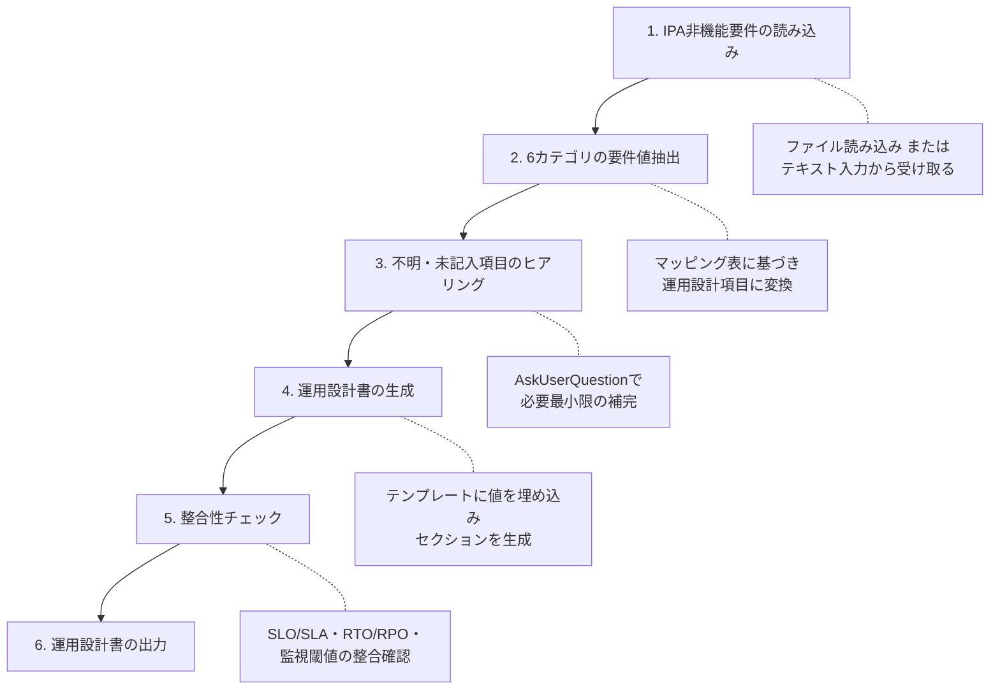

# IPA非機能要求グレード準拠 運用設計書生成スキル

IPA（独立行政法人情報処理推進機構）の「非機能要求グレード2018」に基づく非機能要件定義書から、運用設計書を自動生成します。

## 概要

このスキルは以下の機能を提供します:

- IPA非機能要求グレード（6カテゴリ）の要件値読み取り・解析
- 各カテゴリから運用設計項目へのマッピング（references/ipa_nfr_mapping_ja.md 参照）
- 不明・未記入項目のヒアリング（AskUserQuestionツール使用）
- 運用設計書の生成（assets/templates/operations_design_ipa_ja.md ベース）

## 入力・出力・責務

### 入力（Inputs）

| 入力 | 必須/任意 | 説明 |
|------|----------|------|
| IPA非機能要件ドキュメント | 必須 | 記入済みの非機能要求グレードシート（ファイルパスまたはテキスト） |
| システム名 | 必須 | 対象システム・サービスの名称 |
| 出力先パス | 任意 | 運用設計書の保存先（未指定時はカレントディレクトリ） |

### 出力（Outputs）

| 出力 | 形式 | 説明 |
|------|------|------|
| 運用設計書 | Markdown | IPA非機能要求グレード準拠の運用設計書 |

### 責務

**このスキルが行うこと**:
- IPA非機能要件の6カテゴリを読み取り、運用設計項目に変換
- 空欄・不明項目のみをヒアリング（記入済み項目は確認なしで使用）
- テンプレートに基づいた運用設計書の生成

**このスキルが行わないこと**:
- 非機能要件の定義・策定
- 業界トレンド調査
- システム構成・アーキテクチャの設計

## IPA非機能要求グレードの6カテゴリ

このスキルは以下の6カテゴリを処理します:

| カテゴリ | 記号 | 主な要件項目 | 対応する運用設計セクション |
|---------|------|-------------|--------------------------|
| 可用性 | A | 稼働時間、稼働率(SLA)、RTO/RPO、縮退運転 | SLO/SLA定義、障害対応、BCP |
| 性能・拡張性 | B | 応答時間、スループット、同時接続数、スケーリング | キャパシティ管理、監視、オートスケーリング |
| 運用・保守性 | C | 運用時間、バックアップ、ジョブ管理、パッチ適用、ログ管理 | 定常運用作業、バックアップ計画、変更管理 |
| 移行性 | D | 移行スケジュール、データ移行、並行稼働、切戻し | 運用移管計画 |
| セキュリティ | E | 認証、認可、暗号化、脆弱性対応、監査ログ | セキュリティ運用 |
| システム環境・エコロジー | F | 環境条件、省エネ目標、法規制対応 | インフラ運用基準 |

## ワークフロー



## 詳細な実行手順

### ステップ1: IPA非機能要件の読み込み

```text
スキル: IPA非機能要求グレード準拠の運用設計書を生成します。

まず、非機能要件ドキュメントの場所を確認します。
```

**入力形式に応じた処理**:

- **ファイルパスが指定された場合**: Readツールでファイルを読み込む
- **テキストが貼り付けられた場合**: そのまま解析する
- **IPA公式Excelシートが言及された場合**: ファイルパスを確認してReadツールで読み込む

**ファイルが見つからない場合**:

```text
スキル: （AskUserQuestionツールを使用）
        非機能要件ドキュメントが見つかりませんでした。

        以下のいずれかで提供していただけますか？
        A) ファイルパスを指定（例: /path/to/nfr.md）
        B) 内容をこのチャットに貼り付ける
        C) IPA非機能要求グレードの代わりに、口頭で主要な要件を教える
```

### ステップ2: 6カテゴリの要件値抽出

読み込んだドキュメントから、各カテゴリの要件値を抽出・整理します。

**抽出対象（詳細は references/ipa_nfr_mapping_ja.md 参照）**:

#### A. 可用性
```text
抽出項目:
- A.1.1 連続稼働時間（例: 24時間365日、平日9-18時）
- A.1.2 稼働率目標（例: 99.9%、99.95%、99.99%）
- A.2.1 RTO（目標復旧時間）
- A.2.2 RPO（目標復旧時点）
- A.3.1 縮退運転の可否・方式
- A.4.1 計画停止の可否・頻度・許容時間
```

#### B. 性能・拡張性
```text
抽出項目:
- B.1.1 通常時応答時間（例: 3秒以内）
- B.1.2 ピーク時応答時間
- B.2.1 同時ユーザー数（通常時/ピーク時）
- B.3.1 データ容量（現在/3年後）
- B.4.1 スケーリング方式（手動/自動）
```

#### C. 運用・保守性
```text
抽出項目:
- C.1.1 運用時間（監視・対応体制の時間帯）
- C.2.1 バックアップ取得頻度（日次/週次等）
- C.2.2 バックアップ保管期間・世代数
- C.2.3 バックアップ保管場所（オフサイト要否）
- C.3.1 ジョブ管理方式・エラー時対応
- C.4.1 パッチ適用方針・適用窓
- C.5.1 ログ取得粒度・保管期間
- C.6.1 リモート保守の可否
```

#### D. 移行性
```text
抽出項目:
- D.1.1 移行スケジュール・移行完了期限
- D.2.1 移行対象データ量・形式
- D.3.1 並行稼働期間・方式
- D.4.1 切戻し方針・手順
```

#### E. セキュリティ
```text
抽出項目:
- E.1.1 認証方式（パスワード/MFA/SSO）
- E.2.1 認可方式（RBAC/ABAC）
- E.3.1 通信暗号化要件（TLS版等）
- E.4.1 保存データ暗号化要件
- E.5.1 脆弱性診断の頻度・種別
- E.6.1 監査ログ取得要件・保管期間
- E.7.1 コンプライアンス要件（GDPR等）
```

#### F. システム環境・エコロジー
```text
抽出項目:
- F.1.1 稼働環境（データセンター/クラウド/温度・湿度条件）
- F.2.1 省エネ目標（PUE等）
- F.3.1 法規制・環境基準
```

**抽出結果の整理**:

```text
スキル: 非機能要件から以下の値を抽出しました。

【可用性】
- 稼働時間: [抽出値]
- 稼働率(SLA): [抽出値]
- RTO: [抽出値]
- RPO: [抽出値]

【性能・拡張性】
- 応答時間: [抽出値]
- 同時ユーザー数: [抽出値]

【運用・保守性】
- 監視・対応時間: [抽出値]
- バックアップ: [抽出値]
...

不明または未記入の項目: [リスト]
```

### ステップ3: 不明・未記入項目のヒアリング

未記入・不明な項目がある場合のみヒアリングします。

**【重要】記入済みの要件値は確認なしで使用すること。ヒアリングは必要最小限に留める。**

```text
スキル: （AskUserQuestionツールを使用）
        以下の項目が非機能要件に記載されていませんでした。
        運用設計書に反映するために確認させてください。

        Q1: 監視ツールは何を使用しますか？
        A) Prometheus + Grafana
        B) Datadog
        C) CloudWatch（AWS）
        D) その他（具体的に）
        E) 未定

        Q2: インシデント通知先（チャット等）はありますか？
        A) Slack
        B) Microsoft Teams
        C) PagerDuty
        D) メールのみ
        E) 未定

        [未記入項目の数に応じて追加]
```

**ヒアリング対象の優先順位**:

1. **必須（ヒアリングなしでは生成不可）**:
   - 稼働時間（A.1.1が未記入の場合）
   - 稼働率目標（A.1.2が未記入の場合）

2. **重要（品質向上のため確認）**:
   - 監視ツール（C.1.x が未記入の場合）
   - インシデント通知方式

3. **任意（未定の場合は[要確認]として出力）**:
   - 移行スケジュールの詳細
   - コスト予算

### ステップ4: 運用設計書の生成

`assets/templates/operations_design_ipa_ja.md` を Readツールで読み込み、抽出した要件値を埋め込んで運用設計書を生成します。

**生成ルール**:

| 状況 | 処理 |
|------|------|
| 要件値が明示されている | その値をそのまま使用 |
| 要件値が範囲・グレードで指定 | グレードに対応する具体的な推奨値を記載し、根拠を注記 |
| 未記入でヒアリング回答あり | ヒアリング回答を使用 |
| 未記入かつ未定 | `[要確認: 非機能要件C.X.Xが未定義]` と記載 |

**グレード→具体値の変換例**（IPA非機能要求グレード2018基準）:

| グレード | 稼働率 | RTO | RPO |
|---------|--------|-----|-----|
| 1（社会的影響が殆どない） | 99.0% | 72時間以内 | 24時間以内 |
| 2 | 99.5% | 24時間以内 | 8時間以内 |
| 3 | 99.9% | 4時間以内 | 1時間以内 |
| 4 | 99.95% | 1時間以内 | 15分以内 |
| 5（社会的影響が極めて大きい） | 99.99% | 15分以内 | 5分以内 |

```text
スキル: 非機能要件から運用設計書を生成しています...

[1/6] 可用性要件 → SLO/SLA・障害対応セクション
[2/6] 性能・拡張性要件 → キャパシティ管理・監視セクション
[3/6] 運用・保守性要件 → 定常運用・バックアップ・変更管理セクション
[4/6] 移行性要件 → 運用移管計画セクション
[5/6] セキュリティ要件 → セキュリティ運用セクション
[6/6] システム環境要件 → インフラ運用基準セクション

生成完了: [出力ファイルパス]
```

### ステップ5: 整合性チェック

生成した運用設計書の整合性を自動チェックします。

**チェック項目**:

```text
✅ SLO稼働率とRTO/RPOの整合
   → 稼働率99.99%の場合、RTOは15分以内であることを確認

✅ バックアップ取得間隔とRPOの整合
   → RPO=1時間の場合、バックアップは1時間以内の間隔であることを確認

✅ 監視間隔とRTOの整合
   → RTO=4時間の場合、監視インターバルは最大でもRTOの1/10（24分）以下を確認

✅ オンコール体制と稼働時間の整合
   → 24時間365日稼働の場合、オンコール体制が定義されていることを確認

✅ パッチ適用窓と計画停止の整合
   → 計画停止が許容されている場合、パッチ適用窓が設定されていることを確認
```

**問題が検出された場合**:

```text
スキル: 整合性チェックで以下の問題が検出されました。

⚠️ 問題1: RPOとバックアップ間隔の不整合
   - RPO要件: 1時間以内（非機能要件 A.2.2）
   - バックアップ間隔: 日次（非機能要件 C.2.1）
   - 影響: 最大23時間のデータ損失が発生する可能性があります

   対応案:
   A) バックアップ間隔を1時間以内に変更する
   B) RPO要件を「24時間以内」に修正する
   C) そのまま出力し、[要調整]注記を付ける

どの対応を希望しますか？
```

### ステップ6: 運用設計書の出力

整合性チェック後、運用設計書を出力します。

```text
スキル: 運用設計書を生成しました。

【生成ファイル】
- ファイル: [システム名]-operations-design-[YYYY-MM-DD].md
- セクション数: [N]セクション
- [要確認]マーカー: [N]箇所（非機能要件が未定義の項目）

【サマリー】
- 稼働率目標: [値]
- RTO: [値] / RPO: [値]
- 監視体制: [値]
- バックアップ: [値]
- セキュリティ: [主要設定]
```

## 制約事項

### 実施しないこと

1. **要件値の変更**: 明示された非機能要件の値は変更しない（整合性問題がある場合はユーザーに確認）
2. **推測による補完**: 未記入項目を推測で埋めない（`[要確認]`として出力する）
3. **業界調査**: 業界トレンドの調査は行わない（operations-designスキルを使用すること）

### 情報不足時の対応

```text
必須項目（稼働時間・稼働率）が未記入の場合:
→ ヒアリングを実施（スキップ不可）

重要項目が未記入の場合:
→ `[要確認: 非機能要件X.X.Xが未定義]` として出力し、後で補完できるようにする

任意項目が未記入の場合:
→ IPA非機能要求グレードの標準的なグレード3相当の値を参考値として記載し、
   「※非機能要件に記載なし。要確認」と注記する
```

## リソース

### references/
- `ipa_nfr_mapping_ja.md`: IPA非機能要求グレード6カテゴリ → 運用設計項目 詳細マッピング表

### assets/templates/
- `operations_design_ipa_ja.md`: IPA非機能要求グレード準拠の運用設計書テンプレート
