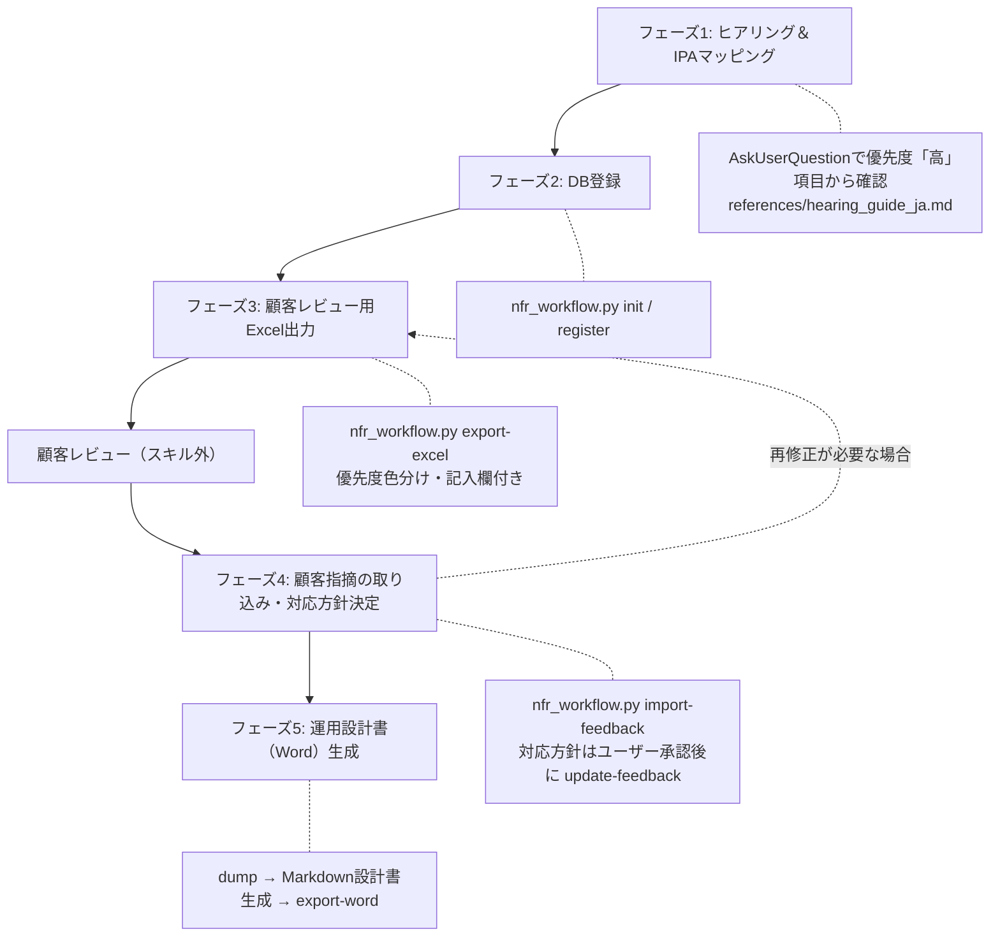

# IPA非機能要求グレード ワークフロースキル

ヒアリング → IPA非機能要求グレード2018マッピング → DB登録 → 顧客レビュー用Excel出力 → 顧客指摘の取り込み → 運用設計書（Word）生成、までの一連のワークフローを提供します。`operations-design`（ヒアリング手法）と `ipa-nfr-operations-design`（IPAマッピング・運用設計書生成）を統合し、顧客提示可能な成果物を作成します。

## 概要

このスキルは以下の機能を提供します:

- ユーザーヒアリング結果のIPA非機能要求グレード2018（6カテゴリ・88項目マスタ）へのマッピング
- マッピング結果のSQLite DBへの登録・管理（スクリプト: `scripts/nfr_workflow.py`）
- 顧客レビュー用Excelの出力（**後続作業への影響度に基づく優先度 高・中・低 の3段階提示**、色分け、顧客記入欄付き）
- 顧客が記入したExcelからの指摘取り込み（グレードでは表現できない「グレード外要求」も取り込み対象）
- 取り込んだDB内容に基づく運用設計書（Word / .docx）の生成

## 前提条件

スクリプトはPython 3と以下のライブラリを使用します。未インストールの場合は最初に導入してください:

```bash
pip install openpyxl python-docx
```

## 入力・出力・責務

### 入力（Inputs）

| 入力 | 必須/任意 | 説明 |
|------|----------|------|
| 対象システム名 | 必須 | 対象システム・サービスの名称 |
| モデルシステム分類 | 必須 | 社会的影響度（1: 殆ど無い / 2: 限定される / 3: 極めて大きい） |
| ヒアリング回答 | 必須 | AskUserQuestionによるヒアリング結果（既存資料があれば流用） |
| 顧客記入済みExcel | フェーズ4で必須 | 顧客が判定・コメントを記入したレビューシート |
| 出力先パス | 任意 | 成果物の保存先（未指定時はカレントディレクトリ） |

### 出力（Outputs）

| 出力 | 形式 | 説明 |
|------|------|------|
| 非機能要件DB | SQLite（.db） | 項目マスタ・選択結果・顧客指摘を管理する単一ファイルDB |
| 非機能要件確認シート | Excel（.xlsx） | 優先度3段階提示・顧客記入欄付きの顧客レビュー用シート |
| 運用設計書 | Word（.docx） | 顧客提示用の運用設計書（要件一覧・指摘対応表の付録付き） |

### 責務

**このスキルが行うこと**:
- ヒアリング回答をIPA 4階層ID（A.X.X.X形式）にマッピングして整理
- DB・Excel・Wordの生成をスクリプト経由で実行
- 顧客指摘への対応方針をユーザーと合意してからDB・設計書に反映（承認フロー）

**このスキルが行わないこと**:
- 推測による要件値の補完（不明項目は `[要確認]` として扱う）
- ユーザー承認なしでの顧客指摘の反映
- 業界トレンド調査（必要な場合はoperations-designを使用）

## ワークフロー



**【重要】1フェーズ1応答の原則**: 各フェーズが完了したら必ずユーザーに結果を報告して応答を返すこと。複数フェーズを連続実行しない。途中から再開する場合は `status` サブコマンドで現在の状態を確認してから該当フェーズを実行する。

## 詳細な実行手順

### フェーズ1: ヒアリング＆IPAマッピング

`references/hearing_guide_ja.md` をReadツールで読み込み、ガイドに従ってヒアリングを実施します。

1. **基本情報の確認**（AskUserQuestionツールを使用）
   - 対象システム名
   - モデルシステム分類（1/2/3）— 判断基準はhearing_guide参照
   - 既存資料の有無（記入済みの非機能要求グレードシート、要件定義書等があれば読み込んでマッピングに流用し、ヒアリングをスキップ）
2. **優先度「高」項目のヒアリング**（必須・32項目）
   - 稼働率・RTO/RPO・稼働時間・性能・認証・稼働環境など、後続作業への影響が大きい項目
   - モデルシステム分類に応じたIPA推奨値（L0-L5）を選択肢の推奨として提示する
3. **優先度「中」「低」項目のヒアリング**（時間に応じて）
   - ユーザーが「高のみで先に進めたい」場合は、中・低はIPAモデルシステム推奨値を `note` に「推奨値（要確認）」と明記して仮設定するか、未登録のままにする
4. **マッピング結果の提示**
   - ヒアリング回答を4階層IDに対応付けた一覧をユーザーに提示し、確認を得る

```text
[ipa-nfr-workflow] フェーズ1完了: ヒアリング済み N項目（高: N / 中: N / 低: N）
未確認の優先度「高」項目: [リスト or なし]
```

### フェーズ2: DB登録

1. **DB初期化**（初回のみ）:

```bash
python3 operations/ipa-nfr-workflow/scripts/nfr_workflow.py init \
  --db <出力先>/nfr.db --project "<システム名>" --model-system <1|2|3>
```

2. **マッピング結果のJSON作成**: フェーズ1の結果を以下の形式でWriteツールで作成する（形式の詳細は `references/db_schema_ja.md` 参照）:

```json
{"selections": [
  {"item_id": "A.2.1.1", "level": "L3", "value": "99.9%", "note": "モデルシステム2の推奨値"},
  {"item_id": "A.1.2.1", "level": "", "value": "24時間365日", "note": "計画停止を除く"}
]}
```

3. **登録と確認**:

```bash
python3 operations/ipa-nfr-workflow/scripts/nfr_workflow.py register --db <path>/nfr.db --input selections.json
python3 operations/ipa-nfr-workflow/scripts/nfr_workflow.py status --db <path>/nfr.db
```

registerの出力に「未登録の優先度『高』項目」が表示された場合は、その一覧をユーザーに報告し、追加ヒアリングするか未登録のままExcelに進むかを確認する。

### フェーズ3: 顧客レビュー用Excel出力

```bash
python3 operations/ipa-nfr-workflow/scripts/nfr_workflow.py export-excel \
  --db <path>/nfr.db --output <path>/<システム名>-非機能要件確認シート-<YYYYMMDD>.xlsx
```

出力されるExcelの構成（顧客がレビューしやすいよう優先度順に整列・色分け済み）:

| シート | 内容 |
|--------|------|
| 非機能要求グレード | 全項目を優先度（高→中→低）順に一覧化。選択レベル・値に加え、顧客記入欄（顧客判定: 承認/要修正/要協議/未確認 のプルダウン、顧客コメント）を持つ |
| グレード外要求 | 非機能要求グレードでは表現できない要望・指摘の自由記入欄（20行） |
| 記入ガイド | 優先度の意味（後続作業への影響度）と記入方法の説明 |

出力後、ファイルパスと「顧客レビュー後のExcelを受領したらフェーズ4に進む」ことをユーザーに伝えて応答を終了する。

### フェーズ4: 顧客指摘の取り込み・対応方針決定

1. **取り込み**（何度実行しても同一指摘は重複登録されない）:

```bash
python3 operations/ipa-nfr-workflow/scripts/nfr_workflow.py import-feedback --db <path>/nfr.db --input <顧客記入済み.xlsx>
python3 operations/ipa-nfr-workflow/scripts/nfr_workflow.py list-feedback --db <path>/nfr.db --status open
```

2. **対応方針の策定と承認（必須ゲート）**: 取り込んだ指摘を1件ずつユーザーに提示し、AskUserQuestionツールで対応方針を確認する。**ユーザー承認なしで対応方針を確定しない。**

```text
指摘 #1（A.1.3.2 RTO / 要修正）: 「RTOは2時間以内に短縮してほしい」
対応案:
A) 受け入れる（RTOを2時間以内に変更。バックアップ・DR設計への影響を備考に記録）
B) 代替案を提示する（現行構成のままではコスト増となるため協議）
C) 見送る（理由を記録して顧客に回答）
```

3. **承認された方針の反映**:

```bash
# 対応方針・状態の記録
python3 operations/ipa-nfr-workflow/scripts/nfr_workflow.py update-feedback \
  --db <path>/nfr.db --id 1 --response "<対応方針>" --status accepted
# 要件値の変更を伴う場合はselectionsも更新（registerで上書き）
python3 operations/ipa-nfr-workflow/scripts/nfr_workflow.py register --db <path>/nfr.db --input updated.json
```

statusの意味: `open`（未対応）/ `accepted`（受入・設計書へ反映予定）/ `rejected`(見送り・理由をresponseに記録) / `reflected`（設計書へ反映済み）。

要件値を変更した場合、再度フェーズ3を実行して更新版Excelを顧客に提示できる（顧客判定・指摘はDBに保持される）。

### フェーズ5: 運用設計書（Word）生成

1. **DB内容の確認**:

```bash
python3 operations/ipa-nfr-workflow/scripts/nfr_workflow.py dump --db <path>/nfr.db --format markdown
```

2. **運用設計書（Markdown）の生成**: `ipa-nfr-operations-design` スキルのテンプレート `operations/ipa-nfr-operations-design/assets/templates/operations_design_ipa_ja.md` とマッピング表 `operations/ipa-nfr-operations-design/references/ipa_nfr_mapping_ja.md` をReadツールで読み込み、dumpした要件値・顧客指摘（accepted/reflectedの対応方針を含む）を反映した運用設計書Markdownを作成する。
   - 生成ルール・整合性チェック（稼働率とRTO/RPO、バックアップ間隔とRPO等）は `ipa-nfr-operations-design` のSKILL.mdステップ4-5に従う
   - `accepted` の指摘は該当セクションに反映し、反映後に `update-feedback --status reflected` で状態を更新する
   - 未登録項目・未対応（open）の指摘は `[要確認]` として明記する

3. **Word変換**（表紙・優先度別の要件一覧付録・顧客指摘対応表付録が自動付与される）:

```bash
python3 operations/ipa-nfr-workflow/scripts/nfr_workflow.py export-word \
  --db <path>/nfr.db --design <設計書.md> --output <path>/<システム名>-運用設計書-<YYYYMMDD>.docx
```

```text
[ipa-nfr-workflow] フェーズ5完了: <出力パス>
付録: 非機能要件88項目（優先度別） / 顧客指摘N件（未対応N件）
```

## 優先度分類（高・中・低）について

Excelおよび運用設計書付録の優先度は、**後続の設計・構築作業への影響度**に基づき項目マスタ（`assets/master/ipa_nfr_items_ja.csv`）で事前分類済みです:

| 優先度 | 基準 | 例 |
|--------|------|-----|
| 高 | インフラ構成・アーキテクチャ・運用体制の根幹を決め、後戻りコストが大きい | 稼働率、RTO/RPO、稼働環境、認証方式 |
| 中 | 運用プロセス・手順の設計に影響するが、設計工程内で調整可能 | 計画停止、パッチ適用、ITILプロセス |
| 低 | 付加的・詳細レベルで、後工程での調整が容易 | ヘルプデスク、ドキュメント整備、省エネ目標 |

分類基準の詳細とプロジェクト固有の調整方法は `references/priority_classification_ja.md` を参照。

## 制約事項

1. **推測による補完の禁止**: ヒアリングで確認できなかった値を推測で登録しない。IPA推奨値を仮設定する場合は必ず `note` に「推奨値（要確認）」と明記する
2. **顧客指摘の無断反映の禁止**: 取り込んだ指摘は必ずユーザー承認を得てから対応方針を確定・反映する
3. **DBファイルが正**: 選択値・指摘の正データはDB。ExcelとWordはDBからの出力物であり、直接編集して正とすることはしない（顧客の記入は必ずimport-feedbackで取り込む）
4. **スクリプトエラー時のフォールバック**: openpyxl/python-docxが導入できない環境では、dumpのMarkdown出力を成果物として提示し、Excel/Word変換は環境の整った場所で実行するよう案内する

## リソース

### scripts/
- `nfr_workflow.py`: ワークフロー管理CLI。サブコマンド: `init` / `register` / `status` / `export-excel` / `import-feedback` / `list-feedback` / `update-feedback` / `dump` / `export-word`

### assets/master/
- `ipa_nfr_items_ja.csv`: IPA非機能要求グレード項目マスタ（88項目・優先度分類済み）

### references/
- `db_schema_ja.md`: DBスキーマとregister用JSON形式の定義
- `priority_classification_ja.md`: 優先度分類の基準と調整方法
- `hearing_guide_ja.md`: 優先度順ヒアリングガイド（質問セット）

### 関連スキル
- `operations/ipa-nfr-operations-design`: 運用設計書の生成ルール・テンプレート・マッピング表（フェーズ5で参照）
- `operations/operations-design`: 業界調査を含むコンサルティング型ヒアリング（必要に応じて併用）

## 準拠規格

- **IPA 非機能要求グレード 2018**（独立行政法人情報処理推進機構）
- **デジタル・ガバメント推進標準ガイドライン** 第9章（デジタル庁）
