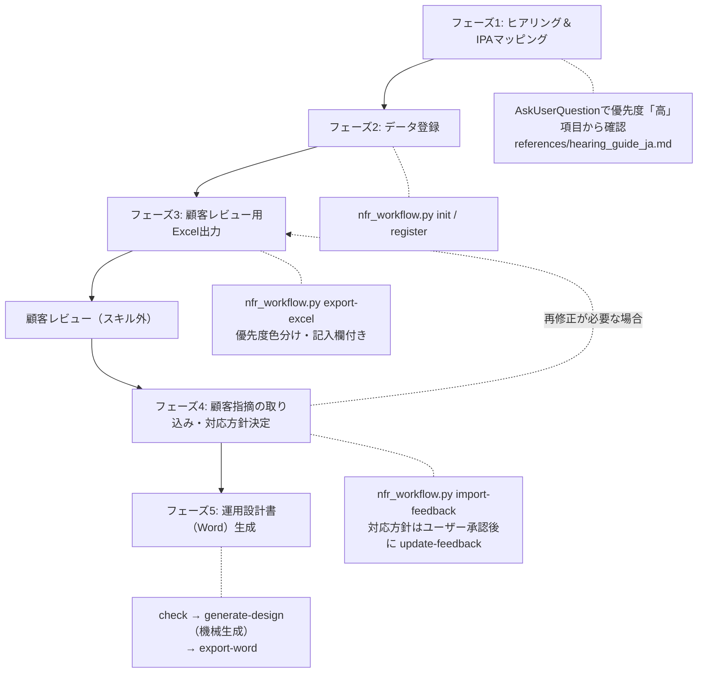

# IPA非機能要求グレード ワークフロースキル

ヒアリング → IPA非機能要求グレード2018マッピング → データ登録 → 顧客レビュー用Excel出力 → 顧客指摘の取り込み → 運用設計書（Word）生成、までの一連のワークフローを提供します。旧 `operations-design`（ヒアリング手法）と旧 `ipa-nfr-operations-design`（IPAマッピング・運用設計書生成）を置き換える後継スキルであり、顧客提示可能な成果物を作成します。

## 概要

このスキルは以下の機能を提供します:

- ユーザーヒアリング結果のIPA非機能要求グレード2018（6カテゴリ・88項目マスタ）へのマッピング
- マッピング結果の登録・管理（正データは人間可読なYAML。登録・検証はスクリプト `scripts/nfr_workflow.py` 経由）
- 顧客レビュー用Excelの出力（**後続作業への影響度に基づく優先度 高・中・低 の3段階提示**、色分け、顧客記入欄付き）
- 顧客が記入したExcelからの指摘取り込み（グレードでは表現できない「グレード外要求」も取り込み対象）
- 要件値の整合性の機械チェック（`check`）と、テンプレート代入による運用設計書の機械生成（`generate-design` → Word変換）

### 役割分担の設計方針（重要）

**AIはヒアリングと判断、ドキュメント生成と整合性チェックはスクリプトによる機械処理**という役割分担を厳守する。これによりトークンコストを削減し、データファイル（YAML）を単一の情報源としてドキュメント間の矛盾・記載漏れを排除する。

| 作業 | 担当 | 理由 |
|------|------|------|
| ヒアリング・IPAマッピング | AI（AskUserQuestion） | 対話的な引き出しと文脈理解が必要 |
| 顧客指摘への対応方針の判断 | AI＋ユーザー承認 | 業務判断が必要 |
| Excel/Word/設計書Markdownの生成 | スクリプト（機械処理） | データファイルから決定論的に生成し、矛盾・記載漏れ・転記ミスを排除 |
| 整合性チェック | スクリプト（`check` / 全コマンドのロード時検証） | 同一ルールを毎回確実に適用 |

**AIが設計書本文を直接記述・編集してはならない**。値の修正は必ずスクリプト（`register` / `update-feedback`）に対して行い、ドキュメントは再生成する。

### データ整合性の担保機構（重要・遵守必須）

正データは人間可読なYAMLファイル（`nfr.yaml`）**ただ1つ**であり、SQLの制約検証は次の機構で**構造的に**担保される。この機構を迂回する操作をしてはならない:

1. **SQLiteはディスクに保存されない**: 全サブコマンドは起動時に必ず「YAMLロード → `:memory:` SQLiteを `nfr_schema.sql` から再構築 → 全行INSERT」を行う。**YAMLが変更されていれば（手編集を含む）、次のコマンド実行時に必ず最新内容でSQLiteが再構築され、CHECK/FK/PK/NOT NULLの全制約検証を受ける**。古いSQLiteが残って検証をすり抜ける経路は存在しない
2. **書き込みは検証済み状態のみ**: 保存は「検証済みインメモリDBの直列化 → 再ロードによる全制約の再検証（ラウンドトリップ検証） → 原子的rename」で行われ、制約違反の内容がYAMLに書かれることはない。処理途中の失敗ではYAMLは変更されない
3. **禁止事項**: `.db` 等のSQLiteファイルを作成・保存しない。AIがYAMLファイルをWrite/Editツールで直接編集しない（登録・更新は必ず `register` / `update-feedback` / `import-feedback` を使う）
4. **人の手編集は許容**（Gitでのレビュー・修正を想定）。ただし手編集後は次のコマンド実行が検証を兼ねるため、明示的に確認する場合は `validate` を実行する:

```bash
python3 <スキルディレクトリ>/scripts/nfr_workflow.py validate --data <path>/nfr.yaml
```

## 前提条件

スクリプトはPython 3と以下のライブラリを使用します。未インストールの場合は最初に導入してください:

```bash
pip install pyyaml openpyxl python-docx
```

以降のコマンド例の `<スキルディレクトリ>` は、本スキルのディレクトリ（このSKILL.mdが置かれている場所）の絶対パスに読み替えること（プラグインとしてインストールされた環境ではリポジトリ配置と異なるため）。

## 入力・出力・責務

### 入力（Inputs）

| 入力 | 必須/任意 | 説明 |
|------|----------|------|
| 対象システム名 | 必須 | 対象システム・サービスの名称 |
| モデルシステム分類 | 必須 | 社会的影響度（1: 殆ど無い / 2: 限定される / 3: 極めて大きい） |
| ヒアリング回答 | 必須 | AskUserQuestionによるヒアリング結果（既存資料があれば流用） |
| 顧客記入済みExcel | フェーズ4で必須 | 顧客が判定・コメントを記入したレビューシート |
| 出力先パス | 任意 | 成果物の保存先（未指定時はカレントディレクトリ） |

### 出力（Outputs）

| 出力 | 形式 | 説明 |
|------|------|------|
| 非機能要件データ | YAML（nfr.yaml） | 選択結果・顧客指摘を保持する人間可読な単一の正データ（Git diffでレビュー可能。項目名・優先度は参考表示として自動付記） |
| 非機能要件確認シート | Excel（.xlsx） | 優先度3段階提示・顧客記入欄付きの顧客レビュー用シート |
| 運用設計書 | Word（.docx） | 顧客提示用の運用設計書（要件一覧・指摘対応表の付録付き） |

### 責務

**このスキルが行うこと**:
- ヒアリング回答をIPA 4階層ID（A.X.X.X形式）にマッピングして整理
- データファイル・Excel・設計書Markdown・Wordの生成と整合性チェックをスクリプト経由で機械的に実行
- 顧客指摘への対応方針をユーザーと合意してからデータファイルに反映（承認フロー）

**このスキルが行わないこと**:
- AIによる設計書本文の直接記述・編集（生成はスクリプトのみ。修正はデータ更新→再生成）
- 推測による要件値の補完（不明項目は `[要確認]` として扱う）
- ユーザー承認なしでの顧客指摘の反映
- 業界トレンド調査（必要な場合はWebSearchツールで別途調査し、結果は選択肢の推奨根拠として利用する）

## ワークフロー



**【重要】1フェーズ1応答の原則**: 各フェーズが完了したら必ずユーザーに結果を報告して応答を返すこと。複数フェーズを連続実行しない。途中から再開する場合は `status` サブコマンドで現在の状態を確認してから該当フェーズを実行する。

## 詳細な実行手順

### フェーズ1: ヒアリング＆IPAマッピング

**ヒアリングで「何を聞くか」は項目マスタの `question` 列に全88項目分定義されている**。`references/hearing_guide_ja.md` をReadツールで読み込み、質問の順序・グルーピングと選択肢の提示方法を確認してから実施します。

1. **基本情報の確認**（AskUserQuestionツールを使用）
   - 対象システム名
   - モデルシステム分類（1/2/3）— 判断基準はhearing_guide参照
   - 既存資料の有無（記入済みの非機能要求グレードシート、要件定義書等があれば読み込んでマッピングに流用し、ヒアリングをスキップ）
   - 確認できたらフェーズ2のデータ初期化（init）を先に実行してよい（hearing-sheetを使うため）
2. **質問一覧の機械取得**: `hearing-sheet` で未登録項目の質問・記入例を取得する

```bash
python3 <スキルディレクトリ>/scripts/nfr_workflow.py hearing-sheet --data <path>/nfr.yaml --priority 高
```

3. **優先度「高」項目のヒアリング**(必須・32項目)
   - hearing-sheetの質問文を使い、hearing_guideのグルーピング順（可用性の根幹→復旧目標→性能→運用監視→バックアップ→移行→セキュリティ→稼働環境）で確認する
   - モデルシステム分類に応じたIPA推奨値（L0-L5）を選択肢の推奨として提示する
4. **優先度「中」「低」項目のヒアリング**（時間に応じて）
   - ユーザーが「高のみで先に進めたい」場合は、中・低はIPAモデルシステム推奨値を `note` に「推奨値（要確認）」と明記して仮設定するか、未登録のままにする
5. **マッピング結果の提示**
   - ヒアリング回答を4階層IDに対応付けた一覧をユーザーに提示し、確認を得る

```text
[ipa-nfr-workflow] フェーズ1完了: ヒアリング済み N項目（高: N / 中: N / 低: N）
未確認の優先度「高」項目: [リスト or なし]
```

### フェーズ2: データ登録

1. **データファイル初期化**（初回のみ）:

```bash
python3 <スキルディレクトリ>/scripts/nfr_workflow.py init \
  --data <出力先>/nfr.yaml --project "<システム名>" --model-system <1|2|3>
```

2. **マッピング結果のJSON作成**: フェーズ1の結果をWriteツールを使い以下の形式で作成する（形式の詳細は `references/db_schema_ja.md` 参照）:

```json
{"selections": [
  {"item_id": "A.2.1.1", "level": "L3", "value": "99.9%", "note": "モデルシステム2の推奨値"},
  {"item_id": "A.1.2.1", "level": "", "value": "24時間365日", "note": "計画停止を除く"}
]}
```

3. **登録と確認**:

```bash
python3 <スキルディレクトリ>/scripts/nfr_workflow.py register --data <path>/nfr.yaml --input selections.json
python3 <スキルディレクトリ>/scripts/nfr_workflow.py check --data <path>/nfr.yaml
```

`check` は重複項目の値一致・バックアップ間隔とRPOの大小・稼働率とRTO/RPOレベルの対応・24時間稼働と監視時間帯の整合などを機械検証する。**ERRORが出た場合は該当項目をユーザーに提示して値を確定し、registerで修正してから次フェーズへ進む**。registerの出力に「未登録の優先度『高』項目」が表示された場合は、その一覧をユーザーに報告し、追加ヒアリングするか未登録のままExcelに進むかを確認する。

### フェーズ3: 顧客レビュー用Excel出力

```bash
python3 <スキルディレクトリ>/scripts/nfr_workflow.py export-excel \
  --data <path>/nfr.yaml --output <path>/<システム名>-非機能要件確認シート-<YYYYMMDD>.xlsx
```

出力されるExcelの構成（顧客がレビューしやすいよう優先度順に整列・色分け済み）:

| シート | 内容 |
|--------|------|
| 非機能要求グレード | 全項目を優先度（高→中→低）順に一覧化。選択レベル・値に加え、顧客記入欄（顧客判定: 承認/要修正/要協議/未確認 のプルダウン、顧客コメント）を持つ。再出力時は「前回指摘と対応方針」列に前回レビューの指摘と対応方針が掲載される |
| グレード外要求 | 非機能要求グレードでは表現できない要望・指摘の自由記入欄（20行）。取込済みの要求は対応方針つきで再掲される |
| 記入ガイド | 優先度の意味（後続作業への影響度）、記入方法、未記入項目への値提案の方法（顧客コメント欄に記入）の説明 |

出力後、ファイルパスと「顧客レビュー後のExcelを受領したらフェーズ4に進む」ことをユーザーに伝えて応答を終了する。

### フェーズ4: 顧客指摘の取り込み・対応方針決定

1. **取り込み**（何度実行しても同一指摘は重複登録されない）:

```bash
python3 <スキルディレクトリ>/scripts/nfr_workflow.py import-feedback --data <path>/nfr.yaml --input <顧客記入済み.xlsx>
python3 <スキルディレクトリ>/scripts/nfr_workflow.py list-feedback --data <path>/nfr.yaml --status open
```

2. **対応方針の策定と承認（必須ゲート）**: 取り込んだ指摘を1件ずつユーザーに提示し、AskUserQuestionツールで対応方針を確認する。**ユーザー承認なしで対応方針を確定しない。**

```text
指摘 #1（A.1.3.2 RTO / 要修正）: 「RTOは2時間以内に短縮してほしい」
対応案:
A) 受け入れる（RTOを2時間以内に変更。バックアップ・DR設計への影響を備考に記録）
B) 代替案を提示する（現行構成のままではコスト増となるため協議）
C) 見送る（理由を記録して顧客に回答）
```

3. **承認された方針の反映**:

```bash
# 対応方針・状態の記録
python3 <スキルディレクトリ>/scripts/nfr_workflow.py update-feedback \
  --data <path>/nfr.yaml --id 1 --response "<対応方針>" --status accepted
# 要件値の変更を伴う場合はselectionsも更新（registerで上書き）
python3 <スキルディレクトリ>/scripts/nfr_workflow.py register --data <path>/nfr.yaml --input updated.json
```

statusの意味: `open`（未対応）/ `accepted`（受入・設計書へ反映予定）/ `rejected`(見送り・理由をresponseに記録) / `reflected`（設計書へ反映済み）。

要件値を変更した場合、再度フェーズ3を実行して更新版Excelを顧客に提示できる（顧客判定・指摘はDBに保持される）。

### フェーズ5: 運用設計書（Word）生成

**設計書の本文はスクリプトが機械生成する。AIは本文を書かない**（役割分担の設計方針参照）。

1. **整合性チェック（必須ゲート）**:

```bash
python3 <スキルディレクトリ>/scripts/nfr_workflow.py check --data <path>/nfr.yaml
```

ERRORが残っている場合はユーザーに提示し、registerで値を修正してから進む（WARNは報告のうえ続行可）。

2. **運用設計書Markdownの機械生成**（テンプレートへ登録値を代入。未登録項目は `[要確認]` が自動挿入され、全88項目のカバレッジが検証される）:

```bash
python3 <スキルディレクトリ>/scripts/nfr_workflow.py generate-design \
  --data <path>/nfr.yaml --output <path>/design.md
```

   - `accepted` の指摘が要件値の変更を伴う場合は、生成前にregisterでデータへ反映し、反映後に `update-feedback --status reflected` で状態を更新する
   - グレード外要求は §15 に対応方針・状態つきで自動掲載される（対応方針未定は `[要確認]`）
   - 生成結果の `[要確認]` 件数とカバレッジをユーザーに報告する。**本文の手直しはせず**、修正が必要ならDBを更新して再生成する

3. **Word変換**（表紙・優先度別の要件一覧付録・顧客指摘対応表付録が自動付与される）:

```bash
python3 <スキルディレクトリ>/scripts/nfr_workflow.py export-word \
  --data <path>/nfr.yaml --design <path>/design.md --output <path>/<システム名>-運用設計書-<YYYYMMDD>.docx
```

```text
[ipa-nfr-workflow] フェーズ5完了: <出力パス>
整合性: ERROR 0件 / [要確認] N箇所 / カバレッジ: 全88項目
付録: 非機能要件88項目（優先度別） / 顧客指摘N件（未対応N件）
```

> セクション構成やナラティブの拡充が必要な場合は、テンプレート（`assets/templates/design_template_ja.md`）をプロジェクト用にコピーして編集し、`--template` で指定する。値はプレースホルダ（`{{value:A.2.1.1}}` 等）のままにすること。

## 優先度分類（高・中・低）について

Excelおよび運用設計書付録の優先度は、**後続の設計・構築作業への影響度**に基づき項目マスタ（`assets/master/ipa_nfr_items_ja.csv`）で事前分類済みです:

| 優先度 | 基準 | 例 |
|--------|------|-----|
| 高 | インフラ構成・アーキテクチャ・運用体制の根幹を決め、後戻りコストが大きい | 稼働率、RTO/RPO、稼働環境、認証方式 |
| 中 | 運用プロセス・手順の設計に影響するが、設計工程内で調整可能 | 計画停止、パッチ適用、ITILプロセス |
| 低 | 付加的・詳細レベルで、後工程での調整が容易 | ヘルプデスク、ドキュメント整備、省エネ目標 |

分類基準の詳細とプロジェクト固有の調整方法は `references/priority_classification_ja.md` を参照。

## 制約事項

1. **推測による補完の禁止**: ヒアリングで確認できなかった値を推測で登録しない。IPA推奨値を仮設定する場合は必ず `note` に「推奨値（要確認）」と明記する
2. **顧客指摘の無断反映の禁止**: 取り込んだ指摘は必ずユーザー承認を得てから対応方針を確定・反映する
3. **YAMLデータが唯一の正**: 選択値・指摘の正データは `nfr.yaml`。Excel・設計書Markdown・Wordはすべてそこからの機械生成物であり、直接編集して正とすることはしない（顧客の記入は必ずimport-feedbackで取り込み、値の修正はregisterで行って再生成する）。「データ整合性の担保機構」の禁止事項（.dbファイルの作成・AIによるYAML直接編集）を遵守する
4. **AIによる本文生成の禁止**: 設計書本文はgenerate-designによる機械生成のみ。AIがWriteやEditで設計書の値・本文を記述してはならない（矛盾・転記ミスの混入を防ぐため）
5. **スクリプトエラー時のフォールバック**: openpyxl/python-docxが導入できない環境では、dump・generate-designのMarkdown出力を成果物として提示し、Excel/Word変換は環境の整った場所で実行するよう案内する

## リソース

### scripts/
- `nfr_workflow.py`: ワークフロー管理CLI。サブコマンド: `init` / `validate` / `hearing-sheet` / `register` / `status` / `export-excel` / `import-feedback` / `list-feedback` / `update-feedback` / `check` / `generate-design` / `dump` / `export-word`
- `nfr_schema.sql`: 制約スキーマの正定義（SQL DDL。全コマンドがインメモリSQLite構築時に読み込み、YAMLの全行を検証する）

### assets/master/
- `ipa_nfr_items_ja.csv`: IPA非機能要求グレード項目マスタ（88項目・優先度分類済み・全項目のヒアリング質問文つき）

### assets/templates/
- `design_template_ja.md`: 運用設計書の機械生成用テンプレート（`{{value:A.2.1.1}}` 形式のプレースホルダにDB値を代入。全88項目をカバー）

### references/
- `db_schema_ja.md`: データ形式（YAML）・制約スキーマ・register用JSON形式の定義
- `priority_classification_ja.md`: 優先度分類の基準と調整方法
- `hearing_guide_ja.md`: 優先度順ヒアリングガイド（質問の順序・グルーピングと選択肢の提示方法）
- `ipa_levels_ja.md`: IPAモデルシステム分類・稼働率レベル・RTO/RPO推奨値の定義（ヒアリング時の推奨値提示に使用）
- `ipa_nfr_mapping_ja.md`: IPA6カテゴリ→運用設計項目の詳細マッピング表（背景知識。設計書生成はテンプレート機械代入で行うため生成時の読み込みは不要）

## 準拠規格

- **IPA 非機能要求グレード 2018**（独立行政法人情報処理推進機構）
- **デジタル・ガバメント推進標準ガイドライン** 第9章（デジタル庁）
