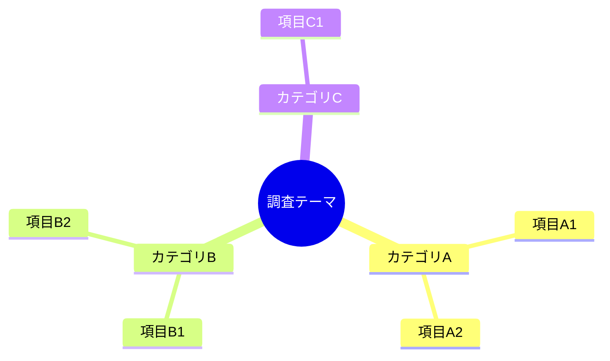
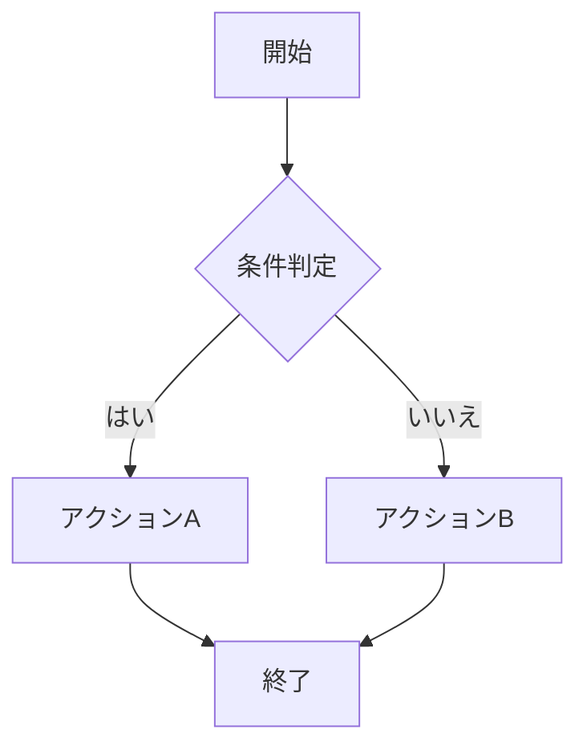
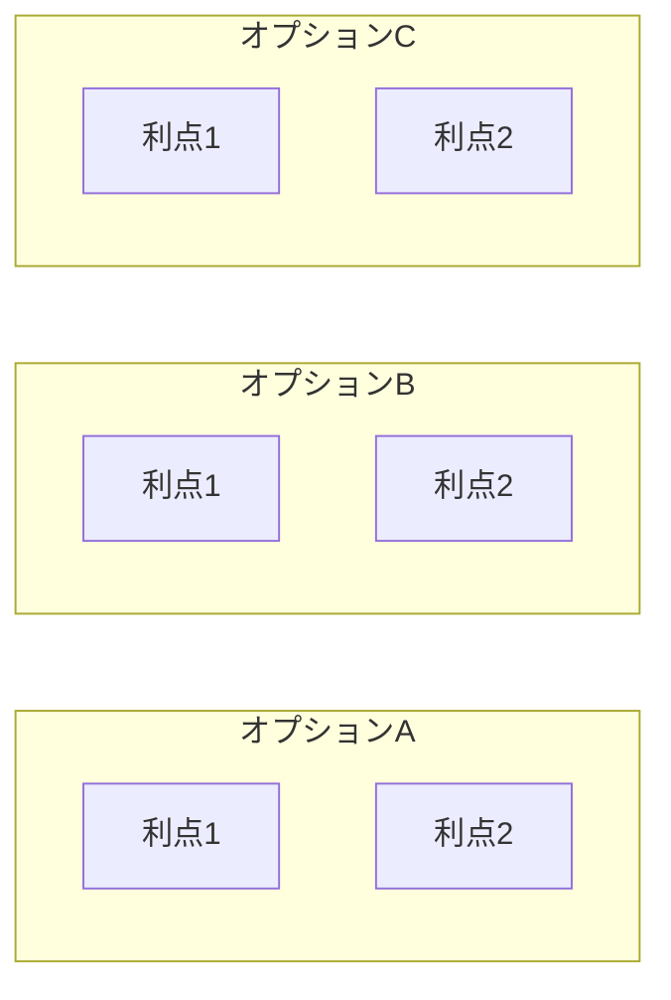
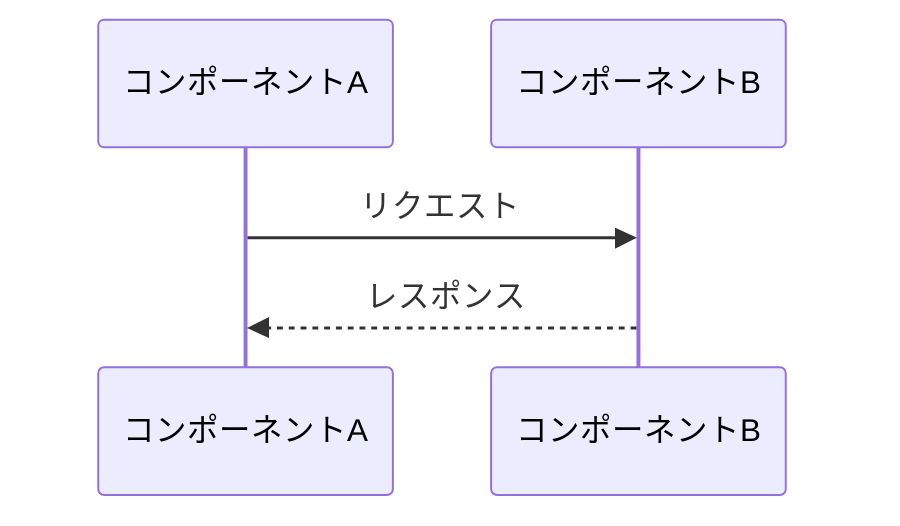
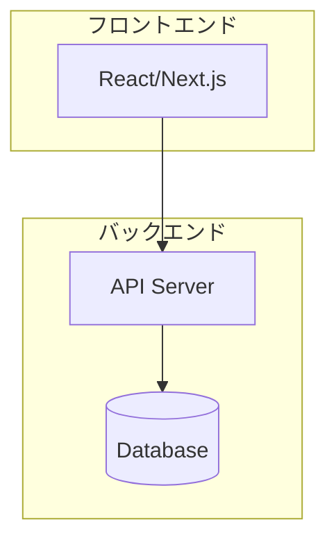
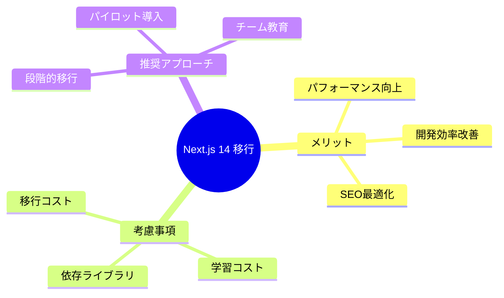

# レポート構造化スキル

調査結果や分析レポートを、4層の情報階層（エグゼクティブサマリー→概要→詳細分析→Appendix）で整理・再構成します。読者が必要な深さまで段階的に情報を取得でき、意思決定を支援します。

## 概要

このスキルは以下の機能を提供します:
- 長大なドキュメントを4層構造（サマリー→概要→詳細→Appendix）に再構成
- 段階的な情報開示（Progressive Disclosure）による読みやすさの向上
- Mermaidダイアグラム（マインドマップ、フローチャート等）による全体像の可視化
- 結論・推奨事項・重要ポイントを冒頭1〜2ページに要約（意思決定可能なレベルで）
- PROS/CONS、課題/対策を概要セクションで表形式に整理
- ソースコード修正案等の技術詳細はAppendixに分離
- 詳細セクションへの内部リンクによるナビゲーション
- GitHub/VSCodeで直接レンダリング可能なMarkdown形式

## このスキルを使用する場面

以下の状況でこのスキルを有効にしてください:

### ドキュメント整理時
- 調査結果が長大になり、全体像を把握しにくい場合
- 意思決定者向けに要約が必要な場合
- 技術調査の比較・関係性を可視化したい場合
- 既存のMarkdownドキュメントを読みやすく再構成したい場合

### レポート作成時
- 新規に調査レポートを作成する場合
- 複数の調査結果を統合してまとめる場合
- チームへの共有用にドキュメントを整理する場合

## 基本的な使い方

### 既存ドキュメントの変換

「このドキュメントをエグゼクティブサマリー形式に変換してください」などと依頼されたら:

1. **ドキュメントの分析**
   - 既存ドキュメントの構造を確認
   - 主要なセクション、結論、重要ポイントを特定
   - 関係性や依存関係を抽出

2. **エグゼクティブサマリーの作成**
   - 結論・推奨事項を1〜2ページに要約
   - 重要ポイントを箇条書きで整理
   - Mermaidダイアグラムで全体像を可視化
   - 詳細セクションへのリンクを配置

3. **本編の再構成**
   - 論理的な順序でセクションを整理
   - 各セクションにアンカーを設定
   - サマリーからリンク可能な形式に整形

4. **ユーザー確認**
   - 変換結果を確認
   - 必要に応じて調整

### 新規レポートの作成

「調査結果をレポートにまとめてください」などと依頼されたら:

1. **情報の整理**
   - 調査内容の確認
   - 結論と推奨事項の特定
   - 重要ポイントの抽出

2. **テンプレートに基づくドキュメント作成**
   - assets/templates/executive_summary_template_ja.mdを基に作成
   - エグゼクティブサマリーから記述
   - 本編を順次追加

3. **ユーザー確認**
   - 内容の確認
   - 追加情報の有無を確認

## ドキュメント構造

### 4層の情報階層

本スキルは以下の4層構造でドキュメントを整理します。読者が必要な深さまで段階的に情報を取得できるようにすることが目的です。

```text
┌─────────────────────────────────────────────────────────┐
│ レベル1: エグゼクティブサマリー（1-2ページ）            │
│ → 意思決定に必要な情報のみ。これだけで判断可能          │
├─────────────────────────────────────────────────────────┤
│ レベル2: 概要（各項目0.5-1ページ）                      │
│ → PROS/CONS要約、主要課題と対策を表形式で              │
├─────────────────────────────────────────────────────────┤
│ レベル3: 詳細分析（本編）                               │
│ → 詳細な分析、根拠データ、課題の詳細説明               │
├─────────────────────────────────────────────────────────┤
│ レベル4: Appendix（付録）                               │
│ → ソースコード修正案、技術仕様、参考文献               │
└─────────────────────────────────────────────────────────┘
```

### 各層の役割と情報量

| 層 | 対象読者 | 情報量の目安 | 含める内容 | 含めない内容 |
|---|---------|------------|----------|------------|
| エグゼクティブサマリー | 意思決定者 | 1-2ページ | 結論、推奨理由、重要ポイント要約 | 詳細な分析、コード |
| 概要 | プロジェクト関係者 | 各項目0.5-1ページ | PROS/CONS一覧、課題・対策の要約 | 詳細な説明、実装方法 |
| 詳細分析 | 実装担当者 | 必要に応じて | 詳細な分析、根拠、対策の実装方針 | ソースコード修正案 |
| Appendix | 開発者 | 必要に応じて | ソースコード、技術仕様、参考文献 | - |

### 推奨される構成

```markdown
# [レポートタイトル]

## エグゼクティブサマリー
### 結論
[3〜5行で結論 + 推奨理由 + 想定効果 + トレードオフ]

### 推奨事項
[表形式: 優先度 | アクション | 効果 | 理由]

### 重要ポイント
[各項目: タイトル + 2-3行の説明 + 概要/詳細へのリンク]

### 全体像
[Mermaidダイアグラム]

### ナビゲーション
[レベル別リンク一覧]

---

## 概要
### [トピック1]の概要
[要約 + PROS/CONS表 + 課題/対策表 + 詳細リンク]

### [トピック2]の概要
[同様]

### 比較サマリー
[選択肢比較表]

---

## 詳細分析
### 背景と目的
### 調査範囲と方法
### [トピック1]の詳細分析
[詳細な分析 + PROSの詳細 + CONSの詳細 + 課題対策の詳細]
### リスク分析
### 次のステップ

---

## Appendix
### A. ソースコード修正案
### B. 技術仕様
### C. 用語集
### D. 参考文献
```

## Mermaidダイアグラムの活用

### 1. マインドマップ（全体構造の可視化）

調査内容の構造や関係性を表現する場合:



**使用場面**:
- 調査範囲の全体像を示す
- カテゴリ別の分類を可視化
- 階層構造を表現

### 2. フローチャート（プロセス・フローの可視化）

意思決定フローや処理の流れを表現する場合:



**使用場面**:
- 推奨アクションのフローを示す
- 意思決定プロセスを可視化
- 手順を明確化

### 3. 比較図（オプション比較）

複数の選択肢を比較する場合:



**使用場面**:
- 技術選定の比較
- アプローチの比較
- コスト・効果の比較

### 4. シーケンス図（インタラクションの可視化）

コンポーネント間のやり取りを表現する場合:



**使用場面**:
- システム間の連携を示す
- API呼び出しの流れを表現
- 処理シーケンスを可視化

### 5. アーキテクチャ図（システム構成）

システム構成や技術スタックを表現する場合:



**使用場面**:
- システムアーキテクチャを示す
- 技術スタックを可視化
- インフラ構成を表現

## エグゼクティブサマリーの書き方

### 基本原則: サマリーだけで判断可能にする

エグゼクティブサマリーは「詳細を読まなくても意思決定できる」レベルの情報を提供する。タイトルだけでなく、「なぜその結論に至ったか」「何がポイントか」を含める。

### 1. 結論セクション

**原則**:
- **3〜5行で記載**（1-3文ではなく、より詳細に）
- 「何を推奨するか」「なぜ推奨するか」「どの程度の効果か」「トレードオフは何か」を含める
- 曖昧な表現を避け、具体的な数値やファクトを含める

**良い例**:
```markdown
### 結論

本調査の結果、**Next.js 14の採用**を推奨する。

**推奨理由**:
- App Routerにより初期読み込み時間が平均40%短縮される
- Server Componentsによりバンドルサイズが30%削減可能
- 既存のReactコンポーネントは段階的に移行可能（破壊的変更なし）

**想定される効果**: パフォーマンス指標（LCP）が2.5秒→1.5秒に改善、SEOスコア15%向上

**主なトレードオフ**: 移行に約2人月の工数が必要。一部のサードパーティライブラリは更新が必要。
```

**悪い例（タイトルのみ）**:
```markdown
### 結論

Next.js 14の採用を推奨する。
```
→ 問題: なぜ推奨するのか、効果は何か、リスクは何かが分からない

**悪い例（曖昧）**:
```markdown
### 結論

調査の結果、いくつかの選択肢があることがわかりました。それぞれにメリット・デメリットがあり、状況に応じて選択することが重要です。
```
→ 問題: 何も決まっていない。読者に判断を丸投げしている

### 2. 推奨事項セクション

**原則**:
- 優先順位を明示（P1/P2/P3または高/中/低）
- 具体的なアクションを記載
- 期限や担当を可能な範囲で示唆

**良い例**:
```markdown
### 推奨事項

| 優先度 | 推奨アクション | 期待効果 |
|-------|--------------|---------|
| P1（高） | Next.js 14へのマイグレーション計画を策定 | パフォーマンス30%向上 |
| P2（中） | 既存コンポーネントのServer Components対応 | バンドルサイズ削減 |
| P3（低） | テスト環境の整備 | 品質向上 |
```

### 3. 重要ポイントセクション

**原則**:
- 3〜5項目に絞る
- **各項目は2〜3行の説明を含める**（タイトルだけでなく、内容が分かるレベルに）
- 「概要」と「詳細」の両方へのリンクを提供し、段階的に深掘りできるようにする

**良い例**:
```markdown
### 重要ポイント

#### パフォーマンス向上
Server Componentsの採用により、初期読み込み時間が平均40%短縮される。特にモバイル環境でのLCPが2.5秒から1.5秒に改善し、SEOスコアも15%向上する見込み。
→ [概要](#パフォーマンスの概要) | [詳細](#パフォーマンスの詳細分析)

#### 開発効率の改善
App Routerの新しいファイルベースルーティングにより、ルート定義が直感的になる。既存プロジェクトでのルーティングコードが約30%削減可能。
→ [概要](#開発効率の概要) | [詳細](#開発効率の詳細分析)

#### 移行の実現可能性
既存のpagesディレクトリとApp Routerは共存可能。段階的な移行が可能で、一度に全てを移行する必要はない。リスクを最小化しながら進められる。
→ [概要](#移行の概要) | [詳細](#移行の詳細分析)
```

**悪い例（タイトルのみ）**:
```markdown
### 重要ポイント

- **パフォーマンス**: [詳細](#パフォーマンス分析)
- **開発効率**: [詳細](#開発効率の改善)
- **移行コスト**: [詳細](#移行戦略)
```
→ 問題: タイトルだけでは内容が分からず、詳細を読まないと判断できない

### 4. 概要セクション（中間層）

**役割**:
- エグゼクティブサマリーと詳細分析の**橋渡し**
- サマリーから飛んだ読者が、いきなり詳細に入らず段階的に情報を得られるようにする
- PROS/CONS、課題/対策を**表形式で一覧化**し、俯瞰できるようにする

**原則**:
- 各トピックを3〜5行の要約 + 表形式で整理
- PROS/CONSは1行ずつで簡潔に（詳細は本編に）
- 課題と対策も1行ずつで整理し、影響度を明示
- 詳細分析へのリンクを必ず設置

**良い例**:
```markdown
### パフォーマンスの概要

#### 要約
Server Componentsの採用により、クライアントに送信されるJavaScriptが大幅に削減される。
特に初期読み込み時のパフォーマンスが改善し、Core Web Vitalsのスコア向上が期待できる。
既存のClient Componentsとの併用も可能。

#### PROS / CONS

| PROS | CONS |
|------|------|
| 初期読み込み時間が40%短縮 | Server側の負荷が増加 |
| バンドルサイズが30%削減 | キャッシュ戦略の見直しが必要 |
| SEOスコアが15%向上 | 学習コストが発生 |

#### 主要課題と対策

| 課題 | 影響 | 対策 |
|-----|------|------|
| Server負荷の増加 | 中 | CDNキャッシュの活用で軽減可能 |
| streaming対応 | 低 | 段階的に対応、初期は不要 |

→ [詳細分析を見る](#パフォーマンスの詳細分析)
```

### 5. 全体像セクション

**原則**:
- Mermaidダイアグラムで視覚化
- 複雑な関係性を1つの図で表現
- 図の下に簡潔な説明を追加

**良い例**:
```markdown
### 全体像



上図は、Next.js 14移行における主要な検討ポイントを示している。詳細は本編各セクションを参照。
```

## 技術的詳細の分離（ソースコード修正案等）

### 原則: 技術的詳細はAppendixに分離する

ソースコード修正案、詳細な設定値、API仕様などの**技術的詳細**は本編から分離し、**Appendixに配置**する。

**理由**:
- 本編は「何をすべきか」「なぜそうすべきか」を説明する場所
- ソースコードは「どう実装するか」の詳細であり、対象読者が限定される
- 本編にコードが混在すると、読みにくく情報の乖離が大きくなる

### 本編とAppendixの役割分担

| 配置場所 | 記載する内容 | 記載しない内容 |
|---------|------------|--------------|
| 本編（詳細分析） | 課題の説明、対策の方針、実装の方向性 | 具体的なコード、詳細な設定値 |
| Appendix | ソースコード修正案、設定ファイル例、API定義 | 課題の説明（本編へリンク） |

### 本編での参照方法

本編で対策を説明する際は、Appendixへのリンクを設置する:

```markdown
#### 課題と対策（詳細）

**課題1: N+1クエリ問題**
- **問題の詳細**: 一覧取得時に関連データを個別に取得しており、レコード数に比例してクエリ数が増加
- **影響範囲**: 商品一覧API、注文履歴API
- **対策**: DataLoaderパターンを導入し、バッチ処理で一括取得
- **実装方針**: GraphQL DataLoaderを使用。修正対象は2ファイル
- **コード修正案**: [Appendix A.1参照](#a1-n1クエリ問題の修正案)
```

### Appendixでの記載方法

Appendixでは、どの課題に対する修正案かを明記し、本編へのリンクを設置する:

```markdown
### Appendix A. ソースコード修正案

#### A.1 N+1クエリ問題の修正案

**関連セクション**: [課題1: N+1クエリ問題](#課題と対策詳細)
**対象ファイル**: `src/loaders/productLoader.ts`

// 修正前
const products = await Product.findAll();
for (const product of products) {
  product.category = await Category.findById(product.categoryId);
}

// 修正後
const products = await Product.findAll();
const categoryIds = products.map(p => p.categoryId);
const categories = await Category.findByIds(categoryIds);
const categoryMap = new Map(categories.map(c => [c.id, c]));
products.forEach(p => p.category = categoryMap.get(p.categoryId));

**修正のポイント**:
- 個別取得をバッチ取得に変更
- Map構造でO(1)のルックアップを実現
```

## 内部リンクの活用

### アンカーリンクの設定

本編の各セクションにはアンカーを設定し、サマリーからリンク可能にします:

**サマリー側**:
```markdown
詳細は[パフォーマンス分析](#パフォーマンス分析)を参照。
```

**本編側**:
```markdown
## パフォーマンス分析

[詳細内容]
```

### ナビゲーションセクション

サマリーの末尾に、本編へのナビゲーションを設置:

```markdown
### 詳細へのナビゲーション

| セクション | 概要 |
|-----------|------|
| [1. 背景と目的](#背景と目的) | 調査の背景と目的 |
| [2. 調査方法](#調査方法) | 調査手法と対象 |
| [3. 調査結果](#調査結果) | 詳細な調査結果 |
| [4. 分析と考察](#分析と考察) | 結果の分析 |
| [5. リスク分析](#リスク分析) | 想定されるリスク |
| [Appendix](#appendix) | 補足資料 |
```

## ワークフロー

### 既存ドキュメントの変換フロー

```text
1. ドキュメントの読み込み
   - 既存ドキュメントの構造を分析
   - 主要セクション、結論を特定
   - PROS/CONS、課題、対策、コード修正案を識別
   ↓
2. 情報の抽出と分類
   - 結論と推奨事項を抽出
   - 重要ポイントをリストアップ
   - 情報を4層に分類:
     * サマリー向け（結論、推奨理由、効果）
     * 概要向け（PROS/CONS一覧、課題/対策要約）
     * 詳細分析向け（詳細な説明、根拠データ）
     * Appendix向け（ソースコード、技術仕様）
   ↓
3. エグゼクティブサマリーの作成
   - 結論セクション（3-5行で理由・効果・トレードオフを含む）
   - 推奨事項（表形式、理由列を追加）
   - 重要ポイント（各項目2-3行の説明 + 概要/詳細へのリンク）
   - Mermaidダイアグラムを作成
   - レベル別ナビゲーションを設置
   ↓
4. 概要セクションの作成
   - 各トピックの要約（3-5行）
   - PROS/CONS表（1行ずつ）
   - 課題/対策表（影響度付き）
   - 詳細分析へのリンク
   ↓
5. 詳細分析の再構成
   - 論理的な順序で整理
   - PROS/CONSの詳細説明
   - 課題と対策の詳細（コードはAppendix参照）
   - アンカーを設定
   ↓
6. Appendixの作成
   - ソースコード修正案（本編へのリンク付き）
   - 技術仕様
   - 用語集、参考文献
   ↓
7. ユーザー確認
   - 変換結果を確認
   - 情報の階層が適切か確認
   - フィードバックに基づき調整
```

### 新規レポート作成フロー

```text
1. 情報のヒアリング
   - 調査内容の確認
   - 結論・推奨事項の確認
   - 重要ポイントの確認
   - PROS/CONS、課題、対策の確認
   ↓
2. 構成の設計
   - 4層構造の各層に含める内容を決定
   - ダイアグラムの種類を選択
   - ソースコード修正案の有無を確認（あればAppendix行き）
   ↓
3. ドキュメント作成（上から下へ）
   - テンプレートを基に作成
   - エグゼクティブサマリー（結論を3-5行で、重要ポイントも2-3行ずつ）
   - 概要セクション（PROS/CONS表、課題/対策表）
   - 詳細分析（詳細な説明、コードはAppendix参照）
   - Appendix（ソースコード、技術仕様）
   ↓
4. 階層間の整合性チェック
   - サマリーだけで判断可能か確認
   - 概要で全体像が把握できるか確認
   - 詳細への誘導が適切か確認
   ↓
5. レビューと調整
   - 内容の確認
   - 必要に応じて調整
```

## ユーザーとの対話ガイドライン

### 1. 変換時の確認事項

既存ドキュメントを変換する際は、以下を確認します:

```text
ドキュメントの変換について確認させてください：

1. 最も重要な結論は何ですか？
2. 推奨事項の優先順位はどうしますか？
3. 特に強調したいポイントはありますか？
4. 本編のセクション構成は現状のままで良いですか？
```

### 2. ダイアグラムの選択

全体像を可視化する際は、適切なダイアグラム形式を提案します:

```text
全体像の可視化について確認させてください：

A) マインドマップ - 階層構造や関係性を表現
B) フローチャート - プロセスや意思決定フローを表現
C) 比較図 - 複数選択肢の比較を表現
D) その他 - 具体的に教えてください

どの形式が適切ですか？
```

### 3. 詳細レベルの調整

サマリーの詳細レベルを確認します:

```text
エグゼクティブサマリーの詳細レベルについて：

A) 超簡潔（半ページ程度）- 結論と推奨のみ
B) 標準（1ページ程度）- 結論、推奨、重要ポイント
C) 詳細（2ページ程度）- 上記 + 背景・リスクの要約

どのレベルが適切ですか？
```

## 検証チェックリスト

変換・作成後は以下を確認:

### エグゼクティブサマリー（レベル1）
- [ ] 結論が3〜5行で記載されている（推奨理由、効果、トレードオフを含む）
- [ ] 推奨事項に優先順位と「理由」列が含まれている
- [ ] 重要ポイントが3〜5項目あり、各項目2-3行の説明がある
- [ ] 重要ポイントから「概要」と「詳細」の両方へリンクがある
- [ ] Mermaidダイアグラムで全体像が可視化されている
- [ ] **サマリーだけで意思決定可能な情報量がある**

### 概要セクション（レベル2）
- [ ] 各トピックに3-5行の要約がある
- [ ] PROS/CONSが表形式で一覧化されている（各1行）
- [ ] 課題/対策が表形式で整理されている（影響度付き）
- [ ] 詳細分析へのリンクがある
- [ ] **サマリーと詳細の橋渡しとして機能している**

### 詳細分析（レベル3）
- [ ] 論理的な順序でセクションが整理されている
- [ ] PROS/CONSの詳細な説明がある
- [ ] 課題と対策の詳細（実装方針まで）がある
- [ ] ソースコードはAppendix参照になっている
- [ ] 各セクションにアンカーが設定されている

### Appendix（レベル4）
- [ ] ソースコード修正案が本編から分離されている
- [ ] 各修正案に「関連セクション」へのリンクがある
- [ ] 技術仕様、用語集、参考文献が整理されている

### 全体
- [ ] GitHubでMermaidが正しくレンダリングされる
- [ ] 内部リンクが正しく機能する
- [ ] **4層の情報階層が適切に機能している**
- [ ] **読者が必要な深さまで段階的に情報を取得できる**

## ベストプラクティス

### 1. 結論ファースト
- 最も重要な情報を冒頭に配置
- 詳細は後から参照できるようにリンク

### 2. 視覚的な情報提示
- Mermaidダイアグラムを積極的に活用
- 表形式で比較情報を整理
- 箇条書きで要点を明確化

### 3. ナビゲーションの充実
- サマリーから本編へのリンクを設置
- 本編内でも関連セクションへのリンクを追加
- 目次を活用

### 4. 適切な粒度
- サマリーは1〜2ページに収める
- 本編は必要に応じて詳細に
- 長すぎるセクションは分割を検討

### 5. 曖昧さの排除
- 「〜かもしれない」より「〜である」
- 具体的な数値や根拠を示す
- 推奨事項は明確なアクションとして記述

## リソース

### assets/templates/
- `executive_summary_template_ja.md`: エグゼクティブサマリー形式のテンプレート

## 今後の拡張

このスキルは将来的に以下の機能を追加予定です:

- 英語版テンプレートの追加
- PDFエクスポート対応
- プレゼンテーション形式への変換
- 複数ドキュメントの統合機能
- バージョン管理・差分表示機能
