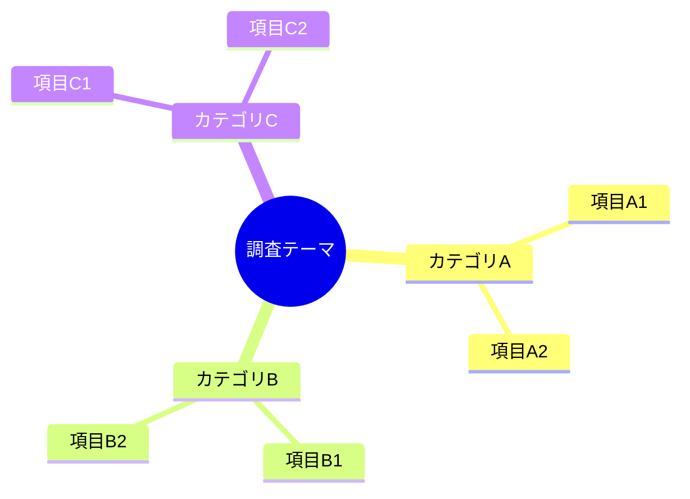

# [レポートタイトル]

> **作成日**: YYYY-MM-DD
> **作成者**: [作成者名]
> **バージョン**: 1.0
> **ステータス**: [Draft / Review / Final]

---

## エグゼクティブサマリー

<!--
このセクションは意思決定者が本編を読まなくても判断できるレベルの情報を提供する。
目安: 1〜2ページ（A4換算）
-->

### 結論

<!--
最重要の結論を3〜5行で記載。「何を」「なぜ」「どうすべきか」を明確に。
単なるタイトルではなく、これだけ読んでも判断できる内容にする。
-->

本調査の結果、**[推奨する選択肢/アクション]** を推奨する。

**推奨理由**:
- [理由1: 具体的な数値やファクトを含める]
- [理由2: 具体的なメリットを記載]
- [理由3: リスクが許容範囲である根拠]

**想定される効果**: [具体的な効果を数値で示す（例: パフォーマンス30%向上、コスト20%削減）]

**主なトレードオフ**: [採用することで失うもの、受け入れるリスクを1-2文で]

### 推奨事項

<!-- 優先順位付きで具体的なアクションを記載。各アクションの「なぜ」も簡潔に含める -->

| 優先度 | 推奨アクション | 期待効果 | 推奨理由 |
|-------|--------------|---------|---------|
| P1（高） | [アクション1] | [定量的な効果] | [なぜこれを最優先とするか] |
| P2（中） | [アクション2] | [定量的な効果] | [なぜP2なのか] |
| P3（低） | [アクション3] | [定量的な効果] | [後回しにできる理由] |

### 重要ポイント

<!--
3〜5項目。各項目は「タイトル + 2-3行の説明 + 詳細リンク」の形式。
読者がここだけ読んでも内容を把握できるレベルの情報量を確保する。
-->

#### [ポイント1のタイトル]
[2-3行の説明。結論と根拠を含む。例: 「〜という調査結果から、〜であることが判明した。これにより〜が可能になる。」]
→ [概要](#トピック1の概要) | [詳細](#トピック1の詳細分析)

#### [ポイント2のタイトル]
[2-3行の説明。問題点と対策の要点を含む。例: 「〜という課題があるが、〜により対処可能。影響は限定的。」]
→ [概要](#トピック2の概要) | [詳細](#トピック2の詳細分析)

#### [ポイント3のタイトル]
[2-3行の説明]
→ [概要](#トピック3の概要) | [詳細](#トピック3の詳細分析)

#### [ポイント4のタイトル]
[2-3行の説明]
→ [概要](#比較サマリー) | [詳細](#リスク分析)

### 全体像

<!-- Mermaidダイアグラムで全体構造を可視化 -->



上図は[調査テーマ]の全体構造を示している。

### ナビゲーション

| レベル | セクション | 内容 |
|-------|-----------|------|
| 概要 | [概要セクション](#概要) | 各項目のPROS/CONS要約、主要課題と対策 |
| 詳細 | [詳細分析](#詳細分析) | 分析の詳細、根拠データ |
| 付録 | [Appendix](#appendix) | ソースコード修正案、技術仕様 |

---

## 概要

<!--
このセクションはエグゼクティブサマリーと詳細分析の中間層。
各トピックごとにPROS/CONS、主要課題、対策を「要約形式」で記載。
目安: 各項目1段落〜半ページ程度
-->

### [トピック1]の概要

#### 要約
[トピック1について3-5行で説明。背景、調査結果、結論を簡潔に]

#### PROS / CONS

| PROS | CONS |
|------|------|
| [利点1を1行で] | [欠点1を1行で] |
| [利点2を1行で] | [欠点2を1行で] |
| [利点3を1行で] | [欠点3を1行で] |

#### 主要課題と対策

| 課題 | 影響 | 対策 |
|-----|------|------|
| [課題1を1行で] | 高/中/低 | [対策を1行で] |
| [課題2を1行で] | 高/中/低 | [対策を1行で] |

→ [詳細分析を見る](#トピック1の詳細分析)

---

### [トピック2]の概要

#### 要約
[トピック2について3-5行で説明]

#### PROS / CONS

| PROS | CONS |
|------|------|
| [利点1を1行で] | [欠点1を1行で] |
| [利点2を1行で] | [欠点2を1行で] |

#### 主要課題と対策

| 課題 | 影響 | 対策 |
|-----|------|------|
| [課題1を1行で] | 高/中/低 | [対策を1行で] |

→ [詳細分析を見る](#トピック2の詳細分析)

---

### [トピック3]の概要

#### 要約
[トピック3について3-5行で説明]

#### PROS / CONS

| PROS | CONS |
|------|------|
| [利点1を1行で] | [欠点1を1行で] |

#### 主要課題と対策

| 課題 | 影響 | 対策 |
|-----|------|------|
| [課題1を1行で] | 高/中/低 | [対策を1行で] |

→ [詳細分析を見る](#トピック3の詳細分析)

---

### 比較サマリー

<!-- 複数の選択肢がある場合の比較表 -->

| 観点 | オプションA | オプションB | オプションC |
|-----|------------|------------|------------|
| [観点1] | ◎/○/△/× | ◎/○/△/× | ◎/○/△/× |
| [観点2] | ◎/○/△/× | ◎/○/△/× | ◎/○/△/× |
| [観点3] | ◎/○/△/× | ◎/○/△/× | ◎/○/△/× |
| **総合** | **[評価]** | **[評価]** | **[評価]** |

凡例: ◎=優れている ○=良い △=やや難あり ×=問題あり

---

## 詳細分析

<!--
このセクションは詳細な分析結果を記載。
ソースコード修正案などの技術的詳細はAppendixに分離する。
-->

### 背景と目的

#### 背景

[調査の背景・経緯を詳細に記載]

#### 目的

[調査の目的を明確に記載]

#### 対象読者

- [対象読者1]
- [対象読者2]

---

### 調査範囲と方法

#### 調査範囲

**スコープ内**:
- [範囲内の項目1]
- [範囲内の項目2]

**スコープ外**:
- [範囲外の項目1]
- [範囲外の項目2]

#### 調査方法

| 手法 | 内容 | 目的 |
|-----|------|------|
| [手法1] | [内容の説明] | [目的] |
| [手法2] | [内容の説明] | [目的] |

---

### [トピック1]の詳細分析

#### 調査結果

[詳細な調査結果を記載]

#### PROS（詳細）

**[利点1のタイトル]**
[利点1の詳細な説明。なぜこれが利点なのか、どの程度の効果があるか]

**[利点2のタイトル]**
[利点2の詳細な説明]

#### CONS（詳細）

**[欠点1のタイトル]**
[欠点1の詳細な説明。どのような状況で問題になるか、影響範囲]

**[欠点2のタイトル]**
[欠点2の詳細な説明]

#### 課題と対策（詳細）

**課題1: [課題タイトル]**
- **問題の詳細**: [何が問題で、なぜ問題なのか]
- **影響範囲**: [どこに影響があるか]
- **対策**: [具体的な対策内容]
- **実装方針**: 対策の実装方針。コード修正が必要な場合は [Appendix A.1参照](#a1-課題1に対する修正案)

---

### [トピック2]の詳細分析

[同様の構造で記載]

---

### [トピック3]の詳細分析

[同様の構造で記載]

---

### リスク分析

| リスク | 影響度 | 発生可能性 | 対策 | 備考 |
|-------|-------|-----------|------|------|
| [リスク1] | 高/中/低 | 高/中/低 | [対策1] | [補足] |
| [リスク2] | 高/中/低 | 高/中/低 | [対策2] | [補足] |
| [リスク3] | 高/中/低 | 高/中/低 | [対策3] | [補足] |

---

### 次のステップ

#### 短期アクション（1〜2週間）

- [ ] [アクション1]
- [ ] [アクション2]

#### 中期アクション（1〜3ヶ月）

- [ ] [アクション3]
- [ ] [アクション4]

#### 長期アクション（3ヶ月以上）

- [ ] [アクション5]
- [ ] [アクション6]

---

## Appendix

<!--
技術的な詳細情報を分離して記載。
本編から参照する形式とし、必要な人だけが見る構成にする。
-->

### Appendix A. ソースコード修正案

<!--
ソースコード修正案は本編から分離してここに記載。
各修正案には「どの課題に対する対策か」を明記する。
-->

#### A.1 [課題1]に対する修正案

**対象ファイル**: `path/to/file.ts`
**関連セクション**: [課題1の詳細](#課題と対策詳細-1)

```typescript
// 修正前
[修正前のコード]

// 修正後
[修正後のコード]
```

**修正のポイント**:
- [修正ポイント1]
- [修正ポイント2]

---

#### A.2 [課題2]に対する修正案

**対象ファイル**: `path/to/another-file.ts`
**関連セクション**: [課題2の詳細](#課題と対策詳細-1)

```typescript
// 修正案
[修正コード]
```

---

### Appendix B. 技術仕様

<!-- 詳細な技術仕様、API定義、設定値など -->

#### B.1 [仕様項目1]

[詳細な技術仕様を記載]

#### B.2 [仕様項目2]

[詳細な技術仕様を記載]

---

### Appendix C. 用語集

| 用語 | 定義 |
|-----|------|
| [用語1] | [定義] |
| [用語2] | [定義] |

---

### Appendix D. 参考文献

1. [文献タイトル1](URL) - [説明]
2. [文献タイトル2](URL) - [説明]

---

### Appendix E. 変更履歴

| バージョン | 日付 | 変更内容 | 変更者 |
|-----------|------|---------|-------|
| 1.0 | YYYY-MM-DD | 初版作成 | [作成者] |

---

> **免責事項**: [必要に応じて免責事項を記載]
