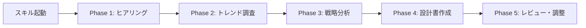
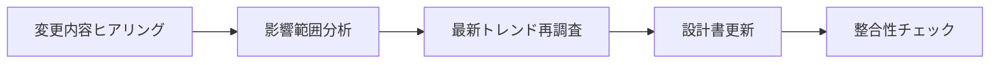

# SaaSサービス設計コンサルティングスキル

Claude Codeで使用するSaaSサービス設計のための専門スキルです。業界トレンドを調査し、包括的なサービス設計書を作成します。

## 概要

このスキルは、SaaSサービスを新規に立ち上げる際、または既存サービスの方針を変更する際に、コンサルタントとして以下を提供します：

- **業界・市場の最新トレンド調査**
- **構造化されたヒアリングプロセス**
- **包括的なサービス設計書の作成**
- **戦略的な推奨事項の提示**
- **サービス方針変更時の設計更新**

## 特徴

### 1. コンサルタントとしての振る舞い

単なるテンプレート埋めではなく、経験豊富なSaaSビジネスコンサルタントとして：

- ✅ 業界の最新トレンドをWebSearchで調査
- ✅ 競合分析と市場ポジショニングを提案
- ✅ ベストプラクティスに基づいた推奨事項を提示
- ✅ リスクと対策を明確化
- ✅ データドリブンな意思決定をサポート

### 2. 推論禁止 - 必ず質問

**重要な原則**: 推測や推論は行いません。

- 不足している情報は必ずユーザーに質問
- 曖昧な要件は明確化を要求
- 前提条件が不明な場合は確認
- ユーザーからの明確な回答に基づいて設計

### 3. 包括的な設計内容

作成される設計書には以下の13セクションが含まれます：

1. **エグゼクティブサマリー** - サービス概要、価値提案
2. **ビジネスモデルキャンバス** - 9つの構成要素の詳細設計
3. **市場分析** - TAM/SAM/SOM、競合分析、トレンド
4. **プロダクトビジョン** - ミッション、コア機能、ユーザーストーリー
5. **技術アーキテクチャ** - システム設計、技術スタック、スケーラビリティ
6. **KPI設計** - ビジネス・プロダクト・技術・CS各KPI
7. **Go-to-Market戦略** - ローンチ、マーケティング、セールス
8. **プロダクトロードマップ** - 短期・中期・長期計画
9. **リスク管理** - ビジネス・技術・市場リスクと対策
10. **組織と役割** - チーム構成、採用計画
11. **財務計画** - 損益計算、ユニットエコノミクス
12. **成功指標** - マイルストーンと評価基準
13. **付録** - 用語集、変更履歴

### 4. 方針変更にも対応

サービスのピボットや方針変更時にも：

- 変更内容のヒアリング
- 影響範囲の分析
- 最新トレンドの再調査
- 設計書の部分更新
- 整合性チェック

## 使い方

### 初回設計時

```
1. スキルを起動
2. ヒアリング質問に回答
3. 業界トレンド調査の結果を確認
4. 戦略的推奨事項を検討
5. 設計書のレビューと調整
```

### 方針変更時

```
1. スキルを起動し、変更内容を伝える
2. 変更に関する詳細質問に回答
3. 最新トレンド調査結果を確認
4. 更新された設計書を確認
```

## ファイル構成

```
saas-design/
├── SKILL.md                              # スキル定義ファイル（メイン）
├── README.md                             # このファイル
├── assets/
│   └── templates/
│       ├── saas_design_template_ja.md    # SaaS設計書テンプレート
│       └── interview_questions_ja.md     # ヒアリング質問リスト
└── references/
    └── example_taskflow_ja.md            # 実例：TaskFlow（プロジェクト管理SaaS）
```

## ヒアリング項目（主要なもの）

スキル起動時に以下のような項目をヒアリングします：

### ビジネス基本情報
- サービス名・概要
- 対象業界
- 解決したい課題

### 市場・顧客
- ターゲット顧客セグメント
- 顧客のペインポイント
- 市場規模と競合

### プロダクト
- 提供する価値
- コア機能
- 差別化ポイント

### ビジネスモデル
- 収益モデル
- 価格帯
- 収益目標

### 技術要件
- 技術スタックの希望
- スケーラビリティ要件
- セキュリティ要件

### プロジェクト計画
- リリースタイムライン
- リソース
- 制約条件

詳細は `assets/templates/interview_questions_ja.md` を参照してください。

## 出力例

実際の設計書の例は `references/example_taskflow_ja.md` を参照してください。

これは架空の「TaskFlow」という中小企業向けプロジェクト管理SaaSの設計書で、以下が含まれます：

- ビジネスモデルキャンバスの詳細
- 市場分析（TAM/SAM/SOM、競合分析）
- 技術アーキテクチャ図（Mermaid）
- KPI設計（LTV/CAC、Churn Rate等）
- 3年間の財務計画
- など

## プロセスフロー

### 新規設計時



### 更新時



## ベストプラクティス

このスキルを効果的に使用するために：

### 準備しておくと良い情報

1. **市場調査**
   - 対象業界の基本的な理解
   - 主要な競合サービスのリスト
   - 市場規模の概算（TAM/SAM）

2. **顧客理解**
   - ペルソナの具体的なイメージ
   - 顧客インタビューの結果（あれば）
   - 現在の課題解決方法

3. **プロダクト構想**
   - 主要機能のリスト
   - 差別化ポイント
   - プロトタイプ（あれば）

4. **ビジネス計画**
   - 収益目標
   - 利用可能な予算
   - リリースタイムライン

### ヒアリング時のコツ

- **具体的に答える**: 「中小企業向け」より「従業員10-200名の製造業」
- **定量的に**: 「安い価格」より「月額5,000-10,000円」
- **優先順位を明確に**: Must-have vs Nice-to-have
- **制約を伝える**: 予算、時間、技術的制約

### 設計書レビュー時のチェックポイント

- [ ] ターゲット顧客が明確で具体的か
- [ ] 価値提案が測定可能か
- [ ] 収益モデルが持続可能か
- [ ] 技術アーキテクチャが実現可能か
- [ ] KPIが適切に設定されているか
- [ ] ロードマップが現実的か
- [ ] リスクと対策が明記されているか

## 活用シーン

### 1. 新規SaaS立ち上げ

スタートアップや新規事業として、SaaSサービスを立ち上げる際の包括的な設計書作成に。

**例**:
- BtoB SaaSの起業
- 社内ツールのSaaS化
- 新規事業としてのSaaS展開

### 2. ピボット・方針転換

既存サービスのターゲットやビジネスモデルを変更する際の戦略再設計に。

**例**:
- ターゲット変更（中小企業 → 大企業）
- 価格モデル変更（サブスク → 従量課金）
- 機能ピボット（コア機能の変更）

### 3. 資金調達準備

投資家向けの詳細なビジネスプランとして。

**例**:
- シードラウンド資金調達
- シリーズA準備
- 事業計画書の一部として

### 4. 社内承認・プレゼン

経営陣や関係部署への提案資料として。

**例**:
- 新規事業提案
- 予算承認申請
- 部門間調整

## 注意事項

### このスキルでできること

- ✅ 業界トレンドの調査と分析
- ✅ 包括的な設計書の作成
- ✅ 戦略的な推奨事項の提示
- ✅ 競合分析とポジショニング
- ✅ ビジネスモデルの設計
- ✅ 技術アーキテクチャの設計
- ✅ KPIとメトリクスの設計

### このスキルでできないこと

- ❌ 法的アドバイス（弁護士に相談してください）
- ❌ 会計・税務アドバイス（会計士に相談してください）
- ❌ 確定的な市場予測（調査結果は参考情報です）
- ❌ 投資判断（最終判断はユーザーの責任です）

### 情報の取り扱い

- WebSearchで取得した情報は参考情報として扱う
- 重要な意思決定には追加検証を推奨
- 業界専門家へのヒアリングを補完的に推奨
- 競合情報は公開情報のみを使用

## よくある質問

### Q1: どのくらいの時間がかかりますか？

**A**: ヒアリングから設計書完成まで、通常30-60分程度です。情報の準備状況によります。

### Q2: 技術的な知識がなくても使えますか？

**A**: はい。ビジネス面を中心にヒアリングします。技術的な部分は一般的なベストプラクティスを提案します。

### Q3: 業界特有の知識は反映されますか？

**A**: はい。WebSearchで対象業界の最新トレンド、競合、規制環境を調査します。

### Q4: 設計書は何度でも更新できますか？

**A**: はい。方針変更時にスキルを再度起動し、変更内容を伝えてください。

### Q5: 英語版のサービスにも対応していますか？

**A**: 現在は日本語版のみです。英語版テンプレートは今後追加予定です。

### Q6: 他のメンバーと共有できますか？

**A**: はい。作成された設計書はMarkdown形式なので、Git等で共有できます。

## バージョン情報

- **バージョン**: 1.0
- **最終更新**: 2024-11
- **対応言語**: 日本語

## ライセンス

このスキルはMITライセンスの下で提供されています。

## 貢献

改善提案やバグ報告は、リポジトリのIssueで受け付けています。

## サポート

質問や問題がある場合は、リポジトリのIssueを作成してください。

---

**Claude Codeで、あなたのSaaSビジョンを実現しましょう！**
