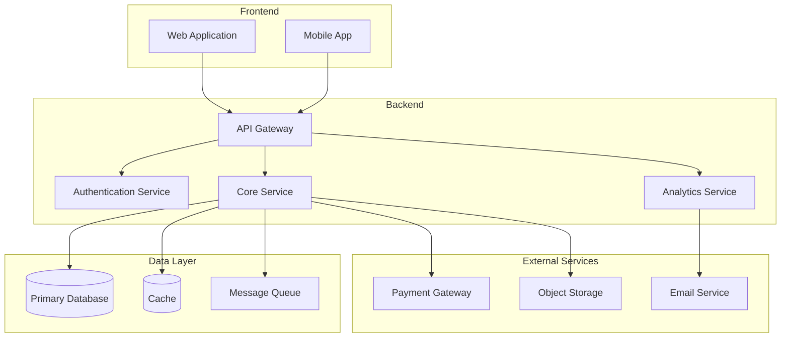

# SaaSサービス設計書

> **作成日**: YYYY-MM-DD
> **バージョン**: 1.0
> **ステータス**: Draft / In Review / Approved
> **最終更新**: YYYY-MM-DD

---

## 1. エグゼクティブサマリー

### 1.1 サービス概要
[サービスの簡潔な説明（2-3文）]

### 1.2 主要な価値提案
[顧客にとっての主要な価値を箇条書きで記載]

-
-
-

### 1.3 ターゲット市場
[対象とする市場・顧客セグメント]

### 1.4 ビジネス目標
[主要なビジネス目標とKPI]

---

## 2. ビジネスモデルキャンバス

### 2.1 顧客セグメント (Customer Segments)
[誰のために価値を創造するか]

#### 主要顧客セグメント
- **セグメント1**: [説明]
  - 業界:
  - 企業規模:
  - 特徴:
- **セグメント2**: [説明]
  - 業界:
  - 企業規模:
  - 特徴:

#### ペルソナ定義
**ペルソナ1**: [名前/役職]
- 年齢層:
- 課題:
- 目標:
- 利用シーン:

### 2.2 価値提案 (Value Propositions)
[どのような価値を顧客に提供するか]

#### 解決する課題
1. **課題1**: [説明]
   - 現状の問題:
   - 提供する解決策:
   - 定量的効果:

#### 提供価値
- **機能的価値**:
- **感情的価値**:
- **社会的価値**:

#### 競合優位性
-
-
-

### 2.3 チャネル (Channels)
[顧客にどのように届けるか]

#### 認知フェーズ
-
-

#### 評価フェーズ
-
-

#### 購入フェーズ
-
-

#### 配送フェーズ
-
-

#### アフターサービス
-
-

### 2.4 顧客との関係 (Customer Relationships)
[顧客とどのような関係を築くか]

- **獲得戦略**:
- **維持戦略**:
- **拡大戦略**:
- **サポート方針**:

### 2.5 収益の流れ (Revenue Streams)
[どのように収益を得るか]

#### 価格モデル
- **モデル名**: [Freemium / Subscription / Usage-based / Tiered など]
- **価格帯**:

#### プランと価格設定

| プラン名 | 月額料金 | 年額料金 | 主要機能 | ターゲット |
|---------|---------|---------|---------|---------|
| Free    | ¥0      | -       |         |         |
| Starter | ¥X,XXX  | ¥XX,XXX |         |         |
| Business| ¥X,XXX  | ¥XX,XXX |         |         |
| Enterprise| カスタム | カスタム |        |         |

#### 収益予測
- **Year 1**:
- **Year 2**:
- **Year 3**:

### 2.6 主要リソース (Key Resources)
[ビジネスモデルに必要な主要リソース]

- **人的リソース**:
- **物理的リソース**:
- **知的リソース**:
- **財務リソース**:

### 2.7 主要活動 (Key Activities)
[ビジネスモデルに必要な主要活動]

- **開発活動**:
- **マーケティング活動**:
- **販売活動**:
- **運用活動**:

### 2.8 主要パートナー (Key Partnerships)
[主要なパートナーとサプライヤー]

- **技術パートナー**:
- **販売パートナー**:
- **外部サービス**:

### 2.9 コスト構造 (Cost Structure)
[主要なコスト]

#### 固定費
- **人件費**:
- **インフラ費**:
- **オフィス費**:

#### 変動費
- **クラウドコスト**:
- **マーケティング費**:
- **サポート費**:

#### 主要指標
- **CAC (Customer Acquisition Cost)**:
- **LTV (Lifetime Value)**:
- **LTV/CAC比率**:
- **Churn Rate**:

---

## 3. 市場分析

### 3.1 市場規模と成長性

#### TAM (Total Addressable Market)
- **市場規模**:
- **成長率**:
- **データソース**:

#### SAM (Serviceable Addressable Market)
- **市場規模**:
- **対象セグメント**:

#### SOM (Serviceable Obtainable Market)
- **初期目標**:
- **3年後目標**:

### 3.2 市場トレンド
1. **トレンド1**: [説明]
2. **トレンド2**: [説明]
3. **トレンド3**: [説明]

### 3.3 競合分析

#### 直接競合

| 競合名 | 強み | 弱み | 価格帯 | 市場シェア |
|--------|------|------|--------|-----------|
|        |      |      |        |           |
|        |      |      |        |           |

#### 間接競合
-
-

#### ポジショニング
[自社サービスのポジショニングマップや説明]

```
        高機能
          |
          |
    B     |     A (自社)
          |
低価格 ---+--- 高価格
          |
    C     |     D
          |
        低機能
```

### 3.4 参入障壁
- **技術的障壁**:
- **規制障壁**:
- **ネットワーク効果**:

---

## 4. プロダクトビジョン

### 4.1 ミッション
[なぜこのサービスを作るのか]

### 4.2 ビジョン
[3-5年後にどのような状態を目指すか]

### 4.3 プロダクト原則
1. **原則1**: [説明]
2. **原則2**: [説明]
3. **原則3**: [説明]

### 4.4 コア機能

#### MVP機能
| 機能ID | 機能名 | 説明 | 優先度 | 工数見積 |
|--------|--------|------|--------|----------|
| F-001  |        |      | High   |          |
| F-002  |        |      | High   |          |
| F-003  |        |      | Medium |          |

#### 将来機能
| 機能ID | 機能名 | 説明 | リリース予定 |
|--------|--------|------|--------------|
| F-101  |        |      | Phase 2      |
| F-102  |        |      | Phase 3      |

### 4.5 ユーザーストーリー

#### エピック1: [エピック名]
```
As a [ユーザータイプ]
I want to [やりたいこと]
So that [目的・理由]
```

**受入基準**:
- [ ]
- [ ]
- [ ]

#### エピック2: [エピック名]
```
As a [ユーザータイプ]
I want to [やりたいこと]
So that [目的・理由]
```

**受入基準**:
- [ ]
- [ ]
- [ ]

---

## 5. 技術アーキテクチャ

### 5.1 システム全体像



### 5.2 技術スタック

#### フロントエンド
- **フレームワーク**:
- **状態管理**:
- **UI/UX**:
- **ビルドツール**:

#### バックエンド
- **言語**:
- **フレームワーク**:
- **API設計**:
- **認証**:

#### インフラ
- **クラウドプロバイダー**:
- **コンテナ**:
- **CI/CD**:
- **監視**:

#### データベース
- **メインDB**:
- **キャッシュ**:
- **検索**:

### 5.3 スケーラビリティ設計

#### 水平スケーリング
- **戦略**:
- **負荷分散**:

#### データベーススケーリング
- **読み取りレプリカ**:
- **シャーディング戦略**:

#### キャッシング戦略
- **CDN**:
- **アプリケーションキャッシュ**:
- **データベースキャッシュ**:

### 5.4 セキュリティとコンプライアンス

#### セキュリティ対策
- **認証・認可**:
- **データ暗号化**:
- **脆弱性対策**:
- **ログ監査**:

#### コンプライアンス
- **GDPR**:
- **個人情報保護法**:
- **業界規制**:

### 5.5 パフォーマンス目標
- **API応答時間**: < XXX ms (p95)
- **ページロード時間**: < X.X 秒
- **稼働率**: XX.XX%
- **同時接続数**: XX,XXX users

---

## 6. KPI設計とメトリクス

### 6.1 ビジネスKPI

#### 成長指標
- **MRR (Monthly Recurring Revenue)**:
- **ARR (Annual Recurring Revenue)**:
- **成長率 (MoM/YoY)**:

#### 顧客獲得
- **新規サインアップ数**:
- **有料転換率**:
- **CAC (Customer Acquisition Cost)**:

#### 顧客維持
- **Churn Rate (解約率)**:
- **Retention Rate (継続率)**:
- **NRR (Net Revenue Retention)**:

#### 顧客価値
- **ARPU (Average Revenue Per User)**:
- **LTV (Customer Lifetime Value)**:
- **LTV/CAC比率**:

### 6.2 プロダクトKPI

#### エンゲージメント
- **DAU (Daily Active Users)**:
- **MAU (Monthly Active Users)**:
- **DAU/MAU比率**:
- **セッション時間**:

#### 機能利用
- **主要機能利用率**:
- **機能別アクティブユーザー数**:

#### コンバージョン
- **サインアップ→アクティベーション**:
- **無料→有料転換**:
- **プランアップグレード率**:

### 6.3 技術KPI
- **API可用性**:
- **平均応答時間**:
- **エラー率**:
- **デプロイ頻度**:

### 6.4 カスタマーサクセスKPI
- **NPS (Net Promoter Score)**:
- **CSAT (Customer Satisfaction Score)**:
- **Time to Value**:
- **サポート対応時間**:

---

## 7. Go-to-Market戦略

### 7.1 ローンチ戦略

#### フェーズ1: クローズドベータ (X週間)
- **目標**:
- **参加者**:
- **目的**:

#### フェーズ2: オープンベータ (X週間)
- **目標**:
- **参加者**:
- **目的**:

#### フェーズ3: 一般リリース
- **目標**:
- **施策**:

### 7.2 マーケティング戦略

#### チャネル別戦略
- **コンテンツマーケティング**:
- **SEO/SEM**:
- **SNSマーケティング**:
- **パートナーシップ**:
- **イベント**:

#### マーケティング予算
| チャネル | 月額予算 | KPI | 目標値 |
|---------|---------|-----|--------|
|         |         |     |        |

### 7.3 セールス戦略

#### セールスプロセス
1. **リード獲得**:
2. **リード育成**:
3. **商談**:
4. **クロージング**:
5. **オンボーディング**:

#### セールス組織
- **インサイドセールス**:
- **フィールドセールス**:
- **パートナーセールス**:

### 7.4 カスタマーサクセス戦略

#### オンボーディング
- **初期設定サポート**:
- **トレーニング**:
- **ドキュメント**:

#### 継続支援
- **定期チェックイン**:
- **利用促進施策**:
- **アップセル/クロスセル**:

---

## 8. プロダクトロードマップ

### 8.1 短期 (0-6ヶ月)

#### Q1 (Month 1-3)
- **目標**:
- **主要マイルストーン**:
  - [ ]
  - [ ]
  - [ ]
- **リリース機能**:
  -
  -

#### Q2 (Month 4-6)
- **目標**:
- **主要マイルストーン**:
  - [ ]
  - [ ]
  - [ ]
- **リリース機能**:
  -
  -

### 8.2 中期 (7-12ヶ月)

#### Q3 (Month 7-9)
- **目標**:
- **主要マイルストーン**:
  - [ ]
  - [ ]

#### Q4 (Month 10-12)
- **目標**:
- **主要マイルストーン**:
  - [ ]
  - [ ]

### 8.3 長期 (1-3年)

#### Year 2
- **ビジョン**:
- **主要施策**:
  -
  -

#### Year 3
- **ビジョン**:
- **主要施策**:
  -
  -

---

## 9. リスク管理

### 9.1 ビジネスリスク

| リスク | 影響度 | 発生確率 | 対策 | 責任者 |
|--------|--------|----------|------|--------|
|        | High/Medium/Low | High/Medium/Low |      |        |

### 9.2 技術リスク

| リスク | 影響度 | 発生確率 | 対策 | 責任者 |
|--------|--------|----------|------|--------|
|        | High/Medium/Low | High/Medium/Low |      |        |

### 9.3 市場リスク

| リスク | 影響度 | 発生確率 | 対策 | 責任者 |
|--------|--------|----------|------|--------|
|        | High/Medium/Low | High/Medium/Low |      |        |

---

## 10. 組織と役割

### 10.1 チーム構成

#### 現在のチーム
- **創業者/CEO**:
- **CTO**:
- **プロダクトマネージャー**:
- **エンジニア**:
- **デザイナー**:
- **マーケティング**:

#### 採用計画 (12ヶ月)
| 役割 | 人数 | タイムライン | 優先度 |
|------|------|-------------|--------|
|      |      |             |        |

### 10.2 意思決定プロセス
- **プロダクト意思決定**:
- **技術意思決定**:
- **ビジネス意思決定**:

---

## 11. 財務計画

### 11.1 初期投資
- **開発費**:
- **マーケティング費**:
- **インフラ費**:
- **その他**:
- **合計**:

### 11.2 資金調達
- **調達額**:
- **ラウンド**:
- **バリュエーション**:
- **用途**:

### 11.3 損益計算 (3年間)

| 項目 | Year 1 | Year 2 | Year 3 |
|------|--------|--------|--------|
| 売上高 |        |        |        |
| 売上原価 |      |        |        |
| 粗利益 |        |        |        |
| 営業費用 |      |        |        |
| 営業利益 |      |        |        |

### 11.4 ユニットエコノミクス
- **LTV**:
- **CAC**:
- **LTV/CAC**:
- **回収期間**:
- **粗利率**:

---

## 12. 成功指標と評価基準

### 12.1 6ヶ月後の成功指標
- [ ] ユーザー数: XXX人
- [ ] MRR: ¥XXX万
- [ ] Churn Rate: < X%
- [ ] NPS: > XX

### 12.2 12ヶ月後の成功指標
- [ ] ユーザー数: XXX人
- [ ] ARR: ¥XXX万
- [ ] LTV/CAC: > 3.0
- [ ] Net Revenue Retention: > 100%

### 12.3 レビューサイクル
- **週次レビュー**: プロダクトKPI
- **月次レビュー**: ビジネスKPI
- **四半期レビュー**: 戦略と方向性

---

## 13. 付録

### 13.1 用語集
| 用語 | 定義 |
|------|------|
|      |      |

### 13.2 参考資料
-
-

### 13.3 変更履歴

| 日付 | バージョン | 変更内容 | 変更者 |
|------|-----------|---------|--------|
|      |           |         |        |

---

## ドキュメント承認

| 役割 | 氏名 | 承認日 | 署名 |
|------|------|--------|------|
| CEO  |      |        |      |
| CTO  |      |        |      |
| CPO  |      |        |      |
