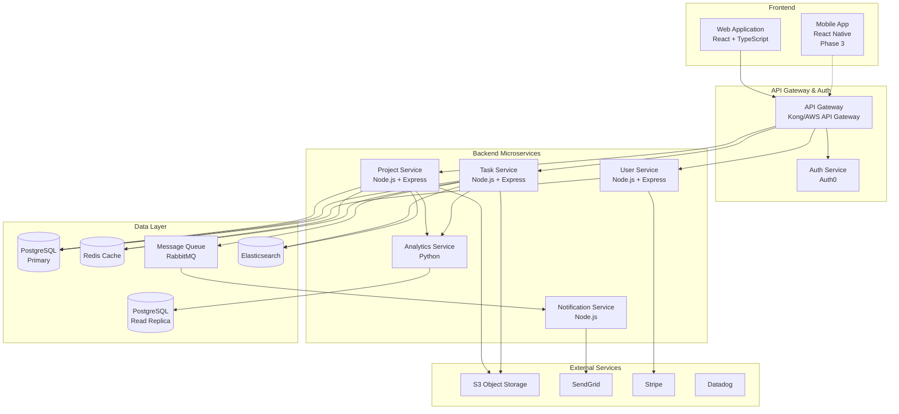

# SaaSサービス設計書：TaskFlow

> **作成日**: 2024-11-17
> **バージョン**: 1.0
> **ステータス**: Draft
> **最終更新**: 2024-11-17

---

## 1. エグゼクティブサマリー

### 1.1 サービス概要
TaskFlowは、中小企業向けのシンプルで直感的なプロジェクト管理SaaSです。複雑な設定不要で、チームが即座にプロジェクトを開始し、タスクを効率的に管理できるソリューションを提供します。

### 1.2 主要な価値提案
- **即座に始められる**: 複雑な初期設定なしで5分で利用開始
- **シンプルな操作性**: 非IT部門でも直感的に使える設計
- **リアルタイム可視化**: プロジェクトの進捗を一目で把握
- **手頃な価格**: 中小企業でも導入しやすい価格設定
- **柔軟なワークフロー**: 業種を問わず適用可能

### 1.3 ターゲット市場
- 従業員数10〜200名の中小企業
- プロジェクト管理ツールを初めて導入する企業
- 既存ツールが複雑すぎると感じている企業
- 日本国内市場を中心に展開

### 1.4 ビジネス目標
- **12ヶ月後**: ARR ¥50M、有料顧客500社
- **24ヶ月後**: ARR ¥200M、有料顧客2,000社
- **36ヶ月後**: ARR ¥500M、有料顧客5,000社
- チャーンレート: < 5%、NPS: > 50

---

## 2. ビジネスモデルキャンバス

### 2.1 顧客セグメント (Customer Segments)

#### 主要顧客セグメント
- **セグメント1: 成長期スタートアップ（従業員10-50名）**
  - 業界: IT、コンサルティング、マーケティング
  - 企業規模: 従業員10-50名
  - 特徴: 急成長中、プロセス標準化のニーズ、予算制約あり

- **セグメント2: 小規模事業会社（従業員50-200名）**
  - 業界: 製造、建設、サービス業
  - 企業規模: 従業員50-200名
  - 特徴: 従来型管理からデジタル化、部門横断プロジェクト増加

#### ペルソナ定義
**ペルソナ1: プロジェクトマネージャー（佐藤さん、35歳）**
- 年齢層: 30-45歳
- 課題: ExcelやSlackでの情報分散、進捗把握の困難さ
- 目標: チーム全体の可視化、効率的な進捗管理
- 利用シーン: 朝会での進捗確認、週次レポート作成、リソース調整

**ペルソナ2: チームリーダー（田中さん、28歳）**
- 年齢層: 25-35歳
- 課題: メンバーのタスク状況不明、優先順位の調整困難
- 目標: チーム生産性向上、残業削減
- 利用シーン: 日次タスク確認、メンバーとのコミュニケーション

### 2.2 価値提案 (Value Propositions)

#### 解決する課題
1. **課題1: 情報の分散とコミュニケーションロス**
   - 現状の問題: Excel、メール、チャットにタスク情報が分散、最新状況が不明
   - 提供する解決策: 一元化されたタスク管理とリアルタイム更新
   - 定量的効果: 情報検索時間を60%削減、会議時間を30%削減

2. **課題2: プロジェクト進捗の不可視性**
   - 現状の問題: 進捗報告に時間がかかる、問題の早期発見が困難
   - 提供する解決策: ビジュアルダッシュボードでリアルタイム可視化
   - 定量的効果: 報告作業時間を70%削減、問題発見を平均3日早期化

3. **課題3: ツールの複雑性と導入障壁**
   - 現状の問題: 既存ツールが複雑で学習コスト高、定着しない
   - 提供する解決策: 直感的UI/UX、5分で始められるオンボーディング
   - 定量的効果: 研修時間を80%削減、利用定着率90%以上

#### 提供価値
- **機能的価値**: タスク管理、進捗可視化、チーム協働、レポート自動生成
- **感情的価値**: ストレス軽減、達成感の可視化、チームの一体感
- **社会的価値**: ワークライフバランス改善、生産性向上による競争力強化

#### 競合優位性
- **シンプルさ**: 機能を絞り込み、誰でも使えるUI/UX
- **日本語ネイティブ**: 日本の商習慣に最適化されたワークフロー
- **中小企業特化**: 大企業向けツールにはない手頃な価格と必要十分な機能
- **迅速な顧客サポート**: 日本語での手厚いサポート体制

### 2.3 チャネル (Channels)

#### 認知フェーズ
- コンテンツマーケティング（ブログ、ホワイトペーパー）
- SEO対策（「プロジェクト管理 中小企業」等）
- SNS（LinkedIn、Twitter/X）
- ウェビナー開催

#### 評価フェーズ
- 無料トライアル（14日間）
- デモ動画・チュートリアル
- ケーススタディ公開
- 無料オンラインデモ

#### 購入フェーズ
- セルフサービスサインアップ
- オンライン決済（クレジットカード、請求書払い）
- エンタープライズ向け営業チーム

#### 配送フェーズ
- クラウドベースのSaaS（即時利用開始）
- オンボーディングウィザード
- メールでのガイド配信

#### アフターサービス
- チャット・メールサポート（日本語）
- ナレッジベース・FAQ
- ユーザーコミュニティ
- 定期的な機能アップデート

### 2.4 顧客との関係 (Customer Relationships)

- **獲得戦略**:
  - Freemiumモデルで気軽に試せる環境
  - 無料トライアルでの機能体験
  - リファラルプログラム（紹介で両者に特典）

- **維持戦略**:
  - カスタマーサクセスチームによる定期フォロー
  - 利用状況分析に基づく改善提案
  - ユーザーコミュニティでのベストプラクティス共有

- **拡大戦略**:
  - 利用ユーザー数・プロジェクト数に応じたアップグレード提案
  - 新機能リリース時のプラン見直し提案
  - 企業内他部門への横展開サポート

- **サポート方針**:
  - 平日9:00-18:00のチャット・メールサポート
  - 上位プランでは電話サポート・専任担当者
  - コミュニティフォーラムでのピアサポート

### 2.5 収益の流れ (Revenue Streams)

#### 価格モデル
- **モデル名**: Freemium + Tiered Subscription
- **価格帯**: 月額 ¥0 〜 ¥100,000+

#### プランと価格設定

| プラン名 | 月額料金 | 年額料金 | 主要機能 | ターゲット |
|---------|---------|---------|---------|---------|
| Free    | ¥0      | -       | 3ユーザー、5プロジェクト、基本機能 | 小規模チーム、トライアル |
| Starter | ¥5,000  | ¥50,000（17%割引） | 10ユーザー、無制限プロジェクト、レポート機能 | 10-20名チーム |
| Business| ¥15,000 | ¥150,000（17%割引） | 30ユーザー、高度な分析、API連携 | 20-50名チーム |
| Enterprise| カスタム | カスタム | 無制限ユーザー、専任サポート、SSO | 50名以上、複数部門 |

**追加オプション**:
- 追加ユーザー: ¥500/ユーザー/月
- ストレージ拡張: ¥1,000/10GB/月
- 高度なセキュリティパック: ¥10,000/月

#### 収益予測
- **Year 1**: ARR ¥50M（有料顧客500社、平均ARPU ¥100K）
- **Year 2**: ARR ¥200M（有料顧客2,000社、平均ARPU ¥100K）
- **Year 3**: ARR ¥500M（有料顧客5,000社、平均ARPU ¥100K）

### 2.6 主要リソース (Key Resources)

- **人的リソース**:
  - エンジニア（フロント2名、バック2名、インフラ1名）
  - プロダクトマネージャー（1名）
  - デザイナー（1名）
  - カスタマーサクセス（2名）
  - マーケティング（1名）

- **物理的リソース**:
  - クラウドインフラ（AWS）
  - 開発環境・ツール

- **知的リソース**:
  - プロジェクト管理のベストプラクティスナレッジ
  - 顧客データと利用パターン
  - ブランドと顧客信頼

- **財務リソース**:
  - シード資金: ¥100M
  - 運転資金: 18ヶ月分

### 2.7 主要活動 (Key Activities)

- **開発活動**:
  - 2週間スプリントでの機能開発
  - 継続的なバグ修正と性能改善
  - セキュリティアップデート

- **マーケティング活動**:
  - コンテンツマーケティング（週2本のブログ記事）
  - SEO最適化
  - ウェビナー（月1回）
  - SNSエンゲージメント

- **販売活動**:
  - インバウンドリードへの対応
  - デモ実施
  - エンタープライズ営業

- **運用活動**:
  - カスタマーサポート（平日9-18時）
  - システム監視・保守
  - データバックアップ

### 2.8 主要パートナー (Key Partnerships)

- **技術パートナー**:
  - AWS（クラウドインフラ）
  - Stripe（決済処理）
  - SendGrid（メール配信）
  - Auth0（認証基盤）

- **販売パートナー**:
  - ITコンサルティング会社（リセラー）
  - 会計ソフトベンダー（連携・共同販売）

- **外部サービス**:
  - Slack、Microsoft Teams（連携）
  - Google Workspace、Microsoft 365（SSO）
  - Zapier（ワークフロー連携）

### 2.9 コスト構造 (Cost Structure)

#### 固定費（月額）
- **人件費**: ¥5,000,000（10名 × 平均¥500K）
- **インフラ基本費**: ¥200,000（AWS予約インスタンス）
- **オフィス費**: ¥300,000
- **SaaS/ツール費**: ¥100,000
- **合計固定費**: ¥5,600,000/月

#### 変動費
- **クラウドコスト**: 顧客数 × ¥500 + データ転送量
- **マーケティング費**: MRR × 30%
- **決済手数料**: 取引額 × 3.6%
- **サポート費**: ¥20,000/100顧客

#### 主要指標（目標値）
- **CAC (Customer Acquisition Cost)**: ¥30,000
- **LTV (Lifetime Value)**: ¥360,000（¥10,000 MRR × 36ヶ月 × (1 - 月次Churn 2.5%)）
- **LTV/CAC比率**: 12:1（理想的）
- **Churn Rate**: < 5%/年（< 0.42%/月）
- **Gross Margin**: > 80%

---

## 3. 市場分析

### 3.1 市場規模と成長性

#### TAM (Total Addressable Market)
- **市場規模**: 約¥500B（日本のプロジェクト管理ソフトウェア市場）
- **成長率**: 年間12-15%（2024-2028予測）
- **データソース**: IDC Japan、Gartner

#### SAM (Serviceable Addressable Market)
- **市場規模**: 約¥50B（従業員10-200名の中小企業セグメント）
- **対象セグメント**: 約100,000社の中小企業

#### SOM (Serviceable Obtainable Market)
- **初期目標**: ¥50M ARR（市場シェア 0.1%）
- **3年後目標**: ¥500M ARR（市場シェア 1%）

### 3.2 市場トレンド
1. **トレンド1: リモートワーク・ハイブリッドワークの定着**
   - コロナ後も継続する柔軟な働き方
   - 分散チームの協働ツールニーズ増大
   - 非同期コミュニケーションの重要性

2. **トレンド2: DX推進と業務効率化の加速**
   - 中小企業のデジタル化投資増加
   - 政府のDX推進支援策
   - 人手不足による生産性向上圧力

3. **トレンド3: ノーコード・ローコードツールの台頭**
   - 非IT部門でも使える直感的ツール需要
   - カスタマイズ性と使いやすさのバランス
   - IT部門への依存度低減

### 3.3 競合分析

#### 直接競合

| 競合名 | 強み | 弱み | 価格帯 | 市場シェア |
|--------|------|------|--------|-----------|
| Backlog | 日本製、多機能、Git連携 | UI複雑、価格高め | ¥12,980-¥82,280/月 | 20% |
| Asana | グローバル標準、豊富な機能 | 日本語化不完全、高価格 | $10.99-$24.99/user/月 | 15% |
| Jooto | シンプル、カンバン式 | 機能限定的、スケーラビリティ | ¥500-¥1,300/user/月 | 10% |
| Trello | 無料プラン充実、直感的 | プロジェクト管理機能弱い | $0-$17.50/user/月 | 25% |

#### 間接競合
- Microsoft Project（大企業向け、複雑）
- Excel + SharePoint（従来型、非効率）
- Slack + Google Drive（統合管理機能なし）

#### ポジショニング
```
        高機能・複雑
          |
          |
  Backlog |  MS Project
   Asana  |
          |
低価格 ---+--- 高価格
          |
  Jooto   |
  TaskFlow|  (自社)
  Trello  |
          |
    シンプル・使いやすい
```

**TaskFlowのポジショニング**:
- シンプルさと必要十分な機能のバランス
- 中小企業に最適化した価格帯
- 日本市場特化の強み

### 3.4 参入障壁
- **技術的障壁**: 低（クラウド技術の成熟）
- **規制障壁**: 低（一般的なデータ保護法規制のみ）
- **ネットワーク効果**: 中（チーム内での採用が広がるとスイッチングコスト高）
- **ブランド**: 既存プレイヤーの知名度（克服可能）

**参入機会**:
- 中小企業市場は大手が手薄
- 日本特化の使いやすさで差別化可能
- Freemiumモデルで試用障壁を下げる

---

## 4. プロダクトビジョン

### 4.1 ミッション
「すべての中小企業が、シンプルなツールでプロジェクトを成功させる世界を創る」

### 4.2 ビジョン
3年後、日本の中小企業5,000社が TaskFlow を使って、チームの生産性を30%向上させ、働き方改革を実現している状態を目指す。

### 4.3 プロダクト原則
1. **原則1: シンプル第一**
   - 機能追加よりも使いやすさを優先
   - 3クリック以内で主要操作を完了
   - 視覚的に直感的なUI

2. **原則2: 実用性重視**
   - 理論よりも実際の現場で使える機能
   - 日本の商習慣に合わせたワークフロー
   - 段階的な機能習得が可能

3. **原則3: 迅速な価値提供**
   - 5分で始められるオンボーディング
   - 初日から効果を実感できる設計
   - 継続的な小さな改善

### 4.4 コア機能

#### MVP機能
| 機能ID | 機能名 | 説明 | 優先度 | 工数見積 |
|--------|--------|------|--------|----------|
| F-001  | プロジェクト管理 | プロジェクト作成、編集、アーカイブ | High | 2週間 |
| F-002  | タスク管理 | タスク作成、割り当て、ステータス管理、期限設定 | High | 3週間 |
| F-003  | カンバンボード | ドラッグ&ドロップでのタスク移動、ステータス列カスタマイズ | High | 2週間 |
| F-004  | ガントチャート | タイムラインビュー、依存関係表示 | Medium | 3週間 |
| F-005  | ダッシュボード | プロジェクト進捗、期限間近タスク、チーム負荷の可視化 | High | 2週間 |
| F-006  | チーム管理 | メンバー招待、権限設定、チーム編成 | High | 1週間 |
| F-007  | コメント・通知 | タスクへのコメント、メンション、リアルタイム通知 | High | 2週間 |
| F-008  | ファイル添付 | タスク・プロジェクトへのファイル添付（最大10MB） | Medium | 1週間 |
| F-009  | 検索機能 | タスク、プロジェクト、コメントの全文検索 | Medium | 1週間 |
| F-010  | レポート生成 | 週次・月次の進捗レポート自動生成 | Medium | 2週間 |

#### 将来機能
| 機能ID | 機能名 | 説明 | リリース予定 |
|--------|--------|------|--------------|
| F-101  | タイムトラッキング | タスクごとの作業時間記録 | Phase 2 (6-9ヶ月) |
| F-102  | 予算管理 | プロジェクトごとの予算・コスト管理 | Phase 2 (6-9ヶ月) |
| F-103  | テンプレート | プロジェクト・タスクテンプレート | Phase 2 (9-12ヶ月) |
| F-104  | API公開 | 外部連携用REST API | Phase 3 (12-18ヶ月) |
| F-105  | モバイルアプリ | iOS/Androidネイティブアプリ | Phase 3 (15-18ヶ月) |
| F-106  | AI推奨機能 | タスク優先順位提案、リスク予測 | Phase 4 (18-24ヶ月) |

### 4.5 ユーザーストーリー

#### エピック1: プロジェクト立ち上げ
```
As a プロジェクトマネージャー
I want to 新しいプロジェクトを5分以内に立ち上げる
So that チームがすぐに作業を開始できる
```

**受入基準**:
- [ ] プロジェクト名、説明、期間を入力してプロジェクトを作成できる
- [ ] チームメンバーを招待できる
- [ ] 初期タスクリストを作成できる
- [ ] テンプレートから迅速にプロジェクトを開始できる（Phase 2）

#### エピック2: 日次タスク管理
```
As a チームメンバー
I want to 自分のタスクを一覧で確認し、進捗を更新する
So that 今日やるべきことに集中できる
```

**受入基準**:
- [ ] 自分に割り当てられたタスクを一覧表示できる
- [ ] タスクのステータスを簡単に更新できる（ToDo → Doing → Done）
- [ ] 期限が近いタスクがハイライトされる
- [ ] 完了したタスクに達成感がある（視覚的フィードバック）

#### エピック3: 進捗可視化とレポート
```
As a プロジェクトマネージャー
I want to プロジェクトの進捗状況をリアルタイムで把握する
So that 問題を早期に発見し、適切な対応ができる
```

**受入基準**:
- [ ] ダッシュボードでプロジェクト全体の進捗率を確認できる
- [ ] 遅延リスクのあるタスクがアラート表示される
- [ ] チームメンバーの負荷状況を可視化できる
- [ ] ワンクリックで週次レポートを生成できる

---

## 5. 技術アーキテクチャ

### 5.1 システム全体像



### 5.2 技術スタック

#### フロントエンド
- **フレームワーク**: React 18 + TypeScript
- **状態管理**: Redux Toolkit + RTK Query
- **UI/UX**: Tailwind CSS + Headless UI + Framer Motion
- **ビルドツール**: Vite
- **テスト**: Vitest + React Testing Library

#### バックエンド
- **言語**: Node.js 20 LTS + TypeScript
- **フレームワーク**: Express.js
- **API設計**: RESTful API + GraphQL（Phase 2）
- **認証**: Auth0 + JWT
- **バリデーション**: Zod
- **ORM**: Prisma

#### インフラ
- **クラウドプロバイダー**: AWS
  - EC2/ECS（コンピューティング）
  - RDS PostgreSQL（データベース）
  - ElastiCache Redis（キャッシュ）
  - S3（ストレージ）
  - CloudFront（CDN）
  - Route53（DNS）
- **コンテナ**: Docker + ECS Fargate
- **CI/CD**: GitHub Actions + AWS CodeDeploy
- **監視**: Datadog + Sentry
- **ログ**: CloudWatch Logs + Elasticsearch

#### データベース
- **メインDB**: PostgreSQL 15（RDS）
  - Multi-AZ構成
  - 自動バックアップ（7日間保持）
- **キャッシュ**: Redis 7（ElastiCache）
  - セッション管理
  - API レスポンスキャッシュ
- **検索**: Elasticsearch 8
  - タスク・プロジェクト全文検索

### 5.3 スケーラビリティ設計

#### 水平スケーリング
- **戦略**: マイクロサービスアーキテクチャ採用
- **負荷分散**: Application Load Balancer（ALB）
- **オートスケーリング**: CPU使用率70%でスケールアウト

#### データベーススケーリング
- **読み取りレプリカ**: レポート・分析クエリ用に2台
- **シャーディング戦略**: テナント（会社）IDベースのシャーディング（Phase 3以降）
- **コネクションプーリング**: PgBouncer

#### キャッシング戦略
- **CDN**: CloudFront（静的アセット、画像）
- **アプリケーションキャッシュ**: Redis（セッション、API レスポンス、集計データ）
- **データベースキャッシュ**: PostgreSQL shared_buffers最適化

### 5.4 セキュリティとコンプライアンス

#### セキュリティ対策
- **認証・認可**:
  - OAuth 2.0 + OpenID Connect（Auth0）
  - RBAC（Role-Based Access Control）
  - MFA対応（EnterpriseプランG）
- **データ暗号化**:
  - TLS 1.3（通信）
  - AES-256（保存データ）
  - データベース暗号化（RDS）
- **脆弱性対策**:
  - 定期的な脆弱性スキャン（Snyk）
  - OWASP Top 10対策
  - WAF（AWS WAF）
  - DDoS対策（AWS Shield）
- **ログ監査**:
  - アクセスログ記録（CloudWatch）
  - 操作ログ（誰が何をしたか）
  - 定期的なログ分析

#### コンプライアンス
- **GDPR**: データポータビリティ、削除権対応
- **個人情報保護法**: 適切な取得・管理・削除
- **業界規制**: 一般的なビジネスツールのため特別な規制なし
- **ISO 27001**: 取得予定（Year 2）

### 5.5 パフォーマンス目標
- **API応答時間**: < 200ms (p95), < 500ms (p99)
- **ページロード時間**: < 2.0秒（初回）、< 1.0秒（再訪問）
- **稼働率**: 99.9%（年間ダウンタイム < 8.76時間）
- **同時接続数**: 10,000ユーザー（Year 1）、100,000ユーザー（Year 3）

---

## 6. KPI設計とメトリクス

### 6.1 ビジネスKPI

#### 成長指標
- **MRR (Monthly Recurring Revenue)**:
  - Year 1目標: ¥4.2M（月平均）
  - Year 3目標: ¥42M
- **ARR (Annual Recurring Revenue)**:
  - Year 1目標: ¥50M
  - Year 3目標: ¥500M
- **成長率 (MoM/YoY)**:
  - MoM: 15-20%（初年度）
  - YoY: 300%（Year 1 → Year 2）、150%（Year 2 → Year 3）

#### 顧客獲得
- **新規サインアップ数**: 月間300社（Year 1平均）
- **有料転換率**: 15%（Free → Paid）
- **CAC (Customer Acquisition Cost)**: ¥30,000

#### 顧客維持
- **Churn Rate (解約率)**: < 5%/年（< 0.42%/月）
- **Retention Rate (継続率)**: > 95%/年
- **NRR (Net Revenue Retention)**: > 100%（アップセル・クロスセルで達成）

#### 顧客価値
- **ARPU (Average Revenue Per User)**: ¥100,000/年
- **LTV (Customer Lifetime Value)**: ¥360,000（36ヶ月想定）
- **LTV/CAC比率**: 12:1

### 6.2 プロダクトKPI

#### エンゲージメント
- **DAU (Daily Active Users)**: サインアップユーザーの40%
- **MAU (Monthly Active Users)**: サインアップユーザーの70%
- **DAU/MAU比率**: > 57%（高いスティッキネス）
- **セッション時間**: 平均15分/日

#### 機能利用
- **主要機能利用率**:
  - タスク作成: 90%
  - カンバンボード: 70%
  - ダッシュボード: 60%
  - レポート生成: 40%
- **機能別アクティブユーザー数**: 週次で計測

#### コンバージョン
- **サインアップ→アクティベーション**: 80%（初回タスク作成）
- **無料→有料転換**: 15%（14日以内）
- **プランアップグレード率**: 20%/年

### 6.3 技術KPI
- **API可用性**: > 99.9%
- **平均応答時間**: < 200ms (p95)
- **エラー率**: < 0.1%
- **デプロイ頻度**: 週2回
- **MTTR (Mean Time To Recovery)**: < 1時間

### 6.4 カスタマーサクセスKPI
- **NPS (Net Promoter Score)**: > 50
- **CSAT (Customer Satisfaction Score)**: > 4.5/5
- **Time to Value**: < 1日（初回タスク完了まで）
- **サポート対応時間**:
  - 初回応答: < 2時間
  - 解決時間: < 24時間

---

## 7. Go-to-Market戦略

### 7.1 ローンチ戦略

#### フェーズ1: クローズドベータ (4週間)
- **目標**: プロダクトの検証、初期フィードバック収集
- **参加者**: 10-20社の友人・知人の会社、アーリーアダプター
- **目的**:
  - バグ修正
  - UX改善
  - 主要機能の使いやすさ検証
  - ケーススタディ作成

#### フェーズ2: オープンベータ (8週間)
- **目標**: 100社のベータユーザー獲得
- **参加者**: 招待制から一般公開へ
- **目的**:
  - スケーラビリティテスト
  - オンボーディングプロセス改善
  - カスタマーサポート体制確立
  - 初期ユーザーコミュニティ形成

#### フェーズ3: 一般リリース
- **目標**: Year 1で500社の有料顧客獲得
- **施策**:
  - プレスリリース配信
  - ローンチイベント開催
  - SNS・メディア露出
  - Freemiumモデルの本格展開

### 7.2 マーケティング戦略

#### チャネル別戦略
- **コンテンツマーケティング**:
  - ブログ記事（週2本）: プロジェクト管理Tips、生産性向上ノウハウ
  - ホワイトペーパー（四半期1本）: 業界レポート、ベストプラクティス
  - ケーススタディ（月1本）: 導入事例、成功ストーリー

- **SEO/SEM**:
  - ターゲットキーワード: 「プロジェクト管理ツール」「タスク管理 中小企業」「チーム協働ツール」
  - Google広告（月額¥500K）
  - リターゲティング広告

- **SNSマーケティング**:
  - Twitter/X: 生産性Tips、製品アップデート
  - LinkedIn: BtoB向けコンテンツ、ソートリーダーシップ
  - YouTube: チュートリアル動画、ウェビナーアーカイブ

- **パートナーシップ**:
  - ITコンサル会社との提携（10社）
  - 会計ソフト・CRMとの連携（Freee、MoneyForward、Salesforce）

- **イベント**:
  - ウェビナー（月1回）: 「中小企業のためのプロジェクト管理」
  - カンファレンス出展（年2回）

#### マーケティング予算（Year 1）
| チャネル | 月額予算 | KPI | 目標値 |
|---------|---------|-----|--------|
| Google広告 | ¥500,000 | リード獲得数 | 100件/月 |
| コンテンツ制作 | ¥200,000 | オーガニック流入 | 5,000 PV/月 |
| SNS広告 | ¥100,000 | エンゲージメント | 1,000件/月 |
| イベント・ウェビナー | ¥200,000 | 参加者数 | 50名/回 |
| PR・メディア | ¥100,000 | メディア掲載 | 2件/月 |
| **合計** | **¥1,100,000** | **Total Leads** | **150-200件/月** |

### 7.3 セールス戦略

#### セールスプロセス
1. **リード獲得**:
   - Webサイトからのサインアップ
   - ウェビナー参加者
   - コンテンツダウンロード
   - リファラル

2. **リード育成**:
   - 無料トライアルメール（14日間のオンボーディングメール）
   - 使い方ガイド、Tips配信
   - ウェビナー招待

3. **商談**:
   - Businessプラン以上の問い合わせに営業フォロー
   - デモ実施
   - ROI試算提示

4. **クロージング**:
   - セルフサービス（Starter）
   - 営業主導（Business、Enterprise）
   - 契約書締結（Enterprise）

5. **オンボーディング**:
   - キックオフミーティング（Enterpriseのみ）
   - セットアップサポート
   - トレーニング提供

#### セールス組織（Year 1）
- **インサイドセールス**: 1名（問い合わせ対応、デモ実施）
- **フィールドセールス**: 0名（Year 2以降）
- **パートナーセールス**: 提携10社経由の紹介

### 7.4 カスタマーサクセス戦略

#### オンボーディング
- **初期設定サポート**:
  - ウェルカムメール（ステップバイステップガイド）
  - チュートリアル動画
  - 初回タスク作成までのガイド（24時間以内達成目標）

- **トレーニング**:
  - ナレッジベース（FAQ、ハウツー記事）
  - ウェビナー（月次）
  - 1on1サポート（Enterpriseプラン）

- **ドキュメント**:
  - ユーザーガイド
  - API ドキュメント（Phase 3）
  - ベストプラクティス集

#### 継続支援
- **定期チェックイン**:
  - 30日後: 使用状況確認、改善提案
  - 90日後: アップグレード提案
  - 四半期ごと: ビジネスレビュー（Enterprise）

- **利用促進施策**:
  - 未使用機能の紹介メール
  - 成功事例の共有
  - コミュニティイベント

- **アップセル/クロスセル**:
  - ユーザー数増加時のプランアップグレード提案
  - 新機能リリース時のアップグレード案内
  - 利用状況分析に基づく提案

---

## 8. プロダクトロードマップ

### 8.1 短期 (0-6ヶ月)

#### Q1 (Month 1-3): MVP開発とベータローンチ
- **目標**: MVPリリース、初期顧客20社獲得
- **主要マイルストーン**:
  - [x] 技術スタック決定・環境構築
  - [ ] コア機能開発（F-001 〜 F-010）
  - [ ] クローズドベータ開始（10-20社）
  - [ ] 初期フィードバック収集・改善
- **リリース機能**:
  - プロジェクト・タスク管理
  - カンバンボード
  - ダッシュボード
  - チーム管理
  - 基本的な通知機能

#### Q2 (Month 4-6): オープンベータと正式ローンチ
- **目標**: 正式リリース、100社（有料50社）獲得
- **主要マイルストーン**:
  - [ ] オープンベータ開始
  - [ ] UX改善・パフォーマンス最適化
  - [ ] セキュリティ監査
  - [ ] 正式リリース
  - [ ] マーケティング本格開始
- **リリース機能**:
  - ガントチャート改善
  - 高度な検索機能
  - レポート機能強化
  - モバイルレスポンシブ対応

### 8.2 中期 (7-12ヶ月)

#### Q3 (Month 7-9): 機能拡充と市場浸透
- **目標**: 300社（有料150社）獲得、機能拡充
- **主要マイルストーン**:
  - [ ] タイムトラッキング機能リリース（F-101）
  - [ ] 予算管理機能リリース（F-102）
  - [ ] 主要SaaS連携（Slack、Teams）
  - [ ] カスタマーサクセス体制強化

#### Q4 (Month 10-12): スケールアップ
- **目標**: 500社（有料250社）獲得、エンタープライズ対応
- **主要マイルストーン**:
  - [ ] テンプレート機能（F-103）
  - [ ] SSO対応（Enterprise）
  - [ ] 高度な権限管理
  - [ ] パートナープログラム開始

### 8.3 長期 (1-3年)

#### Year 2
- **ビジョン**: 2,000社（有料1,000社）、APIエコシステム構築
- **主要施策**:
  - REST API公開（F-104）
  - モバイルアプリリリース（F-105）
  - 業界特化テンプレート（建設、製造、IT）
  - 海外展開準備（英語版）

#### Year 3
- **ビジョン**: 5,000社（有料2,500社）、AIによる知能化
- **主要施策**:
  - AI推奨機能（F-106）
  - プロジェクト成功率予測
  - 自動化ワークフロー
  - グローバル展開（アジア太平洋）

---

## 9. リスク管理

### 9.1 ビジネスリスク

| リスク | 影響度 | 発生確率 | 対策 | 責任者 |
|--------|--------|----------|------|--------|
| 競合の価格攻勢 | High | Medium | 差別化機能強化、カスタマーサクセス注力、スイッチングコスト向上 | CEO/CPO |
| 顧客獲得コスト高騰 | High | Medium | コンテンツマーケティング強化、リファラルプログラム、オーガニック流入増加 | CMO |
| 高いChurn Rate | High | Low | オンボーディング改善、定期的なエンゲージメント、顧客フィードバック反映 | Head of CS |
| 資金ショート | High | Low | 厳格な予算管理、追加資金調達準備、収益化加速 | CFO |

### 9.2 技術リスク

| リスク | 影響度 | 発生確率 | 対策 | 責任者 |
|--------|--------|----------|------|--------|
| システムダウン | High | Low | 冗長化構成、自動フェイルオーバー、定期バックアップ、監視強化 | CTO |
| セキュリティ侵害 | High | Low | 定期的な脆弱性診断、ペネトレーションテスト、セキュリティ教育 | CTO |
| スケーラビリティ問題 | Medium | Medium | 早期の負荷テスト、段階的スケーリング設計、キャッシング戦略 | Tech Lead |
| データ損失 | High | Low | 自動バックアップ（日次）、Point-in-Time Recovery、災害復旧計画 | CTO |

### 9.3 市場リスク

| リスク | 影響度 | 発生確率 | 対策 | 責任者 |
|--------|--------|----------|------|--------|
| 市場の縮小 | Medium | Low | 複数セグメント展開、機能拡張、海外展開 | CEO |
| 新規強力競合の参入 | Medium | Medium | 継続的な差別化、顧客ロイヤルティ強化、迅速な機能開発 | CEO/CPO |
| 規制変更 | Low | Low | 法規制の継続的モニタリング、コンプライアンス体制 | Legal |

---

## 10. 組織と役割

### 10.1 チーム構成

#### 現在のチーム（創業時）
- **創業者/CEO**: 佐々木太郎（ビジネス戦略、資金調達、営業）
- **共同創業者/CTO**: 山田花子（技術戦略、開発統括）
- **フロントエンドエンジニア**: 2名
- **バックエンドエンジニア**: 2名
- **インフラエンジニア**: 1名（兼務）
- **プロダクトマネージャー**: 1名
- **デザイナー**: 1名（UI/UX）
- **カスタマーサクセス**: 1名
- **マーケティング**: 1名

**合計: 10名**

#### 採用計画 (12ヶ月)
| 役割 | 人数 | タイムライン | 優先度 |
|------|------|-------------|--------|
| バックエンドエンジニア | 1名 | Month 3 | High |
| カスタマーサクセス | 1名 | Month 6 | High |
| セールス（インサイド） | 1名 | Month 6 | Medium |
| マーケティング | 1名 | Month 9 | Medium |
| フロントエンドエンジニア | 1名 | Month 9 | Low |
| **合計** | **5名** | **Year 1** | **15名体制** |

### 10.2 意思決定プロセス
- **プロダクト意思決定**:
  - CEO、CTO、PM による週次プロダクト会議
  - 顧客フィードバック、データ分析に基づく優先順位付け

- **技術意思決定**:
  - CTO主導、エンジニアチーム全体で議論
  - RFC（Request for Comments）プロセス

- **ビジネス意思決定**:
  - CEO主導、経営チーム（CEO、CTO、CFO相当）で協議
  - 重要事項は取締役会承認

---

## 11. 財務計画

### 11.1 初期投資
- **開発費**: ¥30M（人件費6ヶ月分 + 外注）
- **マーケティング費**: ¥10M（ローンチ前後6ヶ月）
- **インフラ費**: ¥5M（初期構築 + 6ヶ月運用）
- **オフィス・その他**: ¥5M
- **運転資金**: ¥50M（18ヶ月分）
- **合計**: ¥100M

### 11.2 資金調達
- **調達額**: ¥100M
- **ラウンド**: シードラウンド
- **バリュエーション**: ¥400M（post-money）
- **用途**:
  - プロダクト開発: 40%
  - マーケティング・セールス: 30%
  - 運営費: 20%
  - バッファ: 10%

### 11.3 損益計算 (3年間)

| 項目 | Year 1 | Year 2 | Year 3 |
|------|--------|--------|--------|
| 売上高 | ¥50M | ¥200M | ¥500M |
| 売上原価 | ¥10M | ¥30M | ¥60M |
| 粗利益 | ¥40M | ¥170M | ¥440M |
| 営業費用 | ¥90M | ¥150M | ¥300M |
| - 人件費 | ¥60M | ¥100M | ¥180M |
| - マーケティング費 | ¥15M | ¥30M | ¥80M |
| - その他SG&A | ¥15M | ¥20M | ¥40M |
| 営業利益 | **-¥50M** | **¥20M** | **¥140M** |
| 営業利益率 | -100% | 10% | 28% |

**前提**:
- 売上成長率: 300%（Y1→Y2）、150%（Y2→Y3）
- 粗利率: 80%
- 人件費: 売上の50%（Year 3）へ段階的に低減
- マーケティング費: 売上の15-20%

### 11.4 ユニットエコノミクス
- **LTV**: ¥360,000
  - ARPU: ¥100,000/年
  - 平均顧客寿命: 36ヶ月
  - Gross Margin: 80%
  - LTV = ¥100,000 × 3 × 0.8 = ¥240,000（保守的）

- **CAC**: ¥30,000
  - マーケティング費: ¥15M/年
  - 新規顧客獲得: 500社/年
  - CAC = ¥15M / 500 = ¥30,000

- **LTV/CAC**: 8:1（保守的）〜 12:1（理想的）
- **回収期間**: 3-4ヶ月
- **粗利率**: 80%

---

## 12. 成功指標と評価基準

### 12.1 6ヶ月後の成功指標
- [ ] ユーザー数: 1,000社（有料100社）
- [ ] MRR: ¥1.0M
- [ ] Churn Rate: < 5%
- [ ] NPS: > 40
- [ ] アクティベーション率: > 70%
- [ ] MVP機能リリース完了

### 12.2 12ヶ月後の成功指標
- [ ] ユーザー数: 3,000社（有料500社）
- [ ] ARR: ¥50M
- [ ] MRR: ¥4.2M
- [ ] LTV/CAC: > 8:1
- [ ] Net Revenue Retention: > 100%
- [ ] チームサイズ: 15名
- [ ] 主要機能フェーズ2完了

### 12.3 レビューサイクル
- **週次レビュー**:
  - プロダクトKPI（DAU/MAU、エンゲージメント、バグ）
  - 開発進捗
  - カスタマーサポート状況

- **月次レビュー**:
  - ビジネスKPI（MRR、Churn、CAC、LTV）
  - マーケティング・セールスパフォーマンス
  - 財務状況

- **四半期レビュー**:
  - 戦略と方向性
  - ロードマップ見直し
  - 組織・採用計画
  - 資金調達検討

---

## 13. 付録

### 13.1 用語集
| 用語 | 定義 |
|------|------|
| ARR | Annual Recurring Revenue（年間経常収益） |
| MRR | Monthly Recurring Revenue（月間経常収益） |
| CAC | Customer Acquisition Cost（顧客獲得コスト） |
| LTV | Lifetime Value（顧客生涯価値） |
| Churn Rate | 解約率 |
| NPS | Net Promoter Score（顧客推奨度） |
| CSAT | Customer Satisfaction Score（顧客満足度） |
| DAU | Daily Active Users（日次アクティブユーザー） |
| MAU | Monthly Active Users（月次アクティブユーザー） |
| MVP | Minimum Viable Product（実用最小限の製品） |

### 13.2 参考資料
- SaaS Metrics 2.0 - David Skok (Matrix Partners)
- The SaaS Business Model - Bessemer Venture Partners
- プロジェクト管理市場調査 - IDC Japan
- 中小企業デジタル化調査 - 中小企業庁

### 13.3 変更履歴

| 日付 | バージョン | 変更内容 | 変更者 |
|------|-----------|---------|--------|
| 2024-11-17 | 1.0 | 初版作成 | 佐々木太郎（CEO） |

---

## ドキュメント承認

| 役割 | 氏名 | 承認日 | 署名 |
|------|------|--------|------|
| CEO  | 佐々木太郎 | 2024-11-17 | ✓ |
| CTO  | 山田花子 | 2024-11-17 | ✓ |
| CPO  | （兼任: CEO） | 2024-11-17 | ✓ |
