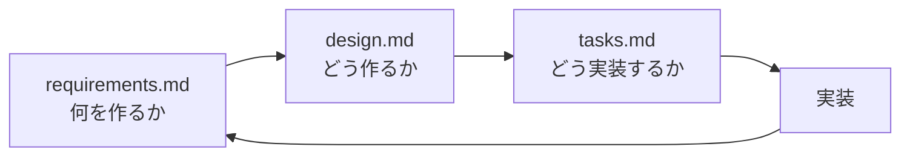

# SDD-Docs - ソフトウェア設計ドキュメント管理スキル

Claude Codeのための構造化されたソフトウェア設計ドキュメント（SDD）作成・管理スキルです。EARS記法を用いた要件定義、技術設計、タスク管理の3つのドキュメントを一貫したプロセスで作成・維持します。

---

## 目次

- [特徴](#特徴)
- [クイックスタート](#クイックスタート)
- [EARS記法について](#ears記法について)
- [ドキュメント構成](#ドキュメント構成)
- [使い方](#使い方)
- [ワークフロー](#ワークフロー)
- [ベストプラクティス](#ベストプラクティス)
- [FAQ](#faq)
- [トラブルシューティング](#トラブルシューティング)
- [リファレンス](#リファレンス)

---

## 特徴

### 解決する課題

- 曖昧で測定不可能な要件定義
- 技術的決定事項の記録不足
- タスク分解と進捗管理の困難さ
- ドキュメントの一貫性の欠如

### 提供する価値

- **明確性**: EARS記法による曖昧さのない要件定義
- **追跡可能性**: 要件→設計→タスクの明確な紐付け
- **テスト可能性**: すべての要件が検証可能
- **一貫性**: 統一されたドキュメント構造

---

## クイックスタート

### 1. スキルを有効化

Claude Codeでこのスキルが自動的に提案されます。

### 2. プロジェクトでドキュメントを初期化

```
docsディレクトリを初期化してください
```

### 3. 生成されるドキュメント

```
your-project/
└── docs/
    ├── requirements.md  # 要件定義書（EARS記法）
    ├── design.md        # 設計書
    └── tasks.md         # タスク管理書
```

### 4. 使用例

**要件を追加:**
```
ユーザー認証機能の要件を追加してください
```

**設計を文書化:**
```
認証システムのアーキテクチャを設計書に追加してください
```

**タスクに分解:**
```
認証機能を実装可能なタスクに分解してください
```

---

## EARS記法について

EARS（Easy Approach to Requirements Syntax）は、明確で曖昧さのない要件を記述するための構造化された記法です。

### 5つの基本パターン

| パターン | 形式 | 使用場面 | 例 |
|---------|------|----------|-----|
| **基本** | システムは〜しなければならない | 常時適用される要件 | システムはパスワードをbcryptで暗号化しなければならない |
| **イベント** | 〜の時、システムは〜しなければならない | イベント駆動要件 | ユーザーがログインボタンをクリックした時、システムは認証処理を開始しなければならない |
| **条件** | もし〜ならば、システムは〜しなければならない | 状態依存要件 | もし認証が失敗した場合、システムはエラーメッセージを表示しなければならない |
| **継続** | 〜の間、システムは〜しなければならない | 継続的要件 | ファイルアップロード中、システムは進捗バーを表示しなければならない |
| **場所** | 〜において、システムは〜しなければならない | コンテキスト固有要件 | EU地域において、システムはGDPR同意バナーを表示しなければならない |

### EARS記法の利点

- **一貫性**: すべての要件が同じ構造に従う
- **明確性**: 曖昧な表現を排除
- **テスト可能性**: 各要件が検証可能
- **完全性**: トリガー、条件、動作が明確

詳細: [EARS記法リファレンス](references/ears_notation_ja.md)

---

## ドキュメント構成

### 3つの必須ドキュメント



#### 1. requirements.md - 要件定義書

**目的**: 何を作るかを定義

**含まれる内容**:
- ユーザーストーリー（私は〜として、〜したい、なぜなら〜）
- EARS記法による受入基準（REQ-001, REQ-002...）
- 非機能要件（NFR-001, NFR-002...）

**例**:
```markdown
### ストーリー1: ユーザーログイン
**私は** 登録済みユーザーとして
**ログインしたい**
**なぜなら** 個人データにアクセスできるから

#### 受入基準
- REQ-001: ユーザーがログインボタンをクリックした時、システムは2秒以内に認証を完了しなければならない
- REQ-002: もしパスワードが誤っている場合、システムはエラーメッセージを表示しなければならない
```

#### 2. design.md - 設計書

**目的**: どのように作るかを文書化

**含まれる内容**:
- アーキテクチャ図（Mermaid形式）
- コンポーネント設計（目的、責務、インターフェース）
- データモデル・スキーマ
- 技術的決定事項と根拠

**例**:
```markdown
### コンポーネント: 認証サービス
**目的**: ユーザー認証とセッション管理
**責務**:
- JWT トークンの生成・検証
- パスワードのハッシュ化（bcrypt）
- セッションの管理

**インターフェース**:
- POST /auth/login - ログイン
- POST /auth/logout - ログアウト
```

#### 3. tasks.md - タスク管理書

**目的**: どのように実装するかを計画

**含まれる内容**:
- フェーズごとのタスク分解
- 各タスクの受入基準
- 依存関係と見積もり時間
- ステータス管理（TODO/IN_PROGRESS/BLOCKED/REVIEW/DONE）

**例**:
```markdown
#### タスク1.1: ログインエンドポイント実装
**説明**: POST /auth/loginエンドポイントの実装
**受入基準**:
- [ ] メール/パスワード検証
- [ ] JWTトークン生成
- [ ] エラーハンドリング
**依存関係**: なし
**推定工数**: 4時間
**ステータス**: `TODO`
```

---

## 使い方

### 基本的な使用フロー

1. **要件定義から開始**
   ```
   ユーザー認証機能の要件を定義してください
   ```
   → `docs/requirements.md`にEARS記法で要件が追加される

2. **設計を文書化**
   ```
   認証機能のアーキテクチャを設計してください
   ```
   → `docs/design.md`にコンポーネント設計が追加される

3. **タスクに分解**
   ```
   認証機能の実装タスクを作成してください
   ```
   → `docs/tasks.md`に実装可能なタスクが追加される

4. **実装とレビュー**
   ```
   タスク1.1を実装してください
   ```
   → コードが実装され、タスクステータスが更新される

5. **ドキュメントの検証**
   ```
   ドキュメントをレビューしてください
   ```
   → チェックリストに基づいてレビューが実行される

### 高度な使用例

**既存プロジェクトのドキュメント化:**
```
このプロジェクトの既存コードから要件と設計を抽出してください
```

**要件の検証:**
```
requirements.mdの要件がEARS記法に従っているか確認してください
```

**タスクの進捗確認:**
```
完了したタスクと残りのタスクをリストアップしてください
```

---

## ワークフロー

### 標準的な開発フロー

```
┌─────────────────────────────────────────────────────────┐
│ 1. 要件定義（requirements.md）                           │
│    ↓ ユーザーストーリーとEARS記法で「何を作るか」を定義  │
├─────────────────────────────────────────────────────────┤
│ 2. 設計（design.md）                                     │
│    ↓ アーキテクチャとコンポーネントで「どう作るか」記述  │
├─────────────────────────────────────────────────────────┤
│ 3. タスク計画（tasks.md）                                │
│    ↓ 実装可能な粒度に分解して「どう実装するか」計画      │
├─────────────────────────────────────────────────────────┤
│ 4. 実装                                                  │
│    ↓ タスクを実行し、ステータスを更新                    │
├─────────────────────────────────────────────────────────┤
│ 5. レビュー                                              │
│    ↓ ドキュメントとコードの整合性を確認                  │
├─────────────────────────────────────────────────────────┤
│ 6. 反復                                                  │
│    ↓ 新しい要件や変更に応じてドキュメントを更新          │
└─────────────────────────────────────────────────────────┘
```

### ドキュメント検証チェックリスト

**requirements.mdの確認項目:**
- [ ] すべての要件がEARS記法に従っている
- [ ] 要件IDが一意である（REQ-XXX、NFR-XXX）
- [ ] 各要件がテスト可能である
- [ ] 非機能要件が含まれている
- [ ] 具体的な数値が使用されている

**design.mdの確認項目:**
- [ ] アーキテクチャ概要がある
- [ ] 主要コンポーネントが定義されている
- [ ] インターフェースが明確である
- [ ] 技術的決定事項と根拠が記載されている
- [ ] 図表が含まれている（Mermaid推奨）

**tasks.mdの確認項目:**
- [ ] タスクが適切な粒度に分解されている（半日〜2日程度）
- [ ] 各タスクに受入基準がある
- [ ] 依存関係が明確である
- [ ] 見積もり時間が記載されている
- [ ] ステータスが有効な値である

---

## ベストプラクティス

### 1. 具体的で測定可能な値を使用

**悪い例**: システムは速くなければならない
**良い例**: システムはユーザークエリに200ミリ秒以内に応答しなければならない

### 2. 1要件1文の原則

**悪い例**: システムはデータを検証し、保存し、メールを送信しなければならない
**良い例**:
- REQ-001: システムはデータを検証しなければならない
- REQ-002: データが有効な場合、システムは保存しなければならない
- REQ-003: データ保存後、システムは確認メールを送信しなければならない

### 3. 曖昧な用語を避ける

**避けるべき**: すべきである、できる、かもしれない、おそらく、一般的に
**使用する**: しなければならない

### 4. 依存関係を明確にする

タスク間の依存関係を明記して、実装順序を明確にします。

### 5. 図表を積極的に活用

Mermaid記法でアーキテクチャ図、シーケンス図、ER図を作成します。

### 6. 継続的な同期を維持

プロジェクトの進展に応じて、ドキュメントを常に最新の状態に保ちます。

---

## FAQ

**Q: EARS記法は必須ですか？**
A: 推奨されますが、プロジェクトに応じて調整可能です。ただし、EARS記法を使用することで要件の明確性が大幅に向上します。

**Q: 既存プロジェクトにも適用できますか？**
A: はい。既存のコードベースから要件と設計を抽出して、ドキュメント化することができます。

**Q: 英語版はありますか？**
A: 現在は日本語版のみですが、将来的に英語版テンプレートの追加を検討しています。

**Q: タスクのステータス管理はどうすればいいですか？**
A: マークダウンファイル内で直接更新します。Claude Codeを使用すると自動的に更新されます。

**Q: 他のツール（Jira、GitHub Issues）との連携は？**
A: 将来的な拡張機能として検討中です。現在はマークダウンベースでの管理のみです。

---

## トラブルシューティング

### 問題: スキルが認識されない

**原因**: スキルファイルのパスが正しくない
**解決策**:
1. `.claude-plugin/marketplace.json`のパスを確認
2. `sdd-docs/SKILL.md`が存在するか確認

### 問題: テンプレートが見つからない

**原因**: テンプレートファイルのパスが間違っている
**解決策**:
```bash
ls -la assets/templates/
```
で3つのテンプレートファイルが存在するか確認

### 問題: EARS記法が正しく適用されない

**原因**: パターンの理解不足
**解決策**: [EARS記法リファレンス](references/ears_notation_ja.md)を参照し、5つの基本パターンを確認

---

## リファレンス

### 詳細ドキュメント

- **EARS記法の完全ガイド**: [ears_notation_ja.md](references/ears_notation_ja.md)
- **実装例集**: [examples_ja.md](references/examples_ja.md)
  - ECショッピングカート（requirements.md例）
  - タスク管理API（design.md例）
  - ユーザー認証機能（tasks.md例）

### テンプレート

- [requirements_template_ja.md](assets/templates/requirements_template_ja.md)
- [design_template_ja.md](assets/templates/design_template_ja.md)
- [tasks_template_ja.md](assets/templates/tasks_template_ja.md)

### ディレクトリ構造

```
sdd-docs/
├── SKILL.md                       # スキル定義ファイル
├── README.md                      # このファイル
├── assets/
│   └── templates/                 # ドキュメントテンプレート
│       ├── requirements_template_ja.md
│       ├── design_template_ja.md
│       └── tasks_template_ja.md
└── references/                    # リファレンス資料
    ├── ears_notation_ja.md        # EARS記法詳細ガイド
    └── examples_ja.md             # 実装例集
```

---

## 謝辞

- **EARS記法**: Alistair Mavin et al.による"EARS - The Easy Approach to Requirements Syntax"
- **標準規格**: IEEE 830-1998, ISO/IEC/IEEE 29148:2018
