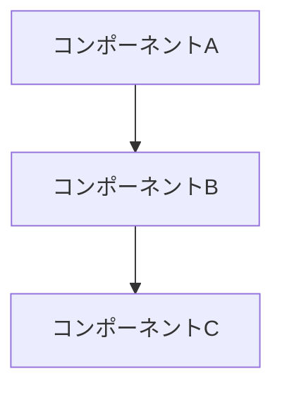
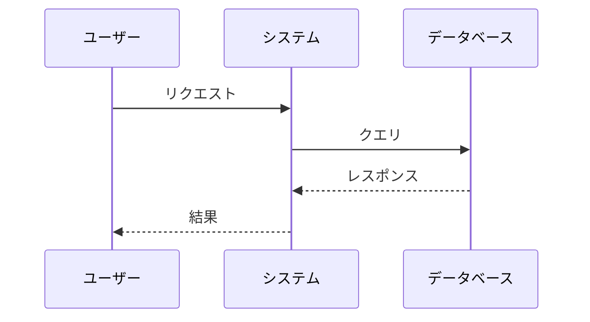

# 設計スキル

技術アーキテクチャ、コンポーネント設計、API設計、データベーススキーマを文書化する設計書を作成します。

## 概要

このスキルは、以下の成果物を作成・管理します：
- **docs/design.md**: 技術アーキテクチャ、コンポーネント、実装詳細

## このスキルを使用する場面

### 新規作成時
- 技術アーキテクチャを文書化したい場合
- コンポーネント設計を明確にしたい場合
- API設計を定義したい場合
- データベーススキーマを設計したい場合
- 技術的決定事項を記録したい場合

### 既存ドキュメントの修正時
- docs/design.mdの設計内容を更新・変更する場合
- 新しいコンポーネントを追加する場合
- API仕様を変更する場合
- アーキテクチャの見直しが必要な場合

## 前提条件

### requirements.mdとの連携
requirements.mdが存在する場合：
1. 要件を読み込み、設計との整合性を確認
2. すべての要件（REQ-XXX）に対応する設計要素があるか確認
3. 要件にない機能が設計に含まれていないか確認

## ドキュメント構造

```markdown
# 設計

## 情報の明確性チェック
### ユーザーから明示された情報
- 技術スタック: [明示されている場合は記載]
- アーキテクチャパターン: [明示されている場合は記載]

### 不明/要確認の情報
| 項目 | 現状の理解 | 確認状況 |
|------|-----------|----------|
| [項目名] | [推測内容] | [ ] 未確認 |

## アーキテクチャ概要
[システムアーキテクチャの高レベルな概要とMermaid図]

## コンポーネント
### コンポーネント1: [名前]
**目的**: [機能]
**責務**: [リスト]
**インターフェース**: [API/メソッド]

## API設計
### エンドポイント: [/api/resource]
**メソッド**: GET/POST/PUT/DELETE
**リクエスト/レスポンス**: [JSON形式]

## データベーススキーマ
### テーブル: [table_name]
| カラム | 型 | 制約 | 説明 |

## 技術的決定事項
### 決定1: [選択]
**検討した選択肢**: [リスト]
**決定**: [選択肢]
**根拠**: [理由]
```

## 設計原則

### コンポーネント設計
1. **単一責任の原則**: 各コンポーネントは1つの明確な目的を持つ
2. **疎結合**: コンポーネント間の依存関係を最小限に
3. **高凝集**: 関連する機能を同じコンポーネントに
4. **インターフェース定義**: 明確な入出力を定義

### API設計
- RESTful原則に従う
- 適切なHTTPステータスコードを使用
- バージョニング戦略を定義
- エラーレスポンスの一貫性
- ペイロードの検証とサニタイゼーション

### データベース設計
- 正規化と非正規化のバランス
- インデックス戦略
- トランザクション境界
- バックアップとリカバリ計画

## Mermaid図の活用

### コンポーネント図


### シーケンス図


## ワークフロー

1. **要件確認**: requirements.mdが存在すれば内容を確認
2. **情報分類**: 明示された情報と不明な情報を分類
3. **不明点確認**: 必要な情報をユーザーに確認
4. **アーキテクチャ設計**: 全体構成を設計
5. **コンポーネント定義**: 各コンポーネントの責務を明確化
6. **API設計**: インターフェースを定義
7. **データベース設計**: スキーマを設計
8. **整合性確認**: requirements.mdとの整合性をチェック
9. **ユーザー確認**: 承認を得て完了

## 検証チェックリスト

- [ ] アーキテクチャ概要が記載されている
- [ ] 主要コンポーネントが定義されている
- [ ] インターフェースが明確である
- [ ] 技術的決定事項と根拠が記載されている
- [ ] 必要に応じて図表が含まれている
- [ ] 情報の明確性チェックが完了している
- [ ] 不明/要確認の情報がすべて解消されている
- [ ] requirements.mdの全要件に対応する設計要素がある
- [ ] CI/CD設計が含まれている（品質ゲート、GitHub Actions）
- [ ] 品質基準が定義されている（カバレッジ80%、Linter、複雑性）

## 要件との整合性チェック

requirements.mdが存在する場合、以下を確認：

| チェック項目 | 確認内容 |
|-------------|---------|
| 機能カバレッジ | すべての要件（REQ-XXX）に対応する設計要素があるか |
| 非機能要件対応 | NFR-XXXの要件が設計に反映されているか |
| 過剰設計チェック | requirements.mdにない機能が設計に含まれていないか |

### 不整合発見時

```text
設計と要件の整合性チェックで以下の不整合を発見しました：

【設計 → 要件の不整合】
1. design.mdに「通知機能」がありますが、requirements.mdに対応する要件がありません

【要件 → 設計の不整合】
2. REQ-005（レポート出力機能）に対応する設計がありません

これらについて確認させてください：
1. 通知機能は必要ですか？対応する要件を追加しますか？
2. REQ-005の設計を追加しますか？
```

## ユーザーとの対話ガイドライン

### 確認が必要な場面

- アーキテクチャパターンの選択
- 技術スタックの選定
- データモデルの構造
- 外部サービスとの連携方法
- セキュリティ・パフォーマンス要件の具体化

### 推奨度付き選択肢の提示

```text
技術スタックについて確認させてください：

A) Next.js + TypeScript
   推奨理由：モダンで型安全、SSR/SSG対応

B) React + JavaScript
   推奨理由：シンプルで導入が容易

C) Vue.js + TypeScript
   推奨理由：学習コストが低い

どれを選択しますか？
```

## CI/CD・品質基準の設計

### 必須品質基準

設計段階で以下の品質基準を定義し、GitHub Actionsで自動検証する：

| 項目 | 基準値 | ツール例 |
|------|--------|---------|
| テストカバレッジ | 80%以上 | Jest, pytest, go test |
| Linter | エラー0件 | ESLint, Ruff, golangci-lint |
| コード複雑性 | 低（循環的複雑度10以下） | SonarQube, lizard, gocyclo |

### GitHub Actions CI設定

design.mdには以下のCI設定を含める：

```yaml
# .github/workflows/ci.yml の設計
name: CI

on:
  push:
    branches: [main, develop]
  pull_request:
    branches: [main]

jobs:
  test:
    runs-on: ubuntu-latest
    steps:
      - uses: actions/checkout@v4
      - name: Run tests with coverage
        run: npm test -- --coverage
      - name: Check coverage threshold
        run: |
          # カバレッジ80%未満で失敗
          coverage=$(cat coverage/coverage-summary.json | jq '.total.lines.pct')
          if (( $(echo "$coverage < 80" | bc -l) )); then
            echo "Coverage ${coverage}% is below 80%"
            exit 1
          fi

  lint:
    runs-on: ubuntu-latest
    steps:
      - uses: actions/checkout@v4
      - name: Run linter
        run: npm run lint

  complexity:
    runs-on: ubuntu-latest
    steps:
      - uses: actions/checkout@v4
      - name: Check code complexity
        run: npx lizard -CCN 10 src/
```

### 設計書への記載項目

design.mdの「技術的決定事項」セクションに以下を含める：

```text
## CI/CD設計

### 品質ゲート
- テストカバレッジ: 80%以上
- Linter: [選択したツール]でエラー0件
- コード複雑性: 循環的複雑度10以下

### CI/CDパイプライン
- トリガー: push/PRでmain/developブランチ
- 必須チェック: test, lint, complexity
- 成功条件: すべてのチェックがパス

### 採用ツール
- テスト: [Jest/pytest/etc.]
- カバレッジ: [Istanbul/coverage.py/etc.]
- Linter: [ESLint/Ruff/etc.]
- 複雑性: [lizard/SonarQube/etc.]
```

### 言語別推奨ツール

| 言語 | テスト/カバレッジ | Linter | 複雑性 |
|------|------------------|--------|--------|
| TypeScript/JS | Jest + Istanbul | ESLint | lizard |
| Python | pytest + coverage.py | Ruff | radon |
| Go | go test -cover | golangci-lint | gocyclo |
| Rust | cargo test + tarpaulin | clippy | - |

## 後続スキルとの連携

design.mdの作成完了後：
- **task-planning**: design.mdを基にタスクを分解

task-planningスキルで逆順レビュー（タスク → 設計 → 要件）が行われます。

## リソース

- テンプレート: `assets/templates/design_template_ja.md`
- 設計パターン: `references/design_patterns_ja.md`
- EARS記法（要件参照用）: `references/ears_notation_ja.md`
