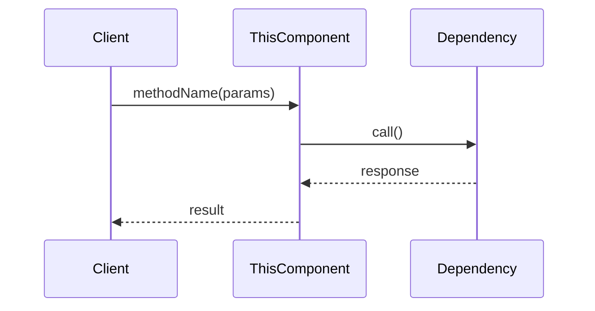
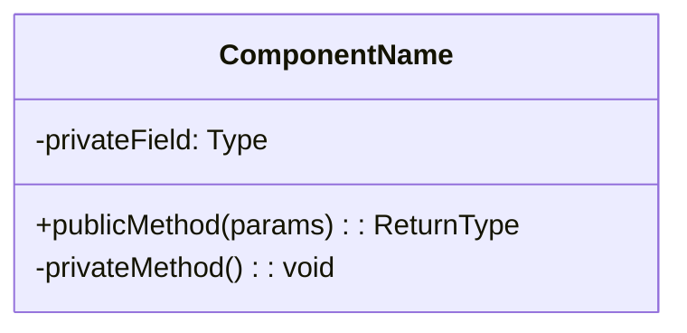

# [コンポーネント名]

## 概要

**目的**: *このコンポーネントの役割*

**責務**:
- 責務1
- 責務2
- 責務3

## 情報の明確性

### 明示された情報
- [ユーザーから明示的に指定された仕様]

### 不明/要確認の情報
- [ ] [推測が必要な項目や不明点]

---

## インターフェース

### 公開API/メソッド

#### `methodName(params): ReturnType`

**説明**: メソッドの説明

**パラメータ**:
| 名前 | 型 | 必須 | 説明 |
|------|-----|------|------|
| param1 | string | Yes | パラメータの説明 |
| param2 | number | No | パラメータの説明 |

**戻り値**: `ReturnType` - 戻り値の説明

**例外**:
- `ErrorType1`: 発生条件

**使用例**:
```typescript
const result = component.methodName('value', 123);
```

---

## 依存関係

### 依存するコンポーネント
- [ComponentB](component-b.md) @component-b.md: [依存の理由]

### 依存されるコンポーネント
- [ComponentC](component-c.md) @component-c.md: [依存の理由]

## データフロー



## 内部設計

### クラス/モジュール構造



### 状態管理（該当する場合）

| 状態 | 説明 | 遷移条件 |
|------|------|---------|
| INITIAL | 初期状態 | - |
| LOADING | 読み込み中 | データ取得開始時 |
| READY | 準備完了 | データ取得成功時 |
| ERROR | エラー状態 | データ取得失敗時 |

## エラー処理

| エラー種別 | 発生条件 | 対処方法 |
|-----------|---------|---------|
| ValidationError | 入力値が不正 | エラーメッセージを返却 |
| NetworkError | 通信エラー | リトライ後にエラーを伝播 |

## テスト観点

- [ ] 正常系: [テストケース1]
- [ ] 正常系: [テストケース2]
- [ ] 異常系: [テストケース3]
- [ ] 境界値: [テストケース4]

## 関連要件

- [REQ-XXX](../../requirements/stories/US-XXX.md) @../../requirements/stories/US-XXX.md: [関連の説明]
- [NFR-XXX](../../requirements/nfr/performance.md) @../../requirements/nfr/performance.md: [関連の説明]
