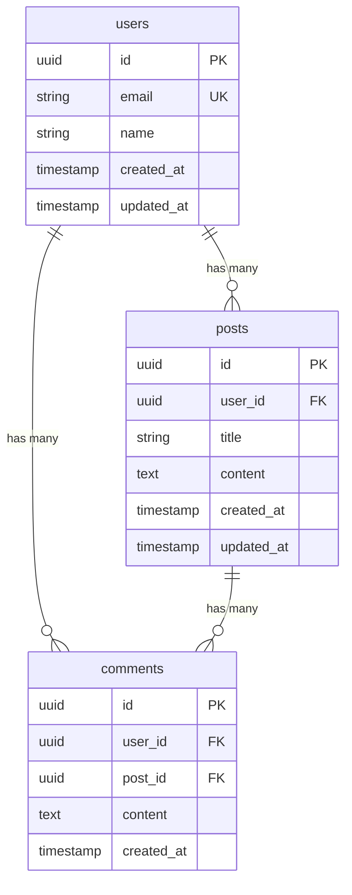

# データベーススキーマ

## 概要

**データベース種別**: [PostgreSQL/MySQL/MongoDB等]
**ORM/クエリビルダー**: [Prisma/TypeORM/Drizzle等]

## 情報の明確性

### 明示された情報
- [ユーザーから明示的に指定されたスキーマ要件]

### 不明/要確認の情報
- [ ] データベースの種類: [PostgreSQL/MySQL/MongoDB等]
- [ ] インデックス戦略: [どのカラムにインデックスを張るか]
- [ ] ソフトデリート: [採用する/しない]
- [ ] タイムスタンプ: [UTC/ローカルタイム]

---

## ER図

---

## テーブル定義

### users {#users}

**概要**: ユーザー情報を管理

| カラム | 型 | 制約 | デフォルト | 説明 |
|--------|------|-------------|-----------|------|
| id | UUID | PRIMARY KEY | gen_random_uuid() | 一意識別子 |
| email | VARCHAR(255) | NOT NULL, UNIQUE | - | メールアドレス |
| name | VARCHAR(100) | NOT NULL | - | 表示名 |
| password_hash | VARCHAR(255) | NOT NULL | - | パスワードハッシュ |
| created_at | TIMESTAMP | NOT NULL | CURRENT_TIMESTAMP | 作成日時 |
| updated_at | TIMESTAMP | NOT NULL | CURRENT_TIMESTAMP | 更新日時 |

**インデックス**:
| 名前 | カラム | 種類 | 用途 |
|------|--------|------|------|
| users_pkey | id | PRIMARY | 主キー |
| users_email_key | email | UNIQUE | メール検索 |
| users_created_at_idx | created_at | BTREE | 作成日ソート |

---

### posts {#posts}

**概要**: 投稿情報を管理

| カラム | 型 | 制約 | デフォルト | 説明 |
|--------|------|-------------|-----------|------|
| id | UUID | PRIMARY KEY | gen_random_uuid() | 一意識別子 |
| user_id | UUID | NOT NULL, FOREIGN KEY | - | 作成者ID |
| title | VARCHAR(200) | NOT NULL | - | タイトル |
| content | TEXT | NOT NULL | - | 本文 |
| status | VARCHAR(20) | NOT NULL | 'draft' | ステータス |
| created_at | TIMESTAMP | NOT NULL | CURRENT_TIMESTAMP | 作成日時 |
| updated_at | TIMESTAMP | NOT NULL | CURRENT_TIMESTAMP | 更新日時 |

**インデックス**:
| 名前 | カラム | 種類 | 用途 |
|------|--------|------|------|
| posts_pkey | id | PRIMARY | 主キー |
| posts_user_id_idx | user_id | BTREE | ユーザー別検索 |
| posts_status_idx | status | BTREE | ステータス検索 |

**外部キー**:
| 名前 | カラム | 参照先 | ON DELETE |
|------|--------|--------|-----------|
| posts_user_id_fkey | user_id | users(id) | CASCADE |

---

## マイグレーション方針

### バージョン管理
- マイグレーションツール: [Prisma Migrate/TypeORM/Flyway等]
- 命名規則: `YYYYMMDDHHMMSS_description.sql`

### ロールバック手順
1. マイグレーション履歴を確認
2. ロールバック対象のバージョンを特定
3. ロールバックコマンドを実行
4. データ整合性を確認

## パフォーマンス考慮

### インデックス戦略
- 検索頻度の高いカラムにインデックスを設定
- 複合インデックスは左端のカラムから使用
- カーディナリティを考慮

### クエリ最適化
- N+1問題の回避（JOINまたはIN句を使用）
- 大量データ処理時はバッチ処理
- EXPLAINで実行計画を確認

## 関連要件

- [REQ-XXX](../../requirements/stories/US-XXX.md): [関連の説明]
- [NFR-XXX](../../requirements/nfr/performance.md): [関連の説明]
