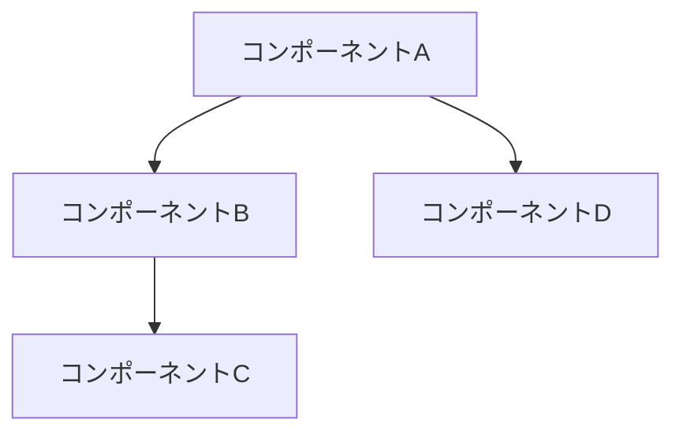

# 設計

> このドキュメントはAIエージェント（Claude Code等）が実装を行うことを前提としています。
> 各セクションで「明示された情報」と「不明/要確認の情報」を明確に区別してください。
> **不明な情報が1つでもある場合は、実装前に必ず確認を取ってください。**

## 情報の明確性チェック

### ユーザーから明示された情報
*ユーザーが明確に指定した情報をリストアップしてください*
- [ ] 技術スタック: [明示されている場合は記載]
- [ ] アーキテクチャパターン: [明示されている場合は記載]
- [ ] フレームワーク: [明示されている場合は記載]
- [ ] データベース: [明示されている場合は記載]
- [ ] 外部サービス連携: [明示されている場合は記載]
- [ ] セキュリティ要件: [明示されている場合は記載]
- [ ] パフォーマンス要件: [明示されている場合は記載]

### 不明/要確認の情報
*推測が必要な情報、または明示されていない情報をリストアップしてください*

| 項目 | 現状の理解 | 確認状況 |
|------|-----------|----------|
| [項目名] | [推測内容や不明点] | [ ] 未確認 / [x] 確認済み |

### 確認が必要な質問リスト
*上記の不明情報に基づき、実装前に確認すべき質問をリストアップ*
1. [質問1]
2. [質問2]

> **注意**: 上記の質問に対する回答を得るまで、該当部分の設計・実装を進めないでください。

---

## アーキテクチャ概要

*システムアーキテクチャの高レベルな概要を提供してください。*



## コンポーネント一覧

| コンポーネント名 | 目的 | 詳細リンク |
|-----------------|------|-----------|
| [ComponentA] | [簡潔な目的] | [詳細](components/component-a.md) @components/component-a.md |
| [ComponentB] | [簡潔な目的] | [詳細](components/component-b.md) @components/component-b.md |

## API一覧

| エンドポイント | メソッド | 目的 | 詳細リンク |
|---------------|---------|------|-----------|
| /api/users | GET, POST | ユーザー管理 | [詳細](api/users.md) @api/users.md |
| /api/items | GET, POST, PUT, DELETE | アイテム管理 | [詳細](api/items.md) @api/items.md |

## データベーススキーマ

| テーブル名 | 概要 | 詳細リンク |
|-----------|------|-----------|
| users | ユーザー情報 | [詳細](database/schema.md#users) @database/schema.md |
| items | アイテム情報 | [詳細](database/schema.md#items) @database/schema.md |

## 技術的決定事項

| ID | 決定内容 | ステータス | 詳細リンク |
|----|---------|-----------|-----------|
| DEC-001 | [決定の概要] | 承認済/検討中 | [詳細](decisions/DEC-001.md) @decisions/DEC-001.md |
| DEC-002 | [決定の概要] | 承認済/検討中 | [詳細](decisions/DEC-002.md) @decisions/DEC-002.md |

## セキュリティ考慮事項
*セキュリティ対策と考慮事項を記述してください。*

## パフォーマンス考慮事項
*パフォーマンス最適化と考慮事項を記述してください。*

## エラー処理戦略
*エラー処理戦略と復旧メカニズムを記述してください。*

## CI/CD設計

### 品質ゲート

| 項目 | 基準値 | 採用ツール |
|------|--------|-----------|
| テストカバレッジ | 80%以上 | [Jest/pytest/go test等] |
| Linter | エラー0件 | [ESLint/Ruff/golangci-lint等] |
| コード複雑性 | 循環的複雑度10以下 | [lizard/radon/gocyclo等] |

---

## リンク形式について

詳細ファイルへのリンクは、マークダウン形式と`@`形式の両方を記載してください：
- **マークダウン形式**: `[詳細](components/component-a.md)` - GitHub等での閲覧用
- **@形式**: `@components/component-a.md` - Claude Codeがファイルを参照する際に使用

---

## ドキュメント構成

```
docs/sdd/design/
├── index.md                 # このファイル（目次）
├── components/
│   ├── component-a.md       # コンポーネント詳細
│   └── component-b.md
├── api/
│   ├── users.md             # API設計詳細
│   └── items.md
├── database/
│   └── schema.md            # データベーススキーマ
└── decisions/
    ├── DEC-001.md           # 技術的決定事項
    └── DEC-002.md
```
