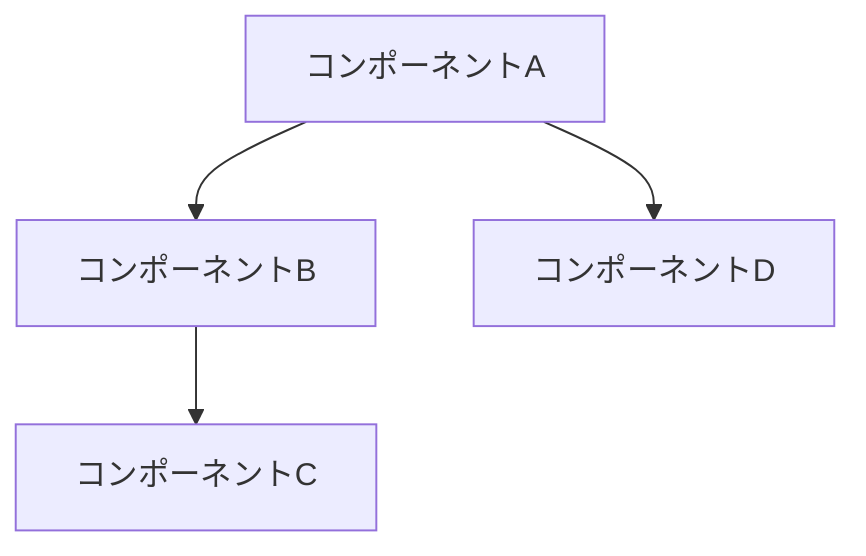
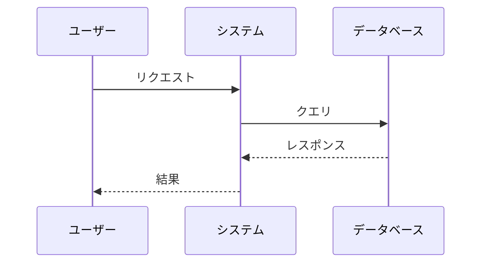
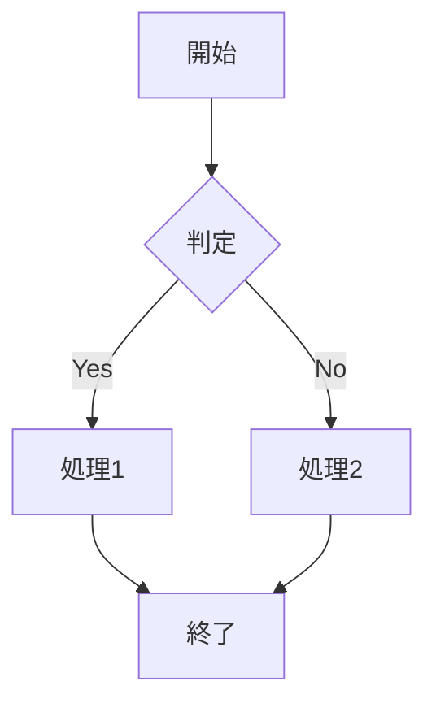
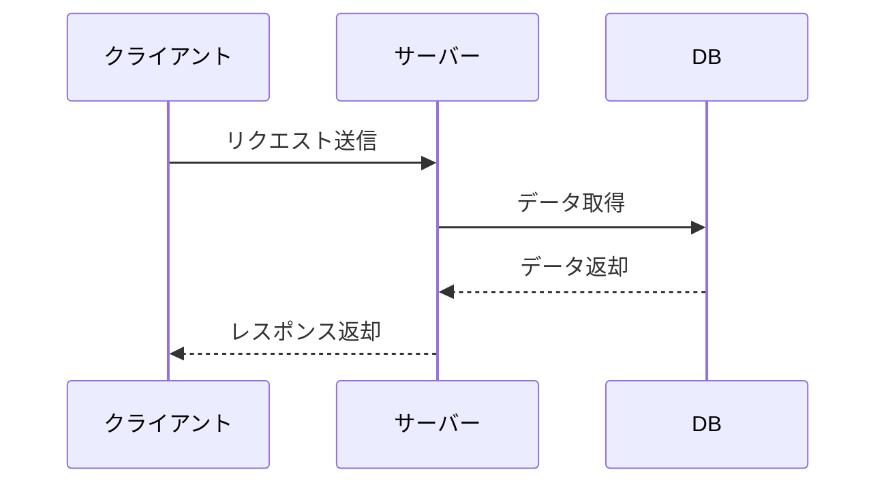

# 設計

> このドキュメントはAIエージェント（Claude Code等）が実装を行うことを前提としています。
> 各セクションで「明示された情報」と「不明/要確認の情報」を明確に区別してください。
> **不明な情報が1つでもある場合は、実装前に必ず確認を取ってください。**

## 情報の明確性チェック

### ユーザーから明示された情報
*ユーザーが明確に指定した情報をリストアップしてください*
- [ ] 技術スタック: [明示されている場合は記載]
- [ ] アーキテクチャパターン: [明示されている場合は記載]
- [ ] フレームワーク: [明示されている場合は記載]
- [ ] データベース: [明示されている場合は記載]
- [ ] 外部サービス連携: [明示されている場合は記載]
- [ ] セキュリティ要件: [明示されている場合は記載]
- [ ] パフォーマンス要件: [明示されている場合は記載]

### 不明/要確認の情報
*推測が必要な情報、または明示されていない情報をリストアップしてください*
*「おそらく〜だろう」という推測は「不明」として扱ってください*

| 項目 | 現状の理解 | 確認状況 |
|------|-----------|----------|
| [項目名] | [推測内容や不明点] | [ ] 未確認 / [x] 確認済み |

### 確認が必要な質問リスト
*上記の不明情報に基づき、実装前に確認すべき質問をリストアップ*
1. [質問1]
2. [質問2]

> **注意**: 上記の質問に対する回答を得るまで、該当部分の設計・実装を進めないでください。

---

## アーキテクチャ概要
*システムアーキテクチャの高レベルな概要を提供してください。*



## コンポーネント

### コンポーネント1: [名前]
**目的**: *このコンポーネントの役割*
**責務**:
- 責務1
- 責務2

**インターフェース**:
- API/メソッド1
- API/メソッド2

**明示された情報**:
- [ユーザーから明示的に指定された仕様]

**不明/要確認の情報**:
- [ ] [推測が必要な項目や不明点]

### コンポーネント2: [名前]
**目的**: *このコンポーネントの役割*
**責務**:
- 責務1
- 責務2

**明示された情報**:
- [ユーザーから明示的に指定された仕様]

**不明/要確認の情報**:
- [ ] [推測が必要な項目や不明点]

## データフロー

### シーケンス: [プロセス名]


## API設計

### エンドポイント: [/api/resource]
**メソッド**: GET/POST/PUT/DELETE
**目的**: *このエンドポイントの機能*

**明示された情報**:
- [ユーザーから明示的に指定されたAPI仕様]

**不明/要確認の情報**:
- [ ] 認証方式: [JWT/セッション/APIキー等]
- [ ] レート制限: [あり/なし、具体的な数値]
- [ ] エラーレスポンス形式: [具体的なフォーマット]

**リクエスト**:
```json
{
  "field1": "value1",
  "field2": "value2"
}
```
**レスポンス**:
```json
{
  "status": "success",
  "data": {}
}
```

## データベーススキーマ

### テーブル: [table_name]

**明示された情報**:
- [ユーザーから明示的に指定されたスキーマ要件]

**不明/要確認の情報**:
- [ ] データベースの種類: [PostgreSQL/MySQL/MongoDB等]
- [ ] インデックス戦略: [どのカラムにインデックスを張るか]
- [ ] ソフトデリート: [採用する/しない]

| カラム | 型 | 制約 | 説明 |
|--------|------|-------------|-------------|
| id | UUID | PRIMARY KEY | 一意識別子 |
| created_at | TIMESTAMP | NOT NULL | 作成日時 |
| updated_at | TIMESTAMP | NOT NULL | 更新日時 |

## 技術的決定事項

### 決定1: [技術/アプローチの選択]

**情報の分類**:
- 明示された情報: [ユーザーから明示的に指定された制約や要件]
- 不明/要確認の情報: [推測が必要な項目]

**検討した選択肢**:
1. 選択肢A - メリット/デメリット
2. 選択肢B - メリット/デメリット

**決定**: 選択肢A
**根拠**: *この選択肢を選んだ理由*
**確認状況**: [ ] ユーザー確認済み

## セキュリティ考慮事項
*セキュリティ対策と考慮事項を記述してください。*

## パフォーマンス考慮事項
*パフォーマンス最適化と考慮事項を記述してください。*

## エラー処理
*エラー処理戦略と復旧メカニズムを記述してください。*

---

## 設計書作成のガイド

### アーキテクチャ図の種類
- **コンポーネント図**: システムの主要な部品と関係性
- **シーケンス図**: 処理の流れと相互作用
- **データフロー図**: データの移動と変換
- **配置図**: 物理的な構成とネットワーク

### Mermaid図の基本構文

#### グラフ（フローチャート）


#### シーケンス図


### コンポーネント設計のポイント
1. **単一責任の原則**: 各コンポーネントは1つの明確な目的を持つ
2. **疎結合**: コンポーネント間の依存関係を最小限に
3. **高凝集**: 関連する機能を同じコンポーネントに
4. **インターフェース定義**: 明確な入出力を定義

### API設計のベストプラクティス
- RESTful原則に従う
- 適切なHTTPステータスコードを使用
- バージョニング戦略を定義
- エラーレスポンスの一貫性
- ペイロードの検証とサニタイゼーション

### データベース設計の考慮点
- 正規化と非正規化のバランス
- インデックス戦略
- トランザクション境界
- バックアップとリカバリ計画